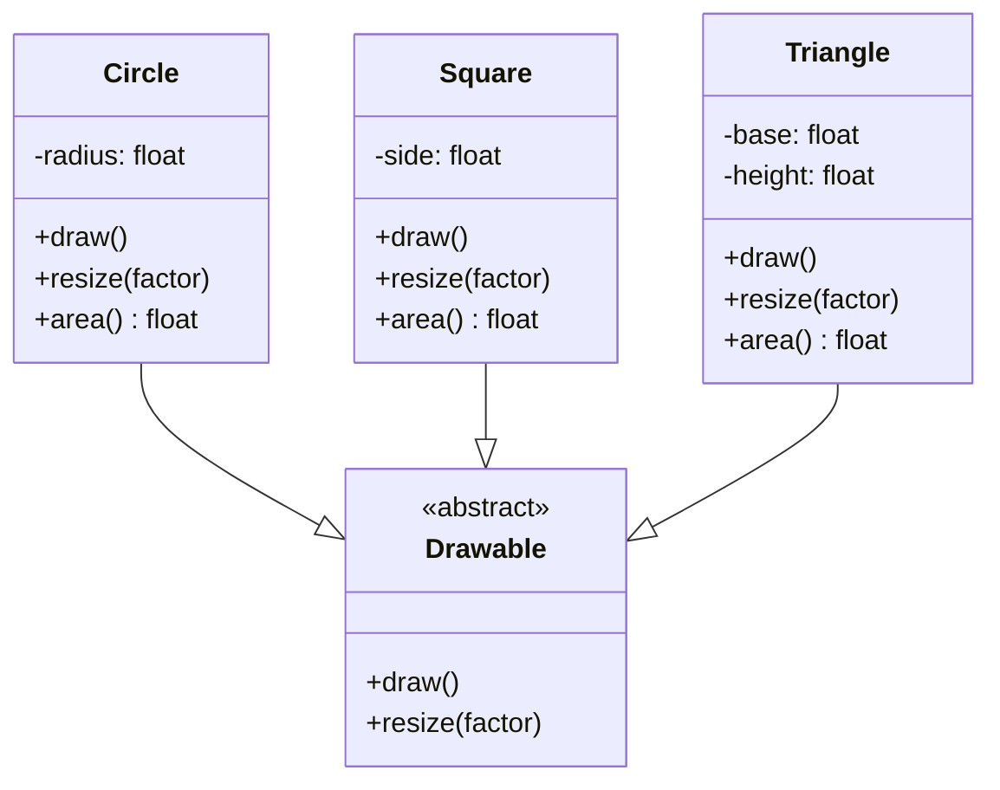
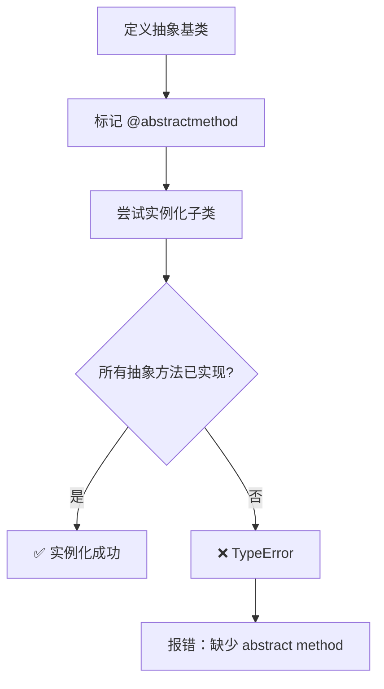

# Day 049 — 抽象基类（ABC）

## 📚 概念解释

### 什么是抽象基类？

**抽象基类（Abstract Base Class，ABC）** 是一种不能被直接实例化的类，它定义了一组接口规范，强制子类实现特定的方法。ABC 通过 `abc` 模块提供，是 Python 实现**接口契约**的官方机制。

```
┌─────────────────────────────────────────────────┐
│              抽象基类 Shape                      │
├─────────────────────────────────────────────────┤
│  + area()      ← 必须实现                       │
│  + perimeter() ← 必须实现                       │
├─────────────────────────────────────────────────┤
│  ❌ 不能直接实例化 Shape()                       │
├─────────────────────────────────────────────────┤
│        ↓ 子类必须实现                            │
│  ┌──────────┐  ┌──────────┐  ┌──────────┐      │
│  │  Circle   │  │ Rectangle│  │ Triangle │      │
│  │ area() ✓  │  │ area() ✓ │  │ area() ✓ │      │
│  │ perim() ✓ │  │ perim()✓ │  │ perim()✓ │      │
│  └──────────┘  └──────────┘  └──────────┘      │
└─────────────────────────────────────────────────┘
```

### 为什么需要 ABC？

```python
# ❌ 没有 ABC：运行时才发现错误
class Dog:
    def speak(self):
        return "Woof"

class Cat:
    # 忘记实现 speak()
    pass

def make_sound(animal):
    return animal.speak()  # Cat 没有 speak()，运行时报错！

make_sound(Dog())  # OK
make_sound(Cat())  # ❌ AttributeError
```

```python
# ✅ 有 ABC：定义时就强制检查
from abc import ABC, abstractmethod

class Animal(ABC):
    @abstractmethod
    def speak(self):
        pass

# Animal()  # ❌ TypeError: Can't instantiate abstract class

class Cat(Animal):
    # 忘记实现 speak()，也会报错
    pass

# Cat()  # ❌ TypeError: Can't instantiate abstract class with abstract method 'speak'
```

---

## 🔬 原理深入

### ABCMeta 元类

`ABC` 的底层是 `ABCMeta` 元类，它在类创建时检查是否有未实现的抽象方法：

```python
from abc import ABCMeta, abstractmethod

class MyABC(metaclass=ABCMeta):
    @abstractmethod
    def required(self):
        pass

# 过程：
# 1. MyABC 类被创建时，ABCMeta.__new__ 被调用
# 2. 检查所有标记为 @abstractmethod 的方法
# 3. 如果子类没有实现所有抽象方法，禁止实例化
```

### register() — 虚拟子类

```python
from abc import ABC, abstractmethod

class Drawable(ABC):
    @abstractmethod
    def draw(self):
        pass

# 即使没有继承 ABC，也能注册为子类
class LegacyWidget:
    def draw(self):
        print("Drawing widget")

Drawable.register(LegacyWidget)  # 虚拟注册

# LegacyWidget 现在被认为是 Drawable 的子类
print(issubclass(LegacyWidget, Drawable))  # True
print(isinstance(LegacyWidget(), Drawable))  # True
```

### abstractproperty 已废弃

```python
# ❌ 旧写法（已废弃）
from abc import abstractproperty

class Old(ABC):
    @abstractproperty
    def value(self):
        pass

# ✅ 新写法
class New(ABC):
    @property
    @abstractmethod
    def value(self):
        pass
```

---

## 📖 API 速查表

### abc 模块核心 API

```python
from abc import ABC, ABCMeta, abstractmethod, abstractproperty, abstractstaticmethod, abstractclassmethod, register

# ABC — 常用基类（等价于 metaclass=ABCMeta）
class MyBase(ABC):
    pass

# ABCMeta — 元类（更灵活）
class MyBase(metaclass=ABCMeta):
    pass

# @abstractmethod — 标记抽象方法
class Shape(ABC):
    @abstractmethod
    def area(self):
        """子类必须实现此方法"""
        pass

# register() — 虚拟子类注册
Shape.register(MyClass)

# issubclass() / isinstance() — 检查
print(issubclass(Circle, Shape))  # True
print(isinstance(circle, Shape))  # True
```

### 抽象属性

```python
class MyClass(ABC):
    @property
    @abstractmethod
    def value(self):
        pass

    @value.setter
    @abstractmethod
    def value(self, val):
        pass
```

### 抽象类方法和静态方法

```python
class Factory(ABC):
    @classmethod
    @abstractmethod
    def create(cls, **kwargs):
        pass

    @staticmethod
    @abstractmethod
    def validate(data):
        pass
```

---

## 📊 图解

### ABC 强制接口实现



### ABC 检查流程



---

## 💻 实战代码案例

### 案例1：可迭代集合框架

```python
from abc import ABC, abstractmethod
from typing import Iterator, List, Optional


class Collection(ABC):
    """抽象集合基类 — 定义集合的通用接口"""

    @abstractmethod
    def add(self, item) -> None:
        """添加元素"""
        pass

    @abstractmethod
    def remove(self, item) -> bool:
        """移除元素，返回是否成功"""
        pass

    @abstractmethod
    def contains(self, item) -> bool:
        """检查是否包含元素"""
        pass

    @abstractmethod
    def size(self) -> int:
        """返回元素数量"""
        pass

    @abstractmethod
    def is_empty(self) -> bool:
        """是否为空"""
        pass

    @abstractmethod
    def clear(self) -> None:
        """清空集合"""
        pass

    def __len__(self) -> int:
        return self.size()

    def __bool__(self) -> bool:
        return not self.is_empty()

    @abstractmethod
    def __iter__(self) -> Iterator:
        """支持迭代"""
        pass


class ListCollection(Collection):
    """基于列表的集合实现"""

    def __init__(self):
        self._items: List = []

    def add(self, item) -> None:
        self._items.append(item)

    def remove(self, item) -> bool:
        try:
            self._items.remove(item)
            return True
        except ValueError:
            return False

    def contains(self, item) -> bool:
        return item in self._items

    def size(self) -> int:
        return len(self._items)

    def is_empty(self) -> bool:
        return len(self._items) == 0

    def clear(self) -> None:
        self._items.clear()

    def __iter__(self) -> Iterator:
        return iter(self._items)

    def __repr__(self):
        return f"ListCollection({self._items})"


class UniqueCollection(Collection):
    """唯一集合（类似 Set）"""

    def __init__(self):
        self._items = {}  # 用 dict 保持插入顺序（Python 3.7+）

    def add(self, item) -> None:
        if item not in self._items:
            self._items[item] = True

    def remove(self, item) -> bool:
        if item in self._items:
            del self._items[item]
            return True
        return False

    def contains(self, item) -> bool:
        return item in self._items

    def size(self) -> int:
        return len(self._items)

    def is_empty(self) -> bool:
        return len(self._items) == 0

    def clear(self) -> None:
        self._items.clear()

    def __iter__(self) -> Iterator:
        return iter(self._items.keys())

    def __repr__(self):
        return f"UniqueCollection({list(self._items.keys())})"


# 使用
print("=== 可迭代集合框架 ===")

# ListCollection
lc = ListCollection()
lc.add("apple")
lc.add("banana")
lc.add("cherry")
print(f"列表集合: {lc}")
print(f"大小: {len(lc)}")
print(f"包含 apple: {lc.contains('apple')}")

# UniqueCollection
uc = UniqueCollection()
uc.add("apple")
uc.add("apple")  # 重复添加
uc.add("banana")
print(f"唯一集合: {uc}")
print(f"大小: {len(uc)}")  # 应该是 2

# 迭代
print("\n迭代 ListCollection:")
for item in lc:
    print(f"  - {item}")
```

### 案例2：插件系统

```python
from abc import ABC, abstractmethod
from typing import Dict, List, Type


class Plugin(ABC):
    """插件抽象基类 — 所有插件必须实现此接口"""

    @property
    @abstractmethod
    def name(self) -> str:
        """插件名称"""
        pass

    @property
    @abstractmethod
    def version(self) -> str:
        """插件版本"""
        pass

    @abstractmethod
    def initialize(self) -> None:
        """初始化插件"""
        pass

    @abstractmethod
    def execute(self, data: dict) -> dict:
        """执行插件逻辑"""
        pass

    def cleanup(self) -> None:
        """清理资源（可选实现）"""
        pass


class PluginManager:
    """插件管理器 — 注册和管理所有插件"""

    _plugins: Dict[str, Plugin] = {}
    _initialized: Dict[str, bool] = {}

    @classmethod
    def register(cls, plugin: Plugin) -> None:
        cls._plugins[plugin.name] = plugin
        cls._initialized[plugin.name] = False
        print(f"✅ 注册插件: {plugin.name} v{plugin.version}")

    @classmethod
    def initialize_all(cls) -> None:
        for name, plugin in cls._plugins.items():
            if not cls._initialized[name]:
                plugin.initialize()
                cls._initialized[name] = True
                print(f"🚀 初始化插件: {name}")

    @classmethod
    def execute_plugin(cls, name: str, data: dict) -> dict:
        if name not in cls._plugins:
            raise ValueError(f"插件不存在: {name}")
        if not cls._initialized[name]:
            raise RuntimeError(f"插件未初始化: {name}")
        return cls._plugins[name].execute(data)

    @classmethod
    def list_plugins(cls) -> List[str]:
        return list(cls._plugins.keys())


# === 具体插件实现 ===

class JsonFormatterPlugin(Plugin):
    @property
    def name(self) -> str:
        return "json_formatter"

    @property
    def version(self) -> str:
        return "1.0.0"

    def initialize(self) -> None:
        import json
        self._json = json

    def execute(self, data: dict) -> dict:
        formatted = self._json.dumps(data, ensure_ascii=False, indent=2)
        return {"output": formatted, "format": "json"}


class UppercasePlugin(Plugin):
    @property
    def name(self) -> str:
        return "uppercase"

    @property
    def version(self) -> str:
        return "1.0.0"

    def initialize(self) -> None:
        pass

    def execute(self, data: dict) -> dict:
        result = {}
        for key, value in data.items():
            if isinstance(value, str):
                result[key] = value.upper()
            else:
                result[key] = value
        return result


# 使用
print("\n=== 插件系统 ===")

# 注册插件
PluginManager.register(JsonFormatterPlugin())
PluginManager.register(UppercasePlugin())

# 初始化
PluginManager.initialize_all()

# 执行
result = PluginManager.execute_plugin("uppercase", {"name": "hello", "value": 42})
print(f"\nuppercase 结果: {result}")

result = PluginManager.execute_plugin("json_formatter", {"users": ["张三", "李四"]})
print(f"\njson_formatter 结果:\n{result['output']}")

# 列出所有插件
print(f"\n已注册插件: {PluginManager.list_plugins()}")
```

### 案例3：抽象工厂模式

```python
from abc import ABC, abstractmethod
from typing import Optional


class Button(ABC):
    @abstractmethod
    def render(self) -> str:
        pass

    @abstractmethod
    def on_click(self, handler) -> None:
        pass


class TextBox(ABC):
    @abstractmethod
    def render(self) -> str:
        pass

    @abstractmethod
    def get_value(self) -> str:
        pass


class Checkbox(ABC):
    @abstractmethod
    def render(self) -> str:
        pass

    @abstractmethod
    def is_checked(self) -> bool:
        pass


class UIFactory(ABC):
    """抽象工厂 — 定义创建 UI 组件的接口"""

    @abstractmethod
    def create_button(self, label: str) -> Button:
        pass

    @abstractmethod
    def create_textbox(self, placeholder: str = "") -> TextBox:
        pass

    @abstractmethod
    def create_checkbox(self, label: str, checked: bool = False) -> Checkbox:
        pass


# === Web 实现 ===

class WebButton(Button):
    def __init__(self, label: str):
        self.label = label
        self._handler = None

    def render(self) -> str:
        return f'<button class="web-btn">{self.label}</button>'

    def on_click(self, handler) -> None:
        self._handler = handler


class WebTextBox(TextBox):
    def __init__(self, placeholder: str):
        self.placeholder = placeholder
        self._value = ""

    def render(self) -> str:
        return f'<input type="text" placeholder="{self.placeholder}" />'

    def get_value(self) -> str:
        return self._value


class WebCheckbox(Checkbox):
    def __init__(self, label: str, checked: bool):
        self.label = label
        self._checked = checked

    def render(self) -> str:
        checked = "checked" if self._checked else ""
        return f'<label><input type="checkbox" {checked} /> {self.label}</label>'

    def is_checked(self) -> bool:
        return self._checked


class WebUIFactory(UIFactory):
    def create_button(self, label: str) -> Button:
        return WebButton(label)

    def create_textbox(self, placeholder: str = "") -> TextBox:
        return WebTextBox(placeholder)

    def create_checkbox(self, label: str, checked: bool = False) -> Checkbox:
        return WebCheckbox(label, checked)


# === Desktop 实现（简化版） ===

class DesktopButton(Button):
    def __init__(self, label: str):
        self.label = label

    def render(self) -> str:
        return f"[Desktop Button: {self.label}]"

    def on_click(self, handler) -> None:
        pass


class DesktopTextBox(TextBox):
    def __init__(self, placeholder: str):
        self.placeholder = placeholder

    def render(self) -> str:
        return f"[Desktop TextBox: {self.placeholder}]"

    def get_value(self) -> str:
        return ""


class DesktopCheckbox(Checkbox):
    def __init__(self, label: str, checked: bool):
        self.label = label
        self._checked = checked

    def render(self) -> str:
        state = "X" if self._checked else " "
        return f"[Desktop Checkbox: [{state}] {self.label}]"

    def is_checked(self) -> bool:
        return self._checked


class DesktopUIFactory(UIFactory):
    def create_button(self, label: str) -> Button:
        return DesktopButton(label)

    def create_textbox(self, placeholder: str = "") -> TextBox:
        return DesktopTextBox(placeholder)

    def create_checkbox(self, label: str, checked: bool = False) -> Checkbox:
        return DesktopCheckbox(label, checked)


# 使用
print("\n=== 抽象工厂模式 ===")

# Web UI
factory = WebUIFactory()
button = factory.create_button("提交")
textbox = factory.create_textbox("请输入姓名")
checkbox = factory.create_checkbox("同意协议", True)

print("Web UI:")
print(f"  {button.render()}")
print(f"  {textbox.render()}")
print(f"  {checkbox.render()}")

# Desktop UI
factory = DesktopUIFactory()
button = factory.create_button("提交")
textbox = factory.create_textbox("请输入姓名")
checkbox = factory.create_checkbox("同意协议", True)

print("\nDesktop UI:")
print(f"  {button.render()}")
print(f"  {textbox.render()}")
print(f"  {checkbox.render()}")
```

---

## 🧠 思考题

1. **ABC 和 Protocol 的区别是什么？** Python 3.8 引入了 `typing.Protocol`（结构化子类型），它和 ABC 有什么异同？什么场景下用哪个？

2. **为什么 `@abstractmethod` 必须在最内层装饰器？** 以下代码为什么不能交换顺序？
```python
@abstractmethod
@property
def value(self): ...

# vs

@property
@abstractmethod
def value(self): ...
```

3. **register() 注册的虚拟子类有什么限制？** 为什么有时候 `isinstance()` 返回 True 但实际调用会报错？

4. **如何用 ABC 实现 Mixin？** 抽象 Mixin 有什么好处和风险？

5. **Python 标准库中哪些模块使用了 ABC？** 查看 `collections.abc`、`io`、`os` 等模块，找出使用 ABC 的例子。

---

## 📋 今日小结

| 概念 | 说明 |
|------|------|
| **ABC** | 抽象基类，不能直接实例化，强制子类实现接口 |
| **@abstractmethod** | 标记抽象方法，子类必须实现 |
| **ABCMeta** | ABC 的底层元类，负责检查抽象方法 |
| **register()** | 注册虚拟子类，无需继承也能被识别 |
| **接口契约** | ABC 确保子类实现特定方法，提供类型安全 |
