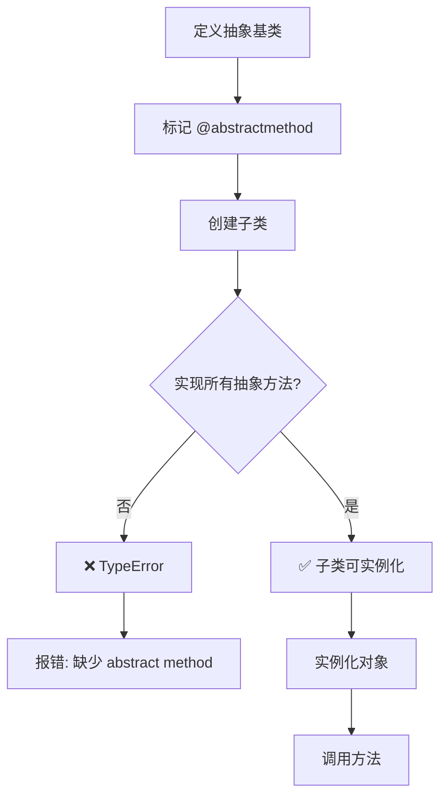
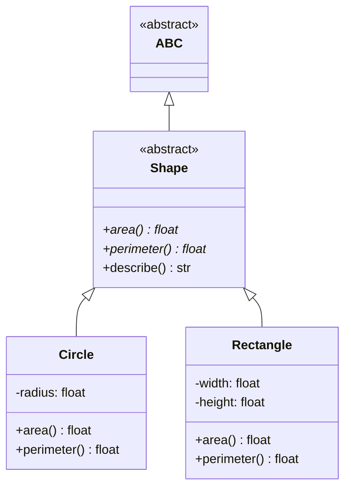

# Day 049 — 抽象基类（ABC）图解

## ABC 强制接口实现流程



## ABC 类层次结构



## register() 虚拟子类

```
┌─────────────────────────────────────────┐
│           虚拟子类注册                    │
├─────────────────────────────────────────┤
│                                         │
│  Drawable (ABC)                         │
│    └── @abstractmethod draw()           │
│                                         │
│  LegacyWidget (普通类)                   │
│    └── draw() # 有实现                   │
│                                         │
│  Drawable.register(LegacyWidget)        │
│    └── ✅ issubclass → True             │
│    └── ⚠️ 但不强制检查接口               │
│                                         │
└─────────────────────────────────────────┘
```

## ABC vs Protocol 对比

```
┌─────────────────────┬─────────────────────────┐
│       ABC           │      Protocol           │
├─────────────────────┼─────────────────────────┤
│ 显式继承            │ 隐式匹配（鸭子类型）       │
│ 必须 subclass       │ 只要方法签名匹配即可       │
│ 运行时强制检查       │ mypy 静态检查             │
│ from abc import     │ from typing import       │
│                     │                         │
│ class Shape(ABC):   │ class Shape(Protocol):   │
│   @abstractmethod  │   def area(self):        │
│   def area(self):   │     ...                 │
│     ...            │                         │
└─────────────────────┴─────────────────────────┘
```
