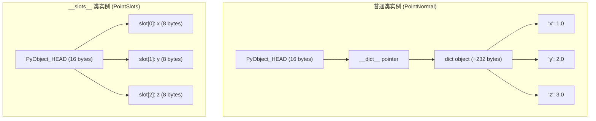
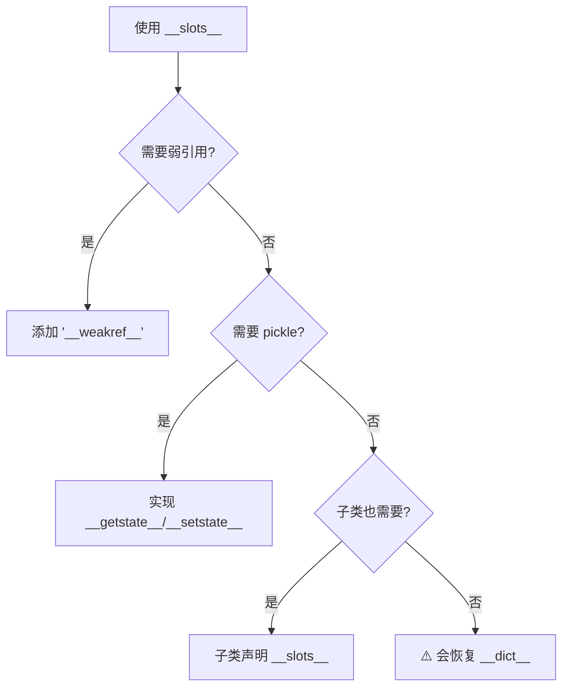

# Day 050 — 槽（__slots__）图解

## 内存布局对比



## 内存节省对比

```
┌─────────────────────────────────────────────┐
│        100,000 个对象内存对比                 │
├─────────────────────────────────────────────┤
│                                             │
│  普通类:                                     │
│  ├─ 对象本身: ~64 bytes × 100,000 = 6.4 MB  │
│  ├─ __dict__: ~232 bytes × 100,000 = 23.2 MB│
│  └─ 总计: ~29.6 MB                          │
│                                             │
│  __slots__ 类:                               │
│  ├─ 对象本身: ~32 bytes × 100,000 = 3.2 MB  │
│  ├─ 无 __dict__                              │
│  └─ 总计: ~3.2 MB                           │
│                                             │
│  节省: ~26.4 MB (89.2%)                     │
│                                             │
└─────────────────────────────────────────────┘
```

## 属性访问性能

```
┌─────────────────────────────────────────────┐
│         属性访问性能对比                      │
├───────────────────────┬─────────────────────┤
│  普通类                │  __slots__ 类        │
├───────────────────────┼─────────────────────┤
│  obj.x → dict lookup  │  obj.x → slot load  │
│  ~100 ns              │  ~90 ns             │
├───────────────────────┼─────────────────────┤
│  obj.x = val          │  obj.x = val        │
│  ~120 ns              │  ~95 ns             │
├───────────────────────┼─────────────────────┤
│  支持动态属性          │  不支持动态属性       │
│  有 __dict__           │  无 __dict__         │
└───────────────────────┴─────────────────────┘
```

## 继承规则

```
┌─────────────────────────────────────────────┐
│            __slots__ 继承规则                 │
├─────────────────────────────────────────────┤
│                                             │
│  class Base:                                │
│      __slots__ = ('x', 'y')                 │
│                                             │
│  class Child(Base):                         │
│      __slots__ = ('z',)  ✅ 声明新槽位       │
│      # x, y 继承自 Base                     │
│      # z 是自己的新槽位                       │
│                                             │
│  class BadChild(Base):                      │
│      # ❌ 忘记声明 __slots__                 │
│      # 会恢复 __dict__，失去优化效果          │
│                                             │
└─────────────────────────────────────────────┘
```

## 常见陷阱


