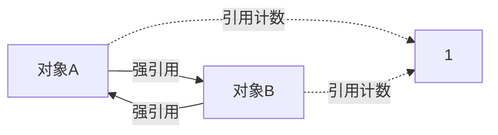

# Day 051 — 弱引用（weakref）

> **Phase 4 · 高阶特性 · Day 051**
> 主题：弱引用（weakref）—— 不增加引用计数的优雅引用

---

## 📌 今日目标

1. 理解弱引用的原理及其与强引用的区别
2. 掌握 `weakref` 模块的核心 API
3. 理解循环引用问题及其解决方案
4. 掌握 `WeakValueDictionary`、`WeakKeyDictionary`、`WeakSet` 的使用
5. 实战：实现带弱引用的缓存系统

---

## 1. 什么是弱引用？

### 1.1 强引用 vs 弱引用

在 Python 中，变量赋值默认创建**强引用**（Strong Reference）：

```python
import sys

a = [1, 2, 3]       # 强引用：变量 a 指向列表对象
print(sys.getrefcount(a))  # 输出至少为 2（a + getrefcount 的参数）
```

**弱引用**（Weak Reference）不增加对象的引用计数。如果一个对象只有弱引用指向它，Python 会在下一次垃圾回收时回收该对象。

```python
import weakref
import sys

a = [1, 2, 3]
b = weakref.ref(a)  # 创建弱引用

print(b())          # 输出: [1, 2, 3] —— 通过弱引用访问对象
print(sys.getrefcount(a))  # 仍然只有强引用的计数

del a               # 删除强引用
print(b())          # 输出: None —— 对象已被回收
```

### 1.2 为什么需要弱引用？

**核心问题：循环引用导致内存泄漏**

```python
# ⚠️ 这会导致循环引用，但 Python 的垃圾回收器可以处理
class Node:
    def __init__(self):
        self.parent = None
        self.children = []

parent = Node()
child = Node()
parent.children.append(child)
child.parent = parent  # 循环引用！
```

在某些场景下，循环引用无法被垃圾回收器正确处理（例如涉及 `__del__` 方法的对象）。弱引用是解决这类问题的优雅方案。

---

## 2. weakref 模块核心 API

### 2.1 `weakref.ref()` —— 创建弱引用

```python
import weakref

class MyClass:
    def __init__(self, name):
        self.name = name
    def __repr__(self):
        return f"MyClass({self.name!r})"

obj = MyClass("hello")
ref = weakref.ref(obj)

print(ref())       # <weakref at 0x...; dead> 或 MyClass('hello')
print(ref() is obj)  # True —— 指向同一个对象
print(ref)         # <weakref at 0x...; to MyClass>
```

### 2.2 弱引用回调（Callback）

```python
import weakref

class MyClass:
    pass

def callback(ref):
    """当对象被回收时，回调函数被调用"""
    print(f"对象被回收了! 弱引用指向: {ref}")

obj = MyClass()
ref = weakref.ref(obj, callback)

del obj  # 输出: 对象被回收了! 弱引用指向: <weakref at 0x...; dead>
```

### 2.3 `weakref.proxy()` —— 代理对象

```python
import weakref

class MyClass:
    def hello(self):
        return "Hello from proxy!"

obj = MyClass()
proxy = weakref.proxy(obj)

print(proxy.hello())  # 输出: Hello from proxy!
# proxy 看起来和原对象一样，但不增加引用计数

del obj
try:
    proxy.hello()
except ReferenceError as e:
    print(f"捕获异常: {e}")  # 弱引用目标已死
```

**`ref` vs `proxy` 的区别：**

| 特性 | `weakref.ref()` | `weakref.proxy()` |
|------|-----------------|-------------------|
| 访问对象 | `ref()` 调用 | 直接使用，无需 `()` |
| 类型检查 | `isinstance(ref, weakref.ref)` | 无法区分代理和原对象 |
| 异常处理 | 返回 `None` | 抛出 `ReferenceError` |

---

## 3. 循环引用与垃圾回收

### 3.1 循环引用的困境



Python 使用**引用计数 + 分代回收**机制：

```python
import gc

class Node:
    def __init__(self, name):
        self.name = name
    def __del__(self):
        print(f"Node({self.name}) 被回收")

# 创建循环引用
a = Node("A")
b = Node("B")
a.other = b
b.other = a

del a
del b
# 即使 del 了，由于循环引用，__del__ 可能不会立即执行
gc.collect()  # 强制垃圾回收，此时才调用 __del__
```

### 3.2 用弱引用打破循环

```python
import weakref

class Parent:
    def __init__(self, name):
        self.name = name
        self._children = []

    def add_child(self, child):
        self._children.append(child)
        child._parent = weakref.ref(self)  # 用弱引用指向父节点

    @property
    def children(self):
        return [c for c in self._children if c is not None]

class Child:
    def __init__(self, name):
        self.name = name
        self._parent = None  # 将存储弱引用

    @property
    def parent(self):
        if self._parent is not None:
            return self._parent()  # 解引用弱引用
        return None

# 使用
parent = Parent("Alice")
child1 = Child("Bob")
parent.add_child(child1)

print(child1.parent.name)  # Alice
print(parent.children[0].name)  # Bob
```

---

## 4. 弱引用容器

### 4.1 `WeakValueDictionary` —— 值为弱引用的字典

```python
import weakref

class ExpensiveObject:
    def __init__(self, name):
        self.name = name
    def __repr__(self):
        return f"ExpensiveObject({self.name!r})"
    def __del__(self):
        print(f"  {self.name} 被回收")

cache = weakref.WeakValueDictionary()

obj1 = ExpensiveObject("data1")
cache["key1"] = obj1
print(f"key1 in cache: {'key1' in cache}")  # True

del obj1  # 对象被回收
print(f"key1 in cache: {'key1' in cache}")  # False —— 自动清理
```

**典型场景：ORM 模型缓存、连接池、资源管理器**

```python
import weakref

class DatabaseConnection:
    _instances = weakref.WeakValueDictionary()

    def __new__(cls, host, port):
        key = (host, port)
        if key not in cls._instances:
            obj = super().__new__(cls)
            obj._connected = True
            cls._instances[key] = obj
            print(f"  创建新连接: {host}:{port}")
        else:
            print(f"  复用连接: {host}:{port}")
        return cls._instances[key]

# 演示
conn1 = DatabaseConnection("localhost", 5432)
conn2 = DatabaseConnection("localhost", 5432)  # 复用
print(f"同一个对象: {conn1 is conn2}")  # True

del conn1
conn3 = DatabaseConnection("localhost", 5432)  # 创建新的
print(f"同一个对象: {conn2 is conn3}")  # True
```

### 4.2 `WeakKeyDictionary` —— 键为弱引用的字典

```python
import weakref

class Config:
    def __init__(self, name):
        self.name = name

config = Config("production")
data = weakref.WeakKeyDictionary()
data[config] = "production_data"

print(data[config])  # production_data

del config  # 键被回收，条目自动删除
print(len(data))  # 0
```

### 4.3 `WeakSet` —— 元素为弱引用的集合

```python
import weakref

class Observer:
    pass

observers = weakref.WeakSet()

obs1 = Observer()
obs2 = Observer()
observers.add(obs1)
observers.add(obs2)
print(f"观察者数量: {len(observers)}")  # 2

del obs1
print(f"观察者数量: {len(observers)}")  # 1
```

---

## 5. 弱引用的使用限制

### 5.1 哪些对象可以有弱引用？

```python
import weakref

# ✅ 可以创建弱引用的对象
class MyClass:
    pass

obj = MyClass()
ref = weakref.ref(obj)  # OK

# ✅ 实例对象可以有弱引用（即使没有 __weakref__）
# 但内置类型（list, dict, int, str）不行

# ❌ 以下会报 TypeError
try:
    ref = weakref.ref([1, 2, 3])
except TypeError as e:
    print(f"list 不支持弱引用: {e}")

# ✅ 解决方案：使用包装类
class MyList:
    def __init__(self, data):
        self.data = data

ref = weakref.ref(MyList([1, 2, 3]))  # OK
```

### 5.2 `__slots__` 与弱引用

```python
import weakref

# 没有 __slots__ 的类默认可以创建弱引用
class NormalClass:
    pass

obj = NormalClass()
ref = weakref.ref(obj)  # OK

# 有 __slots__ 的类默认不能创建弱引用
class SlottedClass:
    __slots__ = ('name',)
    def __init__(self, name):
        self.name = name

try:
    ref = weakref.ref(SlottedClass("test"))
except TypeError as e:
    print(f"SlottedClass 不支持弱引用: {e}")

# ✅ 需要显式添加 '__weakref__' 到 __slots__
class SlottedWithWeak:
    __slots__ = ('name', '__weakref__')
    def __init__(self, name):
        self.name = name

ref = weakref.ref(SlottedWithWeak("test"))  # OK
```

---

## 6. 实战：基于弱引用的 LRU 缓存

```python
import weakref
import time
from collections import OrderedDict

class LRUCache:
    """基于弱引用的 LRU 缓存"""

    class CacheEntry:
        __slots__ = ('key', 'value', 'expire_time', '__weakref__')

        def __init__(self, key, value, ttl):
            self.key = key
            self.value = value
            self.expire_time = time.time() + ttl

    def __init__(self, maxsize=128, ttl=300):
        self._maxsize = maxsize
        self._ttl = ttl
        self._cache = weakref.WeakValueDictionary()
        self._order = OrderedDict()  # 保持访问顺序

    def get(self, key):
        if key in self._cache:
            entry = self._cache[key]
            if time.time() < entry.expire_time:
                # 移到末尾（最近使用）
                self._order.move_to_end(key)
                return entry.value
            else:
                # 过期，删除
                del self._cache[key]
                del self._order[key]
        return None

    def put(self, key, value):
        if key in self._cache:
            self._order.move_to_end(key)
        self._order[key] = True

        entry = self.CacheEntry(key, value, self._ttl)
        self._cache[key] = entry

        # 超出容量时，删除最久未使用的
        while len(self._order) > self._maxsize:
            oldest_key, _ = self._order.popitem(last=False)
            if oldest_key in self._cache:
                del self._cache[oldest_key]

    def __len__(self):
        return len(self._cache)

    def __repr__(self):
        return f"LRUCache(size={len(self)}, maxsize={self._maxsize})"

# 测试
cache = LRUCache(maxsize=3, ttl=10)
cache.put("user:1", {"name": "Alice"})
cache.put("user:2", {"name": "Bob"})
cache.put("user:3", {"name": "Charlie"})

print(cache.get("user:1"))  # {'name': 'Alice'}
cache.put("user:4", {"name": "David"})  # 淘汰 user:2
print(cache.get("user:2"))  # None
print(cache)  # LRUCache(size=3, maxsize=3)
```

---

## 7. 弱引用最佳实践

| 场景 | 推荐方案 | 原因 |
|------|---------|------|
| 缓存系统 | `WeakValueDictionary` | 对象回收后自动清理缓存 |
| 观察者模式 | `WeakSet` | 观察者销毁时自动取消订阅 |
| 父子关系 | `weakref.ref()` | 避免循环引用 |
| 单例模式 | `WeakValueDictionary` | 自动管理实例生命周期 |
| 事件监听器 | `WeakKeyDictionary` | 防止内存泄漏 |

### 注意事项

1. **不要缓存临时对象的弱引用**：临时对象可能立即被回收
2. **注意线程安全**：`WeakValueDictionary` 不是线程安全的
3. **回调函数中避免引用对象**：回调不应持有被监控对象的强引用
4. **性能考量**：弱引用比强引用有额外的查找开销

---

## 8. 思考题

1. **为什么 Python 不让 `list`、`dict`、`int` 等内置类型支持弱引用？** 提示：思考 CPython 的实现机制。

2. **`weakref.proxy()` 有什么潜在的陷阱？** 提示：考虑它与 `isinstance` 检查的关系。

3. **如果一个类同时继承了支持弱引用和不支持弱引用的父类，子类能否创建弱引用？** 提示：查看 MRO 和 `__weakref__` 属性。

4. **如何在多线程环境下安全地使用 `WeakValueDictionary`？** 提示：考虑加锁策略。

5. **弱引用的回调函数什么时候会被调用？** 是对象被 `del` 时还是被 GC 回收时？两者有什么区别？

---

> **明日预告**：Day 052 — 深拷贝与浅拷贝，理解 Python 对象的复制机制。
