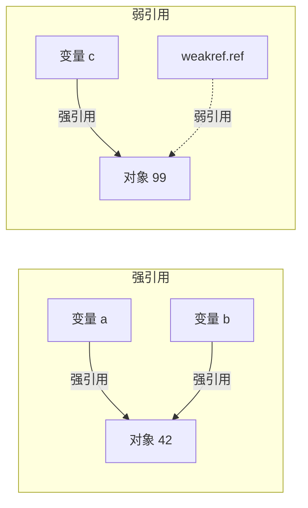
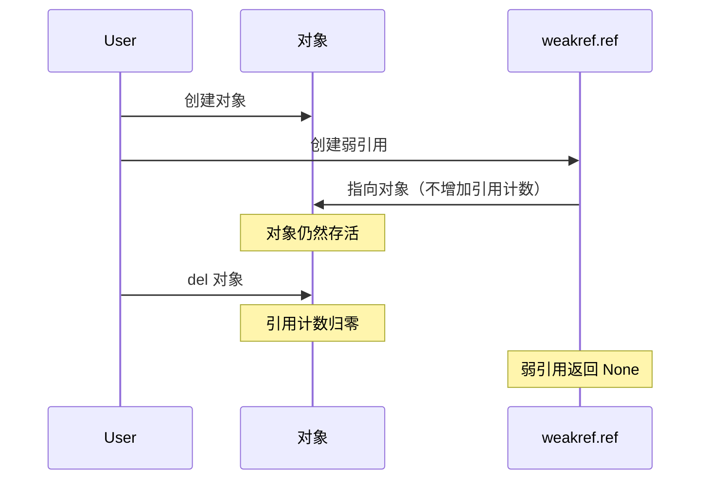
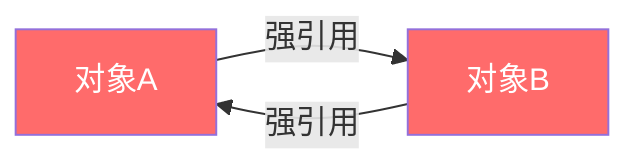
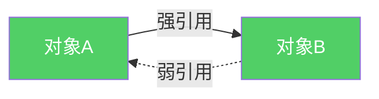
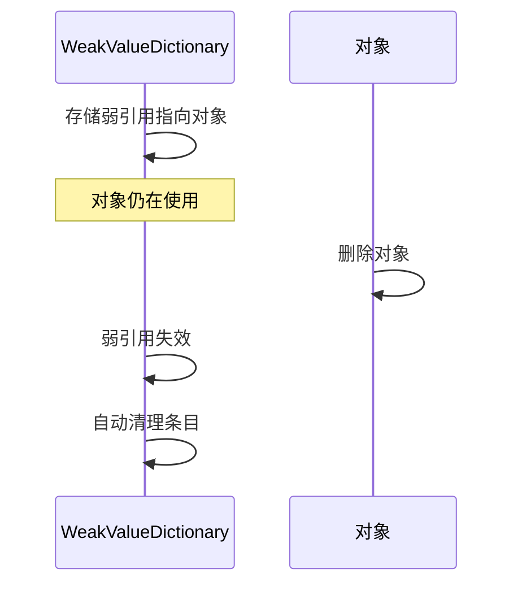
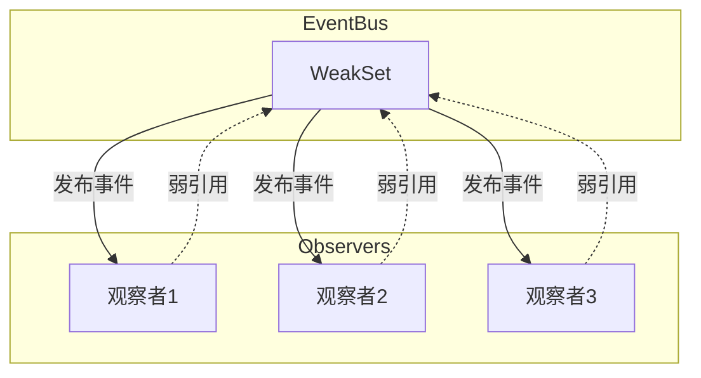
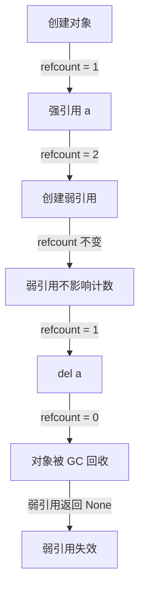

# Day 051 — 弱引用图解

## 1. 强引用 vs 弱引用



## 2. 弱引用生命周期



## 3. 循环引用问题



## 4. 弱引用打破循环



## 5. WeakValueDictionary 工作原理



## 6. 观察者模式中的弱引用



## 7. 引用计数变化



## 8. 内存布局对比

```
强引用:                          弱引用:
┌─────────────┐                  ┌─────────────┐
│ 变量 a      │                  │ 变量 a      │
└──────┬──────┘                  └──────┬──────┘
       │                               │
       ▼                               ▼
┌─────────────┐                  ┌─────────────┐
│ 对象        │                  │ 对象        │
│ refcount=2  │                  │ refcount=1  │
└─────────────┘                  └─────────────┘
                                        ▲
                                        │
                                 ┌──────────────┐
                                 │ weakref.ref  │
                                 │ (不增加计数) │
                                 └──────────────┘
```
