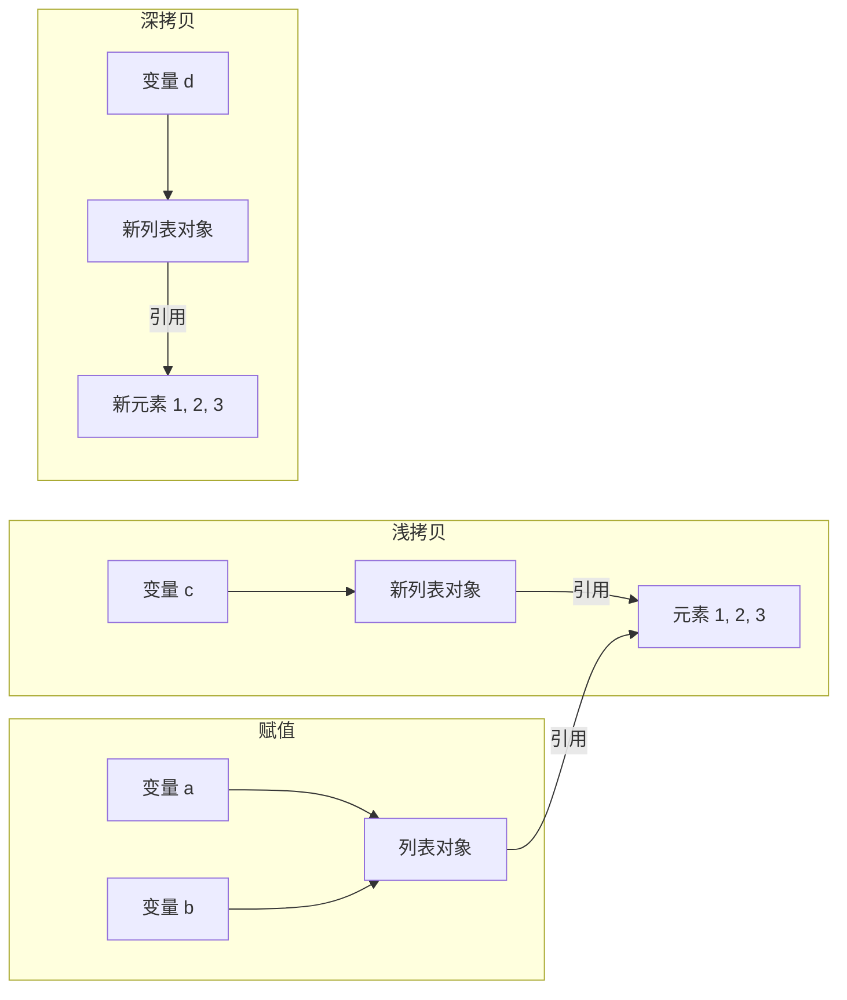

# Day 052 — 深拷贝与浅拷贝

> **Phase 4 · 高阶特性 · Day 052**
> 主题：深拷贝与浅拷贝 —— 理解 Python 对象的复制机制

---

## 📌 今日目标

1. 理解浅拷贝与深拷贝的区别
2. 掌握 `copy.copy()` 和 `copy.deepcopy()` 的使用
3. 理解可变对象与不可变对象的拷贝行为差异
4. 掌握 `__copy__` 和 `__deepcopy__` 魔术方法
5. 实战：实现快照与回滚系统

---

## 1. 什么是浅拷贝和深拷贝？

### 1.1 赋值 vs 浅拷贝 vs 深拷贝

```python
import copy

# 赋值：创建新引用，指向同一对象
a = [1, 2, 3]
b = a                    # b 和 a 是同一个列表对象

# 浅拷贝：创建新对象，但内部元素仍是引用
c = a.copy()             # 或 list(a) 或 [x for x in a] 或 copy.copy(a)
d = copy.copy(a)

# 深拷贝：创建新对象，内部元素也递归拷贝
e = copy.deepcopy(a)
```

### 1.2 可视化对比



---

## 2. 浅拷贝详解

### 2.1 浅拷贝的创建方式

```python
import copy

original = [1, 2, [3, 4]]

# 方式 1: copy.copy()
copy1 = copy.copy(original)

# 方式 2: 列表的 copy 方法
copy2 = original.copy()

# 方式 3: 切片
copy3 = original[:]

# 方式 4: 列表推导式
copy4 = [x for x in original]

# 方式 5: list() 构造函数
copy5 = list(original)

# 以上 5 种方式创建的都是浅拷贝
```

### 2.2 浅拷贝的行为

```python
import copy

original = [1, 2, [3, 4]]
shallow = copy.copy(original)

# 修改外层：不影响原对象
shallow[0] = 99
print(original)  # [1, 2, [3, 4]]  —— 没变
print(shallow)   # [99, 2, [3, 4]] —— 变了

# 修改嵌套对象：影响原对象！
shallow[2].append(5)
print(original)  # [1, 2, [3, 4, 5]]  —— 也被改了！
print(shallow)   # [99, 2, [3, 4, 5]]
```

### 2.3 浅拷贝的陷阱

```python
import copy

# 字典的浅拷贝
original = {"a": [1, 2], "b": [3, 4]}
shallow = copy.copy(original)

# 修改嵌套列表
shallow["a"].append(99)
print(original["a"])  # [1, 2, 99]  —— 原字典也被改了！

# 这就是浅拷贝的"共享引用"问题
```

---

## 3. 深拷贝详解

### 3.1 深拷贝的使用

```python
import copy

original = [1, 2, [3, 4]]
deep = copy.deepcopy(original)

# 修改嵌套对象：不影响原对象
deep[2].append(5)
print(original)  # [1, 2, [3, 4]]  —— 没变
print(deep)      # [1, 2, [3, 4, 5]] —— 只有深拷贝变了

# 完全独立
print(original is deep)          # False
print(original[2] is deep[2])    # False —— 嵌套对象也不同
```

### 3.2 深拷贝与循环引用

```python
import copy

# 创建循环引用
a = [1, 2]
a.append(a)  # a = [1, 2, [...]]

# 深拷贝可以正确处理循环引用
b = copy.deepcopy(a)
print(b)       # [1, 2, [...]]
print(b[2] is b)  # True —— 保持了循环引用关系
print(b[2] is a)  # False —— 与原对象无关
```

### 3.3 深拷贝的性能考量

```python
import copy
import time

# 大型嵌套对象
data = list(range(100000))

# 浅拷贝很快
start = time.perf_counter()
for _ in range(1000):
    copy.copy(data)
print(f"浅拷贝 1000 次: {time.perf_counter() - start:.4f}s")

# 深拷贝较慢（但对于简单列表差异不大）
start = time.perf_counter()
for _ in range(1000):
    copy.deepcopy(data)
print(f"深拷贝 1000 次: {time.perf_counter() - start:.4f}s")
```

---

## 4. 可变 vs 不可变对象的拷贝行为

### 4.1 不可变对象

```python
import copy

# 整数（不可变）
a = 42
b = copy.copy(a)
c = copy.deepcopy(a)
print(a is b)  # True —— 不可变对象不需要拷贝

# 字符串（不可变）
s1 = "hello"
s2 = copy.copy(s1)
print(s1 is s2)  # True

# 元组（不可变）
t1 = (1, 2, 3)
t2 = copy.copy(t1)
print(t1 is t2)  # True

# 但元组中的可变元素仍会被浅拷贝引用
t3 = (1, 2, [3, 4])
t4 = copy.copy(t3)
t4[2].append(5)
print(t3[2])  # [3, 4, 5]  —— 被改了！
```

### 4.2 可变对象

```python
import copy

# 列表（可变）
list1 = [1, 2, 3]
list2 = copy.copy(list1)
print(list1 is list2)  # False —— 创建了新对象

# 字典（可变）
dict1 = {"a": 1, "b": 2}
dict2 = copy.copy(dict1)
print(dict1 is dict2)  # False

# 集合（可变）
set1 = {1, 2, 3}
set2 = copy.copy(set1)
print(set1 is set2)  # False
```

---

## 5. `__copy__` 和 `__deepcopy__` 魔术方法

### 5.1 自定义浅拷贝

```python
import copy

class MyClass:
    def __init__(self, name, data):
        self.name = name
        self.data = data

    def __copy__(self):
        """自定义浅拷贝行为"""
        print(f"  调用 __copy__: {self.name}")
        # 创建新实例，但共享 data
        new_obj = MyClass(self.name, self.data)
        return new_obj

    def __repr__(self):
        return f"MyClass({self.name!r}, {self.data!r})"

obj = MyClass("test", [1, 2, 3])
copied = copy.copy(obj)

print(f"原始: {obj}")
print(f"拷贝: {copied}")
print(f"是同一个对象: {obj is copied}")
print(f"data 是同一个: {obj.data is copied.data}")
```

### 5.2 自定义深拷贝

```python
import copy

class Config:
    def __init__(self, settings):
        self.settings = settings

    def __deepcopy__(self, memo):
        """自定义深拷贝行为"""
        print(f"  调用 __deepcopy__")
        # memo 用于处理循环引用
        new_settings = copy.deepcopy(self.settings, memo)
        return Config(new_settings)

    def __repr__(self):
        return f"Config({self.settings!r})"

config = Config({"debug": True, "db": [1, 2, 3]})
deep_copied = copy.deepcopy(config)

print(f"原始: {config}")
print(f"深拷贝: {deep_copied}")
print(f"是同一个对象: {config is deep_copied}")
print(f"settings 是同一个: {config.settings is deep_copied.settings}")
```

### 5.3 memo 参数的作用

```python
import copy

class Node:
    def __init__(self, value):
        self.value = value
        self.children = []

    def __deepcopy__(self, memo):
        print(f"  深拷贝 Node({self.value})")
        # 检查是否已经拷贝过
        if id(self) in memo:
            return memo[id(self)]

        new_node = Node(copy.deepcopy(self.value, memo))
        new_node.children = copy.deepcopy(self.children, memo)
        memo[id(self)] = new_node
        return new_node

# 创建循环引用
root = Node(1)
child = Node(2)
root.children.append(child)
child.children.append(root)  # 循环

# 深拷贝
copy_root = copy.deepcopy(root)
print(f"\n原始: root.value={root.value}")
print(f"拷贝: copy_root.value={copy_root.value}")
print(f"循环引用保持: copy_root.children[0].children[0] is copy_root")
```

---

## 6. 实战：快照与回滚系统

```python
import copy
from datetime import datetime

class Document:
    """文档类，支持快照和回滚"""

    def __init__(self, title, content=""):
        self.title = title
        self.content = content
        self.history = []
        self._snapshots = []

    def edit(self, new_content):
        """编辑文档，自动保存快照"""
        # 保存当前状态的快照
        snapshot = {
            "content": self.content,
            "timestamp": datetime.now().isoformat()
        }
        self._snapshots.append(snapshot)
        self.content = new_content

    def undo(self):
        """回滚到上一个版本"""
        if not self._snapshots:
            print("  没有可回滚的版本")
            return False
        snapshot = self._snapshots.pop()
        self.content = snapshot["content"]
        print(f"  回滚到 {snapshot['timestamp']}")
        return True

    def get_snapshot(self):
        """获取当前状态的深拷贝"""
        return {
            "title": self.title,
            "content": self.content,
            "timestamp": datetime.now().isoformat()
        }

    def restore_snapshot(self, snapshot):
        """从快照恢复"""
        self.content = snapshot["content"]

    def list_snapshots(self):
        """列出所有快照"""
        for i, snap in enumerate(self._snapshots):
            print(f"  [{i+1}] {snap['timestamp']}: {snap['content'][:30]}...")

    def __repr__(self):
        return f"Document({self.title!r}, content_len={len(self.content)})"


# 使用
doc = Document("笔记", "初始内容")
doc.edit("第一次修改")
doc.edit("第二次修改")
doc.edit("第三次修改")

print(f"当前内容: {doc.content}")
print(f"\n回滚...")
doc.undo()
print(f"回滚后: {doc.content}")

print(f"\n快照列表:")
doc.list_snapshots()
```

---

## 7. 最佳实践

| 场景 | 推荐方式 | 原因 |
|------|---------|------|
| 简单列表/字典拷贝 | `copy.copy()` | 性能好，满足需求 |
| 嵌套对象独立副本 | `copy.deepcopy()` | 完全独立，无共享引用 |
| 不可变对象 | 不需要拷贝 | Python 优化了不可变对象 |
| 自定义类 | 实现 `__copy__` / `__deepcopy__` | 控制拷贝行为 |
| 循环引用对象 | `copy.deepcopy()` | 自动处理循环引用 |

### 注意事项

1. **浅拷贝陷阱**：嵌套可变对象会被共享修改
2. **深拷贝性能**：大型复杂对象深拷贝较慢
3. **循环引用**：深拷贝可以正确处理，但需要 `memo` 参数
4. **不可变对象**：Python 不拷贝不可变对象，直接返回原对象引用

---

## 8. 思考题

1. **为什么 Python 对不可变对象不进行拷贝？** 提示：考虑性能优化和内存管理。

2. **`copy.copy()` 和 `copy.deepcopy()` 对元组有什么区别？** 提示：元组是不可变的，但可能包含可变元素。

3. **如何让一个类同时支持浅拷贝和深拷贝？** 提示：需要实现哪些魔术方法？

4. **深拷贝的 `memo` 参数有什么作用？** 提示：考虑循环引用和对象去重。

5. **在什么情况下应该避免使用深拷贝？** 提示：考虑性能、资源、线程安全等因素。

---

> **明日预告**：Day 053 — 内存管理与垃圾回收，深入了解 Python 的内存管理机制。
