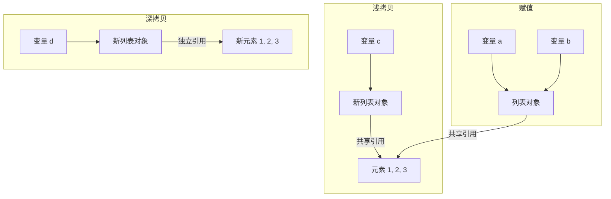
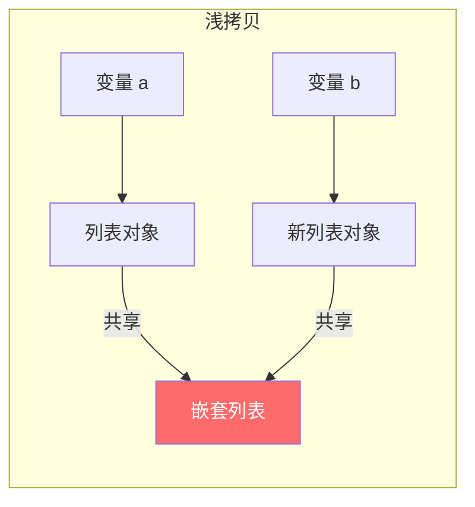
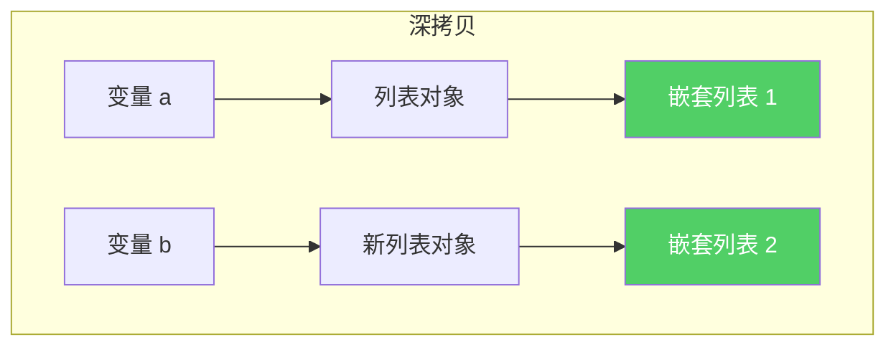
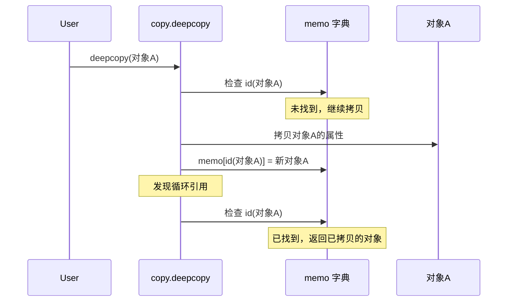
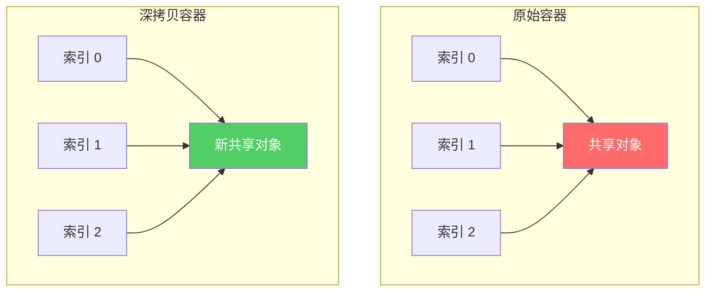
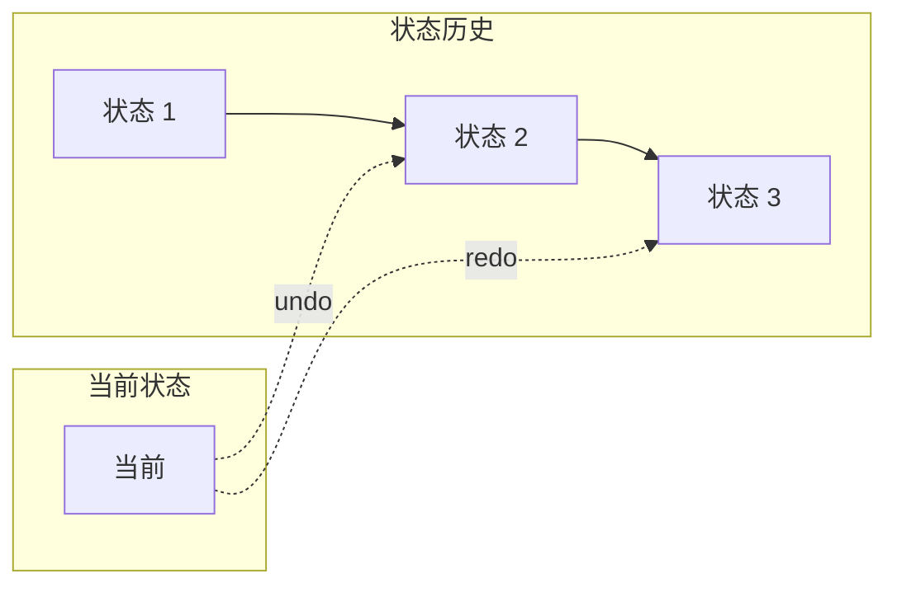
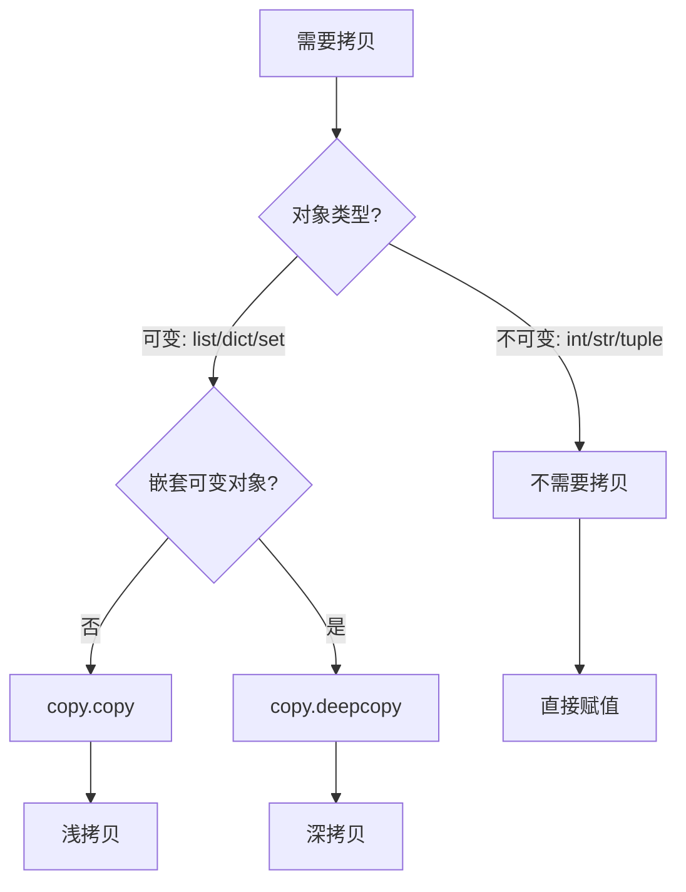

# Day 052 — 深拷贝与浅拷贝图解

## 1. 赋值 vs 浅拷贝 vs 深拷贝



## 2. 内存布局对比

```
赋值:
┌─────────────┐
│ 变量 a      │──┐
└─────────────┘  │
                 ▼
┌─────────────┐  │
│ 变量 b      │──┘
└─────────────┘
                 │
                 ▼
          ┌─────────────┐
          │ 列表对象     │
          │ refcount=2  │
          └─────────────┘

浅拷贝:
┌─────────────┐          ┌─────────────┐
│ 变量 a      │          │ 变量 c      │
└──────┬──────┘          └──────┬──────┘
       │                        │
       ▼                        ▼
┌─────────────┐          ┌─────────────┐
│ 原列表对象   │          │ 新列表对象   │
└──────┬──────┘          └──────┬──────┘
       │                        │
       └──────────┬─────────────┘
                  ▼
          ┌─────────────┐
          │ 共享元素     │
          │ [1, 2, 3]   │
          └─────────────┘

深拷贝:
┌─────────────┐          ┌─────────────┐
│ 变量 a      │          │ 变量 d      │
└──────┬──────┘          └──────┬──────┘
       │                        │
       ▼                        ▼
┌─────────────┐          ┌─────────────┐
│ 原列表对象   │          │ 新列表对象   │
└──────┬──────┘          └──────┬──────┘
       │                        │
       ▼                        ▼
┌─────────────┐          ┌─────────────┐
│ 元素 [1,2,3]│          │ 新元素 [1,2,3]│
└─────────────┘          └─────────────┘
```

## 3. 浅拷贝陷阱



## 4. 深拷贝完全独立



## 5. memo 参数处理循环引用



## 6. 深拷贝去重



## 7. 快照与回滚



## 8. 拷贝方式速查


