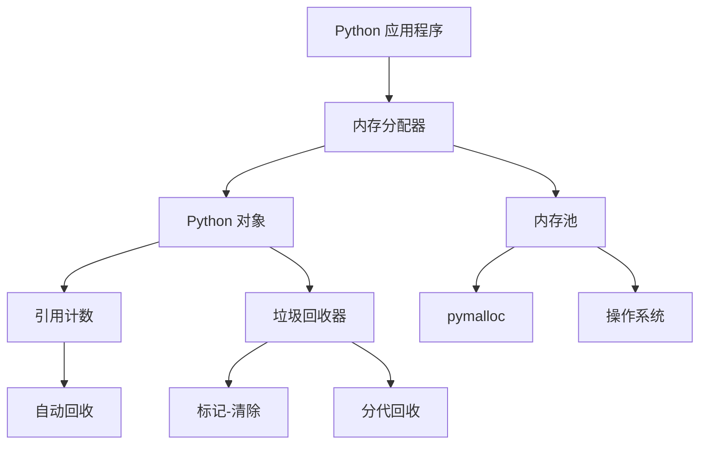
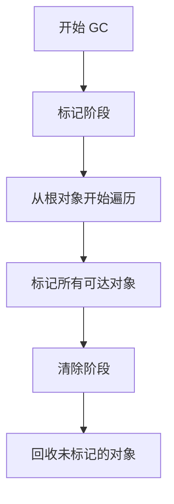

# Day 053 — 内存管理与垃圾回收

> **Phase 4 · 高阶特性 · Day 053**
> 主题：内存管理与垃圾回收 —— 深入理解 Python 的内存管理机制

---

## 📌 今日目标

1. 理解 Python 的引用计数机制
2. 掌握标记-清除与分代回收算法
3. 熟练使用 `gc` 模块进行垃圾回收管理
4. 学会排查和解决内存泄漏问题
5. 实战：实现内存分析工具

---

## 1. Python 内存管理概览

### 1.1 内存管理层次



### 1.2 为什么需要内存管理？

```python
# Python 使用引用计数作为主要的内存管理机制
import sys

a = [1, 2, 3]
print(f"引用计数: {sys.getrefcount(a)}")  # 2 (a + getrefcount 参数)

b = a
print(f"引用计数: {sys.getrefcount(a)}")  # 3

del b
print(f"引用计数: {sys.getrefcount(a)}")  # 2

# 当引用计数归零时，对象立即被回收
```

---

## 2. 引用计数

### 2.1 引用计数原理

每个 Python 对象都有一个引用计数字段：

```python
import sys

class MyClass:
    pass

obj = MyClass()
print(f"引用计数: {sys.getrefcount(obj)}")  # 2

# 增加引用计数的操作
b = obj           # 赋值
c = [obj]         # 放入列表
d = {"key": obj}  # 放入字典
print(f"引用计数: {sys.getrefcount(obj)}")  # 5

# 减少引用计数的操作
del b
del c
del d
print(f"引用计数: {sys.getrefcount(obj)}")  # 2
```

### 2.2 引用计数增加/减少的场景

**增加引用计数：**
- 对象赋值给变量
- 对象作为参数传递给函数
- 对象放入容器（列表、字典等）
- 创建对象的别名

**减少引用计数：**
- `del` 语句
- 变量重新赋值
- 函数返回
- 容器删除元素
- 变量离开作用域

### 2.3 引用计数的局限

```python
# 问题 1: 循环引用
class Node:
    def __init__(self):
        self.ref = None

a = Node()
b = Node()
a.ref = b
b.ref = a  # 循环引用

del a
del b
# 即使 del 了，由于循环引用，引用计数永远不会归零
# 需要垃圾回收器来处理
```

---

## 3. 垃圾回收器

### 3.1 标记-清除算法



```python
import gc

class Node:
    def __init__(self, name):
        self.name = name
        self.ref = None
    def __del__(self):
        print(f"  回收: {self.name}")

# 创建循环引用
a = Node("A")
b = Node("B")
a.ref = b
b.ref = a

del a
del b
# 此时引用计数不为 0，但对象不可达

# 强制垃圾回收
print("触发垃圾回收:")
gc.collect()
```

### 3.2 分代回收

Python 的垃圾回收器使用三代回收策略：

```python
import gc

# 查看各代的回收阈值
print(f"回收阈值: {gc.get_threshold()}")  # 默认 (700, 10, 10)

# 查看各代的对象数量
print(f"各代对象数: {gc.get_count()}")

# 查看各代的回收次数
print(f"各代回收次数: {gc.get_stats()}")
```

**分代回收原理：**

| 代 | 说明 | 回收频率 |
|----|------|---------|
| 第 0 代 | 新创建的对象 | 最频繁 |
| 第 1 代 | 经历过 0 代回收存活的对象 | 中等 |
| 第 2 代 | 经历过 1 代回收存活的对象 | 最少 |

```python
import gc

# 手动触发各代回收
gc.collect(generation=0)  # 只回收第 0 代
gc.collect(generation=1)  # 回收第 0、1 代
gc.collect(generation=2)  # 回收所有三代
```

---

## 4. gc 模块详解

### 4.1 常用 API

```python
import gc

# 启用/禁用垃圾回收
gc.enable()   # 启用
gc.disable()  # 禁用

# 检查是否启用
print(f"GC 启用状态: {gc.isenabled()}")

# 强制回收
collected = gc.collect()
print(f"回收对象数: {collected}")

# 设置回收阈值
gc.set_threshold(700, 10, 10)  # 默认值

# 查看所有可收集对象
objects = gc.get_objects()
print(f"对象总数: {len(objects)}")

# 查看垃圾对象
garbage = gc.garbage
print(f"无法回收的对象: {len(garbage)}")
```

### 4.2 调试选项

```python
import gc

# 启用调试
gc.set_debug(gc.DEBUG_LEAK)    # 检测内存泄漏
gc.set_debug(gc.DEBUG_STATS)   # 打印统计信息
gc.set_debug(gc.DEBUG_COLLECTABLE)  # 打印可回收对象
gc.set_debug(gc.DEBUG_UNCOLLECTABLE)  # 打印无法回收的对象

# 清除调试
gc.set_debug(0)
```

### 4.3 弱引用与垃圾回收

```python
import weakref
import gc

class TrackedObject:
    def __init__(self, name):
        self.name = name
    def __del__(self):
        print(f"  回收: {self.name}")

# 弱引用不影响垃圾回收
obj = TrackedObject("test")
ref = weakref.ref(obj)

# 删除强引用
del obj
# 对象立即被回收（引用计数归零）
# 不需要等待垃圾回收器
```

---

## 5. 内存泄漏排查

### 5.1 常见内存泄漏模式

```python
import gc

# 模式 1: 循环引用（Python 可以处理，但有 __del__ 时不行）
class Node:
    def __init__(self, name):
        self.name = name
        self.ref = None
    def __del__(self):
        # 有 __del__ 的循环引用对象无法被回收！
        print(f"  回收 {self.name}")

a = Node("A")
b = Node("B")
a.ref = b
b.ref = a

del a
del b
gc.collect()  # 可能无法回收

# 模式 2: 全局变量持有引用
_cache = {}
def process_data(data):
    _cache[id(data)] = data  # 永远不会被清理

# 模式 3: 闭包持有外部变量
def make_processor():
    large_data = [i for i in range(1000000)]
    def processor(x):
        return x in large_data  # 持有 large_data 的引用
    return processor
```

### 5.2 内存泄漏检测工具

```python
import gc
import objgraph

# 使用 objgraph 可视化对象引用
# objgraph.show_most_common_types(limit=10)
# objgraph.show_growth(limit=10)

# 手动检测
gc.collect()
before = len(gc.get_objects())
# ... 执行一些操作 ...
gc.collect()
after = len(gc.get_objects())

if after > before:
    print(f"⚠️ 可能存在内存泄漏: {after - before} 个新对象")
```

---

## 6. 内存优化技巧

### 6.1 使用 `__slots__`

```python
import sys

class RegularClass:
    def __init__(self, x, y):
        self.x = x
        self.y = y

class SlottedClass:
    __slots__ = ('x', 'y')
    def __init__(self, x, y):
        self.x = x
        self.y = y

regular = RegularClass(1, 2)
slotted = SlottedClass(1, 2)

print(f"RegularClass 大小: {sys.getsizeof(regular)} bytes")
print(f"SlottedClass 大小: {sys.getsizeof(slotted)} bytes")
print(f"节省: {sys.getsizeof(regular) - sys.getsizeof(slotted)} bytes")
```

### 6.2 使用生成器

```python
import sys

# 列表
list_data = [i for i in range(1000000)]
print(f"列表大小: {sys.getsizeof(list_data)} bytes")

# 生成器
gen_data = (i for i in range(1000000))
print(f"生成器大小: {sys.getsizeof(gen_data)} bytes")
```

### 6.3 使用 `sys.intern()`

```python
import sys

# 字符串驻留
s1 = sys.intern("hello")
s2 = sys.intern("hello")
print(f"相同字符串: {s1 is s2}")  # True - 共享内存

# 对于频繁使用的字符串，可以节省内存
```

---

## 7. 实战：内存分析工具

```python
import gc
import sys
from collections import defaultdict
from datetime import datetime

class MemoryProfiler:
    """内存分析工具"""

    def __init__(self):
        self._snapshots = []
        self._before = None

    def start(self):
        """开始内存分析"""
        gc.collect()
        self._before = self._get_memory_info()

    def stop(self):
        """结束内存分析并返回报告"""
        gc.collect()
        after = self._get_memory_info()

        report = {
            "timestamp": datetime.now().isoformat(),
            "before": self._before,
            "after": after,
            "diff": {
                key: after[key] - self._before[key]
                for key in self._before
            }
        }
        self._snapshots.append(report)
        return report

    def _get_memory_info(self):
        """获取内存信息"""
        objects = gc.get_objects()
        type_counts = defaultdict(int)
        type_sizes = defaultdict(int)

        for obj in objects:
            type_name = type(obj).__name__
            type_counts[type_name] += 1
            type_sizes[type_name] += sys.getsizeof(obj)

        return {
            "total_objects": len(objects),
            "total_size": sum(type_sizes.values()),
            "type_counts": dict(type_counts),
            "type_sizes": dict(type_sizes)
        }

    def top_types(self, n=10):
        """获取占用最多的类型"""
        gc.collect()
        info = self._get_memory_info()

        sorted_types = sorted(
            info["type_sizes"].items(),
            key=lambda x: x[1],
            reverse=True
        )[:n]

        return sorted_types

    def print_report(self):
        """打印内存报告"""
        if not self._snapshots:
            print("没有分析数据")
            return

        latest = self._snapshots[-1]
        print(f"\n{'='*60}")
        print(f"内存分析报告 - {latest['timestamp']}")
        print(f"{'='*60}")

        print(f"\n对象数量: {latest['before']['total_objects']} -> {latest['after']['total_objects']}")
        print(f"内存大小: {latest['before']['total_size'] / 1024:.2f} KB -> {latest['after']['total_size'] / 1024:.2f} KB")

        diff = latest['diff']['total_size']
        if diff > 0:
            print(f"增长: +{diff / 1024:.2f} KB ⚠️")
        else:
            print(f"减少: {diff / 1024:.2f} KB ✅")

        print(f"\n占用最多的类型:")
        for type_name, size in self.top_types(5):
            print(f"  {type_name}: {size / 1024:.2f} KB")


# 使用
profiler = MemoryProfiler()

# 测试
profiler.start()

# 创建一些对象
data = [dict(zip(range(100), range(100))) for _ in range(1000)]

report = profiler.stop()
profiler.print_report()
```

---

## 8. 最佳实践

| 场景 | 推荐方案 | 原因 |
|------|---------|------|
| 大量小对象 | 使用 `__slots__` | 减少内存开销 |
| 大数据处理 | 使用生成器 | 避免一次性加载 |
| 循环引用 | 使用 `weakref` | 避免内存泄漏 |
| 字符串复用 | 使用 `sys.intern()` | 节省内存 |
| 性能分析 | 使用 `memory_profiler` | 精确测量 |

### 注意事项

1. **不要手动调用 `gc.collect()`**：除非有特殊需求
2. **避免循环引用**：特别是涉及 `__del__` 方法时
3. **使用 `__slots__`**：对于属性固定的小对象
4. **使用生成器**：处理大数据集时

---

## 9. 思考题

1. **为什么 Python 使用引用计数而不是只用垃圾回收器？** 提示：考虑实时性和性能。

2. **分代回收的三代有什么区别？** 提示：考虑对象的存活时间。

3. **为什么有 `__del__` 方法的循环引用对象无法被回收？** 提示：考虑 `__del__` 的调用时机。

4. **如何检测 Python 程序的内存泄漏？** 提示：考虑 `gc` 模块和第三方工具。

5. **`gc.garbage` 列表中存放的是什么？** 提示：考虑无法回收的对象。

---

> **明日预告**：Day 054 — 并发入门：线程，理解 GIL 和多线程编程。
