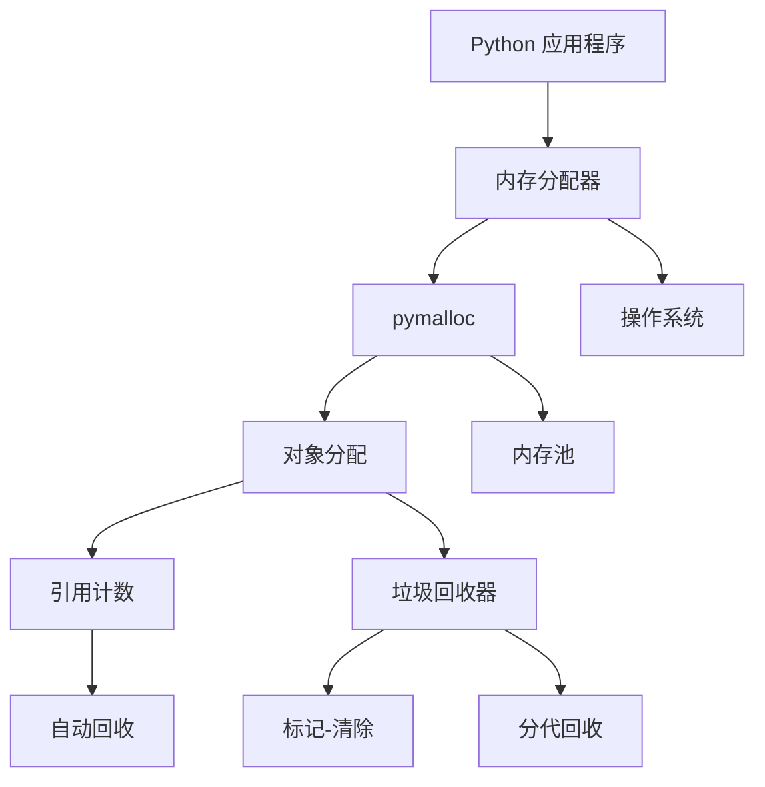
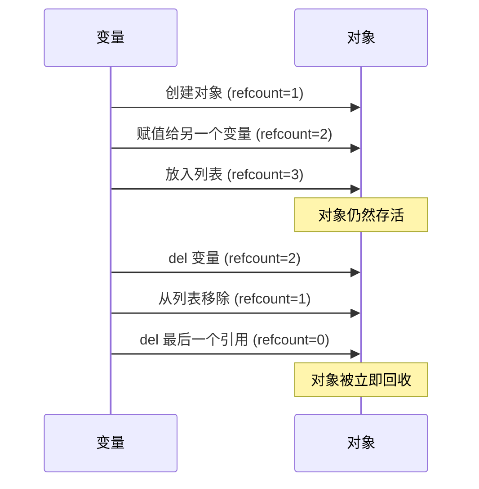
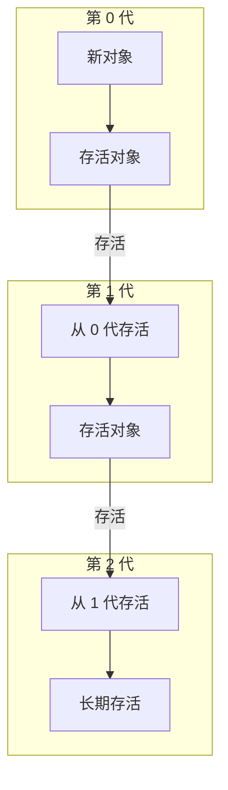
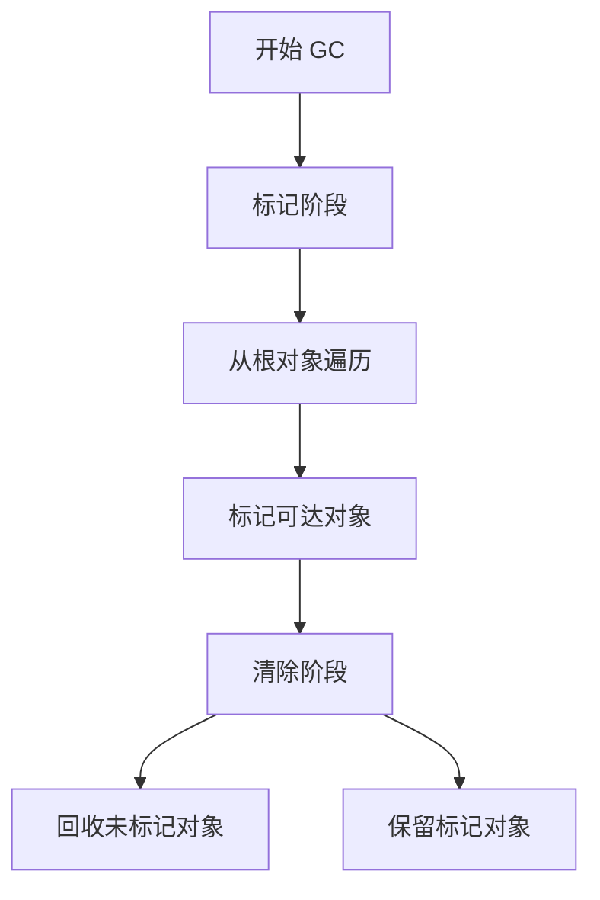
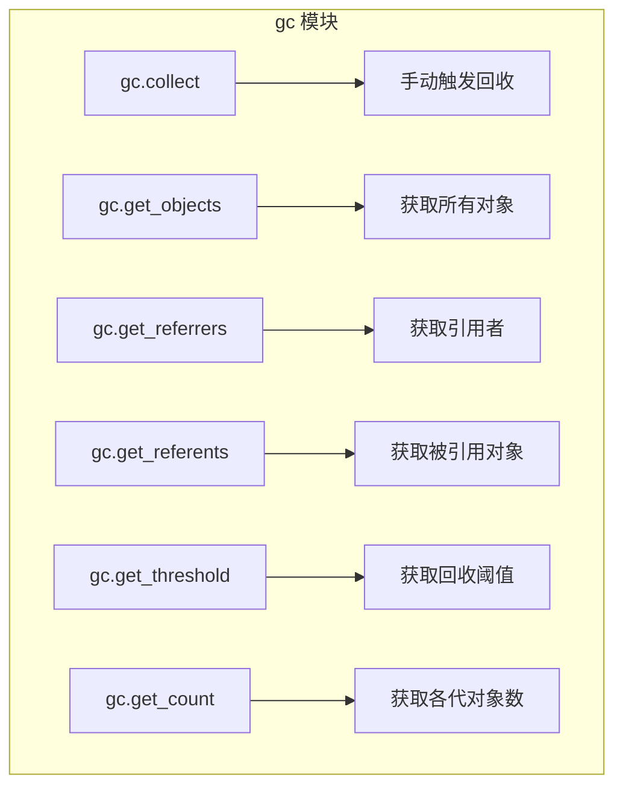
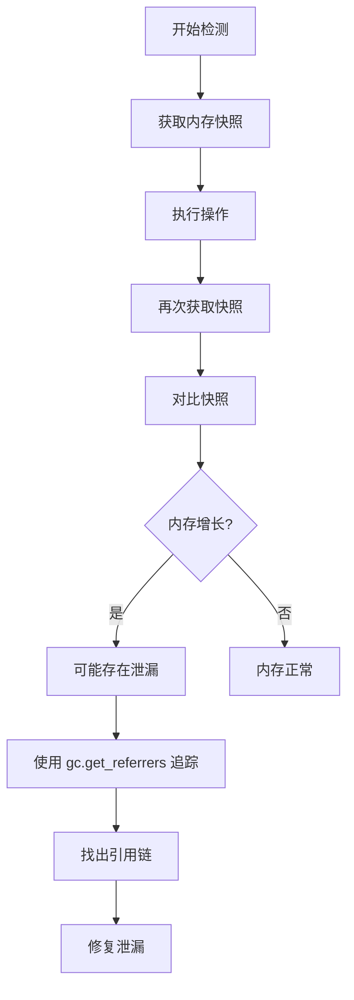
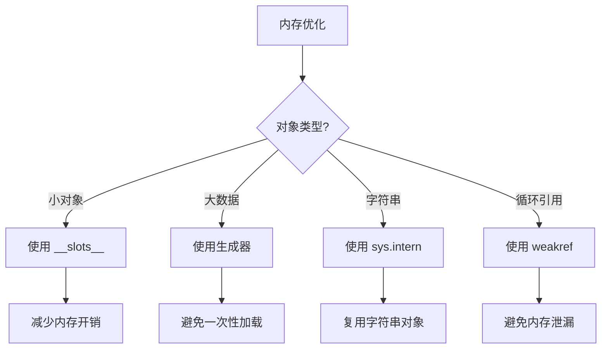

# Day 053 — 内存管理与垃圾回收图解

## 1. Python 内存管理架构



## 2. 引用计数机制



## 3. 循环引用问题


## 4. 分代回收原理



## 5. 标记-清除算法



## 6. gc 模块 API



## 7. 内存泄漏检测流程



## 8. 内存优化策略



## 9. 内存使用可视化

```
内存使用示意图:
┌─────────────────────────────────────────────────────────┐
│                                                         │
│  ┌─────────────────────────────────────────────────┐   │
│  │ 对象堆                                           │   │
│  │  ┌─────────┐ ┌─────────┐ ┌─────────┐           │   │
│  │  │ 对象 1   │ │ 对象 2   │ │ 对象 3   │  ...     │   │
│  │  └─────────┘ └─────────┘ └─────────┘           │   │
│  │                                                 │   │
│  │  第 0 代: 700 个对象                             │   │
│  │  第 1 代: 10 个对象                              │   │
│  │  第 2 代: 10 个对象                              │   │
│  └─────────────────────────────────────────────────┘   │
│                                                         │
│  ┌─────────────────────────────────────────────────┐   │
│  │ gc.garbage                                       │   │
│  │  ┌─────────┐ ┌─────────┐                        │   │
│  │  │ 无法回收 │ │ 无法回收 │  ...                    │   │
│  │  └─────────┘ └─────────┘                        │   │
│  └─────────────────────────────────────────────────┘   │
│                                                         │
└─────────────────────────────────────────────────────────┘
```
