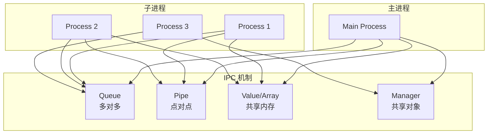

# Day 055 — 并发进阶：进程

> 💡 **今日目标**：掌握 Python `multiprocessing` 模块，理解进程与线程的本质区别，学会进程间通信与进程池，实现 CPU 密集型任务的并行加速。

---

## 1. 为什么需要进程？—— GIL 的枷锁

### 1.1 回顾 GIL

在 Day 054 中我们学过，CPython 的全局解释器锁（GIL）保证同一时刻只有一个线程执行 Python 字节码。这意味着：

- **I/O 密集型任务**（网络请求、文件读写）：线程够用，I/O 等待时释放 GIL
- **CPU 密集型任务**（数值计算、图像处理）：线程被 GIL 限制，无法真正并行

### 1.2 进程 vs 线程

| 特性 | 线程（Thread） | 进程（Process） |
|------|---------------|----------------|
| 内存空间 | 共享进程内存 | 独立内存空间 |
| 创建开销 | 低 | 较高 |
| GIL 影响 | 受限 | 不受限 ✅ |
| 通信方式 | 直接共享变量 | 需要 IPC 机制 |
| 适用场景 | I/O 密集 | CPU 密集 ✅ |
| 崩溃影响 | 可能影响主进程 | 独立崩溃 |

### 1.3 为什么进程不受 GIL 限制？

每个进程拥有独立的 Python 解释器实例，各自有独立的 GIL。操作系统通过 CPU 调度实现真正的并行——在多核 CPU 上，多个进程可以同时在不同核心上运行。

```
┌─────────────────────────────────────────────┐
│              主进程 (Main Process)            │
│  ┌─────────┐  ┌─────────┐  ┌─────────┐     │
│  │ CPU 0   │  │ CPU 1   │  │ CPU 2   │     │
│  │ Process │  │ Process │  │ Process │     │
│  │ + GIL   │  │ + GIL   │  │ + GIL   │     │
│  └─────────┘  └─────────┘  └─────────┘     │
│     ↕            ↕            ↕              │
│  ┌──────────────────────────────────────┐   │
│  │     IPC (Queue / Pipe / SharedMem)   │   │
│  └──────────────────────────────────────┘   │
└─────────────────────────────────────────────┘
```

---

## 2. multiprocessing 模块核心 API

### 2.1 Process 类

`multiprocessing.Process` 是创建子进程的主要方式，接口与 `threading.Thread` 几乎一致。

```python
import multiprocessing as mp

def worker(name):
    print(f"子进程 {name} 运行中, PID={mp.current_process().pid}")

if __name__ == '__main__':
    p = mp.Process(target=worker, args=('A',))
    p.start()   # 启动子进程
    p.join()    # 等待子进程结束
    print(f"主进程结束, PID={mp.current_process().pid}")
```

> ⚠️ **避坑**：`multiprocessing` 在 Windows/macOS 上使用 spawn 启动方式，**必须**将进程相关代码放在 `if __name__ == '__main__':` 保护下，否则会递归创建进程。Linux 默认使用 fork，不一定报错但最好养成习惯。

### 2.2 Process 常用属性与方法

| 方法/属性 | 说明 |
|----------|------|
| `start()` | 启动子进程 |
| `join(timeout=None)` | 阻塞等待子进程结束 |
| `terminate()` | 强制终止子进程 |
| `kill()` | 发送 SIGKILL 信号（等同于 terminate） |
| `is_alive()` | 检查进程是否仍在运行 |
| `pid` | 子进程的进程 ID |
| `exitcode` | 退出码：0=正常，负数=被信号终止 |
| `daemon` | 守护进程标志，设为 True 则主进程退出时子进程自动终止 |

### 2.3 daemon 守护进程

```python
import multiprocessing as mp
import time

def daemon_worker():
    while True:
        print("守护进程运行中...")
        time.sleep(1)

if __name__ == '__main__':
    p = mp.Process(target=daemon_worker, daemon=True)
    p.start()
    time.sleep(3)
    print("主进程结束")
    # 主进程退出时，守护进程自动终止，无需 join
```

---

## 3. 进程间通信（IPC）

进程拥有独立的内存空间，无法像线程那样直接共享变量。Python 提供了几种 IPC 机制：

### 3.1 Queue（队列）—— 生产者-消费者模式

`multiprocessing.Queue` 基于管道 + 锁实现，线程安全、进程安全。

```python
import multiprocessing as mp

def producer(queue):
    for i in range(5):
        item = f"产品-{i}"
        queue.put(item)
        print(f"生产: {item}")
    queue.put(None)  # 哨兵值，通知消费者结束

def consumer(queue):
    while True:
        item = queue.get()
        if item is None:
            break
        print(f"消费: {item}")

if __name__ == '__main__':
    queue = mp.Queue()
    p1 = mp.Process(target=producer, args=(queue,))
    p2 = mp.Process(target=consumer, args=(queue,))
    p1.start()
    p2.start()
    p1.join()
    p2.join()
```

**Queue 核心方法：**

| 方法 | 说明 |
|------|------|
| `put(obj, block=True, timeout=None)` | 放入数据，队列满时阻塞 |
| `get(block=True, timeout=None)` | 取出数据，队列空时阻塞 |
| `put_nowait(obj)` | 非阻塞放入，队列满抛 `Full` |
| `get_nowait()` | 非阻塞取出，队列空抛 `Empty` |
| `qsize()` | 当前队列大小（近似值） |
| `empty()` | 是否为空（不可靠） |
| `full()` | 是否已满（不可靠） |

> ⚠️ **注意**：`qsize()`、`empty()`、`full()` 返回的是近似值，在多进程环境下不可靠，仅用于调试。

### 3.2 Pipe（管道）—— 点对点通信

`multiprocessing.Pipe()` 返回两个 `Connection` 对象，适合两个进程之间的双向通信。

```python
import multiprocessing as mp

def sender(conn):
    conn.send({"type": "greeting", "msg": "你好！"})
    conn.send({"type": "data", "values": [1, 2, 3]})
    conn.send(None)  # 结束信号

def receiver(conn):
    while True:
        data = conn.recv()
        if data is None:
            break
        print(f"收到: {data}")

if __name__ == '__main__':
    parent_conn, child_conn = mp.Pipe()
    p1 = mp.Process(target=sender, args=(child_conn,))
    p2 = mp.Process(target=receiver, args=(parent_conn,))
    p1.start()
    p2.start()
    child_conn.close()  # 父进程关闭子进程端
    parent_conn.close()  # 子进程关闭父进程端
    p1.join()
    p2.join()
```

**Pipe vs Queue 对比：**

| 特性 | Pipe | Queue |
|------|------|-------|
| 连接方式 | 点对点（2个端点） | 多对多（任意数量生产者/消费者） |
| 性能 | 更快（无锁开销） | 较慢（内部使用管道+锁） |
| 适用场景 | 两个进程间的简单通信 | 生产者-消费者、任务分发 |
| 线程安全 | 否（单进程内多线程慎用） | 是 |

### 3.3 Value 和 Array（共享内存）

对于简单数值和数组，可以使用共享内存直接共享：

```python
import multiprocessing as mp
import ctypes

def increment(counter, lock):
    for _ in range(100000):
        with lock:
            counter.value += 1

if __name__ == '__main__':
    counter = mp.Value(ctypes.c_int, 0)  # 共享整数
    lock = mp.Lock()
    processes = [mp.Process(target=increment, args=(counter, lock)) for _ in range(4)]
    
    for p in processes:
        p.start()
    for p in processes:
        p.join()
    
    print(f"最终计数: {counter.value}")  # 期望: 400000
```

### 3.4 Manager（共享对象）

`Manager` 提供共享的 Python 对象（dict、list 等），底层通过代理进程实现：

```python
import multiprocessing as mp

def worker(shared_dict, key, value):
    shared_dict[key] = value

if __name__ == '__main__':
    with mp.Manager() as manager:
        shared_dict = manager.dict()
        processes = [
            mp.Process(target=worker, args=(shared_dict, f"key-{i}", i * 10))
            for i in range(5)
        ]
        for p in processes:
            p.start()
        for p in processes:
            p.join()
        print(dict(shared_dict))
```

> ⚠️ **性能提示**：Manager 通过代理进程中转数据，速度较慢。高频读写场景优先考虑 `Value`/`Array` 或 `Queue`。

---

## 4. 进程池（Pool）

### 4.1 为什么需要进程池？

频繁创建和销毁进程开销很大。`Pool` 预先创建一批工作进程，重复利用它们处理任务。

### 4.2 Pool 核心 API

```python
import multiprocessing as mp
import os

def cpu_bound_task(n):
    """CPU 密集型任务：计算平方和"""
    return sum(i * i for i in range(n))

if __name__ == '__main__':
    numbers = [10**6, 2*10**6, 3*10**6, 4*10**6, 5*10**6]
    
    # 创建进程池（默认为 CPU 核心数）
    with mp.Pool(processes=4) as pool:
        # map: 类似内置 map，阻塞等待所有结果
        results = pool.map(cpu_bound_task, numbers)
        print(f"map 结果: {results}")
        
        # imap: 惰性求值，返回迭代器
        for result in pool.imap(cpu_bound_task, numbers):
            print(f"imap 结果: {result}")
        
        # imap_unordered: 不保证顺序，先完成先返回
        for result in pool.imap_unordered(cpu_bound_task, numbers):
            print(f"imap_unordered 结果: {result}")
        
        # apply_async: 异步提交单个任务
        async_result = pool.apply_async(cpu_bound_task, args=(10**6,))
        print(f"async 结果: {async_result.get()}")
        
        # map_async: 异步版本的 map
        async_results = pool.map_async(cpu_bound_task, numbers)
        print(f"map_async 结果: {async_results.get()}")
```

**Pool 方法速查：**

| 方法 | 说明 |
|------|------|
| `map(func, iterable)` | 同步 map，阻塞直到全部完成 |
| `map_async(func, iterable)` | 异步 map，返回 `AsyncResult` |
| `imap(func, iterable)` | 惰性 map，按顺序返回迭代器 |
| `imap_unordered(func, iterable)` | 惰性 map，不保证顺序 |
| `apply(func, args)` | 同步提交，阻塞等待结果（不推荐） |
| `apply_async(func, args)` | 异步提交，返回 `AsyncResult` |
| `starmap(func, iterable)` | 类似 map，但解包参数 |
| `starmap_async(func, iterable)` | 异步版 starmap |
| `close()` | 停止接收新任务，等待已完成任务结束 |
| `terminate()` | 立即终止所有工作进程 |
| `join()` | 等待工作进程结束（需先 close/terminate） |

### 4.3 AsyncResult 对象

```python
import multiprocessing as mp
import time

def slow_task(seconds):
    time.sleep(seconds)
    return f"完成（耗时 {seconds}s）"

if __name__ == '__main__':
    with mp.Pool(3) as pool:
        result = pool.apply_async(slow_task, args=(2,))
        
        # 检查是否完成
        print(f"是否就绪: {result.ready()}")
        
        # 等待结果（带超时）
        try:
            value = result.get(timeout=5)
            print(f"结果: {value}")
        except mp.TimeoutError:
            print("超时！")
        
        # 获取（如果有的话）异常
        # result.get() 会重新抛出子进程中的异常
```

---

## 5. 进程同步原语

多进程访问共享资源时同样需要同步：

```python
import multiprocessing as mp

def unsafe_increment(shared_val, n):
    """不加锁的竞争条件示例"""
    for _ in range(n):
        shared_val.value += 1  # 非原子操作！

def safe_increment(shared_val, lock, n):
    """加锁后的安全操作"""
    for _ in range(n):
        with lock:
            shared_val.value += 1

if __name__ == '__main__':
    val = mp.Value('i', 0)
    lock = mp.Lock()
    n = 100000
    
    # 不安全版本
    procs = [mp.Process(target=unsafe_increment, args=(val, n)) for _ in range(4)]
    for p in procs: p.start()
    for p in procs: p.join()
    print(f"不安全结果: {val.value}")  # 不确定，通常 < 400000
    
    val.value = 0
    # 安全版本
    procs = [mp.Process(target=safe_increment, args=(val, lock, n)) for _ in range(4)]
    for p in procs: p.start()
    for p in procs: p.join()
    print(f"安全结果: {val.value}")    # 确定 = 400000
```

**同步原语一览：**

| 原语 | 说明 |
|------|------|
| `Lock()` | 互斥锁，同一时刻只有一个进程能获取 |
| `RLock()` | 可重入锁，同一进程可多次获取 |
| `Semaphore(n)` | 信号量，限制同时访问的进程数 |
| `Event()` | 事件，一个进程设置，其他进程等待 |
| `Condition()` | 条件变量，支持 wait/notify 模式 |
| `Barrier(n)` | 屏障，n 个进程到达后一起继续 |

---

## 6. 实战：CPU 密集型计算加速

### 6.1 场景：多进程加速素数计算

```python
import multiprocessing as mp
import time
import math

def is_prime(n):
    """判断素数"""
    if n < 2:
        return False
    if n < 4:
        return True
    if n % 2 == 0 or n % 3 == 0:
        return False
    i = 5
    while i * i <= n:
        if n % i == 0 or n % (i + 2) == 0:
            return False
        i += 6
    return True

def count_primes_in_range(args):
    """计算 [start, end) 范围内的素数个数"""
    start, end = args
    return sum(1 for n in range(start, end) if is_prime(n))

def benchmark():
    total = 5_000_000
    chunk_size = total // mp.cpu_count()
    ranges = [
        (i * chunk_size, min((i + 1) * chunk_size, total))
        for i in range(mp.cpu_count())
    ]
    
    # 单进程
    start = time.perf_counter()
    single_result = count_primes_in_range((0, total))
    single_time = time.perf_counter() - start
    
    # 多进程
    start = time.perf_counter()
    with mp.Pool() as pool:
        results = pool.map(count_primes_in_range, ranges)
    multi_result = sum(results)
    multi_time = time.perf_counter() - start
    
    print(f"CPU 核心数: {mp.cpu_count()}")
    print(f"单进程: {single_result} 个素数, 耗时 {single_time:.2f}s")
    print(f"多进程: {multi_result} 个素数, 耗时 {multi_time:.2f}s")
    print(f"加速比: {single_time / multi_time:.2f}x")

if __name__ == '__main__':
    benchmark()
```

### 6.2 实战：多进程图片处理（模拟）

```python
import multiprocessing as mp
import time
import os

def heavy_computation(image_id):
    """模拟 CPU 密集型图像处理"""
    # 模拟计算密集操作
    result = 0
    for i in range(10_000_000):
        result += (i * image_id) % 997
    return {"image_id": image_id, "result": result, "pid": os.getpid()}

def process_images(image_ids):
    """使用进程池处理图片"""
    with mp.Pool(processes=min(4, mp.cpu_count())) as pool:
        results = pool.map(heavy_computation, image_ids)
    return results

if __name__ == '__main__':
    image_ids = list(range(16))
    
    start = time.perf_counter()
    results = process_images(image_ids)
    elapsed = time.perf_counter() - start
    
    # 统计各进程处理数量
    pid_counts = {}
    for r in results:
        pid = r["pid"]
        pid_counts[pid] = pid_counts.get(pid, 0) + 1
    
    print(f"处理 {len(image_ids)} 张图片，耗时 {elapsed:.2f}s")
    print(f"使用进程数: {len(pid_counts)}")
    for pid, count in pid_counts.items():
        print(f"  PID {pid}: 处理 {count} 张")
```

---

## 7. 常见陷阱与避坑指南

### 7.1 fork vs spawn vs forkserver

| 启动方式 | 平台默认 | 说明 |
|----------|---------|------|
| `fork` | Linux | 直接复制父进程，快但不安全（不推荐在 fork 后调用多线程库） |
| `spawn` | Windows/macOS | 全新 Python 解释器，安全但慢 |
| `forkserver` | 可选 | 独立服务器进程，折中方案 |

```python
# 显式指定启动方式
if __name__ == '__main__':
    mp.set_start_method('spawn')  # 全局只能调用一次
    # 或
    ctx = mp.get_context('spawn')
    p = ctx.Process(target=worker)
```

### 7.2 不要在子进程中使用 threading

子进程中如果已经有线程运行，使用 `fork` 会导致死锁。解决方案：
- 使用 `spawn` 启动方式
- 在 fork 之前不启动线程
- 使用 `multiprocessing.pool.Pool`（内部已处理）

### 7.3 序列化开销

进程间传递的数据必须能被 pickle 序列化。不可序列化的对象（lambda、闭包、文件句柄等）会导致 `PicklingError`。

```python
# ❌ 错误：lambda 不能被 pickle
pool.map(lambda x: x**2, [1, 2, 3])

# ✅ 正确：使用普通函数
def square(x):
    return x ** 2
pool.map(square, [1, 2, 3])
```

### 7.4 资源泄漏

子进程不会自动继承父进程的文件锁、临时文件等资源。注意：
- 子进程打开的文件需要手动关闭
- 数据库连接不能跨进程共享
- 使用 `finally` 或上下文管理器确保清理

---

## 8. 进程间通信全景图



---

## 9. 思考题

1. **为什么 Python 选择多进程而非移除 GIL 来解决 CPU 密集型问题？** 考虑 C 扩展兼容性、内存模型复杂度等方面。

2. **Queue 内部是如何实现进程安全的？** 提示：它基于 `Pipe` + `BoundedSemaphore` + `Lock`。

3. **在什么场景下，你应该选择 `Pipe` 而不是 `Queue`？** 考虑性能、拓扑结构、使用复杂度。

4. **如果子进程处理过程中抛出异常，主进程如何捕获？** 尝试用 `apply_async` 的 `get()` 方法。

5. **进程池的 `map` 和 `imap_unordered` 在结果顺序和内存使用上有什么区别？** 何时选择哪个？

---

## 10. 今日小结

| 知识点 | 要点 |
|--------|------|
| multiprocessing.Process | 创建子进程，接口类似 Thread |
| daemon 守护进程 | 主进程退出时自动终止 |
| Queue | 多进程安全的队列，生产者-消费者模式 |
| Pipe | 点对点双向通信，性能优于 Queue |
| Value/Array | 共享内存，需配合锁使用 |
| Manager | 共享 Python 对象，通过代理实现 |
| Pool | 进程复用，map/apply_async 系列方法 |
| 同步原语 | Lock/RLock/Semaphore/Event/Condition/Barrier |
| fork vs spawn | spawn 更安全，fork 更快 |
| 序列化限制 | 进程间数据必须可 pickle |

> 🎯 **明日预告**：Day 056 将学习 asyncio 异步编程，探索另一种高效的并发范式。
