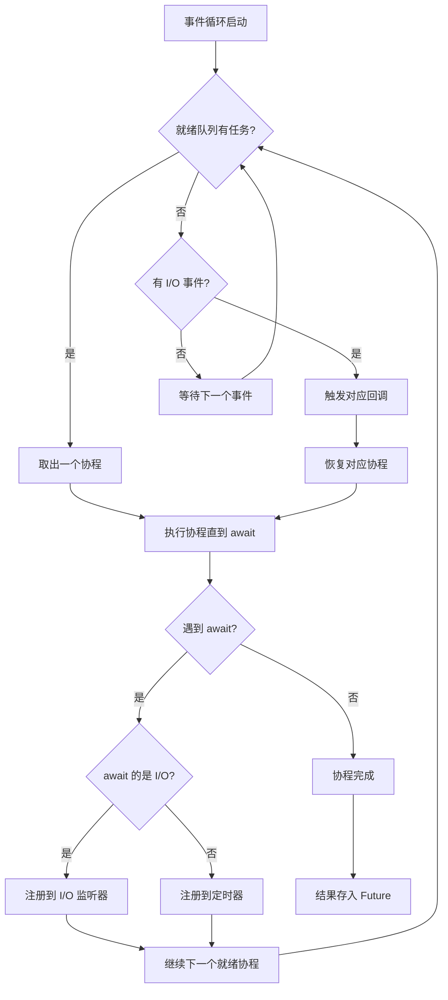
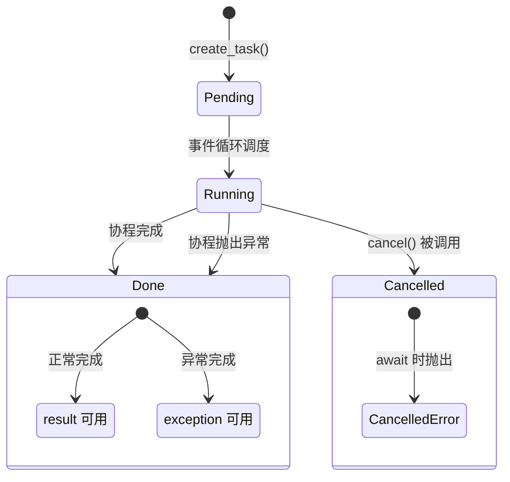
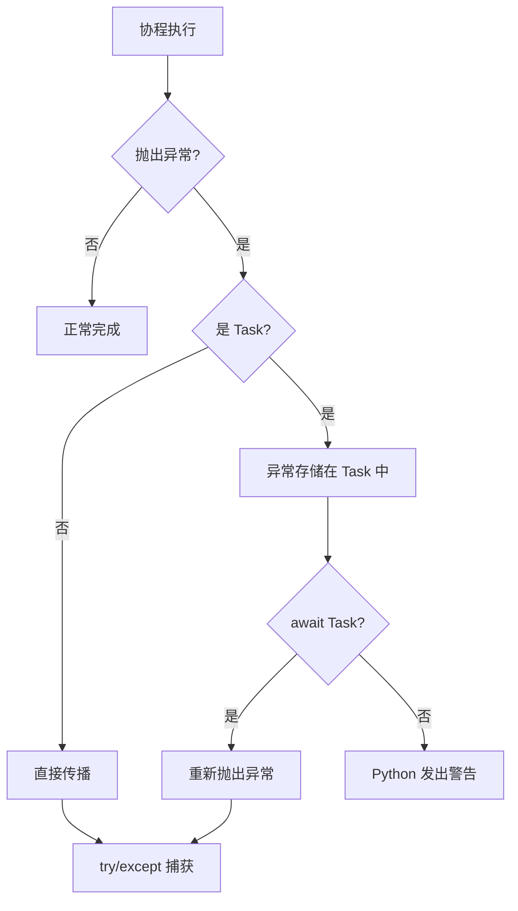

# Day 056 — asyncio 原理解析图解

## 1. 事件循环工作流程



## 2. 同步 vs 异步执行对比

```
同步执行（阻塞模型）：
═══════════════════════════════════════════════════════════
任务1: ████████████████████░░░░░░░░░░░░░░░░░░░░░░░░░░░░░░░
任务2: ░░░░░░░░░░░░░░░░░░░░████████████████████░░░░░░░░░░░░
任务3: ░░░░░░░░░░░░░░░░░░░░░░░░░░░░░░░░░░░░░░░░████████████
       ├────────────────────┼────────────────────┼──────────►
       0s                   5s                   10s         时间
       总耗时: ~10s（串行等待）

异步执行（非阻塞模型）：
═══════════════════════════════════════════════════════════
任务1: ████████████████████░░░░░░░░░░░░░░░░░░░░░░░░░░░░░░░
任务2: ████████████████████░░░░░░░░░░░░░░░░░░░░░░░░░░░░░░░
任务3: ████████████████████░░░░░░░░░░░░░░░░░░░░░░░░░░░░░░░
       ├────────────────────┼──────────────────────────────►
       0s                   5s                             时间
       总耗时: ~5s（并发执行）
```

## 3. asyncio.gather() 并发原理

```mermaid
sequenceDiagram
    participant Main as 主协程
    participant Loop as 事件循环
    participant T1 as Task 1
    participant T2 as Task 2
    participant T3 as Task 3

    Main->>Loop: gather(task1, task2, task3)
    Loop->>T1: 调度执行
    Loop->>T2: 调度执行
    Loop->>T3: 调度执行
    
    T1->>Loop: await I/O (挂起)
    T2->>Loop: await I/O (挂起)
    T3->>Loop: await I/O (挂起)
    
    Note over Loop: 等待 I/O 完成...
    
    Loop->>T1: I/O 完成，恢复执行
    Loop->>T2: I/O 完成，恢复执行
    Loop->>T3: I/O 完成，恢复执行
    
    T1-->>Main: 返回结果 1
    T2-->>Main: 返回结果 2
    T3-->>Main: 返回结果 3
    
    Main->>Main: 收集所有结果
```

## 4. Task 生命周期状态图



## 5. Semaphore 限流原理

```
请求队列: [R1] [R2] [R3] [R4] [R5] [R6] [R7] [R8] [R9] [R10]
                      │
                      ▼
            ┌─────────────────┐
            │  Semaphore(3)   │
            │  可用槽位: 3     │
            └─────────────────┘
                      │
        ┌─────────────┼─────────────┐
        ▼             ▼             ▼
   ┌─────────┐  ┌─────────┐  ┌─────────┐
   │ Worker 1│  │ Worker 2│  │ Worker 3│
   │ (R1)    │  │ (R2)    │  │ (R3)    │
   └────┬────┘  └────┬────┘  └────┬────┘
        │             │             │
        ▼             ▼             ▼
   完成释放槽位 → R4 进入 → R5 进入 → ...
```

## 6. await 挂起与恢复流程


## 7. 错误处理流程


