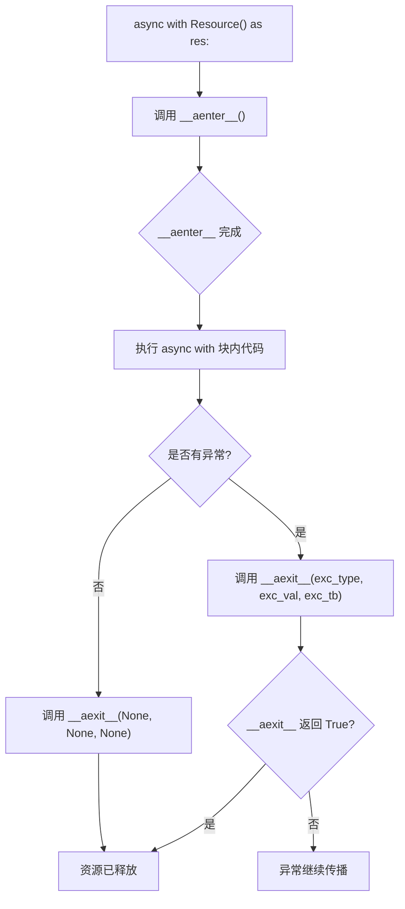
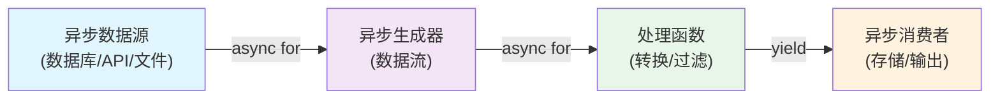

# Day 057 — 图解：asyncio 进阶

## 1. 异步上下文管理器执行流程



## 2. 同步 vs 异步迭代对比

```
同步迭代器                    异步迭代器
─────────────                ─────────────
for item in iterator:        async for item in async_iterator:
    │                            │
    ▼                            ▼
__next__() 返回值             __anext__() 返回协程
    │                            │
    ▼                            ▼
raise StopIteration           raise StopAsyncIteration

特点：同步阻塞               特点：异步非阻塞
      无法等待 I/O                  可以 await I/O
      适用于内存数据                适用于异步数据源
```

## 3. aiohttp 请求生命周期

```
┌────────────────────────────────────────────────────────┐
│                    Event Loop                          │
│                                                        │
│  ┌──────────┐  ┌──────────┐  ┌──────────┐             │
│  │  协程 1   │  │  协程 2   │  │  协程 3   │   ← 任务    │
│  └────┬─────┘  └────┬─────┘  └────┬─────┘             │
│       │             │             │                    │
│       ▼             ▼             ▼                    │
│  ┌─────────────────────────────────────────┐           │
│  │          aiohttp.ClientSession          │           │
│  │  ┌───────┐  ┌───────┐  ┌───────┐       │           │
│  │  │ TCP   │  │ TCP   │  │ TCP   │  ...  │  连接池    │
│  │  │Conn 1 │  │Conn 2 │  │Conn 3 │       │           │
│  │  └───┬───┘  └───┬───┘  └───┬───┘       │           │
│  └──────┼──────────┼──────────┼────────────┘           │
│         │          │          │                        │
└─────────┼──────────┼──────────┼────────────────────────┘
          ▼          ▼          ▼
       Server 1  Server 2  Server 3
```

## 4. 异步数据处理管道



## 5. 并发控制模型

```
无限制并发              Semaphore 限流           连接池限流
─────────────          ─────────────           ─────────────
请求1 ──►              请求1 ──►               请求1 ──►
请求2 ──►              请求2 ──►               请求2 ──►
请求3 ──►              ─── 等待 ───            ─── 等待 ───
请求4 ──►              ─── 等待 ───            请求3 ──►
请求5 ──►              请求3 ──►               ─── 等待 ───
...                    ─── 等待 ───            ...

风险：服务器过载        安全：控制并发数          安全：控制连接数
                      Semaphore(N)             TCPConnector(limit=N)
```
