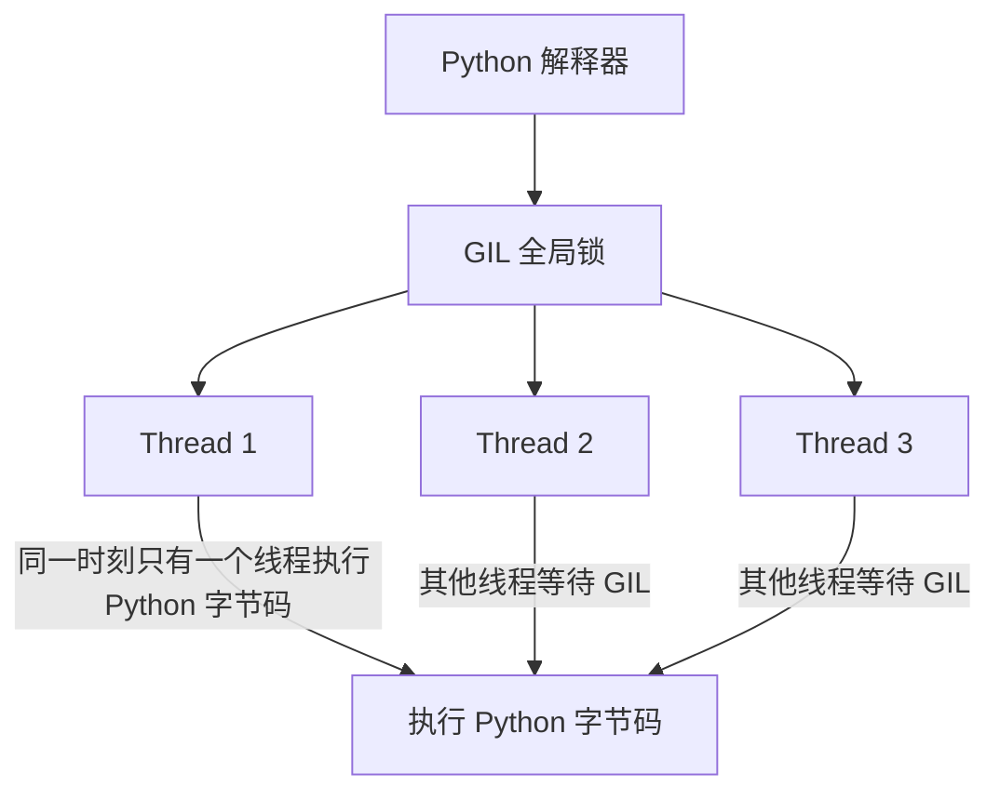
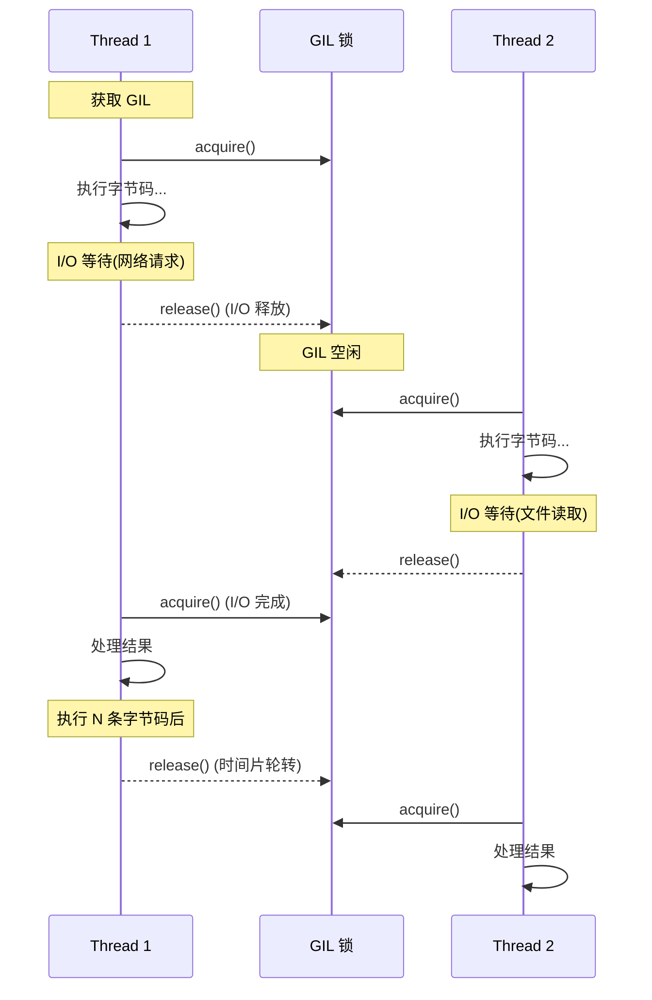

# Day 058 — 并发模型对比

> **阶段**：Phase 4 — 高阶特性  
> **主题**：线程 vs 进程 vs 协程，GIL 策略，性能基准测试

---

## 一、概念总览

### 1.1 三种并发模型是什么？

| 模型 | 基本单位 | 执行方式 | 通信方式 | Python 实现 |
|------|----------|----------|----------|-------------|
| **多线程 (Thread)** | 线程 | 操作系统抢占式调度 | 共享内存（需加锁） | `threading` 模块 |
| **多进程 (Process)** | 进程 | 操作系统抢占式调度 | 消息传递（序列化） | `multiprocessing` 模块 |
| **协程 (Coroutine)** | 协程/任务 | 事件循环协作式调度 | 内存共享（单线程） | `asyncio` 模块 |

### 1.2 为什么要对比它们？

不同并发模型有不同的性能特征：
- **CPU 密集型**任务（计算、加密、图像处理）→ 进程更适合
- **I/O 密集型**任务（网络请求、文件读写、数据库查询）→ 协程更高效
- **混合型**任务 → 线程可能是折中方案

理解每种模型的适用边界，才能做出正确的架构决策。

---

## 二、原理解析

### 2.1 Python 的 GIL（全局解释器锁）

GIL 是 CPython 解释器中最关键的设计约束，直接影响并发模型的选择。



**GIL 的核心机制：**
- 每个 Python 线程在执行字节码前必须获取 GIL
- 执行一定数量的字节码指令后自动释放 GIL
- I/O 操作（网络、文件）期间会释放 GIL，允许其他线程运行
- C 扩展（NumPy、OpenCV）中的计算代码可以释放 GIL

**GIL 带来的影响：**
```
单线程:     ████████████████████ 100% (CPU 全利用)
多线程 CPU:  ██░██░██░██░██░██░██  ~50% (GIL 争抢, CPU 利用率下降)
多进程 CPU:  ████████████████████ 100% (每个进程有自己的 GIL)
多协程 IO:   ████████████████████ 100% (切换等待, CPU 不空闲)
```

> 💡 **关键理解**：GIL 只影响 CPU 密集型多线程的性能。对于 I/O 密集型任务，多线程依然有效，因为 I/O 等待期间 GIL 会自动释放。

### 2.2 内存模型对比

```
┌─────────────────────────────────────────────────┐
│                  多线程模型                       │
│  ┌──────────┐  ┌──────────┐  ┌──────────┐      │
│  │ Thread 1 │  │ Thread 2 │  │ Thread 3 │      │
│  └────┬─────┘  └────┬─────┘  └────┬─────┘      │
│       │              │              │             │
│       ▼              ▼              ▼             │
│  ┌─────────────────────────────────────────┐    │
│  │         共享内存空间                      │    │
│  │  (需要 Lock 保护, 否则数据竞争)           │    │
│  └─────────────────────────────────────────┘    │
└─────────────────────────────────────────────────┘

┌─────────────────────────────────────────────────┐
│                  多进程模型                       │
│  ┌──────────┐  ┌──────────┐  ┌──────────┐      │
│  │Process 1 │  │Process 2 │  │Process 3 │      │
│  │ 内存空间A │  │ 内存空间B │  │ 内存空间C │      │
│  └──────────┘  └──────────┘  └──────────┘      │
│       │              │              │             │
│       ▼              ▼              ▼             │
│  ┌─────────────────────────────────────────┐    │
│  │   消息队列 / 管道 / 共享内存 (需手动同步)  │    │
│  └─────────────────────────────────────────┘    │
└─────────────────────────────────────────────────┘

┌─────────────────────────────────────────────────┐
│                  协程模型                        │
│  ┌─────────────────────────────────────────┐    │
│  │            事件循环 (单线程)              │    │
│  │  ┌─────┐   ┌─────┐   ┌─────┐          │    │
│  │  │Co1  │   │Co2  │   │Co3  │          │    │
│  │  └──┬──┘   └──┬──┘   └──┬──┘          │    │
│  │     │  交替执行 │  交替执行│              │    │
│  │     ▼         ▼         ▼              │    │
│  │   单一内存空间 (无需锁, 但需小心)         │    │
│  └─────────────────────────────────────────┘    │
└─────────────────────────────────────────────────┘
```

### 2.3 GIL 释放策略



**关键触发点：**
1. **I/O 操作**：`socket.recv()`、`file.read()`、`time.sleep()` 等
2. **C 扩展**：NumPy 的 `np.dot()`、OpenCV 的图像处理等
3. **时间片轮转**：`sys.setswitchinterval()` 控制切换频率（默认 5ms）

---

## 三、API 速查表

### 3.1 threading — 多线程

```python
import threading

# 创建线程
t = threading.Thread(target=worker, args=(1,), daemon=True)

# 线程同步
lock = threading.Lock()
with lock:
    # 临界区代码
    shared_data += 1

# 条件变量
cond = threading.Condition()
cond.wait()      # 等待条件
cond.notify()    # 唤醒一个等待线程
cond.notify_all()  # 唤醒所有等待线程

# 信号量
sem = threading.Semaphore(5)  # 最多 5 个线程并发
sem.acquire()
sem.release()

# 线程池
from concurrent.futures import ThreadPoolExecutor
with ThreadPoolExecutor(max_workers=4) as executor:
    future = executor.submit(task, arg)
    result = future.result(timeout=30)
```

### 3.2 multiprocessing — 多进程

```python
from multiprocessing import Process, Queue, Pool, Manager

# 创建进程
p = Process(target=worker, args=(data,))
p.start()
p.join(timeout=10)

# 进程间通信
q = Queue()
q.put(data)
result = q.get(timeout=5)

# 进程池
with Pool(processes=4) as pool:
    result = pool.map(worker, [1, 2, 3, 4])
    result = pool.apply_async(worker, (arg,)).get(timeout=30)

# 共享内存
from multiprocessing import Value, Array
counter = Value('i', 0)  # 共享整数
arr = Array('d', [0.0] * 10)  # 共享数组

# Manager 对象 (跨进程共享复杂对象)
with Manager() as manager:
    shared_dict = manager.dict()
    shared_list = manager.list()
```

### 3.3 asyncio — 协程

```python
import asyncio

# 定义协程
async def fetch_data(url):
    async with aiohttp.ClientSession() as session:
        async with session.get(url) as resp:
            return await resp.json()

# 运行协程
asyncio.run(main())
result = asyncio.get_event_loop().run_until_complete(coro)

# 并发执行
results = await asyncio.gather(
    fetch_data(url1),
    fetch_data(url2),
    return_exceptions=True
)

# 超时控制
result = await asyncio.wait_for(coro, timeout=5.0)

# 任务组 (Python 3.11+)
async with asyncio.TaskGroup() as tg:
    task1 = tg.create_task(coro1())
    task2 = tg.create_task(coro2())
```

---

## 四、适用场景决策矩阵

| 场景 | 推荐模型 | 原因 |
|------|----------|------|
| CPU 密集计算（数值运算、加密） | **多进程** | 绕过 GIL，多核并行 |
| 高并发网络 I/O（爬虫、API） | **协程** | 轻量级，单线程管理万级连接 |
| 混合 I/O + CPU（Web 服务） | **线程池 + 进程池** | I/O 用线程，计算用进程 |
| 实时数据流（WebSocket） | **协程** | 低延迟，非阻塞 |
| 科学计算（NumPy 优化后） | **多进程** | NumPy 释放 GIL |
| GUI 应用后台任务 | **线程** | 避免阻塞主线程 |
| 文件批量处理 | **多进程** | 绕过 GIL，利用多核 |
| 微服务网关 | **协程** | 高吞吐，低资源占用 |

---

## 五、性能基准测试分析

### 5.1 基准测试设计

```python
# 测试场景 1: CPU 密集型
# 计算大量质数
def cpu_bound(n):
    return sum(1 for i in range(n) if is_prime(i))

# 测试场景 2: I/O 密集型
# 模拟网络请求
async def io_bound_async(url):
    async with aiohttp.ClientSession() as session:
        async with session.get(url) as resp:
            return await resp.text()

def io_bound_sync(url):
    return requests.get(url).text
```

### 5.2 典型性能对比结果

**CPU 密集型（计算质数）：**
```
单线程:     1.00x  (基准)
2 线程:     0.55x  (GIL 争抢, 比单线程还慢!)
4 线程:     0.30x  (更严重的争抢)
2 进程:     1.90x  (接近 2x, 有效利用多核)
4 进程:     3.70x  (接近 4x, 几乎线性加速)
协程:       1.00x  (单线程, 无加速效果)
```

**I/O 密集型（模拟 100ms 延迟 x 100 次）：**
```
同步:       10.0s  (100 x 100ms 串行)
2 线程:      5.1s  (接近 2x 提速)
8 线程:      1.3s  (接近 8x 提速)
2 进程:      5.1s  (进程创建开销大)
100 协程:    0.15s  (极低延迟, 并发切换)
```

### 5.3 资源消耗对比

| 指标 | 线程 | 进程 | 协程 |
|------|------|------|------|
| 内存占用 | ~8MB/线程 | ~50MB/进程 | ~1KB/协程 |
| 创建开销 | ~10ms | ~100ms | ~0.01ms |
| 上下文切换 | ~1ms | ~5ms | ~0.01ms |
| 最大并发数 | ~数百 | ~数十 | ~数万 |

---

## 六、GIL 策略深度解析

### 6.1 GIL 的历史与争议

GIL 诞生于 1992 年，由 Guido van Rossum 引入 CPython，目的是简化 C 扩展的内存管理。这一直是 Python 社区的热门争议话题。

### 6.2 GIL 的替代方案

| 方案 | 状态 | 说明 |
|------|------|------|
| **PEP 703 (Free-threaded Python)** | Python 3.13+ 可选 | 可选移除 GIL，实验性 |
| **subinterpreters** | Python 3.12+ | 每个子解释器有自己的 GIL |
| **Jython/IronPython** | 已实现 | JVM/.NET 原生线程 |
| **C 扩展释放 GIL** | 长期支持 | NumPy 等已采用 |

### 6.3 Free-threaded Python (Python 3.13+)

```python
# 编译时启用
# ./configure --disable-gil

# 运行时检查
import sys
if hasattr(sys, '_is_gil_enabled'):
    print(f"GIL enabled: {sys._is_gil_enabled()}")

# Python 3.13t (free-threaded build)
# 多线程 CPU 密集型性能大幅提升
```

---

## 七、实战场景代码

### 场景 1: 网络爬虫 — 协程 vs 线程

```python
# 协程版本 - 1000 个 URL
async def crawl_async(urls):
    async with aiohttp.ClientSession() as session:
        tasks = [fetch(session, url) for url in urls]
        return await asyncio.gather(*tasks)

# 线程版本 - 1000 个 URL
def crawl_threaded(urls, max_workers=100):
    with ThreadPoolExecutor(max_workers=max_workers) as executor:
        return list(executor.map(fetch_sync, urls))
```

### 场景 2: 图像批处理 — 多进程

```python
from multiprocessing import Pool
from PIL import Image

def process_image(path):
    img = Image.open(path)
    img.thumbnail((200, 200))
    img.save(path.replace('.jpg', '_thumb.jpg'))
    return path

with Pool(8) as pool:
    results = pool.map(process_image, image_paths)
```

### 场景 3: Web 服务器 — 混合模型

```
┌─────────────────────────────────────┐
│          Web 服务器架构              │
│                                     │
│  ┌─────────────────────────────┐   │
│  │     事件循环 (协程)          │   │
│  │  - 接受连接                 │   │
│  │  - 路由分发                 │   │
│  │  - I/O 等待                 │   │
│  └──────────┬──────────────────┘   │
│             │                       │
│     ┌───────┴───────┐              │
│     ▼               ▼              │
│  ┌──────┐      ┌──────────┐       │
│  │线程池 │      │ 进程池   │       │
│  │I/O任务│      │ CPU 任务  │       │
│  └──────┘      └──────────┘       │
└─────────────────────────────────────┘
```

---

## 八、常见陷阱与避坑

### 陷阱 1: 多线程 CPU 密集型反而更慢
```python
# ❌ 错误：多线程做 CPU 计算
from threading import Thread
threads = [Thread(target=heavy_compute) for _ in range(4)]
for t in threads: t.start()
for t in threads: t.join()
# 结果: 比单线程慢 50-70%（GIL 争抢）

# ✅ 正确：多进程做 CPU 计算
from multiprocessing import Process
processes = [Process(target=heavy_compute) for _ in range(4)]
for p in processes: p.start()
for p in processes: p.join()
# 结果: 接近 4x 加速
```

### 陷阱 2: 忘记 join() 导致僵尸进程
```python
# ❌ 忘记 join
p = Process(target=work)
p.start()
# p 没有 join，主进程可能提前退出

# ✅ 正确使用
p = Process(target=work)
p.start()
p.join(timeout=30)  # 带超时
if p.is_alive():
    p.terminate()  # 强制结束
```

### 陷阱 3: 协程中混用同步阻塞代码
```python
# ❌ 在协程中调用阻塞 I/O
async def bad():
    time.sleep(1)  # 阻塞整个事件循环！
    requests.get(url)  # 同步阻塞！

# ✅ 正确做法
async def good():
    await asyncio.sleep(1)
    async with aiohttp.ClientSession() as s:
        async with s.get(url) as r:
            return await r.json()

# ✅ 用 run_in_executor 包装同步代码
async def wrapper():
    loop = asyncio.get_event_loop()
    result = await loop.run_in_executor(None, blocking_func)
```

---

## 九、思考题

1. **GIL 是锁，那能不能用 `threading.Lock()` 替代 GIL？为什么不行？**

2. **如果一个程序同时有大量 I/O 和少量 CPU 计算，应该选哪种模型？如果反过来呢？**

3. **Python 3.13 的 Free-threaded Python 改变了什么？这对 `asyncio` 的定位有什么影响？**

4. **协程号称"并发"，但它真的是并行的吗？在单核和多核机器上表现有什么区别？**

5. **设计一个爬虫系统：每天抓取 10 万页面，如何选择并发模型？请给出架构方案和理由。**

---

## 十、参考资源

- [Python GIL 官方文档](https://docs.python.org/3/glossary.html#global-interpreter-lock)
- [PEP 703 — Making the GIL Optional](https://peps.python.org/pep-0703/)
- [Real Python — Speed Up Python with Concurrency](https://realpython.com/python-concurrency/)
- [David Beazley — Understanding the Python GIL](https://pyvideo.org/pycon-us-2010/understanding-the-python-gil.html)

---

## 附录: 常见面试题

### Q1: Python 的 GIL 是什么？为什么存在？

GIL (Global Interpreter Lock) 是 CPython 解释器中的全局锁，确保同一时刻只有一个线程执行 Python 字节码。它简化了 C 扩展的内存管理，但限制了多线程的 CPU 并行能力。

### Q2: 多线程和多进程的区别？

| 特性 | 多线程 | 多进程 |
|------|--------|--------|
| 内存 | 共享 | 独立 |
| 创建开销 | 小 | 大 |
| 通信 | 简单（共享变量） | 复杂（IPC） |
| GIL 影响 | 受限 | 不受限 |
| 适用场景 | I/O 密集 | CPU 密集 |

### Q3: 什么时候用协程？

高并发 I/O 场景，如网络爬虫、API 网关、WebSocket 服务。协程在单线程中管理数万并发连接，内存占用极低。

### Q4: 如何绕过 GIL？

1. 使用多进程（每个进程有自己的 GIL）
2. 使用 C 扩展（NumPy 等释放 GIL）
3. 使用 Python 3.13+ 的 Free-threaded Python（实验性）
4. 使用 Jython/IronPython 等替代实现

---

## 附录: 并发模型选择速查卡

```
┌─────────────────────────────────────────────────────┐
│              并发模型选择速查卡                        │
├─────────────────────────────────────────────────────┤
│                                                     │
│  任务类型          推荐模型         关键指标          │
│  ───────────────────────────────────────────────    │
│  CPU 密集型        多进程          多核利用率         │
│  I/O 密集型        协程            并发连接数         │
│  混合型            线程池+进程池    平衡性             │
│  实时数据流        协程            延迟               │
│  GUI 后台          线程            响应性             │
│  批量文件处理      多进程          吞吐量             │
│                                                     │
│  ⚠️ 避坑:                                           │
│  • 多线程做 CPU 计算 → 比串行更慢!                   │
│  • 协程中调用 time.sleep() → 阻塞事件循环!           │
│  • 忘记 Process.join() → 僵尸进程!                   │
│  • 忘记 Lock 保护共享数据 → 数据竞争!                 │
│                                                     │
└─────────────────────────────────────────────────────┘
```

---

## 附录: Python 版本与并发特性对照

| Python 版本 | 并发特性 | 说明 |
|-------------|----------|------|
| 2.7 | threading, multiprocessing | 基础并发 |
| 3.4 | asyncio 引入 | 协程基础 |
| 3.5 | async/await 语法 | 更清晰的协程写法 |
| 3.6 | asyncio 改进 | 更稳定的事件循环 |
| 3.7 | asyncio.run() | 简化协程运行 |
| 3.8 | concurrent.futures 改进 | 更好的线程/进程池 |
| 3.9 | TaskGroup 准备 | 结构化并发 |
| 3.10 | match/case, 结构化并发 | 更好的并发模式 |
| 3.11 | TaskGroup 正式引入 | 异常处理更优雅 |
| 3.12 | subinterpreters | 每个子解释器独立 GIL |
| 3.13 | Free-threaded Python | 可选移除 GIL (实验性) |
