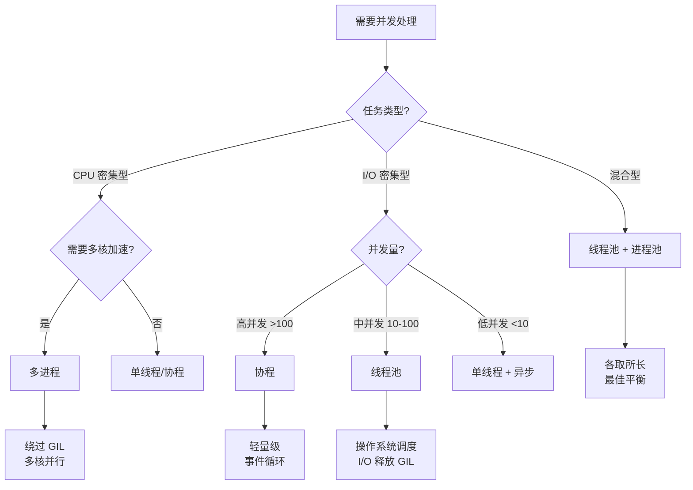

# Day 058 — 并发模型对比 图解

## 1. GIL 工作原理

```
┌──────────────────────────────────────────────────────┐
│                   CPython 解释器                      │
│                                                      │
│  ┌────────────────────────────────────────────────┐  │
│  │              GIL (全局解释器锁)                  │  │
│  │        同一时刻只有一个线程持有 GIL              │  │
│  └─────────┬──────────┬──────────┬────────────────┘  │
│            │          │          │                    │
│     ┌──────▼───┐ ┌────▼────┐ ┌──▼──────┐            │
│     │ Thread 1 │ │Thread 2 │ │Thread 3 │            │
│     │ 持有 GIL │ │  等待   │ │  等待   │            │
│     └──────────┘ └─────────┘ └─────────┘            │
│            │                                          │
│     ┌──────▼──────────────────┐                      │
│     │   执行 Python 字节码     │                      │
│     │   (一次执行 N 条指令)    │                      │
│     └──────────┬──────────────┘                      │
│                │                                      │
│     ┌──────────▼──────────────┐                      │
│     │  I/O 操作 → 释放 GIL    │  或                   │
│     │  时间片到 → 释放 GIL     │                      │
│     └──────────┬──────────────┘                      │
│                │                                      │
│     ┌──────────▼──────────────┐                      │
│     │  其他线程获取 GIL 继续   │                      │
│     └─────────────────────────┘                      │
└──────────────────────────────────────────────────────┘
```

## 2. 三种并发模型内存模型对比

```
┌──────────────────────┬──────────────────────┬──────────────────────┐
│      多线程模型       │      多进程模型       │      协程模型         │
├──────────────────────┼──────────────────────┼──────────────────────┤
│  ┌───┐ ┌───┐ ┌───┐  │  ┌───┐ ┌───┐ ┌───┐  │  ┌─────────────────┐ │
│  │ T │ │ T │ │ T │  │  │ P │ │ P │ │ P │  │  │   事件循环       │ │
│  └─┬─┘ └─┬─┘ └─┬─┘  │  └─┬─┘ └─┬─┘ └─┬─┘  │  │  ┌───┐ ┌───┐  │ │
│    │      │      │    │    │      │      │    │  │  │C1 │ │C2 │  │ │
│    ▼      ▼      ▼    │    ▼      ▼      ▼    │  │  └───┘ └───┘  │ │
│  ┌─────────────────┐ │  ┌───┐  ┌───┐  ┌───┐ │  │  交替执行       │ │
│  │   共享内存空间   │ │  │ A │  │ B │  │ C │ │  │  单线程无锁     │ │
│  │  (需 Lock 保护) │ │  └───┘  └───┘  └───┘ │  └─────────────────┘ │
│  └─────────────────┘ │       ↓       ↓       │                       │
│                      │  ┌─────────────────┐  │                       │
│                      │  │  消息队列/管道   │  │                       │
│                      │  │  (需序列化)     │  │                       │
│                      │  └─────────────────┘  │                       │
└──────────────────────┴──────────────────────┴──────────────────────┘
```

## 3. 选择决策流程图



## 4. GIL 释放时机图

```
时间线 ─────────────────────────────────────────────────►

Thread 1: ████░░░░░░████░░░░░░░░████░░░░░░████
           执行    I/O等待      执行    I/O等待
           ▲                    ▲
           │                    │
        GIL持有              GIL持有

Thread 2: ░░░░████░░░░░░████░░░░████░░░░░░████
              执行      执行      执行      执行
              ▲         ▲         ▲         ▲
              │         │         │         │
           GIL持有    GIL持有   GIL持有    GIL持有

█ = 持有 GIL 执行    ░ = 等待 GIL
```
