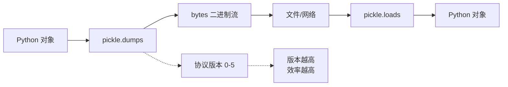
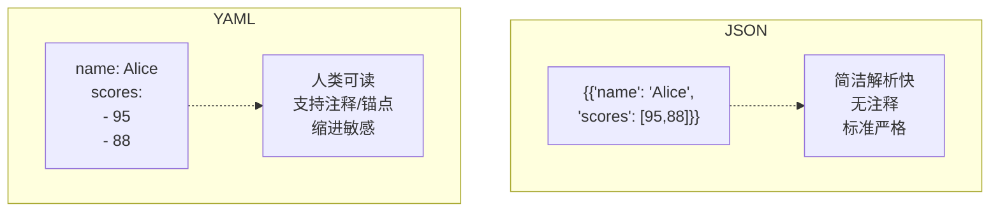

# Day 062 — 数据序列化

## 概述

数据序列化（Serialization）是将内存中的数据结构（如 Python 的 dict、list、对象）转换为可以存储或传输的格式的过程。反序列化（Deserialization）则是逆过程——将存储/传输格式还原为内存中的数据结构。

> 通俗理解：序列化 = 把 Python 对象「打包」成字符串/二进制流，反序列化 = 把打包好的数据「解包」回 Python 对象。

---

## 1. 为什么需要序列化？

### 1.1 核心目的

| 场景 | 说明 |
|------|------|
| **持久化存储** | 将程序状态保存到磁盘文件，下次启动时恢复 |
| **网络传输** | 通过 HTTP、RPC 等协议在不同服务之间交换数据 |
| **跨语言通信** | 不同编程语言的系统之间共享数据 |
| **缓存** | 将计算结果序列化后存入 Redis/Memcached |
| **配置文件** | 使用人类可读的格式（JSON/YAML）作为配置 |

### 1.2 设计原理

Python 对象存活在进程的堆内存中，进程退出后内存被回收。如果要让数据「活」到进程之外，就必须将其转换为字节流——这就是序列化的本质。

```
┌─────────────────────────────────────────────────┐
│                  进程 A                          │
│  ┌──────────┐    序列化     ┌──────────────┐    │
│  │ {"name": │ ──────────→  │ b'{"name":..} │    │
│  │  "Alice"} │             │              │    │
│  └──────────┘    字节流     └──────────────┘    │
│                       │                         │
│                       ▼                         │
│                文件 / 网络 / 缓存                 │
│                       │                         │
│  ┌──────────┐    反序列化   ┌──────────────┐    │
│  │ {"name": │ ←──────────  │ b'{"name":..} │    │
│  │  "Bob"}  │             │              │    │
│  └──────────┘              └──────────────┘    │
│                  进程 B                          │
└─────────────────────────────────────────────────┘
```

---

## 2. JSON 序列化（json 模块）

### 2.1 概念

JSON（JavaScript Object Notation）是一种轻量级的数据交换格式，基于 JavaScript 语法子集，但被几乎所有编程语言支持。

**Python 类型 ↔ JSON 类型映射：**

| Python | JSON |
|--------|------|
| `dict` | `object` |
| `list`, `tuple` | `array` |
| `str` | `string` |
| `int`, `float` | `number` |
| `True` / `False` | `true` / `false` |
| `None` | `null` |

### 2.2 核心 API

| 函数 | 说明 | 参数 |
|------|------|------|
| `json.dumps(obj)` | Python 对象 → JSON 字符串 | `ensure_ascii`, `indent`, `sort_keys`, `default` |
| `json.dump(obj, fp)` | Python 对象 → 写入文件流 | 同上 + 文件对象 |
| `json.loads(s)` | JSON 字符串 → Python 对象 | `parse_float`, `object_hook` |
| `json.load(fp)` | 从文件流读取 → Python 对象 | 同上 |

**常用参数详解：**

```python
import json

data = {"name": "Alice", "scores": [95, 88], "active": True}

# 基础
json.dumps(data)               # '{"name": "Alice", "scores": [95, 88], "active": true}'

# 美化输出
json.dumps(data, indent=2)     # 带缩进格式化

# 中文不转义
json.dumps({"name": "张三"}, ensure_ascii=False)   # '{"name": "张三"}'

# 按键排序
json.dumps(data, sort_keys=True)

# 自定义类型编码
json.dumps(data, default=str)  # 遇到不可序列化的类型调用 str()
```

### 2.3 自定义编码器

当遇到 `datetime`、`Decimal` 等 Python 特有类型时，JSON 默认不支持，需要自定义：

```python
import json
from datetime import datetime

class CustomEncoder(json.JSONEncoder):
    def default(self, obj):
        if isinstance(obj, datetime):
            return obj.isoformat()
        return super().default(obj)

data = {"time": datetime.now(), "value": 42}
json.dumps(data, cls=CustomEncoder)
# '{"time": "2026-07-12T06:00:00", "value": 42}'
```

类似地，`object_hook` 用于反序列化时自定义转换：

```python
def decode_datetime(dct):
    if "time" in dct:
        dct["time"] = datetime.fromisoformat(dct["time"])
    return dct

json.loads(json_str, object_hook=decode_datetime)
```

---

## 3. pickle / msgpack

### 3.1 pickle — Python 专属序列化

`pickle` 是 Python 内置的二进制序列化协议，**只能用于 Python 之间**，不支持跨语言。

**特点：**
- ✅ 支持任意 Python 对象（包括自定义类、函数、生成器等）
- ✅ 二进制格式，比 JSON 更紧凑
- ✅ 内置协议版本（0-5，Python 3.8+ 支持 Protocol 5）
- ❌ **不安全**：反序列化不可信数据时可能执行任意代码
- ❌ 跨语言/跨版本兼容性差



**核心 API：**

| 函数 | 说明 |
|------|------|
| `pickle.dumps(obj)` | 对象 → bytes |
| `pickle.dump(obj, fp)` | 对象 → 二进制文件 |
| `pickle.loads(data)` | bytes → 对象 |
| `pickle.load(fp)` | 二进制文件 → 对象 |
| `pickle.HIGHEST_PROTOCOL` | 当前 Python 支持的最高协议版本 |

**安全警告：** 永远不要 `pickle.loads()` 来自不可信来源的数据。攻击者可以构造恶意的 pickle 数据来执行任意代码。

```python
# ⚠️ 危险示例 — 恶意 pickle 可以执行系统命令
import pickle
import os

# 攻击者构造的 payload
class Exploit:
    def __reduce__(self):
        return (os.system, ('rm -rf /',))

malicious_data = pickle.dumps(Exploit())
# pickle.loads(malicious_data)  # ⚡ 会执行 rm -rf /
```

### 3.2 msgpack — 跨语言二进制序列化

MessagePack 是一种高效的二进制序列化格式，类似 JSON 但更紧凑。

**与 JSON 对比：**
- 同样的数据，msgpack 体积约为 JSON 的 60-70%
- 支持二进制数据（JSON 需要 base64 编码）
- 跨语言支持广泛

**安装：** `pip install msgpack`

```python
import msgpack

data = {"name": "Alice", "age": 30, "scores": [95, 88]}

# 序列化
packed = msgpack.packb(data)   # bytes

# 反序列化
unpacked = msgpack.unpackb(packed)

# 处理自定义类型
from datetime import datetime

def encode(obj):
    if isinstance(obj, datetime):
        return msgpack.ExtType(1, obj.isoformat().encode())
    raise TypeError(f"Unknown type: {type(obj)}")

def decode(code, data):
    if code == 1:
        return datetime.fromisoformat(data.decode())
    return data

packed = msgpack.packb(data, default=encode)
unpacked = msgpack.unpackb(packed, ext_hook=decode)
```

---

## 4. YAML 配置

### 4.1 概念

YAML（YAML Ain't Markup Language）是一种人类可读的数据序列化格式，常用于配置文件。

**特点：**
- 依赖缩进表示层级（类似 Python）
- 比 JSON/XML 更易读
- 支持注释（JSON 不支持）
- 支持锚点/别名（`&`/`*`）避免重复

**安装：** `pip install pyyaml`

```yaml
# config.yaml
server:
  host: localhost
  port: 8080
  debug: true

database:
  host: ${DB_HOST}
  name: myapp
  pool:
    min: 5
    max: 20

# 列表
features:
  - auth
  - logging
  - cache

# 锚点 & 别名（避免重复）
defaults: &defaults
  timeout: 30
  retries: 3

service_a:
  <<: *defaults
  url: /api/a

service_b:
  <<: *defaults
  url: /api/b
```

### 4.2 PyYAML API

```python
import yaml

# 加载 YAML（字符串）
with open("config.yaml") as f:
    config = yaml.safe_load(f)    # ✅ 推荐：只加载标准 YAML
    # config = yaml.load(f, Loader=yaml.FullLoader)  # 更强大但风险更高

# 转储为 YAML
data = {"name": "Alice", "scores": [95, 88]}
yaml_str = yaml.dump(data, default_flow_style=False)
print(yaml_str)
# name: Alice
# scores:
# - 95
# - 88

# 写入文件
with open("output.yaml", "w") as f:
    yaml.dump(data, f, default_flow_style=False)
```

### 4.3 YAML vs JSON 对比



---

## 5. 三种序列化方案对比

| 特性 | JSON | pickle | YAML |
|------|------|--------|------|
| **格式** | 文本（字符串） | 二进制 | 文本 |
| **跨语言** | ✅ 几乎所有语言 | ❌ 仅 Python | ✅ 多数语言 |
| **可读性** | ⭐⭐⭐ | ⭐ | ⭐⭐⭐⭐⭐ |
| **安全性** | ✅ 安全 | ❌ 不安全 | ✅ safe_load 安全 |
| **速度** | ⭐⭐⭐⭐ | ⭐⭐⭐⭐⭐ | ⭐⭐ |
| **体积** | ⭐⭐⭐ | ⭐⭐⭐⭐⭐ | ⭐⭐ |
| **自定义类型** | ❌ 需要自定义 | ✅ 原生支持 | ❌ 需要自定义 |
| **适用场景** | API、配置文件、Web | 缓存、进程间通信 | 配置文件、文档 |

---

## 6. 实战：配置文件解析器

详见 `code/03-config-parser.py`

实现一个通用配置管理器，支持：
- 自动检测配置文件格式（JSON/YAML）
- 支持环境变量替换（`${VAR_NAME}`）
- 配置合并与覆盖
- 配置验证

---

## 7. 思考题

1. **JSON 为什么不支持 datetime 类型？** 如果你是 JSON 标准委员会成员，你会怎么设计解决这个问题？
2. **pickle 的安全性设计为什么如此糟糕？** 为什么要支持 `__reduce__` 这个接口？
3. **YAML 的缩进规则和 Python 一样，那它有没有类似 PEP 8 的缩进规范？** 缩进多少个空格最合适？
4. **如果一个配置文件中既有 YAML 的锚点别名，又有环境变量引用，解析时应该先处理哪个？** 为什么？
5. **msgpack 比 JSON 更紧凑，为什么没有替代 JSON 成为 Web API 的主流格式？** 有哪些关键限制？

---

## 8. 最佳实践总结

| 场景 | 推荐方案 | 原因 |
|------|----------|------|
| REST API | JSON | 标准、跨语言、浏览器可直接解析 |
| 配置文件 | YAML | 可读性好、支持注释 |
| 内部缓存 | pickle | 速度快、支持任意对象 |
| 高性能 RPC | msgpack / protobuf | 体积小、解析快 |
| 日志输出 | JSON | 结构化、易于工具解析 |
| 数据持久化 | JSON | 安全、兼容性好 |
