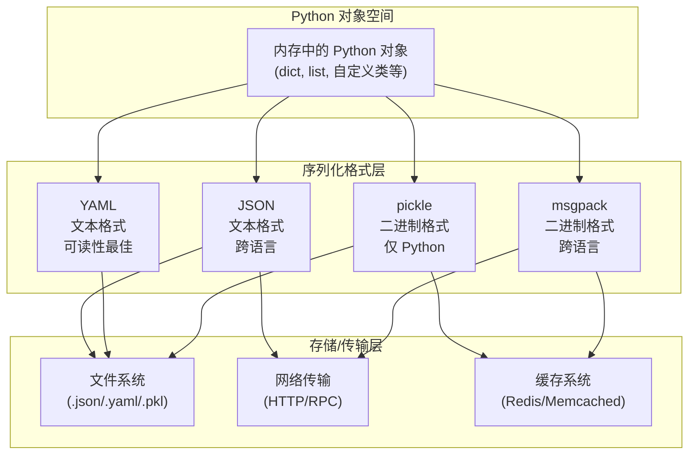

# Day 062 — 数据序列化：图解

## 1. 序列化体系架构



## 2. JSON 序列化流程

```
Python 对象                    JSON 字符串
┌──────────────┐    dumps()    ┌──────────────────┐
│ {             │  ──────────→ │ {                │
│   "name":     │              │   "name": "张三", │
│   "张三",     │   loads()    │   "age": 30,     │
│   "age": 30,  │  ←────────── │   "active": true │
│   "active":   │              │ }                │
│   True        │              │                  │
│ }             │              │                  │
└──────────────┘              └──────────────────┘

  dict   → object
  list   → array  
  str    → string
  int    → number
  True   → true
  False  → false
  None   → null
  tuple  → array  (⚠️ 类型信息丢失)
  set    → ❌ TypeError
  datetime → ❌ TypeError (需自定义编码)
```

## 3. 序列化格式选择决策树

```
要序列化的数据
    │
    ├─ 需要跨语言交换？
    │   ├─ 是 → 需要二进制？
    │   │   ├─ 是 → 用 msgpack (体积小，解析快)
    │   │   └─ 否 → 人类可读要求高？
    │   │       ├─ 是 → YAML (配置文件首选)
    │   │       └─ 否 → JSON (API/Web 标准)
    │   └─ 否 → 安全性要求高？
    │       ├─ 是 → 用 JSON 或 msgpack
    │       └─ 否 → pickle (速度最快，支持最广)
    │
    ├─ 用于配置文件？
    │   └─ 人类要编辑？
    │       ├─ 是 → YAML (支持注释、锚点)
    │       └─ 否 → JSON 或 TOML
    │
    ├─ 用于缓存/内部通信？
    │   ├─ 跨进程/跨服务 → msgpack / protobuf
    │   └─ 同进程 → pickle (零成本)
    │
    └─ 用于日志输出？
        └─ JSON (结构化日志，易于 ELK 等工具解析)
```

## 4. 二进制 vs 文本序列化对比

```
文本格式 (JSON/YAML)                二进制格式 (pickle/msgpack)
┌─────────────────────┐           ┌─────────────────────┐
│ 人类可直接阅读       │           │ 机器直接解析        │
│ {"name":"Alice"}    │           │ 82 a4 6e 61 6d 65   │
│                     │           │ a5 41 6c 69 63 65   │
│ ✓ 可读性好          │           │ ✓ 体积小 30-50%    │
│ ✓ 跨语言兼容        │           │ ✓ 解析速度快 2-5x  │
 │ ✓ 可编辑             │           │ ✓ 支持二进制数据    │
│ ❌ 体积大            │           │ ❌ 不可读           │
│ ❌ 解析慢            │           │ ❌ 部分格式不跨语言 │
│ ❌ 不支持二进制数据  │           │                     │
└─────────────────────┘           └─────────────────────┘
```

## 5. pickle 协议版本演进

```
Protocol 0  ─── ASCII 格式，最慢最胖
    │
Protocol 1  ─── 二进制格式，旧式
    │
Protocol 2  ─── Python 2.3+ 引入，支持新式类
    │
Protocol 3  ─── Python 3.0+ 默认，bytes 支持
    │
Protocol 4  ─── Python 3.4+ 默认，大型对象优化
    │
Protocol 5  ─── Python 3.8+，内存视图/零拷贝
    │
    ▼
  越高版本 → 速度越快 → 体积越小 → 兼容性越差
```

## 6. YAML 锚点与别名原理

```
数据定义                          引用
┌──────────────────────┐      ┌──────────────────────┐
│ defaults: &defaults  │      │ development:         │
│   timeout: 30       │ ───→ │   <<: *defaults      │
│   retries: 3        │ 锚    │   debug: true        │
│   debug: false      │ 点    │                      │
└──────────────────────┘      └──────────────────────┘

展开后等价于:
development:
  timeout: 30           ← 来自锚点
  retries: 3            ← 来自锚点
  debug: true           ← 被覆盖为 true

原理: YAML 解析时，*defaults 会被替换为 &defaults 指向的
节点的一个深拷贝，然后再应用 <<: 后的合并规则。
```

## 7. 配置文件加载流程（实战解析器）

```
                    ┌─────────────┐
                    │  用户调用    │
                    │ get("xxx")  │
                    └──────┬──────┘
                           │
                    ┌──────▼──────┐
                    │ 热加载检查   │
                    │ 文件变更?    │
                    └──────┬──────┘
                           │
              ┌────────────┴────────────┐
              │ 否                      │ 是
              ▼                         ▼
       ┌──────────────┐        ┌──────────────┐
       │ 使用缓存配置  │        │ 重新加载文件  │
       └──────┬───────┘        └──────┬───────┘
              │                       │
              └──────────┬────────────┘
                         ▼
                ┌─────────────────┐
                │ 点号路径解析     │
                │ "a.b.c" →       │
                │ config[a][b][c] │
                └────────┬────────┘
                         ▼
                ┌─────────────────┐
                │ 环境变量替换     │
                │ ${VAR} → os.env │
                └────────┬────────┘
                         ▼
                ┌─────────────────┐
                │  返回最终值      │
                └─────────────────┘
```
