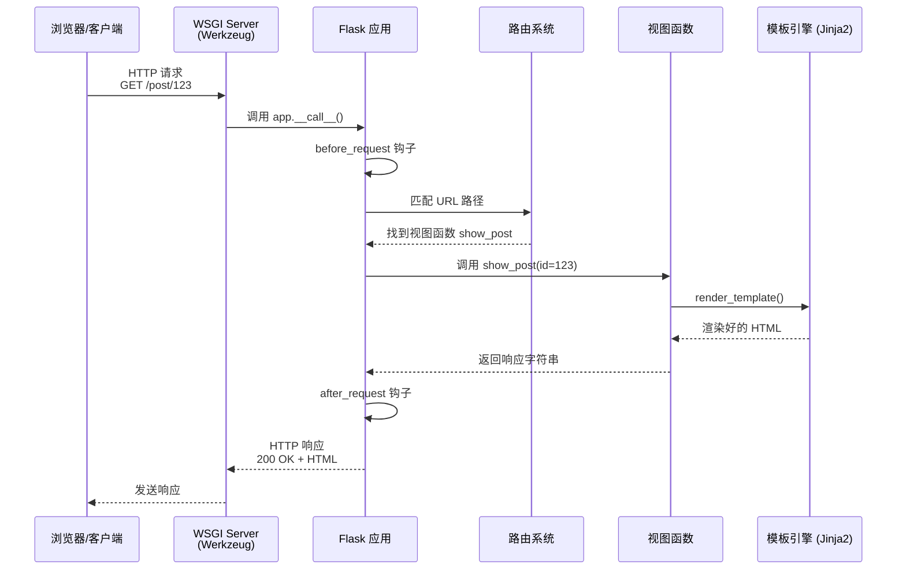
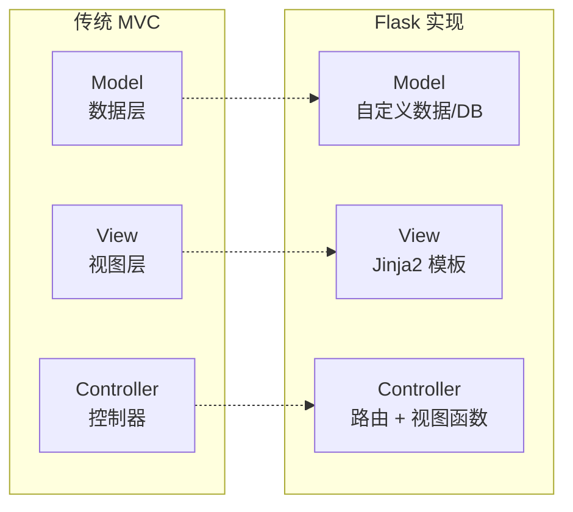
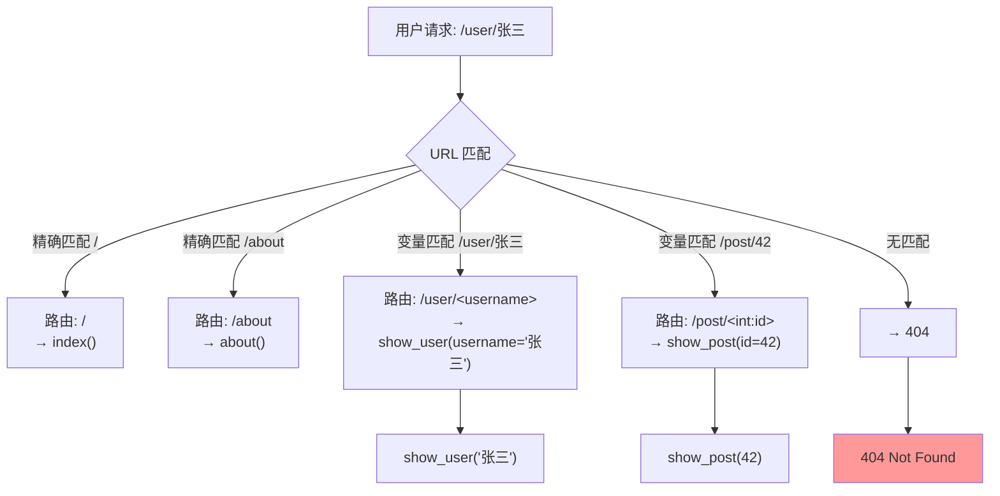
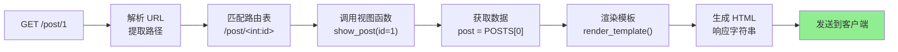

# Day 065 — 图解：Web 框架原理

> 本目录包含 Flask Web 框架核心概念的图解说明。

---

## 1. Flask 请求处理流程



---

## 2. MVC 模式 vs Flask 的实际模式

传统的 MVC（Model-View-Controller）模式在 Flask 中的对应关系：



Flask 没有强制 MVC 结构，但通常开发者会按以下模式组织：

```
Flask 请求处理模式（类似 Controller → View）

用户请求
    │
    ▼
routes.py (路由定义) ← 类似 Controller
    │  @app.route('/post/<id>')
    │  def show_post(id):
    │      post = get_post(id)  ← 类似 Model
    │      return render_template(
    │          'post.html',      ← 类似 View
    │          post=post
    │      )
    │
    ▼
templates/post.html (Jinja2 模板)
```

---

## 3. 路由匹配机制详解



**匹配顺序**：Flask 按照路由定义的**顺序**进行匹配。先定义的路由优先级更高。

---

## 4. Jinja2 模板渲染流程

```mermaid
graph TB
    subgraph "模板解析阶段"
        A[加载模板文件] --> B[解析模板语法]
        B --> C[构建 AST<br/>抽象语法树]
        C --> D[编译为 Python 字节码]
    end
    
    subgraph "模板渲染阶段"
        E[传入上下文变量] --> F[执行编译后的代码]
        F --> G[替换 {{变量}}]
        G --> H[执行 ]
        H --> I[生成最终 HTML]
    end
    
    D -.-> E
    
    style I fill:#90EE90
```

---

## 5. HTTP 请求-响应生命周期

```
                    ┌─────────────────────────────┐
                    │         Flask 应用            │
                    │                              │
请求进入               │  ┌───────────────────┐     │
──────┐               │  │   before_request   │     │
      │               │  │  (请求前处理)      │     │
      ▼               │  └────────┬──────────┘     │
┌──────────┐          │           ▼                │
│  WSGI    │──────────│──┌───────────────────┐     │
│ Server   │  environ │  │   路由解析         │     │
│(Werkzeug)│          │  │   匹配 URL → 函数  │     │
└──────────┘          │  └────────┬──────────┘     │
      ▲               │           ▼                │
      │               │  ┌───────────────────┐     │
      │               │  │   视图函数执行     │     │
      │               │  │   处理请求、渲染   │     │
      │               │  └────────┬──────────┘     │
      │               │           ▼                │
      │               │  ┌───────────────────┐     │
      │               │  │   after_request    │     │
  响应返回             │  │  (响应后处理)     │     │
←─────                │  └───────────────────┘     │
                      └─────────────────────────────┘
```

---

## 6. Flask 核心组件关系

```mermaid
graph TB
    subgraph "Flask 核心"
        Flask[Flask 应用] --> Router[路由系统<br/>@app.route]
        Flask --> Config[配置系统<br/>app.config]
        Flask --> Extension[扩展机制<br/>app.extensions]
    end
    
    subgraph "Werkzeug（WSGI 工具包）"
        WSGI[WSGI 服务器] --> Request[请求对象<br/>request]
        WSGI --> Response[响应对象<br/>response]
        WSGI --> RouterEngine[路由引擎<br/>Map/Rule]
    end
    
    subgraph "Jinja2（模板引擎）"
        Template[模板加载] --> Env[环境<br/>Environment]
        Env --> Compiler[编译<br/>Compiler]
        Env --> Sandbox[沙箱<br/>SandboxedEnvironment]
    end
    
    Flask --- WSGI
    Flask --- Template
    
    subgraph "开发者"
        Views[视图函数] --> Flask
        Templates[Jinja2 模板] --> Template
        Static[静态文件<br/>CSS/JS/图片] --> User[用户浏览器]
    end
    
    Views --> Templates
```

---

## 7. 渲染流程图：从 URL 到 HTML 的完整路径



---

## 8. 蓝图（Blueprint）—— 模块化组织

大型 Flask 项目通过蓝图（Blueprint）来组织模块：

```ascii
项目根目录/
│
├── app.py                  ← 创建 Flask 应用，注册蓝图
│
├── blog/                   ← 博客模块（蓝图）
│   ├── __init__.py         ← 创建蓝图对象
│   ├── routes.py           ← blog 的路由
│   └── templates/
│       └── blog/
│           ├── index.html
│           └── post.html
│
├── auth/                   ← 认证模块（蓝图）
│   ├── __init__.py
│   ├── routes.py           ← auth 的路由
│   └── templates/
│       └── auth/
│           ├── login.html
│           └── register.html
│
└── static/                 ← 全局静态文件
    ├── css/
    ├── js/
    └── images/
```

```python
# blog/routes.py
from flask import Blueprint, render_template

blog_bp = Blueprint('blog', __name__, url_prefix='/blog')

@blog_bp.route('/')
def index():
    return render_template('blog/index.html')

# app.py
from blog.routes import blog_bp
app.register_blueprint(blog_bp)
```
