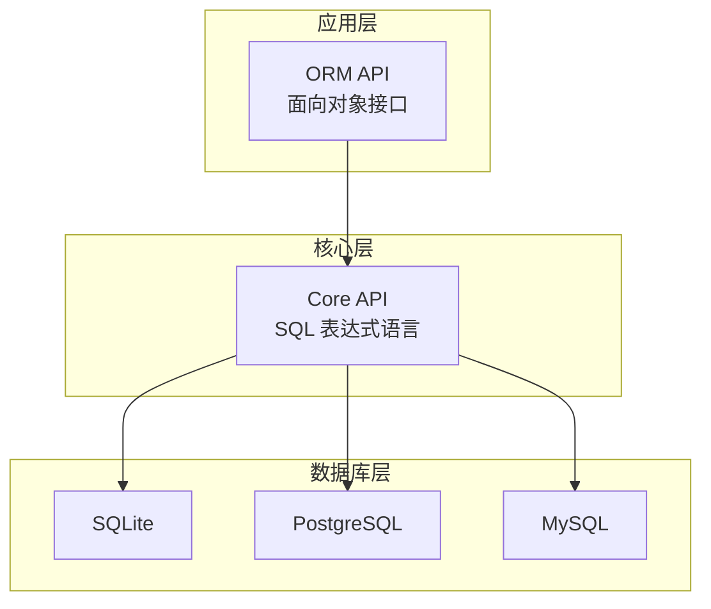
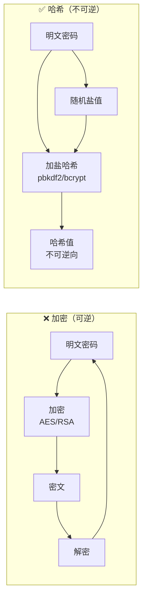
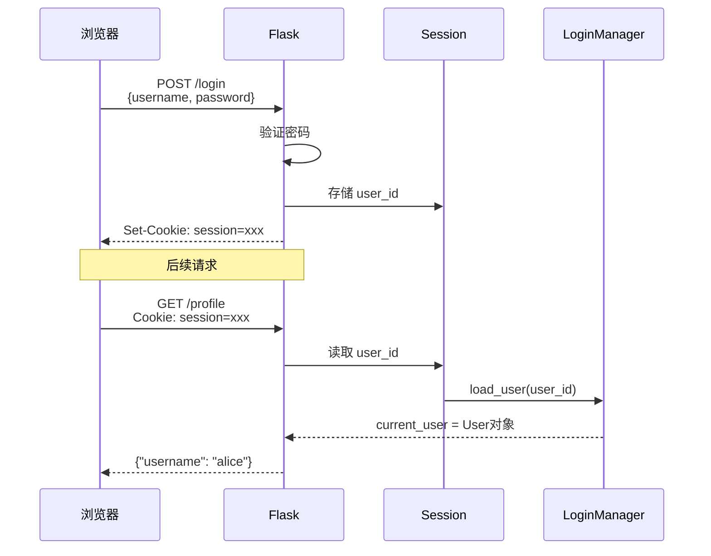
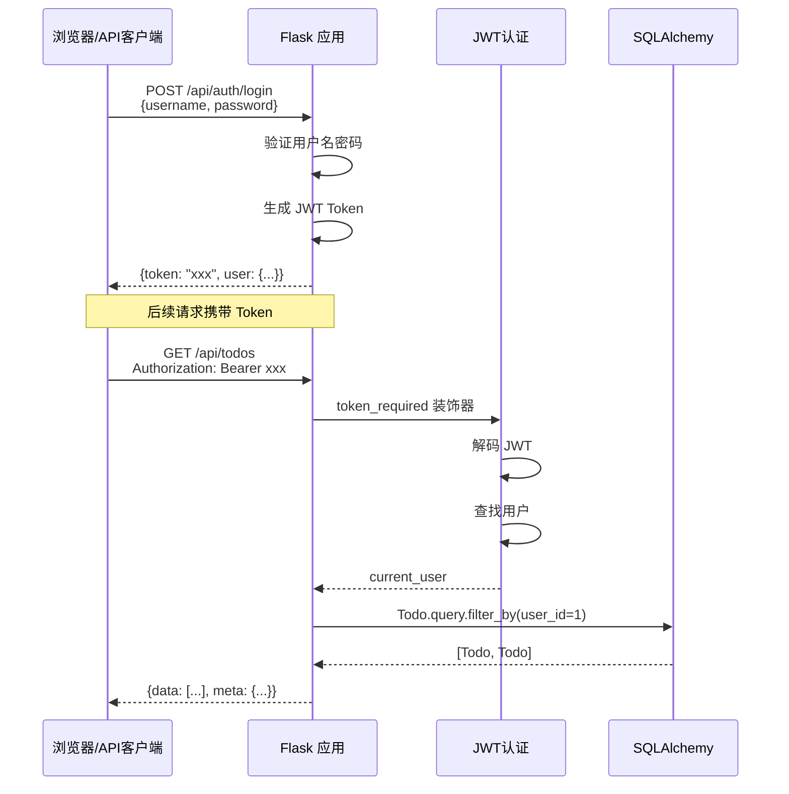

# Day 066 — Flask 进阶：数据库、认证与 RESTful API

## 概述

Day 065 我们学会了 Flask 的**基础**——路由、模板、请求/响应。今天进入**进阶**领域，将 Flask 与真实世界的 Web 开发需求结合起来：

1. **数据库集成（SQLAlchemy）** —— 如何把数据持久化到关系型数据库
2. **用户认证** —— 注册、登录、会话管理、密码安全
3. **RESTful API** —— 构建以 JSON 为核心的 Web 服务
4. **实战：TODO API** —— 用所学知识构建一个完整的任务管理 API

这些是**几乎每个生产级 Web 应用都会用到**的核心能力。

---

## 1. 数据库集成（SQLAlchemy）

### 1.1 为什么需要 ORM？

在没有 ORM（Object-Relational Mapping）之前，Python 操作数据库直接写 SQL：

```python
import sqlite3

conn = sqlite3.connect('app.db')
cursor = conn.cursor()

# 手动拼接 SQL——危险！
cursor.execute("SELECT * FROM users WHERE username = '%s'" % username)

# 即使使用参数化查询，代码依然繁琐
cursor.execute(
    "INSERT INTO todo (title, done, user_id) VALUES (?, ?, ?)",
    (title, done, user_id)
)
conn.commit()
```

**问题**：
- **SQL 注入风险**：手动拼接字符串是安全漏洞
- **重复样板代码**：每个表都要重复写 CRUD 的 SQL
- **类型不安全**：Python 类型和数据库类型需要手动转换
- **对象关系阻抗不匹配**：Python 对象 ←→ 数据库行 的转换很繁琐

> 💡 **ORM 的核心思想**：把关系型数据库的"表"映射成 Python 的"类"，把"行"映射成 Python 的"对象"，用 Python 的思维操作数据库。

### 1.2 SQLAlchemy 概览

SQLAlchemy 是 Python 最流行的 ORM 框架，它包含两层架构：



**分层设计的好处**：
- **上层（ORM）**：用 Python 类和对象操作数据库，适合大多数场景
- **下层（Core）**：用 Python 表达式写 SQL，需要复杂查询时更灵活
- **最底层**：通过 Dialect（方言）适配不同数据库，切换数据库时只需要改连接字符串

### 1.3 Flask-SQLAlchemy 集成

Flask-SQLAlchemy 是 Flask 的 SQLAlchemy 扩展，做了一些便捷封装：

```python
from flask import Flask
from flask_sqlalchemy import SQLAlchemy
from datetime import datetime, timezone

# 创建 Flask 应用
app = Flask(__name__)

# 🔑 配置数据库连接
app.config['SQLALCHEMY_DATABASE_URI'] = 'sqlite:///app.db'  # 数据库位置
app.config['SQLALCHEMY_TRACK_MODIFICATIONS'] = False         # 关闭事件跟踪（节省内存）

# 创建数据库实例
db = SQLAlchemy(app)
```

> 💡 **`sqlite:///app.db` 的含义**：这是数据库 URI（统一资源标识符）。`sqlite:///` 表示 SQLite 数据库，后面的路径是数据库文件位置。三个斜杠表示相对于应用根目录的路径。

### 1.4 定义模型（Model）

模型 = 数据库表在 Python 中的表示：

```python
class User(db.Model):
    """用户模型——对应数据库中的 user 表"""
    __tablename__ = 'user'  # 表名（不指定则默认类名小写）
    
    # 定义列（字段）
    id = db.Column(db.Integer, primary_key=True)       # 主键，自增
    username = db.Column(db.String(80), unique=True, nullable=False)  # 唯一，非空
    email = db.Column(db.String(120), unique=True, nullable=False)
    password_hash = db.Column(db.String(256), nullable=False)
    created_at = db.Column(db.DateTime, default=lambda: datetime.now(timezone.utc))
    
    # 关系（一对多）
    todos = db.relationship('Todo', backref='user', lazy=True)
    
    def __repr__(self):
        return f'<User {self.username}>'
```

**各列类型详解**：

| 类型 | Python 类型 | 说明 |
|------|-------------|------|
| `db.Integer` | `int` | 整数 |
| `db.String(n)` | `str` | 变长字符串，n 为最大长度 |
| `db.Text` | `str` | 无长度限制的文本 |
| `db.Float` | `float` | 浮点数 |
| `db.Boolean` | `bool` | 布尔值 |
| `db.DateTime` | `datetime` | 日期时间 |
| `db.Date` | `date` | 日期 |
| `db.JSON` | `dict/list` | JSON 数据 |
| `db.PickleType` | 任意 | Python 对象（用 pickle 序列化） |

**列约束选项**：

| 参数 | 说明 |
|------|------|
| `primary_key=True` | 主键 |
| `unique=True` | 唯一约束 |
| `nullable=False` | 不可为空 |
| `default=value` | 默认值 |
| `index=True` | 创建索引 |
| `db.ForeignKey('user.id')` | 外键 |

### 1.5 关系（Relationship）

```python
class Todo(db.Model):
    __tablename__ = 'todo'
    
    id = db.Column(db.Integer, primary_key=True)
    title = db.Column(db.String(200), nullable=False)
    done = db.Column(db.Boolean, default=False)
    user_id = db.Column(db.Integer, db.ForeignKey('user.id'), nullable=False)
    created_at = db.Column(db.DateTime, default=lambda: datetime.now(timezone.utc))
    # user_id 是外键，指向 user 表的 id
    
    def to_dict(self):
        return {
            'id': self.id,
            'title': self.title,
            'done': self.done,
            'user_id': self.user_id,
            'created_at': self.created_at.isoformat() if self.created_at else None
        }
```

**`db.relationship()` 的作用**：在 User 类中定义了 `todos = db.relationship('Todo', backref='user', lazy=True)`，这样：

```python
# 正向访问：通过用户获取他的所有 todo
user = User.query.get(1)
user.todos  # ➜ [Todo, Todo, ...]

# 反向访问：通过 todo 获取它的所有者
todo = Todo.query.get(1)
todo.user   # ➜ <User xxx>
# ^ 这就是 backref='user' 的作用——给 Todo 类添加了 .user 属性
```

**lazy 加载模式**：

| 模式 | 行为 |
|------|------|
| `lazy=True` / `lazy='select'` | 首次访问时惰性查询（默认） |
| `lazy='joined'` | 用 JOIN 一次性加载 |
| `lazy='subquery'` | 用子查询加载 |
| `lazy='dynamic'` | 返回 Query 对象，支持链式过滤 |

### 1.6 CRUD 操作速查

```python
# ──────────────── 创建 ────────────────

user = User(username='alice', email='alice@example.com')
db.session.add(user)      # 添加到会话
db.session.commit()       # 提交事务（写入数据库）

# 批量创建
todo1 = Todo(title='学 Flask', user=user)
todo2 = Todo(title='学 SQLAlchemy', user=user)
db.session.add_all([todo1, todo2])
db.session.commit()

# ──────────────── 读取 ────────────────

# 获取全部
User.query.all()

# 按主键获取
user = User.query.get(1)

# 按条件过滤
users = User.query.filter_by(username='alice').all()      # 精确匹配
users = User.query.filter(User.email.endswith('@gmail.com')).all()  # 模糊匹配
user = User.query.filter_by(username='alice').first()     # 取第一个

# 排序
todos = Todo.query.order_by(Todo.created_at.desc()).all()  # 倒序

# 分页
todos = Todo.query.paginate(page=1, per_page=10, error_out=False)

# 复杂查询
results = db.session.execute(
    db.select(User).where(User.username.in_(['alice', 'bob']))
).scalars().all()

# ──────────────── 更新 ────────────────

user = User.query.get(1)
user.email = 'newemail@example.com'  # 直接修改属性
db.session.commit()                   # 提交更新

# ──────────────── 删除 ────────────────

user = User.query.get(1)
db.session.delete(user)
db.session.commit()
```

### 1.7 数据库迁移

随着应用迭代，数据库表结构也会变化（新增字段、修改类型等）。Flask-Migrate 解决了这个问题：

```bash
pip install Flask-Migrate
```

```python
from flask_migrate import Migrate

migrate = Migrate(app, db)

# 终端操作
# flask db init        # 初始化迁移仓库
# flask db migrate     # 自动检测模型变化，生成迁移脚本
# flask db upgrade     # 应用迁移到数据库
# flask db downgrade   # 回滚迁移
```

> 💡 **为什么需要迁移而不是手动改表？** 在生产环境中，数据库里有真实数据。手动 ALTER TABLE 容易出错、难以回滚。迁移脚本可以像 Git 一样版本化管理，确保团队和部署环境的数据结构一致。

---

## 2. 用户认证

### 2.1 认证 vs 授权

| 概念 | 英文 | 说明 |
|------|------|------|
| **认证** | Authentication | **你是谁？** — 验证身份（登录） |
| **授权** | Authorization | **你能做什么？** — 判断权限（管理员/普通用户） |

>> Day 066 聚焦**认证**，授权会在后续内容中涉及。

### 2.2 密码安全：永远不要存明文密码

```python
from werkzeug.security import generate_password_hash, check_password_hash

# 注册：存储哈希值
password_hash = generate_password_hash('my_password123')
# ➜ 'pbkdf2:sha256:600000$...'  （自动加盐，默认 600000 次迭代）

# 登录：验证密码
is_valid = check_password_hash(password_hash, 'my_password123')  # ➜ True
is_valid = check_password_hash(password_hash, 'wrong_password')  # ➜ False
```

**为什么不是加密而是哈希？**



**核心技术**：
- **加盐（Salt）**：每个密码附加一个随机字符串再哈希，防止彩虹表攻击
- **慢哈希**：PBKDF2、bcrypt 等算法故意计算很慢（多次迭代），让暴力破解的成本剧增
- **不可逆**：从哈希值无法还原出原始密码，即使数据库泄露攻击者也拿不到密码

### 2.3 Flask-Login：会话管理

Flask-Login 管理用户的登录状态——它在用户的浏览器（session cookie）和服务器之间维护一个"登录了"的标记。

```python
from flask_login import LoginManager, UserMixin, login_user, logout_user, login_required, current_user

# ──────────────── 初始化 ────────────────
login_manager = LoginManager()
login_manager.init_app(app)
login_manager.login_view = 'login'  # 未登录时重定向到登录页面

# ──────────────── 用户加载回调 ────────────────
@login_manager.user_loader
def load_user(user_id):
    """Flask-Login 需要这个函数来从 session 中恢复用户"""
    return User.query.get(int(user_id))

# ──────────────── 用户模型 ────────────────
class User(UserMixin, db.Model):
    """UserMixin 提供了 Flask-Login 需要的 is_authenticated/is_active/is_anonymous/get_id 方法"""
    id = db.Column(db.Integer, primary_key=True)
    username = db.Column(db.String(80), unique=True, nullable=False)
    password_hash = db.Column(db.String(256), nullable=False)

# ──────────────── 登录路由 ────────────────
@app.route('/login', methods=['POST'])
def login():
    data = request.get_json()
    user = User.query.filter_by(username=data['username']).first()
    
    if user and check_password_hash(user.password_hash, data['password']):
        login_user(user)               # 🔑 在 session 中标记用户已登录
        return jsonify({'message': '登录成功'})
    return jsonify({'error': '用户名或密码错误'}), 401

# ──────────────── 登出路由 ────────────────
@app.route('/logout', methods=['POST'])
@login_required  # 需要登录才能访问
def logout():
    logout_user()  # 🔓 清除 session 中的登录标记
    return jsonify({'message': '已登出'})

# ──────────────── 保护路由 ────────────────
@app.route('/profile')
@login_required  # 未登录用户会被重定向到 login_manager.login_view
def profile():
    return jsonify({
        'username': current_user.username  # current_user 是当前登录用户
    })
```

**Flask-Login 的工作机制**：



### 2.4 JWT（JSON Web Token）认证

对于 API 来说，Flask-Login 基于 cookie 的 session 方案不一定是最佳选择。JWT 是一种**无状态**的认证方案：

```python
import jwt
from datetime import datetime, timedelta, timezone

# ──────────────── 生成 Token ────────────────
def create_token(user_id):
    payload = {
        'user_id': user_id,
        'exp': datetime.now(timezone.utc) + timedelta(hours=24),  # 过期时间
        'iat': datetime.now(timezone.utc)                         # 签发时间
    }
    return jwt.encode(payload, app.config['SECRET_KEY'], algorithm='HS256')

# ──────────────── 验证 Token（装饰器） ────────────────
from functools import wraps

def token_required(f):
    @wraps(f)
    def decorated(*args, **kwargs):
        token = request.headers.get('Authorization', '').replace('Bearer ', '')
        if not token:
            return jsonify({'error': '缺少 Token'}), 401
        try:
            payload = jwt.decode(token, app.config['SECRET_KEY'], algorithms=['HS256'])
            current_user = User.query.get(payload['user_id'])
        except jwt.ExpiredSignatureError:
            return jsonify({'error': 'Token 已过期'}), 401
        except jwt.InvalidTokenError:
            return jsonify({'error': '无效的 Token'}), 401
        return f(current_user, *args, **kwargs)
    return decorated

# ──────────────── 使用 ────────────────
@app.route('/api/todos', methods=['GET'])
@token_required
def get_todos(current_user):
    todos = Todo.query.filter_by(user_id=current_user.id).all()
    return jsonify([t.to_dict() for t in todos])
```

**JWT vs Session 认证**：

| 特性 | Session（Flask-Login） | JWT |
|------|----------------------|-----|
| **存储位置** | 服务器内存/Redis 存储 session | Token 本身包含全部信息 |
| **有状态/无状态** | 有状态（服务器存 session） | 无状态（不占服务器存储） |
| **扩展性** | 需要共享 session 存储 | 天然支持分布式 |
| **撤销能力** | 可以立即删除 session | 通常只能等过期（或维护黑名单） |
| **适合场景** | 传统 Web 应用（模板渲染） | RESTful API / 移动端 |

> 💡 **最佳实践**：传统 Web 页面用 Flask-Login + Session，API 服务用 JWT。

---

## 3. RESTful API 设计

### 3.1 什么是 REST？

REST（Representational State Transfer，表述性状态传递）是一种 **API 设计风格**，而不是协议或标准。它的核心思想：

1. **资源（Resource）**：一切皆资源，URL 表示资源（如 `/todos`）
2. **HTTP 方法（Verb）**：用 HTTP 方法表示对资源的操作
3. **无状态（Stateless）**：每个请求包含所有必要信息
4. **统一接口**：用标准化的方式操作资源

### 3.2 RESTful 资源命名与操作

| HTTP 方法 | URL | 操作 | SQL 对应 | 状态码 |
|-----------|-----|------|----------|--------|
| `GET` | `/todos` | 获取列表 | `SELECT` | 200 |
| `GET` | `/todos/1` | 获取单个 | `SELECT WHERE` | 200 |
| `POST` | `/todos` | 创建 | `INSERT` | 201 |
| `PUT` | `/todos/1` | 全量更新 | `UPDATE` | 200 |
| `PATCH` | `/todos/1` | 部分更新 | `UPDATE` | 200 |
| `DELETE` | `/todos/1` | 删除 | `DELETE` | 204 |

### 3.3 API 响应规范

```python
# ✅ 成功响应
{
    "data": [...],           # 主体数据
    "meta": {                # 元信息（分页等）
        "page": 1,
        "per_page": 10,
        "total": 42
    },
    "message": "获取成功"    # 可选的提示信息
}

# ❌ 错误响应
{
    "error": "资源不存在",             # 人类可读的错误描述
    "code": "NOT_FOUND",              # 机器可读的错误码
    "details": {"id": "用户 ID 无效"}  # 详细的字段级错误
}
```

### 3.4 状态码速查

| 范围 | 含义 | 常用状态码 |
|------|------|-----------|
| 2xx | 成功 | 200 OK, 201 Created, 204 No Content |
| 3xx | 重定向 | 301 Moved, 302 Found, 304 Not Modified |
| 4xx | 客户端错误 | 400 Bad Request, 401 Unauthorized, 403 Forbidden, 404 Not Found, 422 Unprocessable |
| 5xx | 服务器错误 | 500 Internal Server Error, 502 Bad Gateway |

```python
from flask import jsonify

# 200 — 获取成功
return jsonify({'data': todos}), 200

# 201 — 创建成功
return jsonify({'data': todo.to_dict(), 'message': '创建成功'}), 201

# 204 — 删除成功（无内容）
return '', 204

# 400 — 请求参数错误
return jsonify({'error': 'title 字段是必填的'}), 400

# 404 — 资源不存在
return jsonify({'error': '任务不存在'}), 404

# 409 — 资源冲突（如用户名已存在）
return jsonify({'error': '用户名已被注册'}), 409
```

---

## 4. 实战：TODO API 完整应用

现在我们将以上所有知识整合，构建一个完整的 TODO API。

### 4.1 项目结构

```
todo-api/
├── app.py              # 应用入口
├── models.py           # 数据库模型
├── auth.py             # JWT 认证
├── routes/
│   ├── __init__.py
│   ├── auth_routes.py  # 认证路由
│   └── todo_routes.py  # TODO CRUD 路由
└── requirements.txt    # 依赖
```

### 4.2 完整代码（app.py）

```python
#!/usr/bin/env python3
"""
TODO API 完整应用
集成了 SQLAlchemy 数据库 + JWT 认证 + RESTful 接口
"""

from flask import Flask, jsonify, request
from flask_sqlalchemy import SQLAlchemy
from datetime import datetime, timedelta, timezone
from functools import wraps
import jwt

# ──────────────── 应用初始化 ────────────────

app = Flask(__name__)

app.config['SECRET_KEY'] = 'your-secret-key-change-in-production'
app.config['SQLALCHEMY_DATABASE_URI'] = 'sqlite:///todo.db'
app.config['SQLALCHEMY_TRACK_MODIFICATIONS'] = False

db = SQLAlchemy(app)


# ──────────────── 数据库模型 ────────────────

class User(db.Model):
    __tablename__ = 'user'
    
    id = db.Column(db.Integer, primary_key=True)
    username = db.Column(db.String(80), unique=True, nullable=False, index=True)
    password_hash = db.Column(db.String(256), nullable=False)
    created_at = db.Column(db.DateTime, default=lambda: datetime.now(timezone.utc))
    
    # 关系
    todos = db.relationship('Todo', backref='user', lazy='dynamic')
    
    def to_dict(self):
        return {
            'id': self.id,
            'username': self.username,
            'created_at': self.created_at.isoformat() if self.created_at else None,
            'todo_count': self.todos.count()
        }


class Todo(db.Model):
    __tablename__ = 'todo'
    
    id = db.Column(db.Integer, primary_key=True)
    title = db.Column(db.String(200), nullable=False)
    description = db.Column(db.Text, default='')
    done = db.Column(db.Boolean, default=False)
    user_id = db.Column(db.Integer, db.ForeignKey('user.id'), nullable=False, index=True)
    created_at = db.Column(db.DateTime, default=lambda: datetime.now(timezone.utc))
    updated_at = db.Column(db.DateTime, default=lambda: datetime.now(timezone.utc),
                           onupdate=lambda: datetime.now(timezone.utc))
    
    def to_dict(self):
        return {
            'id': self.id,
            'title': self.title,
            'description': self.description,
            'done': self.done,
            'user_id': self.user_id,
            'created_at': self.created_at.isoformat() if self.created_at else None,
            'updated_at': self.updated_at.isoformat() if self.updated_at else None,
        }


# ──────────────── JWT 认证 ────────────────

from werkzeug.security import generate_password_hash, check_password_hash


def create_token(user_id):
    """生成 JWT Token"""
    payload = {
        'user_id': user_id,
        'exp': datetime.now(timezone.utc) + timedelta(hours=24),
        'iat': datetime.now(timezone.utc),
    }
    return jwt.encode(payload, app.config['SECRET_KEY'], algorithm='HS256')


def token_required(f):
    """JWT 验证装饰器"""
    @wraps(f)
    def decorated(*args, **kwargs):
        auth_header = request.headers.get('Authorization', '')
        
        if not auth_header.startswith('Bearer '):
            return jsonify({'error': '缺少或无效的 Authorization 头'}), 401
        
        token = auth_header.split(' ')[1]
        
        try:
            payload = jwt.decode(token, app.config['SECRET_KEY'], algorithms=['HS256'])
            current_user = User.query.get(payload['user_id'])
            if not current_user:
                return jsonify({'error': '用户不存在'}), 401
        except jwt.ExpiredSignatureError:
            return jsonify({'error': 'Token 已过期，请重新登录'}), 401
        except jwt.InvalidTokenError:
            return jsonify({'error': '无效的 Token'}), 401
        
        return f(current_user, *args, **kwargs)
    return decorated


# ──────────────── 认证路由 ────────────────

@app.route('/api/auth/register', methods=['POST'])
def register():
    """用户注册"""
    data = request.get_json()
    
    # 参数验证
    if not data or not data.get('username') or not data.get('password'):
        return jsonify({'error': '用户名和密码是必填的'}), 400
    
    username = data['username'].strip()
    password = data['password']
    
    if len(username) < 3 or len(username) > 20:
        return jsonify({'error': '用户名长度必须在 3-20 个字符之间'}), 400
    
    if len(password) < 6:
        return jsonify({'error': '密码长度不能少于 6 个字符'}), 400
    
    # 检查用户名是否已存在
    if User.query.filter_by(username=username).first():
        return jsonify({'error': '用户名已被注册'}), 409
    
    # 创建用户
    user = User(
        username=username,
        password_hash=generate_password_hash(password)
    )
    db.session.add(user)
    db.session.commit()
    
    # 生成 Token
    token = create_token(user.id)
    
    return jsonify({
        'message': '注册成功',
        'data': {
            'user': user.to_dict(),
            'token': token
        }
    }), 201


@app.route('/api/auth/login', methods=['POST'])
def login():
    """用户登录"""
    data = request.get_json()
    
    if not data or not data.get('username') or not data.get('password'):
        return jsonify({'error': '用户名和密码是必填的'}), 400
    
    user = User.query.filter_by(username=data['username'].strip()).first()
    
    if not user or not check_password_hash(user.password_hash, data['password']):
        return jsonify({'error': '用户名或密码错误'}), 401
    
    token = create_token(user.id)
    
    return jsonify({
        'message': '登录成功',
        'data': {
            'user': user.to_dict(),
            'token': token
        }
    })


@app.route('/api/auth/profile', methods=['GET'])
@token_required
def get_profile(current_user):
    """获取当前用户信息"""
    return jsonify({'data': current_user.to_dict()})


# ──────────────── TODO CRUD 路由 ────────────────

@app.route('/api/todos', methods=['GET'])
@token_required
def get_todos(current_user):
    """获取当前用户的所有 TODO"""
    # 支持过滤
    status = request.args.get('status')  # 'done' 或 'active'
    page = request.args.get('page', 1, type=int)
    per_page = request.args.get('per_page', 10, type=int)
    
    query = Todo.query.filter_by(user_id=current_user.id)
    
    if status == 'done':
        query = query.filter_by(done=True)
    elif status == 'active':
        query = query.filter_by(done=False)
    
    # 分页
    pagination = query.order_by(Todo.created_at.desc()).paginate(
        page=page, per_page=per_page, error_out=False
    )
    
    return jsonify({
        'data': [todo.to_dict() for todo in pagination.items],
        'meta': {
            'page': pagination.page,
            'per_page': pagination.per_page,
            'total': pagination.total,
            'pages': pagination.pages
        }
    })


@app.route('/api/todos/<int:todo_id>', methods=['GET'])
@token_required
def get_todo(current_user, todo_id):
    """获取单个 TODO"""
    todo = Todo.query.filter_by(id=todo_id, user_id=current_user.id).first()
    if not todo:
        return jsonify({'error': '任务不存在'}), 404
    return jsonify({'data': todo.to_dict()})


@app.route('/api/todos', methods=['POST'])
@token_required
def create_todo(current_user):
    """创建 TODO"""
    data = request.get_json()
    
    if not data or not data.get('title', '').strip():
        return jsonify({'error': '标题是必填的'}), 400
    
    title = data['title'].strip()
    if len(title) > 200:
        return jsonify({'error': '标题长度不能超过 200 个字符'}), 400
    
    todo = Todo(
        title=title,
        description=data.get('description', ''),
        user_id=current_user.id
    )
    db.session.add(todo)
    db.session.commit()
    
    return jsonify({
        'message': '创建成功',
        'data': todo.to_dict()
    }), 201


@app.route('/api/todos/<int:todo_id>', methods=['PUT'])
@token_required
def update_todo(current_user, todo_id):
    """更新 TODO（全量更新）"""
    todo = Todo.query.filter_by(id=todo_id, user_id=current_user.id).first()
    if not todo:
        return jsonify({'error': '任务不存在'}), 404
    
    data = request.get_json()
    if not data:
        return jsonify({'error': '请求体为空'}), 400
    
    todo.title = data.get('title', todo.title).strip()
    todo.description = data.get('description', todo.description)
    todo.done = data.get('done', todo.done)
    
    db.session.commit()
    
    return jsonify({
        'message': '更新成功',
        'data': todo.to_dict()
    })


@app.route('/api/todos/<int:todo_id>', methods=['PATCH'])
@token_required
def patch_todo(current_user, todo_id):
    """部分更新 TODO"""
    todo = Todo.query.filter_by(id=todo_id, user_id=current_user.id).first()
    if not todo:
        return jsonify({'error': '任务不存在'}), 404
    
    data = request.get_json()
    if not data:
        return jsonify({'error': '请求体为空'}), 400
    
    # 只更新提供的字段
    if 'title' in data:
        todo.title = data['title'].strip()
    if 'description' in data:
        todo.description = data['description']
    if 'done' in data:
        todo.done = data['done']
    
    db.session.commit()
    
    return jsonify({
        'message': '更新成功',
        'data': todo.to_dict()
    })


@app.route('/api/todos/<int:todo_id>', methods=['DELETE'])
@token_required
def delete_todo(current_user, todo_id):
    """删除 TODO"""
    todo = Todo.query.filter_by(id=todo_id, user_id=current_user.id).first()
    if not todo:
        return jsonify({'error': '任务不存在'}), 404
    
    db.session.delete(todo)
    db.session.commit()
    
    return '', 204


# ──────────────── 错误处理 ────────────────

@app.errorhandler(404)
def not_found(error):
    return jsonify({'error': '接口不存在'}), 404


@app.errorhandler(405)
def method_not_allowed(error):
    return jsonify({'error': '不支持该请求方法'}), 405


@app.errorhandler(500)
def internal_error(error):
    db.session.rollback()  # 回滚事务
    return jsonify({'error': '服务器内部错误'}), 500


# ──────────────── 启动 ────────────────

if __name__ == '__main__':
    with app.app_context():
        db.create_all()  # 创建所有表
    app.run(debug=True, host='0.0.0.0', port=5000)
```

### 4.3 API 测试示例

```bash
# 1. 注册用户
curl -X POST http://localhost:5000/api/auth/register \
  -H "Content-Type: application/json" \
  -d '{"username":"alice","password":"secret123"}'

# 2. 登录（获取 Token）
curl -X POST http://localhost:5000/api/auth/login \
  -H "Content-Type: application/json" \
  -d '{"username":"alice","password":"secret123"}'
# 保存返回的 token

# 3. 创建 TODO
TOKEN="<上面的 token>"
curl -X POST http://localhost:5000/api/todos \
  -H "Content-Type: application/json" \
  -H "Authorization: Bearer $TOKEN" \
  -d '{"title":"学习 Flask 进阶","description":"完成 Day 066 所有内容"}'

# 4. 获取 TODO 列表
curl http://localhost:5000/api/todos \
  -H "Authorization: Bearer $TOKEN"

# 5. 更新 TODO
curl -X PATCH http://localhost:5000/api/todos/1 \
  -H "Content-Type: application/json" \
  -H "Authorization: Bearer $TOKEN" \
  -d '{"done":true}'

# 6. 删除 TODO
curl -X DELETE http://localhost:5000/api/todos/1 \
  -H "Authorization: Bearer $TOKEN"
```

---

## 5. 请求处理流程总览



---

## 思考题 🤔

1. **ORM vs 裸 SQL**：ORM 提高了开发效率，但有时性能不如手写 SQL。什么场景下你该绕过 ORM 直接执行原生 SQL？如何平衡开发效率和执行效率？

2. **JWT 过期策略**：JWT 签发后无法在过期前撤销。如果用户的账号被盗，你怎么让 JWT 立即失效？（提示：Token 黑名单、短有效期 + 刷新 Token）

3. **密码哈希迭代次数**：`generate_password_hash` 默认 600000 次迭代。这个数字越大越安全，但速度也越慢。你怎么决定用多大的迭代次数？（提示：要考虑服务器的计算能力和用户的等待体验）

4. **N+1 查询问题**：获取 TODO 列表时，如果用 `lazy='select'` 访问每个 TODO 的 user 属性，会产生 N+1 次查询。如何诊断和解决这个问题？（提示：`joined` 加载、`subqueryload`、SQLAlchemy 的调试工具）

5. **API 版本管理**：当你的 TODO API 上线后，用户已经在使用 v1 接口。如果你要大规模调整数据结构，如何平滑升级到 v2 而不影响现有用户？（提示：URL 版本号 `/api/v2/`、请求头版本、兼容层）
