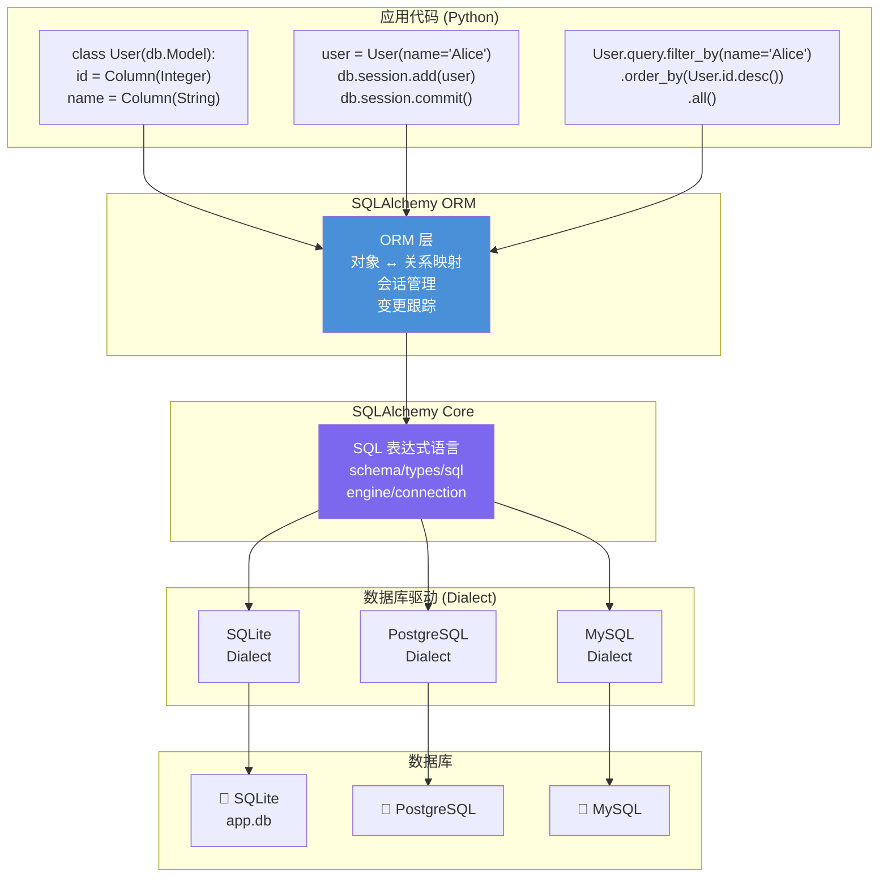
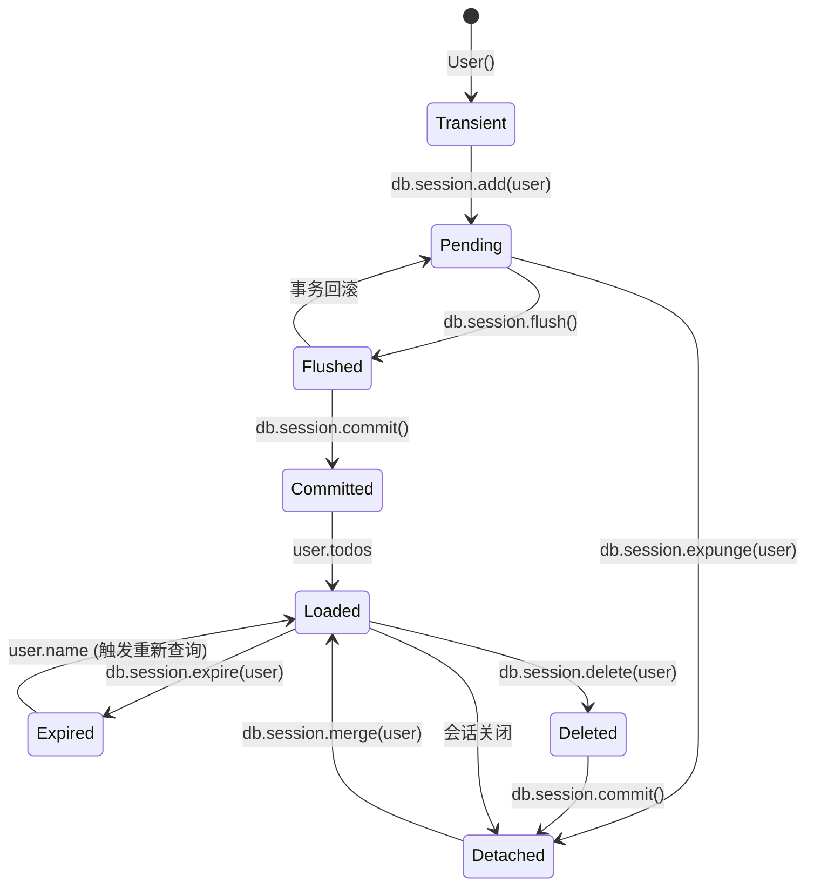
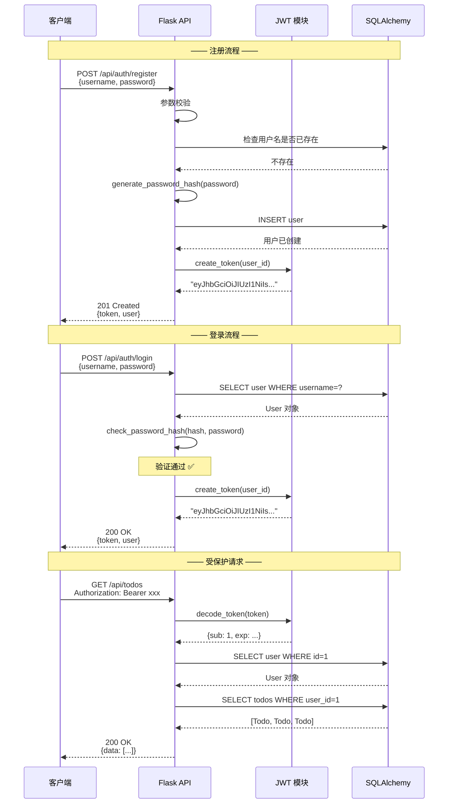
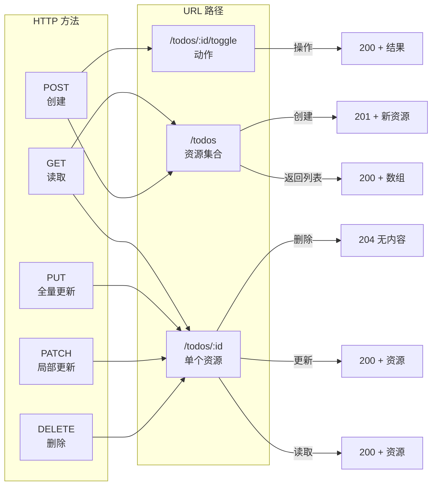
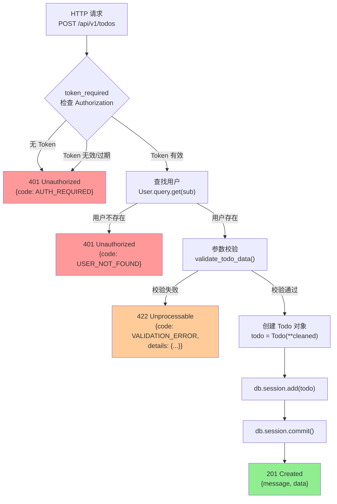
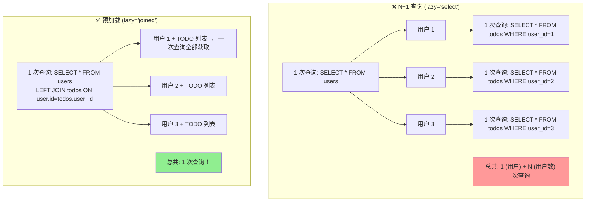

# Day 066 — 图解：Flask 进阶核心概念

> 本目录包含 Flask 进阶话题的图解说明：ORM 原理、JWT 认证、RESTful API 架构。

---

## 1. SQLAlchemy 架构总览



### 各层职责

```
应用层 (你的 Python 代码)
    │
    ▼ 定义模型、CRUD 操作、业务逻辑
    │
ORM 层 (对象关系映射)
    │
    │  • 模型 ↔ 表的映射
    │  • 关系管理 (一对多/多对多)
    │  • 变更追踪 (unit of work)
    │  • 会话管理 (session)
    │  • 惰性加载/预加载
    │
    ▼ 翻译成 SQL 表达式
    │
Core 层 (SQL 表达式语言)
    │
    │  • SQL 抽象语法树
    │  • 类型系统与类型转换
    │  • 连接池与事务管理
    │  • 结果集处理
    │
    ▼ 发送到具体数据库
    │
Dialect (数据库方言)
    │
    │  • SQL 语法适配 (不同数据库 SQL 略有差异)
    │  • 驱动封装 (sqlite3/psycopg2/mysql-connector)
    │
    ▼
Database (数据库)
```

---

## 2. SQLAlchemy 对象状态生命周期



| 状态 | 说明 | 是否在 session 中 | 数据库中是否存在 |
|------|------|-------------------|----------------|
| **Transient** | 刚创建的 Python 对象 | ❌ | ❌ |
| **Pending** | 已添加到 session，未刷新 | ✅ | ❌ |
| **Flushed** | SQL 已发送到数据库，未提交 | ✅ | ✅（事务中） |
| **Committed** | 已提交到数据库 | ✅ | ✅ |
| **Detached** | 与 session 分离 | ❌ | ✅ |
| **Deleted** | 标记为删除 | ✅ | ✅（等待提交删除） |

---

## 3. JWT 结构详解

```mermaid
graph LR
    subgraph "JWT = Header.Payload.Signature"
        H["Header<br/>{<br/>&nbsp;"alg": "HS256",<br/>&nbsp;"typ": "JWT"<br/>}"]
        P["Payload<br/>{<br/>&nbsp;"sub": 1,<br/>&nbsp;"iat": 1700000000,<br/>&nbsp;"exp": 1700086400<br/>}"]
        S["Signature<br/>HMACSHA256(<br/>&nbsp;base64(Header) + '.' +<br/>&nbsp;base64(Payload),<br/>&nbsp;SECRET_KEY<br/>)"]
    end
    
    H -->|Base64URL| H64["eyJhbGciOiJIUzI1NiIs..."]
    P -->|Base64URL| P64["eyJzdWIiOjEsImlhdCI6MTcw..."]
    S --> S64["dGhpcyBpcyB0aGUgc2lnbmF0..."]
    
    H64 --> Token["eyJhbGciOiJIUzI1NiIs...<br/>.<br/>eyJzdWIiOjEsImlhdCI6MTcw...<br/>.<br/>dGhpcyBpcyB0aGUgc2lnbmF0..."]
    P64 --> Token
    S64 --> Token
    
    style Token fill:#f0f0f0,stroke:#333,stroke-width:2px
```

### JWT 三个部分的含义

```
第一部分 ─ Header（头部）
    {"alg": "HS256"}    → 签名算法：HMAC-SHA256
    {"typ": "JWT"}      → Token 类型

第二部分 ─ Payload（载荷）
    "sub"  (Subject)   → 用户 ID
    "iat"  (Issued At) → 签发时间
    "exp"  (Expiration)→ 过期时间
    "type"             → access / refresh

第三部分 ─ Signature（签名）
    防止 Token 被篡改
    用 SECRET_KEY + Header + Payload 计算
    服务器端唯一能验证（因为只有服务器知道 SECRET_KEY）
```

---

## 4. 认证流程：注册 → 登录 → 受保护请求



---

## 5. RESTful API 资源映射



### RESTful URL 设计原则

```
集合 (Collection):              /resources
单个资源:                       /resources/:id
子资源:                        /resources/:id/sub-resources
动作 (非 CRUD):                /resources/:id/action
搜索/过滤:                     /resources?q=keyword&status=active
分页:                          /resources?page=1&per_page=20
```

---

## 6. 完整请求处理流程（TODO API）



---

## 7. 密码哈希原理图解

```
用户注册密码: "myPassword123"
                    │
                    ▼
    生成随机 Salt: "a1b2c3d4e5f6g7h8"
                    │
                    ▼
    组合: "myPassword123" + "a1b2c3d4e5f6g7h8"
                    │
                    ▼
    PBKDF2-HMAC-SHA256 (600000 次迭代)
                    │
                    ▼
    输出哈希: "pbkdf2:sha256:600000$a1b2c3d4e5f6g7h8$..."
                                          ↑
                                    Salt 被包含在输出中
    
    存储到数据库: password_hash 字段 ← "pbkdf2:sha256:600000$..."
    
    ──────────── 验证 ────────────
    
    用户输入密码: "myPassword123"
    
    check_password_hash() 执行:
    1. 从存储的哈希中提取 Salt: "a1b2c3d4e5f6g7h8"
    2. 用同样的 Salt + 算法重新计算哈希
    3. 比较结果是否一致
    
    如果一致 → 密码正确 ✅
    如果不一致 → 密码错误 ❌
```

---

## 8. ORM 查询中 N+1 问题



---

## 9. Flask 项目分层架构（推荐）

```
flask-todo-api/
│
├── app.py                 ← 创建 Flask 实例、配置加载
│
├── config.py              ← 不同环境的配置类
│
├── models/                ← 数据库模型
│   ├── __init__.py
│   ├── user.py
│   └── todo.py
│
├── routes/                ← 路由（蓝图）
│   ├── __init__.py
│   ├── auth.py            ← 认证相关路由
│   └── todos.py           ← TODO CRUD 路由
│
├── services/              ← 业务逻辑
│   ├── __init__.py
│   ├── auth_service.py
│   └── todo_service.py
│
├── utils/                 ← 工具函数
│   ├── __init__.py
│   ├── errors.py          ← 错误码和异常
│   ├── validators.py      ← 参数校验
│   └── jwt_utils.py       ← JWT 工具
│
├── requirements.txt
├── Dockerfile
└── .env                    ← 环境变量
```

**分层职责：**

```
路由层 (routes/)        ← 接收请求、返回响应、参数提取
    │
    ▼ 调用服务层
服务层 (services/)      ← 业务逻辑、事务管理
    │
    ▼ 调用模型层
模型层 (models/)        ← 数据定义、数据库操作
    │
    ▼
工具层 (utils/)         ← JWT、校验、错误码等通用工具
```
