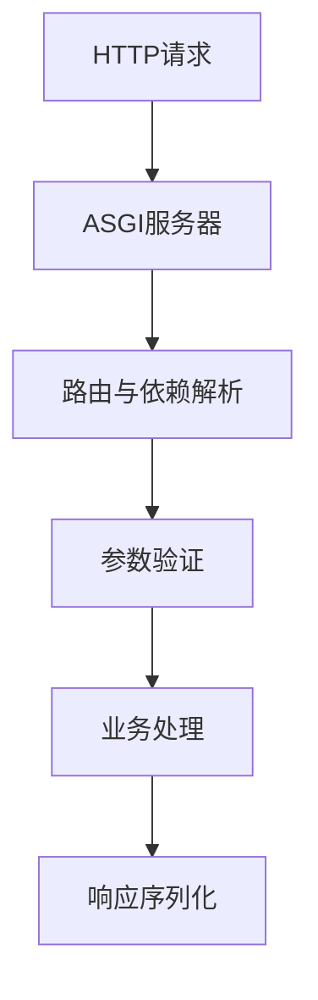

# Day 067 — FastAPI 请求生命周期

```mermaid
flowchart TD
    N0["HTTP请求"] --> N1
    N1["ASGI服务器"] --> N2
    N2["路由与依赖解析"] --> N3
    N3["参数验证"] --> N4
    N4["业务处理"] --> N5
    N5["响应序列化"]
```

## 阅读与检查

参数验证失败时返回错误响应，不进入业务处理。异步接口不要直接执行长时间阻塞操作。练习：标出请求体类型错误发生在哪一层。

结合本日主 README 和 code 目录解释每个节点。此图解补充不代表重新运行了本日所有依赖环境。
