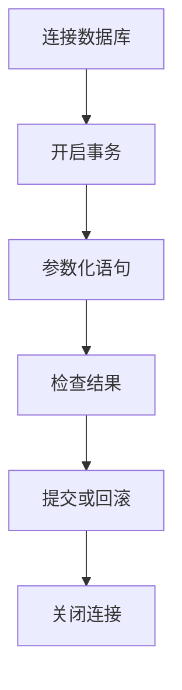

# Day 068 — SQLite 事务

```mermaid
flowchart TD
    N0["连接数据库"] --> N1
    N1["开启事务"] --> N2
    N2["参数化语句"] --> N3
    N3["检查结果"] --> N4
    N4["提交或回滚"] --> N5
    N5["关闭连接"]
```

## 阅读与检查

绑定参数用来传值，不是拼接 SQL 字符串。异常路径需要回滚；提交后数据才能持久化。练习：画出第二条写入失败时的回滚支路。

结合本日主 README 和 code 目录解释每个节点。此图解补充不代表重新运行了本日所有依赖环境。
