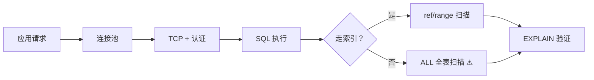

# Day 069 — MySQL 图解

```mermaid
flowchart LR
    A["应用请求"] --> B["连接池"]
    B --> C["TCP + 认证"]
    C --> D["SQL 执行"]
    D --> E{"走索引？"}
    E -->|是| F["ref/range 扫描"]
    E -->|否| G["ALL 全表扫描 ⚠️"]
    F --> H["EXPLAIN 验证"]
    G --> H
```

## 阅读与检查

连接池把"建连接"的成本摊薄，EXPLAIN 把"查得慢"变成可见问题。练习：对实战里的慢查询跑一次 EXPLAIN，指出 type 与 key 两列的变化。此图解补充不代表重新运行了本日所有依赖环境。
