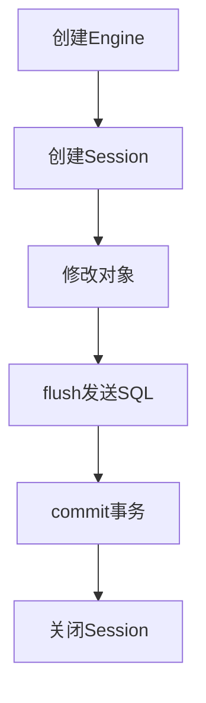

# Day 069 — SQLAlchemy 工作单元

```mermaid
flowchart TD
    N0["创建Engine"] --> N1
    N1["创建Session"] --> N2
    N2["修改对象"] --> N3
    N3["flush发送SQL"] --> N4
    N4["commit事务"] --> N5
    N5["关闭Session"]
```

## 阅读与检查

flush 不等于 commit；事务失败后先 rollback 再复用 Session。练习：说明对象改变和数据库提交的时刻为什么不同。

结合本日主 README 和 code 目录解释每个节点。此图解补充不代表重新运行了本日所有依赖环境。
