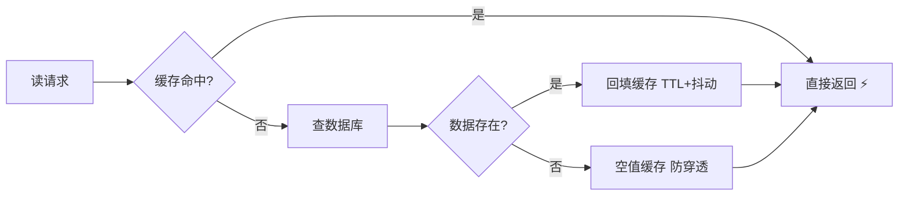

# Day 070 图解

```mermaid
flowchart LR
    A["读请求"] --> B{"缓存命中?"}
    B -->|是| C["直接返回 ⚡"]
    B -->|否| D["查数据库"]
    D --> E{"数据存在?"}
    E -->|是| F["回填缓存 TTL+抖动"]
    E -->|否| G["空值缓存 防穿透"]
    F --> C
    G --> C
```

## 阅读与检查

Cache-Aside 的读路径是缓存的第一课。练习：指出这张图里哪一步对应"击穿"风险，用什么手段挡住。此图解补充不代表重新运行了本日所有依赖环境。
