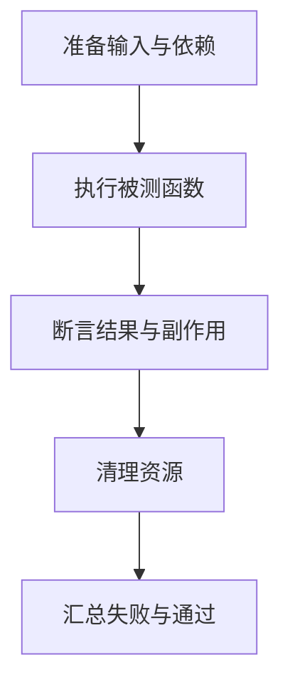

# Day 070 — 测试基础

```mermaid
flowchart TD
    N0["准备输入与依赖"] --> N1
    N1["执行被测函数"] --> N2
    N2["断言结果与副作用"] --> N3
    N3["清理资源"] --> N4
    N4["汇总失败与通过"]
```

## 阅读与检查

Mock 只替代外部依赖，不应把被测试的业务本身替换掉。练习：在正常、边界、异常三种输入上写断言。

结合本日主 README 和 code 目录解释每个节点。此图解补充不代表重新运行了本日所有依赖环境。
