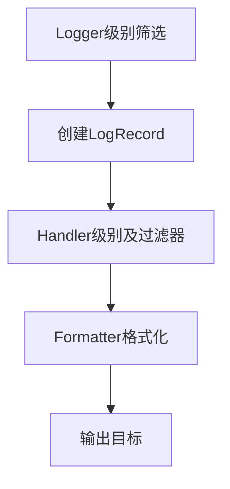

# Day 071 — 日志处理链

```mermaid
flowchart TD
    N0["Logger级别筛选"] --> N1
    N1["创建LogRecord"] --> N2
    N2["Handler级别及过滤器"] --> N3
    N3["Formatter格式化"] --> N4
    N4["输出目标"]
```

## 阅读与检查

Logger 和 Handler 的级别会共同影响输出。日志避免保存密钥；父级传播配置不当会导致重复输出。练习：追踪 INFO 为什么没有出现在控制台。

结合本日主 README 和 code 目录解释每个节点。此图解补充不代表重新运行了本日所有依赖环境。
