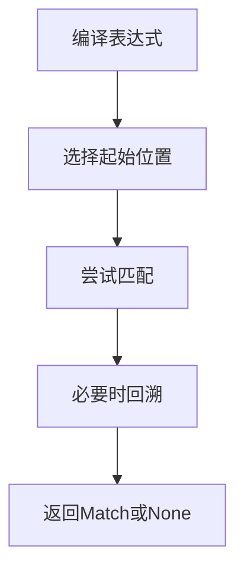

# Day 072 — 正则匹配过程

```mermaid
flowchart TD
    N0["编译表达式"] --> N1
    N1["选择起始位置"] --> N2
    N2["尝试匹配"] --> N3
    N3["必要时回溯"] --> N4
    N4["返回Match或None"]
```

## 阅读与检查

限制输入长度，避免不必要的嵌套量词。search、match、fullmatch 的匹配范围不同。练习：用短字符串比较三者返回值，不做耗尽资源实验。

结合本日主 README 和 code 目录解释每个节点。此图解补充不代表重新运行了本日所有依赖环境。
