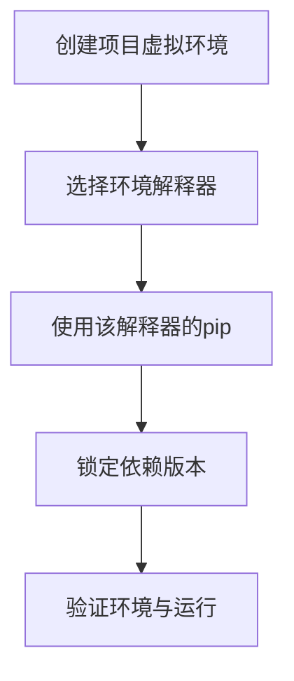

# Day 073 — 虚拟环境隔离

```mermaid
flowchart TD
    N0["创建项目虚拟环境"] --> N1
    N1["选择环境解释器"] --> N2
    N2["使用该解释器的pip"] --> N3
    N3["锁定依赖版本"] --> N4
    N4["验证环境与运行"]
```

## 阅读与检查

激活仅改变当前 shell 的搜索路径。python -m pip 让安装器与解释器对应；不要把本机环境目录提交进 Git。练习：比较解释器路径及依赖列表。

结合本日主 README 和 code 目录解释每个节点。此图解补充不代表重新运行了本日所有依赖环境。
