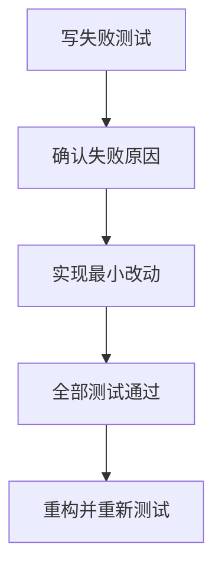

# Day 074 — TDD 红绿重构

```mermaid
flowchart TD
    N0["写失败测试"] --> N1
    N1["确认失败原因"] --> N2
    N2["实现最小改动"] --> N3
    N3["全部测试通过"] --> N4
    N4["重构并重新测试"]
```

## 阅读与检查

红灯必须因为缺少目标行为，而不是路径或环境错误。参数化测试减少重复，覆盖率高不代表断言有效。练习：加入边界断言并检查修改是否被测试捕获。

结合本日主 README 和 code 目录解释每个节点。此图解补充不代表重新运行了本日所有依赖环境。
