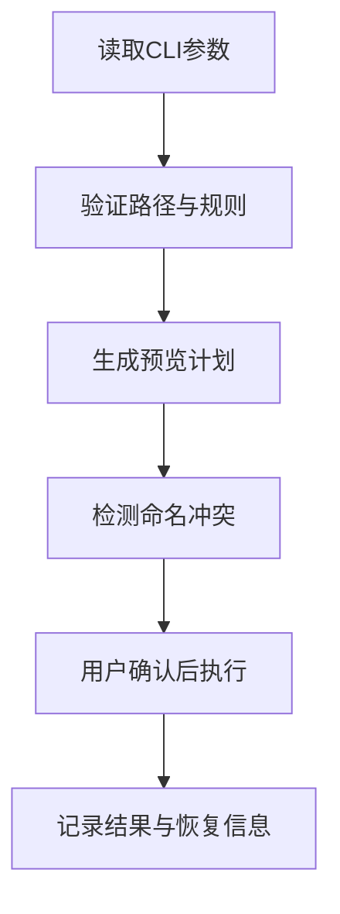

# Day 075 — 文件工具的安全处理

```mermaid
flowchart TD
    N0["读取CLI参数"] --> N1
    N1["验证路径与规则"] --> N2
    N2["生成预览计划"] --> N3
    N3["检测命名冲突"] --> N4
    N4["用户确认后执行"] --> N5
    N5["记录结果与恢复信息"]
```

## 阅读与检查

预览阶段不得改文件；冲突必须在执行前检测。练习：只在临时目录验证同名冲突和异常中断，保留恢复记录。

结合本日主 README 和 code 目录解释每个节点。此图解补充不代表重新运行了本日所有依赖环境。
