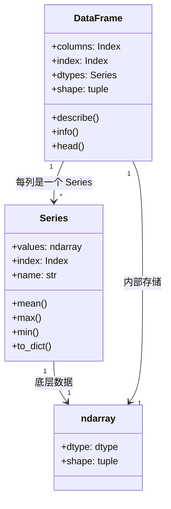
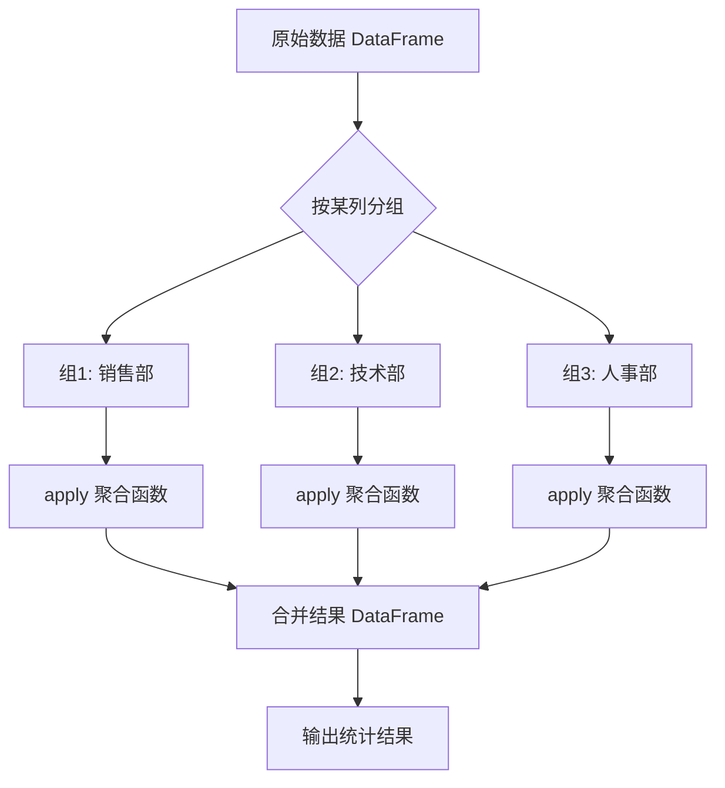
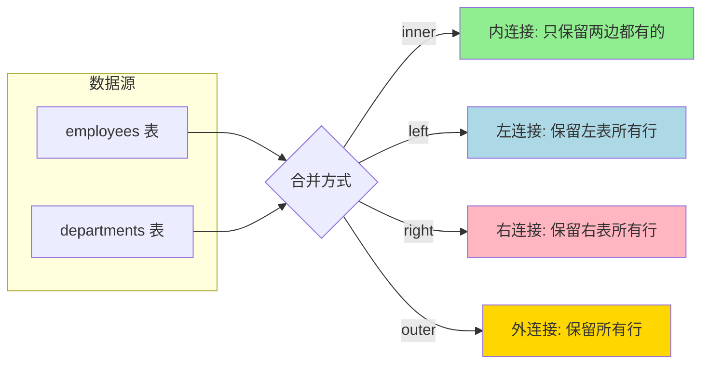
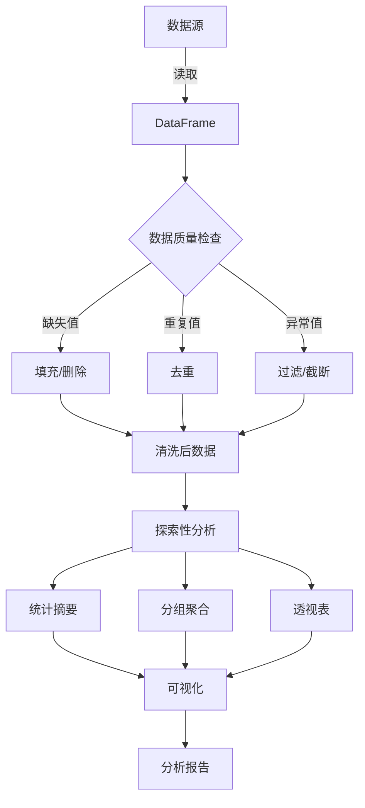

# Day 080 — Pandas 数据分析 · 图解

---

## 1. Pandas 数据结构关系图



---

## 2. loc vs iloc 索引对比

```
原始 DataFrame:
┌─────┬──────┬──────┬──────┐
│ idx │  A   │  B   │  C   │  ← columns（列标签）
├─────┼──────┼──────┼──────┤
│  0  │ 10   │ 20   │ 30   │
│  1  │ 15   │ 25   │ 35   │  ← index（行标签）
│  2  │ 20   │ 30   │ 40   │
│  3  │ 25   │ 35   │ 45   │
└─────┴──────┴──────┴──────┘

loc[0:2, 'A':'B']     iloc[0:2, 0:2]
┌─────┬──────┬──────┐  ┌─────┬──────┬──────┐
│ idx │  A   │  B   │  │ idx │  A   │  B   │
├─────┼──────┼──────┤  ├─────┼──────┼──────┤
│  0  │ 10   │ 20   │  │  0  │ 10   │ 20   │
│  1  │ 15   │ 25   │  │  1  │ 15   │ 25   │
│  2  │ 20   │ 30   │  │  2  │ 20   │ 30   │
└─────┴──────┴──────┘  └─────┴──────┴──────┘
  ↑ 包含末尾标签 2        ↑ 不包含末尾位置 2

关键区别：loc 切片包含末尾，iloc 切片不包含末尾（与 Python 一致）
```

---

## 3. GroupBy 分组聚合流程



---

## 4. 数据合并类型对比



---

## 5. 数据分析工作流



---

## 6. Pandas 常用操作速查

| 操作 | 语法 | 说明 |
|------|------|------|
| 创建 | `pd.DataFrame(dict)` | 从字典创建 |
| 读取 CSV | `pd.read_csv('file.csv')` | 读取 CSV 文件 |
| 写入 CSV | `df.to_csv('file.csv')` | 写入 CSV 文件 |
| 查看形状 | `df.shape` | (行数, 列数) |
| 查看列名 | `df.columns` | 列标签 |
| 列选择 | `df['col']` 或 `df[['col1','col2']]` | 单列或多列 |
| 行筛选 | `df[df['col'] > value]` | 布尔索引 |
| loc 索引 | `df.loc[行标签, 列标签]` | 基于标签 |
| iloc 索引 | `df.iloc[行位置, 列位置]` | 基于位置 |
| 缺失值 | `df.isnull().sum()` | 统计缺失值 |
| 填充 | `df.fillna(value)` | 填充缺失值 |
| 去重 | `df.drop_duplicates()` | 删除重复行 |
| 分组 | `df.groupby('col').agg(...)` | 分组聚合 |
| 透视表 | `df.pivot_table(...)` | 交叉分析 |
| 排序 | `df.sort_values('col')` | 按值排序 |
| 合并 | `pd.merge(df1, df2, on='key')` | 表连接 |
| 拼接 | `pd.concat([df1, df2])` | 简单拼接 |
