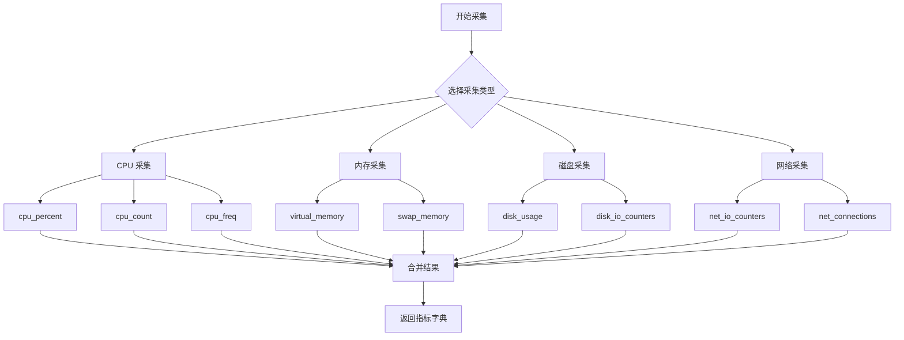

# Day 084 — 监控告警系统 图解

## 1. 系统架构图

```
┌─────────────────────────────────────────────────────────────────┐
│                    监控告警系统架构                               │
├─────────────────────────────────────────────────────────────────┤
│                                                                 │
│   ┌─────────────────────────────────────────────────────────┐   │
│   │                    数据采集层                            │   │
│   │  ┌──────────┐  ┌──────────┐  ┌──────────┐  ┌────────┐ │   │
│   │  │   CPU    │  │   内存   │  │   磁盘   │  │  网络  │ │   │
│   │  │ Collector│  │ Collector│  │ Collector│  │Collect.│ │   │
│   │  └────┬─────┘  └────┬─────┘  └────┬─────┘  └───┬────┘ │   │
│   └───────┼──────────────┼──────────────┼────────────┼───────┘   │
│           │              │              │            │           │
│           ▼              ▼              ▼            ▼           │
│   ┌─────────────────────────────────────────────────────────┐   │
│   │                    数据存储层                            │   │
│   │  ┌─────────────────────────────────────────────────┐   │   │
│   │  │              SQLite / 时序数据库                  │   │   │
│   │  │  ┌─────────┐  ┌─────────┐  ┌─────────┐        │   │   │
│   │  │  │metrics  │  │alerts   │  │config   │        │   │   │
│   │  │  │table    │  │table    │  │table    │        │   │   │
│   │  │  └─────────┘  └─────────┘  └─────────┘        │   │   │
│   │  └─────────────────────────────────────────────────┘   │   │
│   └─────────────────────────────────────────────────────────┘   │
│           │                                                    │
│           ▼                                                    │
│   ┌─────────────────────────────────────────────────────────┐   │
│   │                    分析引擎层                            │   │
│   │  ┌──────────┐  ┌──────────┐  ┌──────────┐            │   │
│   │  │  规则    │  │  趋势    │  │  组合    │            │   │
│   │  │  引擎    │  │  检测    │  │  规则    │            │   │
│   │  └────┬─────┘  └────┬─────┘  └────┬─────┘            │   │
│   └───────┼──────────────┼──────────────┼─────────────────────┘   │
│           │              │              │                        │
│           ▼              ▼              ▼                        │
│   ┌─────────────────────────────────────────────────────────┐   │
│   │                    告警输出层                            │   │
│   │  ┌──────────┐  ┌──────────┐  ┌──────────┐            │   │
│   │  │  控制台  │  │   钉钉   │  │   邮件   │            │   │
│   │  │  输出    │  │  Webhook │  │  通知    │            │   │
│   │  └──────────┘  └──────────┘  └──────────┘            │   │
│   └─────────────────────────────────────────────────────────┘   │
│                                                                 │
└─────────────────────────────────────────────────────────────────┘
```

## 2. 告警流程图

```
┌─────────────┐
│  开始监控   │
└──────┬──────┘
       │
       ▼
┌─────────────┐
│  采集指标   │◄──────────────────────┐
└──────┬──────┘                       │
       │                              │
       ▼                              │
┌─────────────┐                       │
│  存储数据   │                       │
└──────┬──────┘                       │
       │                              │
       ▼                              │
┌─────────────┐    否                 │
│  检查规则   │───────────────────────┤
└──────┬──────┘                       │
       │ 是                           │
       ▼                              │
┌─────────────┐    是                 │
│  去重检查   │───┐                   │
└──────┬──────┘   │                   │
       │ 否       │                   │
       ▼          ▼                   │
┌─────────────┐  ┌─────────────┐      │
│  生成告警   │  │  跳过告警   │      │
└──────┬──────┘  └──────┬──────┘      │
       │                │             │
       ▼                │             │
┌─────────────┐         │             │
│  发送通知   │         │             │
└──────┬──────┘         │             │
       │                │             │
       └────────────────┴─────────────┘
                    等待间隔
```

## 3. 指标采集流程



## 4. 告警规则状态机

```
                    ┌─────────────┐
                    │   空闲      │
                    │  (Idle)     │
                    └──────┬──────┘
                           │
                           │ 指标超过阈值
                           ▼
                    ┌─────────────┐
                    │   触发      │
                    │  (Triggered)│
                    └──────┬──────┘
                           │
           ┌───────────────┼───────────────┐
           │               │               │
           ▼               ▼               ▼
    ┌─────────────┐ ┌─────────────┐ ┌─────────────┐
    │   去重      │ │  聚合      │ │  升级      │
    │  (Dedup)    │ │ (Aggregate)│ │ (Escalate) │
    └──────┬──────┘ └──────┬──────┘ └──────┬──────┘
           │               │               │
           └───────────────┼───────────────┘
                           │
                           ▼
                    ┌─────────────┐
                    │   通知      │
                    │  (Notify)   │
                    └──────┬──────┘
                           │
                           ▼
                    ┌─────────────┐
                    │   记录      │
                    │  (Log)      │
                    └──────┬──────┘
                           │
                           │ 恢复正常
                           ▼
                    ┌─────────────┐
                    │   恢复      │
                    │ (Resolved)  │
                    └─────────────┘
```

## 5. 数据存储模型

```
┌─────────────────────────────────────────────────────────────┐
│                      metrics 表                             │
├─────────┬─────────────┬─────────────────────┬───────────────┤
│   id    │  timestamp  │       data          │  created_at   │
├─────────┼─────────────┼─────────────────────┼───────────────┤
│   1     │ 2024-01-01  │ {"cpu":...,"mem":...}│ 2024-01-01   │
│   2     │ 2024-01-02  │ {"cpu":...,"mem":...}│ 2024-01-02   │
└─────────┴─────────────┴─────────────────────┴───────────────┘

┌─────────────────────────────────────────────────────────────┐
│                      alerts 表                              │
├─────────┬─────────────┬────────┬──────────┬────────┬────────┤
│   id    │ rule_name   │ metric │  value   │severity│created │
├─────────┼─────────────┼────────┼──────────┼────────┼────────┤
│   1     │ CPU使用率高  │ cpu    │  95.2    │critical│ 01-01  │
│   2     │ 内存使用率高 │ mem    │  87.5    │warning │ 01-01  │
└─────────┴─────────────┴────────┴──────────┴────────┴────────┘
```

## 6. 告警级别说明

```
┌─────────────────────────────────────────────────────────────┐
│                    告警严重级别                              │
├─────────────────────────────────────────────────────────────┤
│                                                             │
│  🔵 INFO (信息)                                             │
│  ├─ 用途: 记录正常事件                                      │
│  ├─ 示例: 服务启动、配置变更                                │
│  └─ 处理: 仅记录日志                                        │
│                                                             │
│  ⚠️ WARNING (警告)                                          │
│  ├─ 用途: 提示潜在问题                                      │
│  ├─ 示例: CPU > 80%, 内存 > 85%                            │
│  └─ 处理: 关注，可能需要干预                                │
│                                                             │
│  🚨 CRITICAL (严重)                                         │
│  ├─ 用途: 紧急问题                                          │
│  ├─ 示例: CPU > 95%, 磁盘 > 95%, 服务宕机                  │
│  └─ 处理: 立即处理，可能导致服务中断                        │
│                                                             │
└─────────────────────────────────────────────────────────────┘
```

---

> 📝 这些图解帮助理解监控系统的整体架构和工作流程
