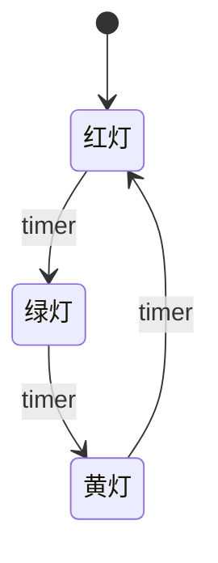
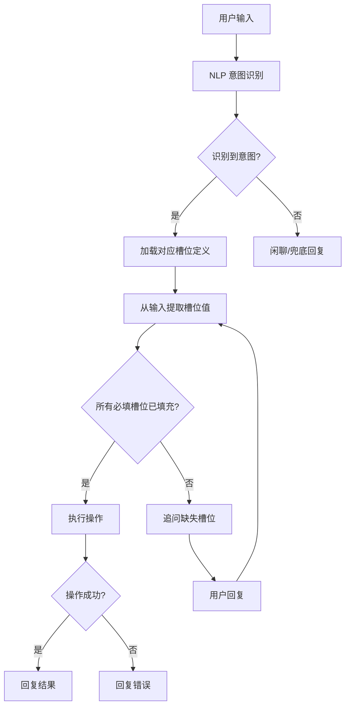

# Day 087 — 状态机对话管理

> 🤖 项目四（聊天机器人）第 3 天：用状态机管理对话流程

## 📋 今日目标

| 目标 | 说明 |
|------|------|
| 理解状态机 | 什么是有限状态机（FSM），为什么聊天机器人需要它 |
| 实现 FSM | 从零实现一个轻量状态机 |
| 对话管理 | 用状态机管理多轮对话的状态流转 |
| 上下文维护 | 对话上下文、槽位填充、意图识别的整合 |
| 实战项目 | 构建一个完整的客服聊天机器人 |

---

## 一、为什么聊天机器人需要状态机？

### 1.1 无状态 vs 有状态

**无状态机器人**（如 Day 086 的简单 NLP）：
```
用户：我想订机票
机器人：请问出发城市？
用户：北京
机器人：请问目的地？
用户：上海
机器人：请问日期？
用户：明天
机器人：好的，已为您查询！
```

看似正常，但问题是——**机器人并不"记住"之前的对话**。如果用户突然说：

```
用户：改成后天
```

无状态机器人会完全困惑，因为它不知道"后天"指的是哪个字段。

**有状态机器人**：
```
用户：我想订机票
机器人：请问出发城市？ [状态：等待出发城市]
用户：北京
机器人：请问目的地？ [状态：等待目的地，已记录出发=北京]
用户：上海
机器人：请问日期？ [状态：等待日期，已记录出发=北京，目的=上海]
用户：明天
机器人：好的，北京→上海，明天的机票已查询到！ [状态：完成]
用户：改成后天
机器人：好的，已改为北京→上海，后天的机票。 [状态：已完成修改]
```

### 1.2 状态机的核心思想

**有限状态机（Finite State Machine, FSM）** 是一种数学模型，由以下部分组成：

```
┌─────────────────────────────────────────────────────┐
│                    FSM 五元组                         │
│                                                     │
│  S  = 有限状态集合        (States)                   │
│  Σ  = 输入符号集合        (Inputs/Events)            │
│  δ  = 状态转移函数        (Transition Function)       │
│  s₀ = 初始状态            (Initial State)            │
│  F  = 终止状态集合        (Final/Accepting States)    │
│                                                     │
│  简化版：                                            │
│  δ: S × Σ → S   当前状态 + 输入事件 → 下一个状态      │
└─────────────────────────────────────────────────────┘
```

用一个经典的例子——红绿灯：



---

## 二、从零实现状态机

### 2.1 最简状态机

```python
class SimpleFSM:
    """最简有限状态机"""

    def __init__(self, initial_state):
        self.state = initial_state
        self.transitions = {}  # {(当前状态, 事件): 下一状态}

    def add_transition(self, from_state, event, to_state):
        """添加状态转移规则"""
        self.transitions[(from_state, event)] = to_state

    def trigger(self, event):
        """触发事件，返回新状态"""
        key = (self.state, event)
        if key in self.transitions:
            old_state = self.state
            self.state = self.transitions[key]
            return old_state, self.state
        raise ValueError(f"非法转移: 状态={self.state}, 事件={event}")

    def is_in(self, state):
        return self.state == state
```

**使用示例——红绿灯：**

```python
light = SimpleFSM("红灯")
light.add_transition("红灯", "timer", "绿灯")
light.add_transition("绿灯", "timer", "黄灯")
light.add_transition("黄灯", "timer", "红灯")

print(light.state)  # 红灯
light.trigger("timer")
print(light.state)  # 绿灯
```

### 2.2 带动作的状态机

实际应用中，状态转移时通常需要执行一些动作（回调函数）：

```python
class ActionFSM:
    """带动作回调的状态机"""

    def __init__(self, initial_state):
        self.state = initial_state
        self.transitions = {}  # {(state, event): (new_state, callback)}
        self.callbacks = {}    # {state: on_enter_callback}

    def add_transition(self, from_state, event, to_state, action=None):
        self.transitions[(from_state, event)] = (to_state, action)

    def on_enter(self, state, callback):
        """注册进入状态时的回调"""
        self.callbacks[state] = callback

    def trigger(self, event):
        key = (self.state, event)
        if key not in self.transitions:
            raise ValueError(f"非法转移: {self.state} + {event}")

        new_state, action = self.transitions[key]
        old_state = self.state

        # 执行转移时的动作
        if action:
            action(old_state, new_state, event)

        # 执行进入新状态的回调
        self.state = new_state
        if new_state in self.callbacks:
            self.callbacks[new_state](new_state)

        return new_state
```

### 2.3 状态转移表（可视化）

| 当前状态 | 事件 | 下一状态 | 动作 |
|---------|------|---------|------|
| 等待出发 | 输入城市 | 等待目的 | 保存出发城市 |
| 等待目的 | 输入城市 | 等待日期 | 保存目的城市 |
| 等待日期 | 输入日期 | 确认订单 | 保存日期 |
| 确认订单 | 确认 | 完成 | 提交订单 |
| 确认订单 | 取消 | 初始 | 清空数据 |
| 任何状态 | 退出 | 结束 | 清理资源 |

---

## 三、对话状态机设计

### 3.1 对话状态定义

一个典型的客服机器人需要以下状态：

```
                         ┌─────────────┐
                         │   初始状态   │
                         │   GREET     │
                         └──────┬──────┘
                                │ 用户发消息
                                ▼
                         ┌─────────────┐
                    ┌───▶│  理解意图    │
                    │    │  UNDERSTAND │
                    │    └──────┬──────┘
                    │           │ 识别到意图
                    │           ▼
                    │    ┌─────────────┐
                    │    │  收集信息    │◀─────┐
                    │    │  COLLECT     │      │ 信息不完整
                    │    └──────┬──────┘      │
                    │           │ 信息完整      │
                    │           ▼              │
                    │    ┌─────────────┐      │
                    │    │  执行操作    │      │
                    │    │  EXECUTE     │      │
                    │    └──────┬──────┘      │
                    │           │ 执行失败      │
                    │           └──────────────┘
                    │
                    │ 用户重新提问
                    └──────────────────────────┘
```

### 3.2 槽位（Slot）概念

槽位是对话中需要填充的信息字段，类似函数的参数：

```python
# 订机票场景的槽位定义
SLOTS = {
    "book_flight": {
        "departure": {"required": True,  "question": "请问出发城市？"},
        "destination": {"required": True, "question": "请问目的地？"},
        "date": {"required": True,       "question": "请问出发日期？"},
        "passengers": {"required": False, "question": "请问几位乘客？", "default": 1},
    },
    "check_order": {
        "order_id": {"required": True, "question": "请提供订单号？"},
    },
    "cancel_order": {
        "order_id": {"required": True, "question": "请提供要取消的订单号？"},
        "reason": {"required": False, "question": "取消原因是什么？"},
    }
}
```

### 3.3 意图识别 + 槽位填充流程



---

## 四、完整实战：客服聊天机器人

### 4.1 架构设计

```
┌─────────────────────────────────────────────────┐
│                  ChatBot                         │
│                                                  │
│  ┌──────────┐  ┌──────────┐  ┌──────────────┐   │
│  │ NLP 引擎  │→│ 状态管理器 │→│ 动作执行器    │   │
│  │ (意图+NER)│  │ (FSM)    │  │ (业务逻辑)   │   │
│  └──────────┘  └──────────┘  └──────────────┘   │
│       ↑              │              ↓            │
│  ┌──────────┐  ┌──────────┐  ┌──────────────┐   │
│  │ 用户输入  │  │ 对话历史  │  │ 回复生成     │   │
│  └──────────┘  └──────────┘  └──────────────┘   │
└─────────────────────────────────────────────────┘
```

### 4.2 核心组件

```python
from enum import Enum, auto
from dataclasses import dataclass, field
from typing import Dict, List, Optional, Callable, Any
import re


class Intent(Enum):
    """用户意图"""
    GREET = auto()          # 打招呼
    BOOK_FLIGHT = auto()    # 订机票
    CHECK_ORDER = auto()    # 查询订单
    CANCEL_ORDER = auto()   # 取消订单
    BYE = auto()            # 再见
    UNKNOWN = auto()        # 未知意图


@dataclass
class Slot:
    """槽位定义"""
    name: str
    required: bool = True
    question: str = ""
    default: Any = None
    value: Any = None

    @property
    def is_filled(self):
        return self.value is not None


@dataclass
class DialogueState:
    """对话状态"""
    current_intent: Optional[Intent] = None
    slots: Dict[str, Slot] = field(default_factory=dict)
    history: List[Dict] = field(default_factory=list)
    context: Dict[str, Any] = field(default_factory=dict)

    def add_message(self, role: str, content: str):
        self.history.append({"role": role, "content": content})

    def get_next_slot(self) -> Optional[Slot]:
        """获取下一个需要填充的槽位"""
        for slot in self.slots.values():
            if slot.required and not slot.is_filled:
                return slot
        return None

    def all_slots_filled(self) -> bool:
        return all(s.is_filled for s in self.slots.values() if s.required)


class NLPProcessor:
    """简化版 NLP 处理器"""

    # 意图关键词映射
    INTENT_KEYWORDS = {
        Intent.BOOK_FLIGHT: ["订机票", "买机票", "航班", "飞"],
        Intent.CHECK_ORDER: ["查询订单", "查订单", "订单状态", "我的订单"],
        Intent.CANCEL_ORDER: ["取消订单", "退票", "不要了"],
        Intent.GREET: ["你好", "嗨", "您好", "hi", "hello"],
        Intent.BYE: ["再见", "拜拜", "bye", "quit", "退出"],
    }

    # 城市识别（简化）
    CITIES = ["北京", "上海", "广州", "深圳", "成都", "杭州", "武汉", "重庆", "西安", "南京"]

    def identify_intent(self, text: str) -> Intent:
        """识别用户意图"""
        text_lower = text.lower().strip()
        for intent, keywords in self.INTENT_KEYWORDS.items():
            for kw in keywords:
                if kw in text_lower:
                    return intent
        return Intent.UNKNOWN

    def extract_entities(self, text: str, slot_name: str) -> Optional[str]:
        """提取实体（简化版 NER）"""
        if slot_name == "departure" or slot_name == "destination":
            for city in self.CITIES:
                if city in text:
                    return city
        elif slot_name == "date":
            # 简单日期提取
            date_patterns = [
                r"(\d{1,2})月(\d{1,2})[日号]",
                r"(明天|后天|大后天|今天)",
                r"(下[一二三四五六日天])",
                r"(\d{4}[-/]\d{1,2}[-/]\d{1,2})",
            ]
            for pattern in date_patterns:
                match = re.search(pattern, text)
                if match:
                    return match.group(0)
        elif slot_name == "order_id":
            match = re.search(r"[A-Za-z0-9]{8,}", text)
            if match:
                return match.group(0)
        elif slot_name == "passengers":
            match = re.search(r"(\d+)\s*[位个名人]", text)
            if match:
                return int(match.group(1))
        return None


class ChatBot:
    """客服聊天机器人"""

    # 意图对应的槽位模板
    SLOT_TEMPLATES = {
        Intent.BOOK_FLIGHT: [
            Slot("departure", question="请问从哪个城市出发？"),
            Slot("destination", question="请问目的地是哪里？"),
            Slot("date", question="请问出发日期？"),
            Slot("passengers", required=False, question="请问几位乘客？", default=1),
        ],
        Intent.CHECK_ORDER: [
            Slot("order_id", question="请提供订单号？"),
        ],
        Intent.CANCEL_ORDER: [
            Slot("order_id", question="请提供要取消的订单号？"),
            Slot("reason", required=False, question="取消原因是什么？"),
        ],
    }

    def __init__(self):
        self.nlp = NLPProcessor()
        self.state = DialogueState()
        self._init_state()

    def _init_state(self):
        """初始化/重置对话状态"""
        self.state = DialogueState()

    def process_message(self, user_input: str) -> str:
        """处理用户消息，返回回复"""
        self.state.add_message("user", user_input)

        # 1. 识别意图
        intent = self.nlp.identify_intent(user_input)

        # 2. 处理特殊意图
        if intent == Intent.GREET:
            reply = "您好！我是智能客服，可以帮您订机票、查询订单、取消订单。请问有什么可以帮您？"
            self.state.add_message("bot", reply)
            return reply

        if intent == Intent.BYE:
            reply = "感谢您的咨询，再见！👋"
            self._init_state()
            self.state.add_message("bot", reply)
            return reply

        # 3. 如果当前正在收集信息（有未完成的槽位），继续填充
        if self.state.current_intent and not self.state.all_slots_filled():
            self._fill_slots(user_input)
            return self._continue_collection()

        # 4. 新意图
        if intent == Intent.UNKNOWN:
            reply = "抱歉，我没理解您的意思。我可以帮您：\n1. 订机票\n2. 查询订单\n3. 取消订单\n请问您需要什么服务？"
            self.state.add_message("bot", reply)
            return reply

        # 5. 开始新的意图处理
        self.state.current_intent = intent
        self.state.slots = {}
        for slot_template in self.SLOT_TEMPLATES.get(intent, []):
            self.state.slots[slot_template.name] = Slot(
                name=slot_template.name,
                required=slot_template.required,
                question=slot_template.question,
                default=slot_template.default,
            )

        # 尝试从当前输入提取槽位
        self._fill_slots(user_input)

        return self._continue_collection()

    def _fill_slots(self, text: str):
        """从文本中提取槽位值"""
        for slot in self.state.slots.values():
            if not slot.is_filled:
                value = self.nlp.extract_entities(text, slot.name)
                if value is not None:
                    slot.value = value

    def _continue_collection(self) -> str:
        """继续收集信息或执行操作"""
        next_slot = self.state.get_next_slot()
        if next_slot:
            reply = next_slot.question
        elif self.state.all_slots_filled():
            reply = self._execute_action()
        else:
            reply = "抱歉，处理中遇到问题。"

        self.state.add_message("bot", reply)
        return reply

    def _execute_action(self) -> str:
        """执行业务操作"""
        intent = self.state.current_intent
        slots = {k: v.value for k, v in self.state.slots.items()}

        if intent == Intent.BOOK_FLIGHT:
            return (
                f"✅ 订票成功！\n"
                f"  出发：{slots.get('departure')}\n"
                f"  目的地：{slots.get('destination')}\n"
                f"  日期：{slots.get('date')}\n"
                f"  乘客：{slots.get('passengers', 1)} 位\n"
                f"  订单号：FL{hash(str(slots)) % 100000:06d}"
            )
        elif intent == Intent.CHECK_ORDER:
            order_id = slots.get('order_id', '未知')
            return f"📋 订单 {order_id} 状态：已支付，等待出票"
        elif intent == Intent.CANCEL_ORDER:
            order_id = slots.get('order_id', '未知')
            reason = slots.get('reason', '未说明')
            return f"❌ 订单 {order_id} 已取消（原因：{reason}）"
        else:
            return "操作已完成。"

        # 重置状态，准备下一轮对话
        self._init_state()
```

### 4.3 运行效果

```
🤖 智能客服已启动！输入 quit 退出。

你: 你好
机器人: 您好！我是智能客服，可以帮您订机票、查询订单、取消订单。请问有什么可以帮您？

你: 我要订机票
机器人: 请问从哪个城市出发？

你: 北京
机器人: 请问目的地是哪里？

你: 上海
机器人: 请问出发日期？

你: 明天
机器人: ✅ 订票成功！
  出发：北京
  目的地：上海
  日期：明天
  乘客：1 位
  订单号：FL482917

你: 我要查订单
机器人: 请提供订单号？

你: FL482917
机器人: 📋 订单 FL482917 状态：已支付，等待出票

你: 再见
机器人: 感谢您的咨询，再见！👋
```

---

## 五、进阶：状态机的高级用法

### 5.1 状态嵌套（层级状态机）

复杂对话可能有嵌套状态：

```python
class HierarchicalState:
    """层级状态机 - 支持子状态"""

    def __init__(self, name, parent=None):
        self.name = name
        self.parent = parent
        self.children = {}
        self.current_child = None

    def add_child(self, child_state):
        self.children[child_state.name] = child_state

    def enter(self):
        """进入状态时调用"""
        print(f"  → 进入状态: {self.name}")

    def exit(self):
        """退出状态时调用"""
        print(f"  ← 退出状态: {self.name}")
        if self.current_child:
            self.children[self.current_child].exit()
            self.current_child = None


class HierarchicalFSM:
    """层级状态机"""

    def __init__(self):
        self.root = HierarchicalState("root")
        self.current = self.root

    def add_state(self, name, parent_name=None):
        state = HierarchicalState(name)
        if parent_name:
            parent = self._find_state(self.root, parent_name)
            if parent:
                parent.add_child(state)
                state.parent = parent
        else:
            self.root.add_child(state)
        return state

    def _find_state(self, node, name):
        if node.name == name:
            return node
        for child in node.children.values():
            result = self._find_state(child, name)
            if result:
                return result
        return None

    def transition_to(self, state_name):
        # 退出当前状态链
        self.current.exit()
        # 进入新状态链
        new_state = self._find_state(self.root, state_name)
        if new_state:
            self.current = new_state
            self.current.enter()
```

### 5.2 并行状态机

某些场景下，机器人需要同时处理多个状态（如等待用户输入的同时处理超时）：

```python
import threading
import time


class ParallelFSM:
    """并行状态机 - 支持多个并发状态机"""

    def __init__(self):
        self.state_machines = {}
        self.locks = {}

    def add_machine(self, name, initial_state):
        self.state_machines[name] = SimpleFSM(initial_state)
        self.locks[name] = threading.Lock()

    def trigger(self, machine_name, event):
        with self.locks[machine_name]:
            return self.state_machines[machine_name].trigger(event)

    def get_state(self, machine_name):
        with self.locks[machine_name]:
            return self.state_machines[machine_name].state
```

### 5.3 状态机可视化

```python
def visualize_fsm(fsm, title="FSM"):
    """将状态机导出为 Mermaid 图"""
    lines = [f"stateDiagram-v2", f"    title {title}"]
    for (from_state, event), to_state in fsm.transitions.items():
        lines.append(f"    {from_state} --> {to_state} : {event}")
    return "\n".join(lines)
```

---

## 六、状态机设计模式

### 6.1 常见模式对比

| 模式 | 适用场景 | 优点 | 缺点 |
|------|---------|------|------|
| 查表法 | 简单状态机 | 直观、易维护 | 状态多时表格庞大 |
| 状态模式（OOP） | 复杂状态逻辑 | 每个状态独立封装 | 类数量多 |
| 表驱动 | 规则明确的系统 | 数据驱动、易配置 | 灵活性较低 |
| 行为树 | 游戏 AI | 可视化、易调试 | 学习成本高 |

### 6.2 状态模式（State Pattern）

```python
from abc import ABC, abstractmethod


class State(ABC):
    """状态基类"""

    @abstractmethod
    def handle(self, context, user_input):
        pass

    @abstractmethod
    def get_prompt(self, context):
        pass


class IdleState(State):
    """空闲状态"""

    def handle(self, context, user_input):
        intent = context.nlp.identify_intent(user_input)
        if intent in context.SLOT_TEMPLATES:
            context.current_intent = intent
            context.slots = {
                s.name: Slot(name=s.name, required=s.required,
                           question=s.question, default=s.default)
                for s in context.SLOT_TEMPLATES[intent]
            }
            return CollectingState()
        return self

    def get_prompt(self, context):
        return "您好！请问有什么可以帮您？"


class CollectingState(State):
    """收集信息状态"""

    def handle(self, context, user_input):
        context.fill_slots(user_input)
        if context.all_slots_filled():
            return ExecutingState()
        return self

    def get_prompt(self, context):
        next_slot = context.get_next_slot()
        return next_slot.question if next_slot else "处理中..."


class ExecutingState(State):
    """执行操作状态"""

    def handle(self, context, user_input):
        result = context.execute_action()
        context.last_result = result
        return IdleState()

    def get_prompt(self, context):
        return context.last_result or "操作完成"
```

---

## 七、思考题

1. **状态爆炸问题**：如果一个聊天机器人要支持 10 种意图，每种意图平均 4 个槽位，理论上需要多少个状态？如何用层级状态机减少状态数量？

2. **并发处理**：当用户在等待系统响应时发来新消息，你的状态机应该如何处理？设计一个"中断-恢复"机制。

3. **错误恢复**：用户输入了一个无效的城市名（如"火星"），状态机应该如何优雅地处理？设计一个错误恢复流程。

4. **持久化**：对话状态需要保存到数据库以便会话恢复，你会如何序列化状态机的状态？哪些信息需要持久化，哪些可以丢弃？

5. **多用户并发**：一个服务器上运行的状态机需要同时服务 1000 个用户，如何设计才能保证每个用户的会话互不干扰？

---

## 📚 扩展阅读

- [经典状态模式 - Refactoring.Guru](https://refactoring.guru/design-patterns/state)
- [对话系统架构 - Rasa 文档](https://rasa.com/docs/rasa/)
- [有限状态机 - Wikipedia](https://en.wikipedia.org/wiki/Finite-state_machine)
- [行为树 vs 状态机 - Game AI Pro](http://www.gameaipro.com/)

---

> 💡 **今日关键点**：状态机是管理复杂对话流程的核心工具。它让机器人从"一问一答"进化到"理解上下文的多轮对话"。掌握状态机设计，是构建真正智能对话系统的基础。
