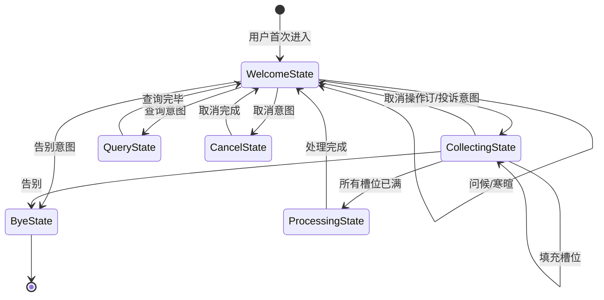
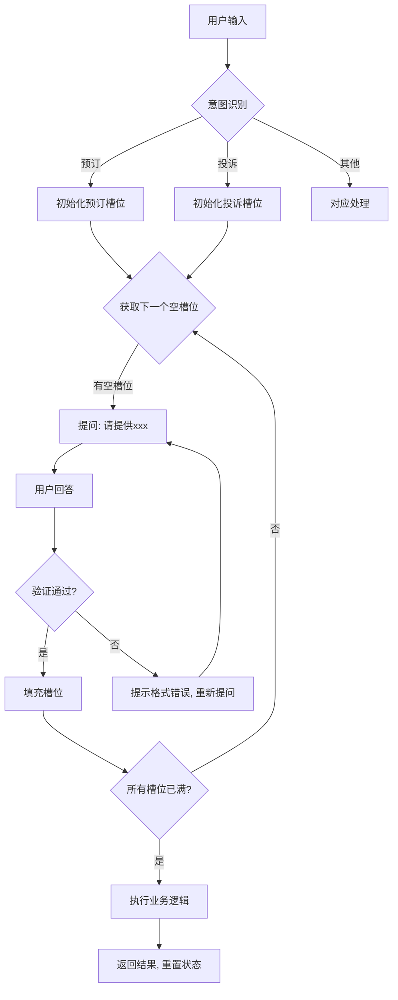
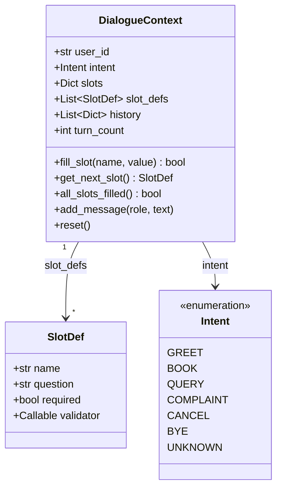
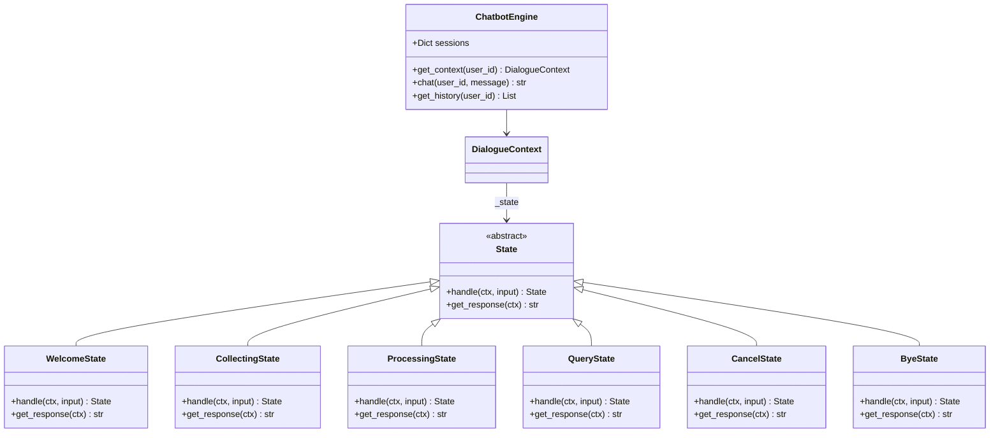
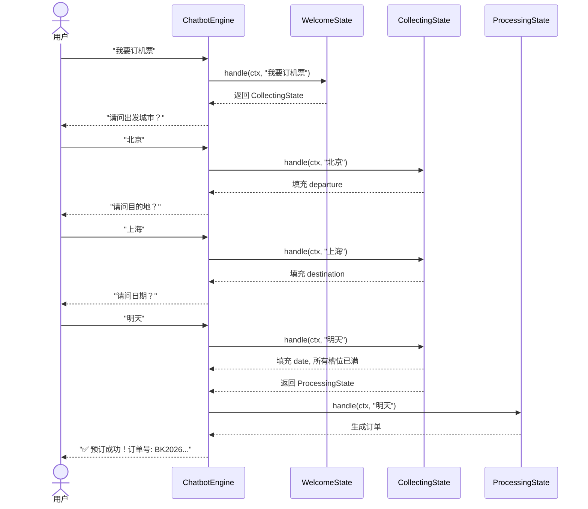

# Day 087 — 状态机对话管理 · 图解

## 1. 客服机器人状态流转图



## 2. 槽位填充流程



## 3. 对话上下文数据结构



## 4. 状态模式 UML 类图



## 5. 预订流程时序图



## 6. 红绿灯状态转换（ASCII）

```
    ┌─────────┐
    │  红灯 🔴  │
    │  停止    │
    └────┬────┘
         │ timer
         ▼
    ┌─────────┐
    │  绿灯 🟢  │
    │  通行    │
    └────┬────┘
         │ timer
         ▼
    ┌─────────┐
    │  黄灯 🟡  │
    │  警示    │
    └────┬────┘
         │ timer
         └──────→ 回到红灯
```
