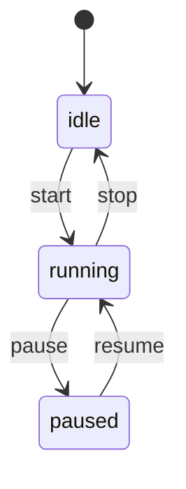

# Day 087 — 状态机对话管理 · 练习清单

## ✅ 今日完成清单

- [ ] 理解有限状态机（FSM）的五元组概念
- [ ] 掌握从零实现状态机的三种方式（查表法、类继承、状态模式）
- [ ] 理解状态机在对话管理中的应用场景
- [ ] 掌握槽位填充（Slot Filling）的工作原理
- [ ] 完成代码示例运行与调试

---

## 🟢 基础练习

### 练习 1：简单交通灯状态机
实现一个交通灯状态机，支持红→绿→黄→红的循环。添加一个 `flash` 事件，在夜间模式下黄灯闪烁。

**要求：**
- 使用 `SimpleFSM` 或自行实现
- 添加 `night_mode` / `day_mode` 切换事件
- 打印每次状态转换的日志

### 练习 2：登录状态机
设计一个用户登录流程的状态机：
```
未登录 → 输入用户名 → 输入密码 → 验证中 → 已登录 / 验证失败
```

**要求：**
- 包含至少 5 个状态
- 验证失败时可以重试（最多 3 次）
- 添加超时机制（模拟 30 秒超时）

### 练习 3：购物车状态机
为电商购物车设计状态流转：
```
空车 → 添加商品 → 选择数量 → 确认订单 → 支付中 → 支付成功/失败
```

**要求：**
- 每个状态转换时打印操作提示
- 支付失败时可以重新支付
- 记录操作历史

---

## 🔴 进阶挑战

### 挑战 1：多用户并发聊天机器人
扩展 Day 087 的 `ChatbotEngine`，使其支持同时服务多个用户：

```python
engine = ChatbotEngine()
# 用户 A 在预订机票
engine.chat("user_a", "我要订机票")
engine.chat("user_a", "北京")
# 用户 B 在投诉
engine.chat("user_b", "我要投诉")
engine.chat("user_b", "订单12345")
# 用户 A 继续
engine.chat("user_a", "上海")  # 不应被用户 B 干扰
```

**要求：**
- 每个用户有独立的 `DialogueContext`
- 支持会话持久化（保存到 JSON 文件）
- 实现会话恢复功能

### 挑战 2：层级状态机（HFSM）
实现一个支持层级嵌套的状态机，用于管理更复杂的对话流程：

```
主状态
├── 预订子流程
│   ├── 选择航线
│   ├── 选择座位
│   └── 确认支付
└── 投诉子流程
    ├── 描述问题
    └── 提交工单
```

**要求：**
- 子状态可以独立流转
- 子流程完成后自动返回主状态
- 支持子流程中断和恢复

### 挑战 3：可视化状态图生成器
编写一个工具，将状态机定义自动转换为 Mermaid 状态图代码：

```python
fsm = SimpleFSM("idle")
fsm.add_transition("idle", "start", "running")
fsm.add_transition("running", "pause", "paused")
fsm.add_transition("running", "stop", "idle")
fsm.add_transition("paused", "resume", "running")

# 自动生成 Mermaid 代码
print(fsm.to_mermaid())
```

**输出：**


---

## 📝 思考题

1. **状态爆炸**：如果你的聊天机器人要支持 20 种意图，每种 5 个槽位，理论上需要多少个状态？如何用层级状态机或子状态机减少状态数量？

2. **并发安全**：在多线程环境下，`DialogueContext` 可能被并发修改。你会如何保证线程安全？使用锁？还是每个线程独立的上下文？

3. **状态持久化**：对话状态需要保存到数据库以便会话恢复。你会选择序列化整个状态机对象，还是只保存状态名 + 槽位数据？各自的优缺点是什么？

4. **错误恢复**：当状态机进入一个无法转换的状态（死锁），你会如何检测和恢复？设计一个"看门狗"机制。

5. **性能优化**：当服务器同时服务 10000 个用户时，每个用户一个状态机对象是否可行？你会如何优化内存使用？

---

## 🏆 完成标准

- [ ] 基础练习 1-3 全部完成
- [ ] 至少完成 1 个进阶挑战
- [ ] 所有代码可独立运行
- [ ] 理解状态机的核心设计模式
- [ ] 能够解释状态机在实际项目中的应用场景
