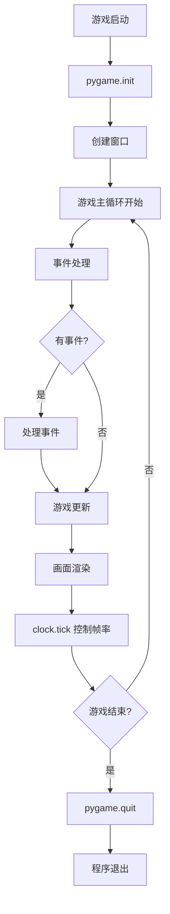
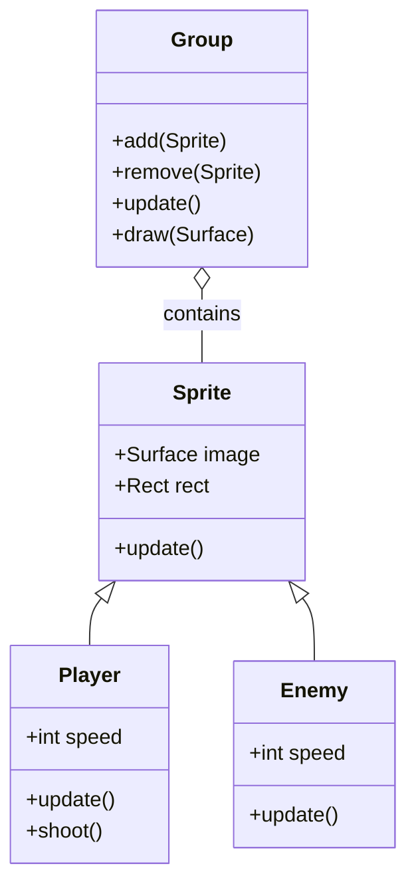

# Day 088 - 图解 Pygame 核心概念

## 1. 游戏循环流程图



## 2. Pygame 坐标系

```
    X 轴 (向右增大)
    ──────────────────────→
    │
    │  (0,0) ← 左上角原点
    │    ┌──────────┐
    │    │  rect    │ (x, y)
    │    │  ┌────┐  │
    │    │  │●   │  │ ← rect.center
    │    │  └────┘  │
    │    └──────────┘
    │
    │  Y 轴 (向下增大)
    ↓
```

## 3. 精灵系统架构



## 4. 碰撞检测类型

```
1. 矩形碰撞 (AABB)
   ┌────────┐
   │  A     │
   │     ┌──┼────┐
   └─────┼──┘    │
         │  B    │
         └───────┘
   两矩形有重叠区域 = 碰撞

2. 圆形碰撞
      ╭──╮
    ╭─┤A ├─╮
    │ ╰──╯ │
    │ ╭──╮ │
    ╰─┤B ├──╯
      ╰──╯
   圆心距 < r1 + r2 = 碰撞

3. 像素级碰撞
   需要逐像素检测，最精确但最慢
   pygame.mask 模块提供此功能
```

## 5. 双缓冲渲染原理

```
┌─────────────────────────────────────────────┐
│                  显示器                       │
│  ┌─────────────────────────────────────┐    │
│  │        当前显示的画面（前缓冲区）       │    │
│  │    用户正在看到的内容                  │    │
│  └─────────────────────────────────────┘    │
│                   ↑                          │
│              display.flip()                  │
│                   ↓                          │
│  ┌─────────────────────────────────────┐    │
│  │        正在绘制的画面（后缓冲区）       │    │
│  │    fill() + draw() 操作都在这里       │    │
│  └─────────────────────────────────────┘    │
│              后台准备                         │
└─────────────────────────────────────────────┘
```

**为什么要用双缓冲？**
- 避免画面撕裂：如果直接在显示缓冲区绘制，用户可能看到"画了一半"的画面
- flip() 是原子操作：一次性替换整个画面，视觉上瞬间切换
