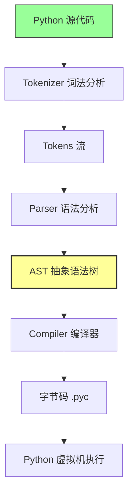
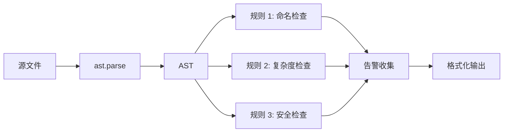

# Day 096 — AST 与代码分析

> 抽象语法树是 Python 理解代码的"骨架"。掌握 AST，你就能让程序"读懂"并"改造"自身。

---

## 一、抽象语法树（ast 模块）

### 1.1 什么是 AST？

**抽象语法树**（Abstract Syntax Tree）是源代码的树状结构化表示。Python 解释器在执行代码前，会先把源码解析成 AST，再编译成字节码。

```
源代码 → AST → 字节码 → 执行
         ↑
      我们要操作这一层
```

**为什么需要 AST？**

| 需求 | 说明 |
|------|------|
| 静态分析 | 不运行代码就能检查语法和结构 |
| 代码变换 | 自动修改/生成代码 |
| Lint 工具 | 实现自定义代码规范检查 |
| 代码生成 | 从数据或 DSL 生成 Python 代码 |

### 1.2 ast 模块核心概念

**Node 类型层级**（继承关系）：

```
AST (base)
├── stmt (语句)
│   ├── FunctionDef    # def foo():
│   ├── ClassDef       # class Foo:
│   ├── Return         # return x
│   ├── Assign         # x = 1
│   ├── If             # if ...:
│   ├── For            # for x in ...:
│   ├── While          # while ...:
│   ├── Import         # import os
│   ├── With           # with open(...) as f:
│   └── Expr           # expression as statement
├── expr (表达式)
│   ├── Name           # 变量名
│   ├── Constant       # 字面量（3.8+）
│   ├── BinOp          # a + b
│   ├── Call           # func()
│   ├── Attribute      # obj.attr
│   ├── IfExp          # a if cond else b
│   ├── ListComp       # [x for x in ...]
│   └── Lambda         # lambda x: ...
├── operator (运算符)
│   ├── Add, Sub, Mult, Div, Mod, Pow
│   └── LShift, RShift, BitOr, BitXor, BitAnd
└── keyword (关键字参数)
```

### 1.3 基本操作

```python
import ast

# 解析源代码为 AST
tree = ast.parse("x = 1 + 2")

# 将 AST 转回源代码
print(ast.unparse(tree))  # "x = 1 + 2"（Python 3.9+）

# 查看 AST 结构
print(ast.dump(tree, indent=2))
```

**ast.dump 输出解读**：

```
Module(
  body=[
    Assign(
      targets=[Name(id='x', ctx=Store())],
      value=BinOp(
        left=Constant(value=1),
        op=Add(),
        right=Constant(value=2)
      )
    )
  ]
)
```

**关键字段含义**：

| 字段 | 含义 |
|------|------|
| `ctx` | 上下文：`Load()`=读取，`Store()`=赋值，`Del()`=删除 |
| `op` | 运算符类型（`Add()`, `Sub()`, `Mult()` 等） |
| `id` | 标识符名称 |
| `value` | 字面量的值 |

### 1.4 遍历 AST 的三种方式

#### 方式一：ast.NodeVisitor（推荐）

```python
import ast

class NameFinder(ast.NodeVisitor):
    """收集所有变量名"""
    def __init__(self):
        self.names = []

    def visit_Name(self, node):
        self.names.append(node.id)
        self.generic_visit(node)  # 继续遍历子节点

tree = ast.parse("x = a + b; print(x)")
finder = NameFinder()
finder.visit(tree)
print(finder.names)  # ['x', 'a', 'b', 'x']
```

#### 方式二：ast.walk（递归遍历）

```python
import ast

tree = ast.parse("x = 1 + 2")
for node in ast.walk(tree):
    print(type(node).__name__, end=" ")
# Module Assign Name Constant BinOp Add Constant
```

#### 方式三：ast.NodeTransformer（修改 AST）

```python
import ast

class NumAdder(ast.NodeTransformer):
    """把所有数字加 1"""
    def visit_Constant(self, node):
        if isinstance(node.value, (int, float)):
            return ast.Constant(value=node.value + 1)
        return node

tree = ast.parse("x = 10 + 20")
new_tree = ast.NodeTransformer().visit(tree)
ast.fix_missing_locations(new_tree)  # 补全行号信息
print(ast.unparse(new_tree))  # "x = 11 + 21"
```

---

## 二、代码生成与变换

### 2.1 ast.parse 与 ast.unparse

```python
import ast

# 解析
source = "result = sum([i**2 for i in range(10)])"
tree = ast.parse(source)

# 代码变换（在 AST 上操作）
# ...（中间变换逻辑）...

# 还原为代码
print(ast.unparse(tree))  # Python 3.9+
```

**⚠️ Python 版本注意**：
- `ast.unparse()` 需要 **Python 3.9+**
- 3.8 可用 `astor` 库：`pip install astor` → `astor.to_source(tree)`
- 3.7 可用 `astunparse`：`pip install astunparse`

### 2.2 手动构建 AST 节点

```python
import ast

# 构建：print("Hello, AST!")
node = ast.Expr(
    value=ast.Call(
        func=ast.Name(id='print', ctx=ast.Load()),
        args=[ast.Constant(value='Hello, AST!')],
        keywords=[]
    )
)
tree = ast.Module(body=[node], type_ignores=[])
ast.fix_missing_locations(tree)
code = compile(tree, '<ast>', 'exec')
exec(code)  # 输出: Hello, AST!
```

**构建节点的速查表**：

| 目标代码 | AST 构造 |
|---------|---------|
| `x = 1` | `Assign(targets=[Name('x', Store())], value=Constant(1))` |
| `return x` | `Return(value=Name('x', Load()))` |
| `if x: pass` | `If(test=Name('x', Load()), body=[Pass()], orelse=[])` |
| `def f(): pass` | `FunctionDef(name='f', args=arguments(...), body=[Pass()])` |
| `import os` | `Import(names=[alias(name='os')])` |
| `a + b` | `BinOp(left=Name('a'), op=Add(), right=Name('b'))` |

### 2.3 代码变换实战：自动添加类型注解

```python
import ast

class TypeAnnotator(ast.NodeTransformer):
    """给函数参数添加类型注解"""
    def __init__(self, annotations: dict):
        # annotations: {"x": "int", "y": "str"}
        self.annotations = annotations

    def visit_FunctionDef(self, node):
        for arg in node.args.args:
            if arg.arg in self.annotations and arg.annotation is None:
                arg.annotation = ast.Name(
                    id=self.annotations[arg.arg],
                    ctx=ast.Load()
                )
        return node

source = """
def greet(name, age):
    return f"Hello {name}, you are {age}"
"""
tree = ast.parse(source)
annotator = TypeAnnotator({"name": "str", "age": "int"})
new_tree = annotator.visit(tree)
ast.fix_missing_locations(new_tree)
print(ast.unparse(new_tree))
```

---

## 三、静态分析工具实现

### 3.1 什么是静态分析？

**静态分析**是指**不运行程序**的情况下，通过分析源代码的结构和内容来发现潜在问题。

```
源代码 → 解析器 → AST → 分析器 → 报告
                            ↑
                        规则在这里执行
```

### 3.2 常见分析维度

| 分析类型 | 检查内容 | 典型工具 |
|---------|---------|---------|
| 语法检查 | 代码是否合法 | ast.parse 直接报错 |
| 命名规范 | 变量/函数命名风格 | pylint, flake8 |
| 复杂度分析 | 函数复杂度、嵌套深度 | radon |
| 安全检查 | 危险函数调用、SQL 注入 | bandit |
| 类型检查 | 类型注解一致性 | mypy |
| 死代码检测 | 未使用的变量/导入 | vulture |
| 依赖分析 | 函数间调用关系 | 自定义 |

### 3.3 实现一个函数复杂度分析器

```python
import ast

class ComplexityAnalyzer(ast.NodeVisitor):
    """计算函数的圈复杂度（Cyclomatic Complexity）"""
    # 复杂度 = 分支数 + 1

    def __init__(self):
        self.results = []

    def _calc(self, node):
        """计算单个函数的复杂度"""
        complexity = 1  # 基础复杂度

        for child in ast.walk(node):
            if isinstance(child, (ast.If, ast.While, ast.For,
                                  ast.ExceptHandler, ast.With)):
                complexity += 1
            elif isinstance(child, ast.BoolOp):
                # and/or 每个操作数 +1
                complexity += len(child.values) - 1
            elif isinstance(child, ast.Assert):
                complexity += 1

        return complexity

    def visit_FunctionDef(self, node):
        cc = self._calc(node)
        self.results.append((node.name, cc, node.lineno))
        self.generic_visit(node)

source = """
def risky_function(a, b):
    if a > 0:
        if b > 0:
            return a + b
    elif a < 0:
        for i in range(b):
            if i % 2 == 0:
                print(i)
    else:
        try:
            result = a / b
        except ZeroDivisionError:
            result = 0
    return result
"""

tree = ast.parse(source)
analyzer = ComplexityAnalyzer()
analyzer.visit(tree)

for name, cc, line in analyzer.results:
    level = "🟢 简单" if cc <= 5 else "🟡 中等" if cc <= 10 else "🔴 复杂"
    print(f"函数 {name}（第{line}行）: 圈复杂度 = {cc} {level}")
```

### 3.4 实现变量作用域分析器

```python
import ast

class ScopeAnalyzer(ast.NodeVisitor):
    """分析函数内变量的定义和使用"""

    def __init__(self):
        self.definitions = {}  # name -> [line]
        self.usages = {}       # name -> [line]

    def visit_FunctionDef(self, node):
        # 分析函数体
        self._analyze_body(node)
        self.generic_visit(node)

    def _analyze_body(self, func_node):
        """分析函数体中的变量"""
        for node in ast.walk(func_node):
            # 赋值 = 定义
            if isinstance(node, ast.Assign):
                for target in node.targets:
                    if isinstance(target, ast.Name):
                        self._add_def(target.id, node.lineno)
                # 右侧是使用
                self._check_value(node.value)

            # For 循环变量 = 定义
            elif isinstance(node, ast.For):
                if isinstance(node.target, ast.Name):
                    self._add_def(node.target.id, node.lineno)

            # 名称引用 = 使用
            elif isinstance(node, ast.Name) and isinstance(node.ctx, ast.Load):
                self._add_use(node.id, node.lineno)

    def _add_def(self, name, line):
        self.definitions.setdefault(name, []).append(line)

    def _add_use(self, name, line):
        self.usages.setdefault(name, []).append(line)

    def _check_value(self, node):
        """检查表达式中的名称引用"""
        for child in ast.walk(node):
            if isinstance(child, ast.Name) and isinstance(child.ctx, ast.Load):
                self._add_use(child.id, child.lineno)

    def report(self):
        # 未使用的变量
        unused = set(self.definitions) - set(self.usages)
        # 未定义的变量（可能是全局变量）
        undefined = set(self.usages) - set(self.definitions)

        print("=== 变量分析报告 ===")
        if unused:
            print(f"未使用的变量: {', '.join(sorted(unused))}")
        else:
            print("所有变量均被使用 ✓")
        if undefined:
            print(f"可能的外部变量: {', '.join(sorted(undefined))}")

source = """
def analyze(x, y):
    temp = x + y
    unused_var = 42
    result = temp * 2
    print(result)
    return result
"""
tree = ast.parse(source)
for node in ast.walk(tree):
    if isinstance(node, ast.FunctionDef):
        analyzer = ScopeAnalyzer()
        analyzer.visit(node)
        analyzer.report()
```

---

## 四、实战：自定义 Linter

### 4.1 Linter 的工作流程

```
┌─────────────────────────────────────────────┐
│              自定义 Linter                    │
├─────────────────────────────────────────────┤
│                                             │
│  1. 读取源文件                               │
│     ↓                                       │
│  2. ast.parse() 解析为 AST                  │
│     ↓                                       │
│  3. 遍历 AST，运行规则检查器                  │
│     ↓                                       │
│  4. 收集所有告警                              │
│     ↓                                       │
│  5. 格式化输出报告                            │
│                                             │
└─────────────────────────────────────────────┘
```

### 4.2 实现一个迷你 Linter

```python
import ast
import sys
from dataclasses import dataclass, field
from typing import List

@dataclass
class LintWarning:
    """一条 Lint 告警"""
    line: int
    col: int
    code: str       # e.g. "W001"
    message: str
    severity: str   # "warning" | "error"

    def __str__(self):
        return f"  L{self.line}:{self.col} [{self.severity.upper()}] {self.code}: {self.message}"


class Linter(ast.NodeVisitor):
    """自定义 Linter：检查常见代码问题"""

    def __init__(self):
        self.warnings: List[LintWarning] = []

    # ===== 规则集合 =====

    def visit_FunctionDef(self, node):
        self._check_func_name(node)
        self._check_func_length(node)
        self._check_func_args(node)
        self.generic_visit(node)

    def visit_Assign(self, node):
        self._check_var_name(node)
        self.generic_visit(node)

    def visit_Call(self, node):
        self._check_bare_except(node)
        self.generic_visit(node)

    def visit_ClassDef(self, node):
        self._check_class_name(node)
        self.generic_visit(node)

    # ===== 具体规则 =====

    def _check_func_name(self, node):
        """规则 W001：函数名应使用 snake_case"""
        import re
        if not re.match(r'^[a-z_][a-z0-9_]*$', node.name):
            self.warnings.append(LintWarning(
                line=node.lineno,
                col=node.col_offset,
                code="W001",
                message=f"函数名 '{node.name}' 应使用 snake_case 命名",
                severity="warning"
            ))

    def _check_func_length(self, node):
        """规则 W002：函数不应超过 50 行"""
        end = getattr(node, 'end_lineno', None)
        if end:
            length = end - node.lineno + 1
            if length > 50:
                self.warnings.append(LintWarning(
                    line=node.lineno,
                    col=node.col_offset,
                    code="W002",
                    message=f"函数 '{node.name}' 有 {length} 行，建议不超过 50 行",
                    severity="warning"
                ))

    def _check_func_args(self, node):
        """规则 W003：函数参数不应超过 5 个"""
        arg_count = len(node.args.args)
        if arg_count > 5:
            self.warnings.append(LintWarning(
                line=node.lineno,
                col=node.col_offset,
                code="W003",
                message=f"函数 '{node.name}' 有 {arg_count} 个参数，建议不超过 5 个",
                severity="warning"
            ))

    def _check_var_name(self, node):
        """规则 W004：变量名应使用 snake_case"""
        import re
        for target in node.targets:
            if isinstance(target, ast.Name) and not re.match(r'^[a-z_][a-z0-9_]*$', target.id):
                if not target.id.startswith('_'):
                    self.warnings.append(LintWarning(
                        line=node.lineno,
                        col=node.col_offset,
                        code="W004",
                        message=f"变量名 '{target.id}' 应使用 snake_case",
                        severity="warning"
                    ))

    def _check_class_name(self, node):
        """规则 W005：类名应使用 PascalCase"""
        import re
        if not re.match(r'^[A-Z][a-zA-Z0-9]*$', node.name):
            self.warnings.append(LintWarning(
                line=node.lineno,
                col=node.col_offset,
                code="W005",
                message=f"类名 '{node.name}' 应使用 PascalCase",
                severity="warning"
            ))

    def _check_bare_except(self, node):
        """规则 E001：不应使用裸 except"""
        if isinstance(node.func, ast.Name) and node.func.id == 'raise':
            pass  # skip raise
        # 注意：bare except 检查在 ExceptionHandler 节点

    def report(self) -> str:
        if not self.warnings:
            return "✅ 未发现问题！"
        lines = [f"发现 {len(self.warnings)} 个问题：\n"]
        for w in sorted(self.warnings, key=lambda x: x.line):
            lines.append(str(w))
        return "\n".join(lines)


def lint_file(filepath: str):
    """对单个文件运行 Linter"""
    with open(filepath, 'r') as f:
        source = f.read()

    tree = ast.parse(source, filename=filepath)
    linter = Linter()
    linter.visit(tree)
    print(f"📄 {filepath}")
    print(linter.report())
    return linter.warnings


if __name__ == "__main__":
    if len(sys.argv) < 2:
        print("用法: python linter.py <file.py>")
        sys.exit(1)

    all_warnings = []
    for path in sys.argv[1:]:
        all_warnings.extend(lint_file(path))

    sys.exit(1 if any(w.severity == "error" for w in all_warnings) else 0)
```

### 4.3 进阶：实现多文件分析

```python
import ast
import os
import sys
from pathlib import Path

class ProjectLinter:
    """项目级别的 Linter"""

    def __init__(self, root_dir: str):
        self.root_dir = Path(root_dir)
        self.results = {}

    def find_python_files(self) -> list:
        """递归查找所有 .py 文件"""
        files = []
        for path in self.root_dir.rglob("*.py"):
            # 跳过常见的不需要检查的目录
            parts = path.parts
            if any(skip in parts for skip in ['venv', '.venv', 'node_modules', '__pycache__']):
                continue
            files.append(path)
        return sorted(files)

    def lint_file(self, filepath: Path) -> list:
        """分析单个文件"""
        try:
            source = filepath.read_text(encoding='utf-8')
            tree = ast.parse(source, filename=str(filepath))

            # 自定义分析器
            linter = Linter()
            linter.visit(tree)

            return linter.warnings
        except SyntaxError as e:
            return [LintWarning(
                line=e.lineno or 1,
                col=e.offset or 0,
                code="E999",
                message=f"语法错误: {e.msg}",
                severity="error"
            )]

    def lint_project(self):
        """分析整个项目"""
        files = self.find_python_files()
        print(f"🔍 扫描 {len(files)} 个 Python 文件...\n")

        total_warnings = 0
        total_errors = 0

        for filepath in files:
            warnings = self.lint_file(filepath)
            if warnings:
                rel = filepath.relative_to(self.root_dir)
                print(f"📄 {rel}")
                for w in warnings:
                    print(f"   L{w.line} [{w.severity.upper()}] {w.code}: {w.message}")
                print()
                total_warnings += sum(1 for w in warnings if w.severity == "warning")
                total_errors += sum(1 for w in warnings if w.severity == "error")

        print("=" * 50)
        print(f"📊 总计: {total_errors} 个错误, {total_warnings} 个警告")
        return total_errors, total_warnings
```

---

## 五、AST 高级技巧

### 5.1 exec 与 compile 配合 AST

```python
import ast

# 从 AST 生成可执行代码
tree = ast.parse("""
def fibonacci(n):
    if n <= 1:
        return n
    return fibonacci(n-1) + fibonacci(n-2)

print(fibonacci(10))
""")

# 编译
code = compile(tree, '<fib>', 'exec')

# 执行
exec(code)  # 输出: 55
```

### 5.2 ast.literal_eval 的安全求值

```python
import ast

# 安全地解析 Python 字面量（不执行任意代码）
data = ast.literal_eval("{'name': '聂董', 'age': 30, 'scores': [95, 88, 72]}")
print(data)
# {'name': '聂董', 'age': 30, 'scores': [95, 88, 72]}

# 对比 eval（危险！不要用）
# eval("__import__('os').system('rm -rf /')")  # ❌ 绝对不要
```

**为什么 `ast.literal_eval` 安全？**

```
eval()     → 可执行任意代码（函数调用、导入等）
ast.literal_eval() → 只接受字面量：
  ✓ 数字、字符串、布尔、None
  ✓ 列表、元组、字典、集合
  ✗ 函数调用、变量引用、import
```

### 5.3 代码格式化的 AST 实现

```python
import ast

class CodeFormatter:
    """基于 AST 的简单代码格式化器"""

    @staticmethod
    def indent_code(source: str, indent_size: int = 4) -> str:
        """规范化缩进"""
        tree = ast.parse(source)
        lines = source.splitlines()
        result = []

        for node in ast.walk(tree):
            if hasattr(node, 'lineno'):
                # 简单的缩进规范化
                line = lines[node.lineno - 1] if node.lineno <= len(lines) else ""
                if line:
                    # 去掉前导空格，按层级重新缩进
                    stripped = line.lstrip()
                    indent = " " * (node.col_offset)
                    result.append(indent + stripped)

        return "\n".join(result) if result else source
```

### 5.4 安全的动态代码执行流程

```
用户输入 → ast.literal_eval / ast.parse
              ↓
         是否安全？
         ├─ 是 → compile() → exec() / eval()
         └─ 否 → 拒绝执行，返回错误
```

---

## 六、Mermaid 图解

### AST 解析流程



### Linter 分析流程



---

## 七、思考题

1. **AST 与正则表达式的区别**：为什么不能用正则表达式来解析 Python 代码？用 AST 做代码分析相比正则有什么优势？

2. **安全执行**：`ast.literal_eval` 为什么比 `eval` 安全？如果要设计一个安全的在线 Python 执行环境，需要做哪些防护措施？

3. **代码变换的局限性**：使用 `ast.NodeTransformer` 修改 AST 时，为什么需要调用 `ast.fix_missing_locations()`？如果省略会发生什么？

4. **性能考虑**：在一个大型项目（10万行代码）中运行自定义 Linter，你会选择哪种遍历方式（NodeVisitor / walk / 手动递归）？为什么？

5. **扩展性**：如何让自定义 Linter 支持通过配置文件（如 `.lintrc`）来启用/禁用规则？设计一个简单的插件机制。

---

## 八、总结

| 概念 | 核心要点 |
|------|---------|
| AST 结构 | 语句(stmt) + 表达式(expr) + 运算符(operator) |
| 遍历方式 | NodeVisitor（安全）、walk（简单）、NodeTransformer（可修改） |
| 代码变换 | parse → 修改 AST → fix_missing_locations → unparse/compile |
| 静态分析 | 不运行代码就能发现问题 |
| 安全执行 | `ast.literal_eval` 只解析字面量，`eval/exec` 有安全风险 |

> **明日预告**：Day 097 — 领域特定语言（DSL），用 Python 元编程构建自己的 DSL！
