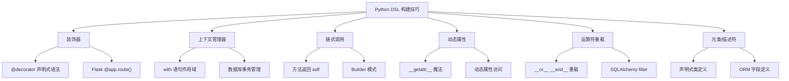
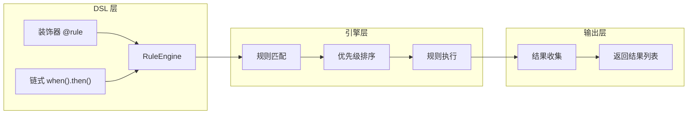

# Day 097 — 领域特定语言（DSL）图解

## 1. DSL 分类全景图

```
┌─────────────────────────────────────────────────────────────────┐
│                    DSL 分类体系                                  │
├─────────────────────────────────────────────────────────────────┤
│                                                                 │
│  ┌─────────────┐   ┌──────────────┐   ┌───────────────────┐    │
│  │  外部 DSL    │   │  内部 DSL     │   │  中间 DSL          │    │
│  │  (External)  │   │  (Internal)   │   │  (Mid-level)       │    │
│  └──────┬──────┘   └──────┬───────┘   └────────┬──────────┘    │
│         │                 │                     │               │
│         ▼                 ▼                     ▼               │
│  ┌─────────────┐   ┌──────────────┐   ┌───────────────────┐    │
│  │ • 独立语法   │   │ • 嵌入宿主    │   │ • 部分独立语法     │    │
│  │ • 需要解析器 │   │ • 利用宿主    │   │ • 依赖宿主执行     │    │
│  │ • 完全自定义 │   │   语言特性    │   │                   │    │
│  └──────┬──────┘   └──────┬───────┘   └────────┬──────────┘    │
│         │                 │                     │               │
│         ▼                 ▼                     ▼               │
│  ┌─────────────┐   ┌──────────────┐   ┌───────────────────┐    │
│  │ SQL          │   │ Python 装饰器 │   │ Jinja2 模板        │    │
│  │ HTML/CSS     │   │ Python 上下文  │   │ Mako 模板          │    │
│  │ 正则表达式    │   │ Python 链式调用│   │ Terraform HCL      │    │
│  │ Makefile     │   │ SQLAlchemy    │   │                   │    │
│  └─────────────┘   └──────────────┘   └───────────────────┘    │
│                                                                 │
└─────────────────────────────────────────────────────────────────┘
```

## 2. Python DSL 构建技巧关系图



## 3. DSL 执行流程图

```
源码 (DSL 语法)
    │
    ▼
┌──────────────────┐
│  Python 解释器    │
│  1. 解析语法      │
│  2. 查找属性/方法  │
│  3. 执行调用      │
└────────┬─────────┘
         │
         ▼
┌──────────────────┐
│  DSL 对象状态    │
│  • 内部存储数据   │
│  • 累积配置      │
│  • 链式传递 self  │
└────────┬─────────┘
         │
         ▼
┌──────────────────┐
│  .build() / 输出 │
│  • 生成最终结果   │
│  • 返回 SQL/配置  │
│  • 执行操作       │
└──────────────────┘
```

## 4. 规则引擎 DSL 架构图



## 5. DSL 设计权衡图

```
表达力强
    ▲
    │     ★ SQL
    │        ★ HTML
    │     ★ Jinja2
    │  ★ SQLAlchemy
    │     ★ Flask 路由
    │  ★ 本日配置 DSL
    │        ★ 规则引擎
    │
    │─────────────────────────► 可维护性高
    │
    │     ⚠️ 过度魔法化
    │        ⚠️ 隐式行为
    │           ⚠️ 调试困难
    ▼
```

> 📝 **设计原则**：好的 DSL 应该在表达力和可维护性之间找到平衡点。过于「魔法化」的 DSL 会让代码难以理解和调试。
