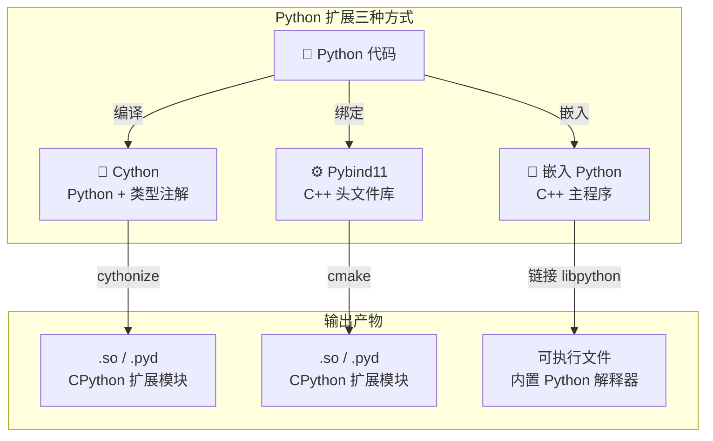
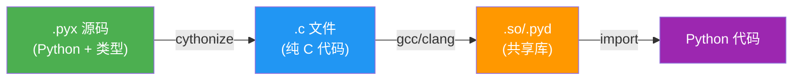
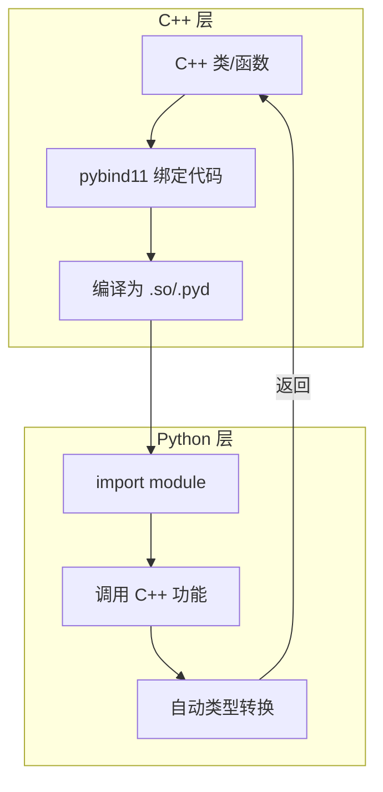
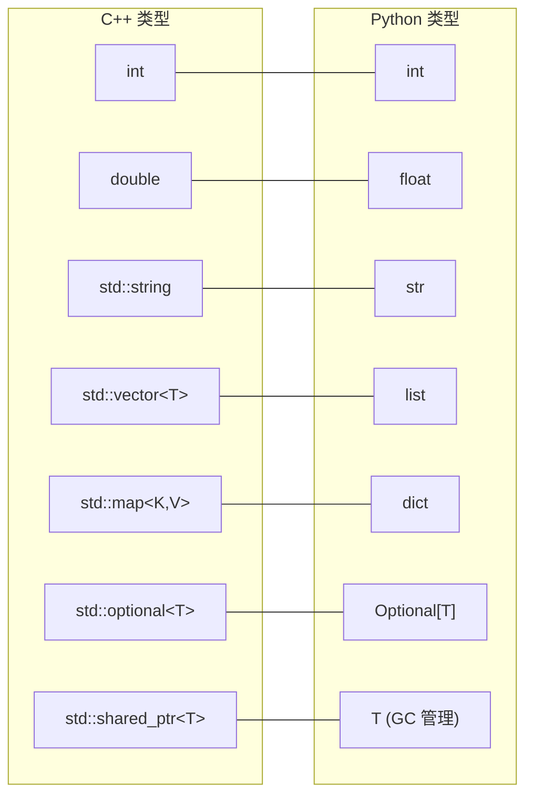
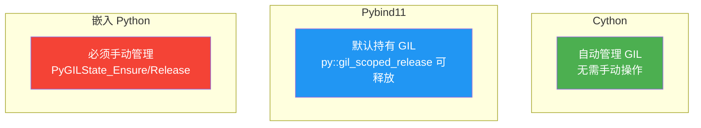

# Day 099 — 扩展 Python 架构图解

## 1. Python 扩展方式总览



## 2. Cython 编译流程



## 3. Pybind11 绑定架构



## 4. 嵌入 Python 架构

```mermaid
sequenceDiagram
    participant C++ as C++ 主程序
    participant PY as Python 解释器
    participant Code as Python 脚本

    C++->>C++: Py_Initialize()
    C++->>PY: PyRun_SimpleString()
    PY->>Code: 执行 Python 代码
    Code-->>PY: 返回结果
    PY-->>C++: PyObject* 结果
    C++->>C++: 解析 PyObject
    C++->>C++: Py_Finalize()
```

## 5. 混合编程项目结构

```
hybrid_project/
├── CMakeLists.txt              # 构建入口
├── setup.py                    # pip 安装入口
│
├── src/                        # C++ 源码
│   ├── core.cpp               # 核心计算逻辑
│   ├── bindings.cpp           # pybind11 绑定
│   └── utils.h                # C++ 工具函数
│
├── python/                     # Python 高层接口
│   ├── __init__.py
│   ├── wrapper.py             # Python 包装层
│   └── pipeline.py            # 业务流程
│
├── tests/                      # 测试
│   ├── test_core.py
│   └── test_wrapper.py
│
└── examples/                   # 使用示例
    └── demo.py
```

## 6. 类型转换映射表



## 7. 性能对比图

```
基准测试：斐波那契(500000)
━━━━━━━━━━━━━━━━━━━━━━━━━━━━━━━━━━

纯 Python     ████████████████████████████  100%
Cython (无类型) ████████████████             55%
Cython (全类型) ██                           8%
C++ 原生       █                            5%

━━━━━━━━━━━━━━━━━━━━━━━━━━━━━━━━━━
```

## 8. GIL 管理对比


