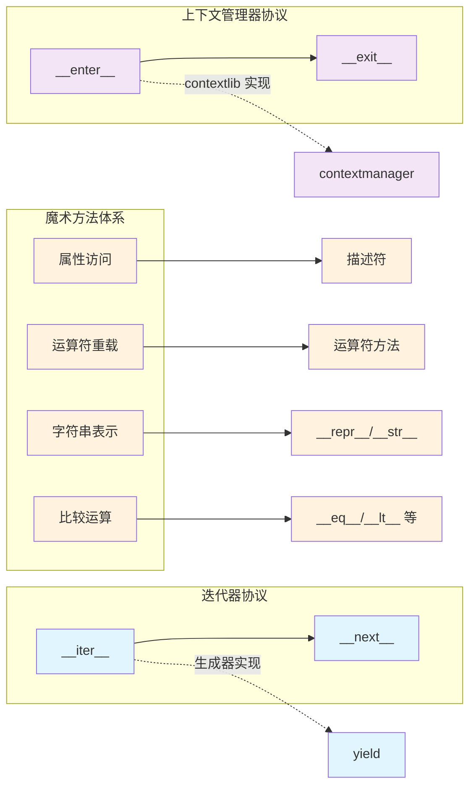
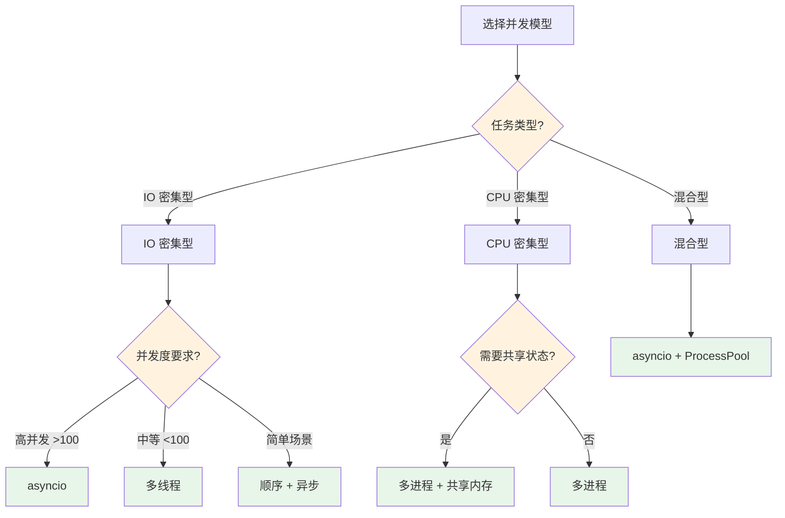
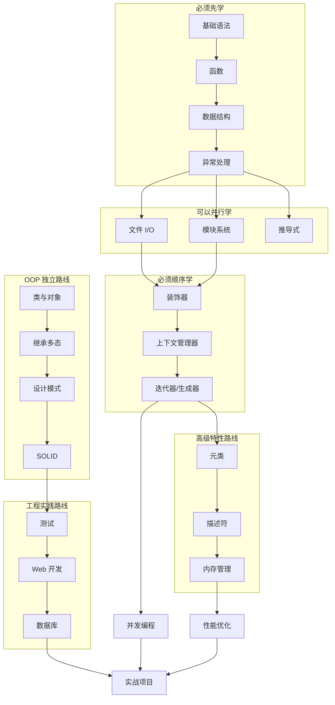
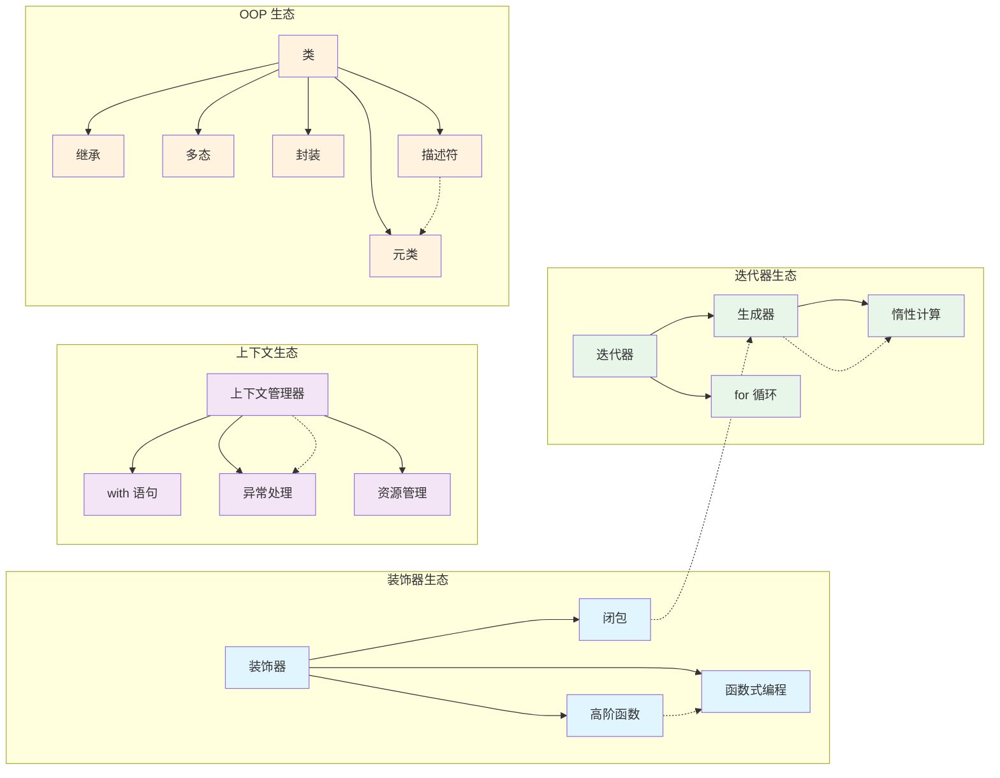

# Day 100 知识体系梳理 - 图解

## 🗺️ 100 天知识架构图

```mermaid
graph TB
    subgraph "Phase 1: Python 基础 (Day 1-15)"
        A1[变量与数据类型]
        A2[字符串]
        A3[列表/元组/字典/集合]
        A4[循环与条件]
        A5[函数与作用域]
        A6[模块与包]
    end
    
    subgraph "Phase 2: 核心编程 (Day 16-30)"
        B1[文件 I/O]
        B2[异常处理]
        B3[推导式]
        B4[Lambda 与函数式]
        B5[迭代器与生成器]
        B6[装饰器]
        B7[上下文管理器]
        B8[数据结构综合]
        B9[算法入门]
    end
    
    subgraph "Phase 3: OOP (Day 31-45)"
        C1[类与对象]
        C2[继承与多态]
        C3[魔术方法]
        C4[设计模式]
        C5[SOLID 原则]
        C6[dataclass]
    end
    
    subgraph "Phase 4: 高阶特性 (Day 46-60)"
        D1[元类]
        D2[描述符]
        D3[内存管理]
        D4[并发编程]
        D5[C 扩展]
    end
    
    subgraph "Phase 5: 工程实践 (Day 61-75)"
        E1[Web 开发]
        E2[数据库]
        E3[测试]
        E4[日志]
        E5[包管理]
    end
    
    subgraph "Phase 6-7: 实战与进阶 (Day 76-100)"
        F1[爬虫]
        F2[数据分析]
        F3[性能优化]
        F4[Python 内部机制]
    end
    
    A1 --> A2 --> A3 --> A4 --> A5 --> A6
    A6 --> B1
    B1 --> B2 --> B3 --> B4 --> B5 --> B6 --> B7
    B7 --> B8 --> B9
    B9 --> C1
    C1 --> C2 --> C3 --> C4 --> C5 --> C6
    C6 --> D1
    D1 --> D2 --> D3 --> D4 --> D5
    D5 --> E1
    E1 --> E2 --> E3 --> E4 --> E5
    E5 --> F1
    F1 --> F2 --> F3 --> F4
```



## 🔄 核心概念关系图



## 🎯 并发模型决策树



## 🏗️ 知识依赖关系



## 📊 每日知识量趋势

```
Day 001  ██░░░░░░░░  10%  Hello Python
Day 010  ███░░░░░░░  30%  循环与函数
Day 020  ████░░░░░░  40%  函数式编程
Day 030  █████░░░░░  50%  CLI 工具
Day 040  ██████░░░░  60%  设计模式
Day 050  ███████░░░  70%  高级特性
Day 060  ████████░░  80%  并发编程
Day 070  ████████░░  85%  测试与日志
Day 080  █████████░  90%  数据分析
Day 090  █████████░  95%  实战项目
Day 100  ██████████  100% 🎉 里程碑！
```

## 🔗 概念关联网络


