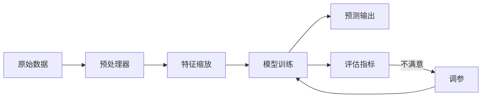

# Day 106 — 机器学习基础

> 🎯 **今日目标**：理解机器学习的核心概念，掌握 Scikit-learn 基本工作流，完成第一个完整的 ML 流程体验。

---

## 1. 什么是机器学习？

机器学习（Machine Learning）是让计算机从数据中**自动学习规律**，而不是通过显式编程来完成任务。

### 为什么需要机器学习？

| 传统编程 | 机器学习 |
|---------|---------|
| 人写规则 → 计算机执行 | 人给数据 → 计算机学习规则 |
| 适合逻辑明确的任务 | 适合规则难以描述的任务 |
| 例：if-else 判断年龄 | 例：识别图片中的猫 |

**核心公式**：
```
传统编程:  Input + Rules  → Output
机器学习:  Input + Output → Rules (Model)
```

---

## 2. 三大学习范式

### 2.1 监督学习（Supervised Learning）

给模型**带标签的数据**，让它学习输入到输出的映射。

```
训练数据: [(图片1, "猫"), (图片2, "狗"), ...]
         ↓ 模型学习
新图片 → 模型 → 预测 "猫"/"狗"
```

**典型任务**：
- **分类**：邮件是否是垃圾邮件？肿瘤是良性还是恶性？
- **回归**：预测房价、预测温度

### 2.2 无监督学习（Unsupervised Learning）

数据**没有标签**，让模型自己发现数据中的结构。

```
训练数据: [客户A的消费数据, 客户B的消费数据, ...]
         ↓ 模型发现
结果: 客户被分成 3 个群体（高消费、中等、低消费）
```

**典型任务**：
- **聚类**：客户分群、文档分组
- **降维**：数据可视化、特征压缩
- **异常检测**：欺诈识别

### 2.3 强化学习（Reinforcement Learning）

模型通过**与环境交互**，根据奖励信号学习最优策略。

```
Agent(智能体) → 执行动作 → 环境反馈奖励/惩罚
     ↑                              ↓
     ←←←←←←← 学习最优策略 ←←←←←←←←←
```

**典型应用**：游戏 AI（AlphaGo）、机器人控制、自动驾驶

### 学习范式对比

```
┌─────────────┬──────────────────┬──────────────────┐
│   范式       │  数据特点         │  学习目标         │
├─────────────┼──────────────────┼──────────────────┤
│ 监督学习     │  有标签           │  预测输出         │
│ 无监督学习   │  无标签           │  发现结构         │
│ 强化学习     │  奖励信号         │  最优策略         │
└─────────────┴──────────────────┴──────────────────┘
```

---

## 3. Scikit-learn 概览

Scikit-learn（sklearn）是 Python 最流行的机器学习库，提供统一、简洁的 API。

### 3.1 安装

```bash
pip install scikit-learn
```

### 3.2 统一 API 设计

Scikit-learn 所有模型都遵循相同的 API 模式：

```python
from sklearn.xxx import XxxModel

# 1. 创建模型
model = XxxModel(hyperparameter=value)

# 2. 训练（拟合）
model.fit(X_train, y_train)

# 3. 预测
y_pred = model.predict(X_test)

# 4. 评估
score = model.score(X_test, y_test)
```

### 3.3 核心模块

```
sklearn
├── datasets        # 内置数据集（鸢尾花、手写数字等）
├── model_selection # 数据拆分、交叉验证、网格搜索
├── preprocessing   # 数据预处理（标准化、编码等）
├── linear_model    # 线性模型（线性回归、逻辑回归等）
├── tree            # 决策树
├── ensemble        # 集成方法（随机森林、GBDT）
├── svm             # 支持向量机
├── neighbors       # K 近邻
├── cluster         # 聚类算法
├── metrics         # 评估指标
└── pipeline        # 管道（串联预处理和模型）
```

---

## 4. 数据集拆分 — train_test_split

### 为什么要拆分？

防止**过拟合**——模型在训练集上表现好，但在新数据上表现差。

```
完整数据集
├── 训练集 (80%) → 用于训练模型
└── 测试集 (20%) → 用于评估模型泛化能力
```

### 使用方法

```python
from sklearn.model_selection import train_test_split

X_train, X_test, y_train, y_test = train_test_split(
    X, y,                # 特征和标签
    test_size=0.2,       # 测试集比例
    random_state=42,     # 随机种子（保证可复现）
    stratify=y           # 分层抽样（保持类别比例一致）
)
```

### 参数说明

| 参数 | 说明 | 默认值 |
|------|------|--------|
| `test_size` | 测试集比例（0~1） | 0.25 |
| `train_size` | 训练集比例（0~1） | None |
| `random_state` | 随机种子 | None |
| `stratify` | 按该标签分层抽样 | None |

---

## 5. 评估指标详解

### 5.1 分类指标

#### 混淆矩阵（Confusion Matrix）

```
                    预测值
                正例(P)   负例(N)
实际  正例(P)    TP        FN
值    负例(N)    FP        TN
```

- **TP**（True Positive）：真正例，实际正，预测正 ✅
- **TN**（True Negative）：真负例，实际负，预测负 ✅
- **FP**（False Positive）：假正例，实际负，预测正 ❌（误报）
- **FN**（False Negative）：假负例，实际正，预测负 ❌（漏报）

#### 四大指标

| 指标 | 公式 | 含义 | 适用场景 |
|------|------|------|----------|
| **准确率** Accuracy | (TP+TN)/(TP+TN+FP+FN) | 所有样本中预测正确的比例 | 类别平衡时 |
| **精确率** Precision | TP/(TP+FP) | 预测为正的样本中真正为正的比例 | 关注误报（如垃圾邮件） |
| **召回率** Recall | TP/(TP+FN) | 实际为正的样本中被正确预测的比例 | 关注漏报（如癌症检测） |
| **F1 分数** | 2×P×R/(P+R) | 精确率和召回率的调和平均 | 综合考虑两者 |

#### 何时用哪个？

```
垃圾邮件检测 → 高精确率（宁可漏掉，不可误判正常邮件为垃圾）
癌症筛查     → 高召回率（宁可误判，不可漏掉真正的患者）
一般分类     → F1 分数（综合考虑）
```

### 5.2 回归指标

| 指标 | 公式 | 含义 |
|------|------|------|
| **MSE** | mean((y-y_pred)²) | 均方误差，对大误差敏感 |
| **RMSE** | √MSE | 均方根误差，与原始单位一致 |
| **MAE** | mean(|y-y_pred|) | 平均绝对误差 |
| **R²** | 1 - SS_res/SS_tot | 决定系数，1=完美，0=等同于均值 |

---

## 6. 完整 ML 工作流图解

```
┌─────────────────────────────────────────────────┐
│              机器学习工作流                        │
├─────────────────────────────────────────────────┤
│                                                   │
│  ① 数据收集                                       │
│      ↓                                            │
│  ② 数据探索 (EDA)                                  │
│      ↓                                            │
│  ③ 数据预处理                                     │
│      ├── 缺失值处理                                │
│      ├── 特征编码                                  │
│      ├── 特征缩放                                  │
│      └── 特征选择                                  │
│      ↓                                            │
│  ④ 数据拆分 (train_test_split)                    │
│      ↓                                            │
│  ⑤ 模型选择 & 训练                                │
│      ↓                                            │
│  ⑥ 模型评估                                       │
│      ├── 准确率/精确率/召回率/F1                    │
│      ├── 交叉验证                                  │
│      └── 学习曲线                                  │
│      ↓                                            │
│  ⑦ 超参数调优 (GridSearchCV)                      │
│      ↓                                            │
│  ⑧ 部署 & 预测                                    │
│                                                   │
└─────────────────────────────────────────────────┘
```

### Scikit-learn Pipeline 流程图



---

## 7. 实战代码案例

### 案例：鸢尾花分类（Iris Classification）

这是 ML 界的 "Hello World"，用 4 个特征（花萼/花瓣长宽）预测鸢尾花品种。

```python
"""
Day 106 实战：鸢尾花分类完整流程
"""
from sklearn.datasets import load_iris
from sklearn.model_selection import train_test_split
from sklearn.preprocessing import StandardScaler
from sklearn.neighbors import KNeighborsClassifier
from sklearn.metrics import classification_report, confusion_matrix
import numpy as np

# ===== 1. 加载数据 =====
iris = load_iris()
X, y = iris.data, iris.target
print(f"数据集大小: {X.shape}")
print(f"特征名: {iris.feature_names}")
print(f"类别名: {list(iris.target_names)}")

# ===== 2. 数据拆分 =====
X_train, X_test, y_train, y_test = train_test_split(
    X, y, test_size=0.2, random_state=42, stratify=y
)
print(f"训练集: {X_train.shape}, 测试集: {X_test.shape}")

# ===== 3. 特征缩放 =====
scaler = StandardScaler()
X_train_scaled = scaler.fit_transform(X_train)  # fit + transform
X_test_scaled = scaler.transform(X_test)         # 只 transform!

# ===== 4. 训练模型 =====
model = KNeighborsClassifier(n_neighbors=5)
model.fit(X_train_scaled, y_train)

# ===== 5. 评估 =====
y_pred = model.predict(X_test_scaled)
accuracy = np.mean(y_pred == y_test)
print(f"\n准确率: {accuracy:.2%}")
print("\n分类报告:")
print(classification_report(y_test, y_pred, target_names=iris.target_names))
print("混淆矩阵:")
print(confusion_matrix(y_test, y_pred))
```

---

## 8. 常见陷阱与避坑

### ❌ 陷阱 1：数据泄露（Data Leakage）

```python
# ❌ 错误：先缩放再拆分 → 测试集信息泄露到训练集
scaler.fit_transform(X)  # 用所有数据算均值/方差
X_train, X_test, y_train, y_test = train_test_split(X, y)

# ✅ 正确：先拆分再缩放
X_train, X_test, y_train, y_test = train_test_split(X, y)
scaler.fit_transform(X_train)  # 只用训练集算
scaler.transform(X_test)       # 测试集用训练集的参数
```

### ❌ 陷阱 2：在测试集上训练

```python
# ❌ 错误
model.fit(X_test, y_test)  # 绝对不要这样做！

# ✅ 正确
model.fit(X_train, y_train)
y_pred = model.predict(X_test)
```

### ❌ 陷阱 3：忽略类别不平衡

```python
# 如果 95% 是 A 类，5% 是 B 类
# 模型全预测 A 就有 95% 准确率，但毫无意义！
# 解决：用 F1 分数、加权分类报告、过采样/欠采样
```

---

## 9. API 速查表

### 模型通用 API

| 方法 | 说明 |
|------|------|
| `model.fit(X, y)` | 训练模型 |
| `model.predict(X)` | 预测 |
| `model.predict_proba(X)` | 预测概率（分类） |
| `model.score(X, y)` | 评估（默认准确率） |
| `model.get_params()` | 获取超参数 |
| `model.set_params(**params)` | 设置超参数 |

### 数据拆分

| 函数 | 说明 |
|------|------|
| `train_test_split(X, y, ...)` | 拆分训练/测试集 |
| `cross_val_score(model, X, y, cv=5)` | 交叉验证 |
| `StratifiedKFold(n_splits=5)` | 分层 K 折 |

### 预处理

| 类 | 说明 |
|-----|------|
| `StandardScaler()` | 标准化（均值0，方差1） |
| `MinMaxScaler()` | 归一化（0~1） |
| `LabelEncoder()` | 标签编码 |
| `OneHotEncoder()` | 独热编码 |

### 评估指标

| 函数 | 说明 |
|------|------|
| `accuracy_score(y_true, y_pred)` | 准确率 |
| `precision_score(y_true, y_pred)` | 精确率 |
| `recall_score(y_true, y_pred)` | 召回率 |
| `f1_score(y_true, y_pred)` | F1 分数 |
| `classification_report(y_true, y_pred)` | 完整报告 |
| `confusion_matrix(y_true, y_pred)` | 混淆矩阵 |

---

## 10. 思考题

1. **数据泄露**：为什么不能在拆分之前做特征缩放？用一个简单的数值例子说明后果。

2. **评估指标选择**：假设你在构建一个欺诈检测系统（欺诈交易仅占 0.1%），准确率、精确率、召回率哪个最重要？为什么？

3. **K 值选择**：KNN 中 K=1 和 K=100 分别会导致什么问题？如何选择合适的 K 值？

4. **模型选择**：面对一个新问题，你会如何选择机器学习算法？请列出你的决策流程。

5. **实际应用**：想一个你生活中的场景，它适合用监督学习还是无监督学习？为什么？需要什么数据？
