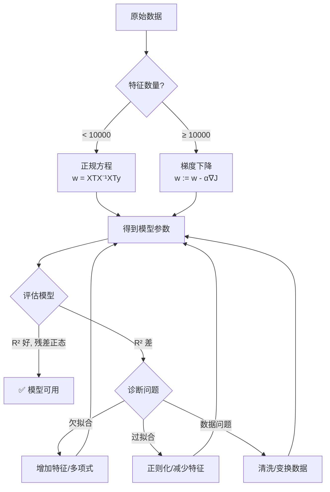

# Day 107 — 线性回归 · 图解

## 1. 线性回归核心流程

```
┌──────────────┐     ┌──────────────┐     ┌──────────────┐
│   原始数据    │────▶│  特征工程     │────▶│  模型训练     │
│  (X, y)      │     │  标准化/缩放  │     │  最小化损失   │
└──────────────┘     └──────────────┘     └──────┬───────┘
                                                  │
                                                  ▼
┌──────────────┐     ┌──────────────┐     ┌──────────────┐
│  部署/应用    │◀────│  模型评估     │◀────│  得到参数     │
│  新数据预测   │     │  MSE/R²      │     │  w₀, w₁...   │
└──────────────┘     └──────────────┘     └──────────────┘
```

## 2. 正规方程 vs 梯度下降

```
正规方程（封闭解）                梯度下降（迭代优化）
─────────────────                ────────────────────
w = (XᵀX)⁻¹Xᵀy                  w := w - α·∇J(w)

优点：                             优点：
• 一步到位，不需要调参              • 适合大数据集
• 不需要学习率 α                   • 特征数很多时更快
• 精确解                           • 内存占用小

缺点：                             缺点：
• O(n³) 计算复杂度                 • 需要调学习率 α
• 特征 > 10000 时很慢              • 可能收敛到局部最优
• XᵀX 可能不可逆                   • 需要多次迭代

适用：特征数 < 10,000               适用：特征数 > 10,000
```

## 3. 损失函数可视化（MSE）

```
  J(w)
   │
 50├─                              ·
   │                             ·   ·
 40├─                           ·       ·
   │                          ·           ·
 30├─                        ·               ·
   │                       ·                   ·
 20├─                     ·                       ·
   │                    ·                           ·
 10├─                  ·                               ·
   │               · · · · · · · · · · · · · ·           ·
  0├──────────────────────────●───────────────────────────────
   │                        最优 w                          w
   │
   └─────────────────────────────────────────────────────────

  MSE 是一个凸函数（碗形），只有一个最小值
  梯度下降就是沿着碗壁往下走，直到到达底部
```

## 4. 四大评估指标对比

```
            对异常值敏感度        可解释性        数学性质
            ─────────────        ──────────      ──────────
  MSE       ★★★★★（很高）        ★★（差）        可导，有闭式解
  RMSE      ★★★★★（很高）        ★★★★（好）      同 MSE
  MAE       ★★（低）             ★★★★（好）      零点不可导
  R²        ★★★（中等）          ★★★★★（很好）   无量纲

  ┌──────────────────────────────────────────────┐
  │              预测误差 y_pred - y_true          │
  │                                              │
  │  小误差    中误差    大误差                     │
  │   │         │         │                      │
  │   ▼         ▼         ▼                      │
  │  MAE:  |1| |2|  |10|  线性增长               │
  │  MSE:  1   4     100  平方增长（大误差惩罚重）  │
  │                                              │
  │  → MSE 重视大误差 → MAE 更均衡                │
  └──────────────────────────────────────────────┘
```

## 5. 多重共线性示意

```
  正常情况                    多重共线性
  ────────                    ──────────
  
  x1 ──────┐                 x1 ──────┐
            ├─▶ y                       ├─▶ y
  x2 ──────┘                 x2 ≈ x1 ──┘
  
  系数: w1=2.0, w2=3.0        系数: w1=1.2, w2=3.8
  含义清晰                     系数被「分摊」，含义模糊
                               但预测能力不受影响！
```

## 6. 欠拟合 vs 过拟合

```
  欠拟合（阶数=1）              合适（阶数=3）              过拟合（阶数=10）
  ─────────────               ──────────────              ────────────────
  
       ·  ·                       ·  ·                        ·  ·
     ·  ·  ·                    · ·  · ·                     · ··· ·
   ·   ·  ·   ·               ·· · ··· ··                  ···········
  · · ·  · · · ·            ·· ·· · ··· ··               ··············
  
  一条直线                     平滑曲线                     锯齿状曲线
  忽略数据模式                 捕捉主要趋势                  拟合了噪声
  
  训练 R²: 0.6                训练 R²: 0.95                训练 R²: 0.99
  测试 R²: 0.55               测试 R²: 0.93                测试 R²: 0.70
  → 欠拟合 ✗                  → 好模型 ✓                   → 过拟合 ✗
```

## Mermaid 图解



```mermaid
graph LR
    subgraph 损失函数
        L[MSE = 1/m Σ(y-ŷ)²]
    end
    subgraph 求解方法
        NE[正规方程<br/>闭式解]
        GD[梯度下降<br/>迭代优化]
    end
    subgraph 评估指标
        MSE2[MSE/RMSE<br/>误差大小]
        MAE2[MAE<br/>鲁棒误差]
        R2[R²<br/>拟合优度]
    end
    L --> NE
    L --> GD
    L --> MSE2
    L --> MAE2
    L --> R2
```
