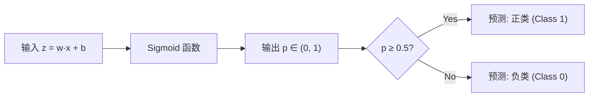

# Day 108 — 逻辑回归与分类

## 📚 今日学习目标

- 理解逻辑回归的数学原理和设计思想
- 掌握 `sklearn.linear_model.LogisticRegression` 的使用
- 学会混淆矩阵、ROC 曲线、AUC 等分类评估指标
- 实战完成一个完整的二分类任务

---

## 1. 逻辑回归原理

### 1.1 为什么需要逻辑回归？

线性回归用于预测连续值（如房价），但很多场景我们需要预测**类别**（如：邮件是否是垃圾邮件？肿瘤是良性还是恶性？）。逻辑回归就是为了解决**分类问题**而设计的。

### 1.2 核心思想：Sigmoid 函数

逻辑回归的核心是在线性回归的基础上套一层 **Sigmoid 函数**，把输出映射到 (0, 1) 区间，表示概率。

```
线性模型:  z = w₁x₁ + w₂x₂ + ... + wₙxₙ + b
Sigmoid:   σ(z) = 1 / (1 + e^(-z))
预测概率:  p = σ(z)  ∈ (0, 1)
```

**为什么用 Sigmoid？**

| 特性 | 说明 |
|------|------|
| 输出范围 | (0, 1)，天然适合表示概率 |
| 单调递增 | z 越大，p 越接近 1；z 越小，p 越接近 0 |
| 导数优美 | σ'(z) = σ(z) × (1 - σ(z))，方便梯度计算 |
| 中心对称 | σ(0) = 0.5，决策边界清晰 |

### 1.3 决策边界

- 当 p ≥ 0.5（即 z ≥ 0）→ 预测为正类（Class 1）
- 当 p < 0.5（即 z < 0）→ 预测为负类（Class 0）

决策边界是 w·x + b = 0 这个超平面。

### 1.4 损失函数：交叉熵

逻辑回归不用 MSE（均方误差），因为 Sigmoid + MSE 会导致损失函数非凸，容易陷入局部最优。取而代之的是**二元交叉熵损失**：

```
L = -[y·log(p) + (1-y)·log(1-p)]
```

- 当 y=1 且 p→1 时，L→0（预测正确，损失小）
- 当 y=1 且 p→0 时，L→∞（预测错误，损失大）

### 1.5 多分类扩展

逻辑回归本身是二分类模型，但可以通过以下方式扩展到多分类：

| 策略 | 说明 | sklearn 参数 |
|------|------|-------------|
| **OvR (One-vs-Rest)** | 训练 K 个二分类器，每个区分"当前类 vs 其余" | `multi_class='ovr'` |
| **Softmax (Multinomial)** | 直接输出 K 个概率，概率和为 1 | `multi_class='multinomial'` |

Softmax 公式：
```
P(y=k) = e^(zₖ) / Σⱼ e^(zⱼ)
```

---

## 2. Scikit-Learn LogisticRegression 详解

### 2.1 核心 API 速查

```python
from sklearn.linear_model import LogisticRegression

# 创建模型
model = LogisticRegression(
    penalty='l2',           # 正则化类型: 'l1', 'l2', 'elasticnet', None
    C=1.0,                  # 正则化强度的倒数（越小正则化越强）
    solver='lbfgs',         # 优化算法
    max_iter=1000,          # 最大迭代次数
    multi_class='auto',     # 多分类策略
    class_weight=None,      # 类别权重（处理不平衡数据）
    random_state=42
)

# 训练
model.fit(X_train, y_train)

# 预测
y_pred = model.predict(X_test)          # 类别预测
y_prob = model.predict_proba(X_test)    # 概率预测

# 评估
accuracy = model.score(X_test, y_test)
```

### 2.2 关键参数详解

| 参数 | 默认值 | 说明 |
|------|--------|------|
| `penalty` | 'l2' | 正则化类型，防止过拟合 |
| `C` | 1.0 | 正则化强度倒数。C 越小 → 正则化越强 → 模型越简单 |
| `solver` | 'lbfgs' | 优化算法。小数据集用 lbfgs，大数据用 saga |
| `max_iter` | 100 | 最大迭代次数，收敛不了就加大 |
| `class_weight` | None | 'balanced' 可自动处理类别不平衡 |

### 2.3 solver 选择指南

| solver | 适用场景 | 支持的 penalty |
|--------|----------|---------------|
| `lbfgs` | 小数据集（<10k），默认推荐 | l2, None |
| `liblinear` | 小数据集，需要 L1 正则 | l1, l2 |
| `saga` | 大数据集，支持弹性网络 | l1, l2, elasticnet, None |
| `newton-cg` | 中等数据集 | l2, None |

---

## 3. 分类评估指标

### 3.1 混淆矩阵（Confusion Matrix）

混淆矩阵是分类评估的基石，展示模型预测结果的四个维度：

```
                  预测为正    预测为负
实际为正    TP（真正例）    FN（假反例）
实际为负    FP（假正例）    TN（真反例）
```

| 指标 | 公式 | 含义 |
|------|------|------|
| **Accuracy（准确率）** | (TP+TN) / (TP+TN+FP+FN) | 整体预测正确的比例 |
| **Precision（精确率）** | TP / (TP+FP) | 预测为正的样本中，实际为正的比例 |
| **Recall（召回率）** | TP / (TP+FN) | 实际为正的样本中，被正确预测的比例 |
| **F1-Score** | 2·P·R / (P+R) | 精确率和召回率的调和平均 |

**实际选择建议：**
- 欺诈检测 → 高召回率（宁可误报，不能漏报）
- 垃圾邮件 → 高精确率（不能把正常邮件误判为垃圾）
- 一般场景 → F1-Score 平衡精确率和召回率

### 3.2 ROC 曲线与 AUC

**ROC 曲线**展示不同阈值下 TPR（真正例率）和 FPR（假正例率）的关系：

- **TPR（真正例率）**= Recall = TP / (TP + FN)
- **FPR（假正例率）**= FP / (FP + TN)

**AUC（曲线下面积）**：

| AUC 范围 | 模型质量 |
|----------|----------|
| 0.9 - 1.0 | 优秀 |
| 0.8 - 0.9 | 良好 |
| 0.7 - 0.8 | 一般 |
| 0.5 - 0.7 | 较差 |
| 0.5 | 随机猜测（无价值） |

**为什么用 AUC 而不是 Accuracy？**
- Accuracy 受类别不平衡影响严重（99% 正样本时，全预测正类就有 99% 准确率）
- AUC 不受阈值选择影响，综合评估模型区分能力

### 3.3 分类报告

```python
from sklearn.metrics import classification_report

print(classification_report(y_test, y_pred, target_names=['负类', '正类']))
```

输出包含每个类别的 precision、recall、f1-score 和 support（样本数）。

---

## 4. 图解

### 4.1 Sigmoid 函数



### 4.2 逻辑回归决策过程

```
        z 值分布
   ←─────────────────────→
   -∞          0          +∞
   ├───────────┼───────────┤
   p→0        p=0.5       p→1
   负类 ←──────────────────→ 正类
   
   决策边界: z = 0 (即 w·x + b = 0)
```

### 4.3 混淆矩阵可视化

```
                    ┌─────────────┬─────────────┐
                    │   预测正类   │   预测负类   │
    ┌───────────────┼─────────────┼─────────────┤
    │   实际正类     │     TP      │     FN      │
    ├───────────────┼─────────────┼─────────────┤
    │   实际负类     │     FP      │     TN      │
    └───────────────┴─────────────┴─────────────┘
    
    Precision = TP / (TP + FP)    ← "预测为正的有多少是对的"
    Recall    = TP / (TP + FN)    ← "实际为正的被找出多少"
    F1        = 2 × P × R / (P+R) ← "两者的平衡"
```

### 4.4 ROC 曲线示意

```
    TPR (召回率)
    1.0 ┤          ╭──────────── 完美模型
        │        ╱
    0.8 ┤      ╱
        │    ╱      ← 好模型（AUC≈0.9）
    0.6 ┤  ╱
        │╱
    0.4 ╱  ← 随机模型（AUC=0.5）
        │
    0.2 ┤
        │
    0.0 ┼────────────────────────
        0.0   0.2   0.4   0.6   0.8   1.0
                    FPR (假正例率)
```

---

## 5. 实战代码案例

### 5.1 完整二分类任务：乳腺癌诊断

```python
"""
Day 108 实战：使用逻辑回归进行乳腺癌诊断分类
数据集：sklearn 内置乳腺癌数据集
"""
import numpy as np
import matplotlib.pyplot as plt
from sklearn.datasets import load_breast_cancer
from sklearn.model_selection import train_test_split
from sklearn.linear_model import LogisticRegression
from sklearn.preprocessing import StandardScaler
from sklearn.metrics import (
    confusion_matrix, classification_report,
    roc_curve, auc, accuracy_score
)

# ==================== 1. 加载数据 ====================
data = load_breast_cancer()
X, y = data.data, data.target
print(f"特征数: {X.shape[1]}, 样本数: {X.shape[0]}")
print(f"类别分布: 恶性={sum(y==0)}, 良性={sum(y==1)}")

# ==================== 2. 数据划分 ====================
X_train, X_test, y_train, y_test = train_test_split(
    X, y, test_size=0.2, random_state=42, stratify=y
)

# ==================== 3. 特征标准化 ====================
# 逻辑回归对特征尺度敏感，必须标准化
scaler = StandardScaler()
X_train_scaled = scaler.fit_transform(X_train)
X_test_scaled = scaler.transform(X_test)

# ==================== 4. 训练模型 ====================
model = LogisticRegression(
    penalty='l2',
    C=1.0,
    solver='lbfgs',
    max_iter=1000,
    random_state=42
)
model.fit(X_train_scaled, y_train)

# ==================== 5. 预测与评估 ====================
y_pred = model.predict(X_test_scaled)
y_prob = model.predict_proba(X_test_scaled)[:, 1]  # 正类概率

print(f"\n准确率: {accuracy_score(y_test, y_pred):.4f}")
print(f"\n分类报告:\n{classification_report(y_test, y_pred, target_names=['恶性', '良性'])}")

# ==================== 6. 混淆矩阵 ====================
cm = confusion_matrix(y_test, y_pred)
print(f"混淆矩阵:\n{cm}")

# ==================== 7. ROC 曲线 ====================
fpr, tpr, thresholds = roc_curve(y_test, y_prob)
roc_auc = auc(fpr, tpr)
print(f"\nAUC: {roc_auc:.4f}")

# ==================== 8. 可视化 ====================
fig, axes = plt.subplots(1, 2, figsize=(14, 5))

# 混淆矩阵热力图
im = axes[0].imshow(cm, interpolation='nearest', cmap=plt.cm.Blues)
axes[0].set_title('混淆矩阵')
axes[0].set_xlabel('预测标签')
axes[0].set_ylabel('真实标签')
tick_marks = np.arange(2)
axes[0].set_xticks(tick_marks)
axes[0].set_xticklabels(['恶性', '良性'])
axes[0].set_yticks(tick_marks)
axes[0].set_yticklabels(['恶性', '良性'])
for i in range(2):
    for j in range(2):
        axes[0].text(j, i, format(cm[i, j], 'd'),
                     ha="center", va="center",
                     color="white" if cm[i, j] > cm.max()/2 else "black")
plt.colorbar(im, ax=axes[0])

# ROC 曲线
axes[1].plot(fpr, tpr, color='darkorange', lw=2, label=f'ROC curve (AUC = {roc_auc:.4f})')
axes[1].plot([0, 1], [0, 1], color='navy', lw=2, linestyle='--', label='随机模型')
axes[1].set_xlim([0.0, 1.0])
axes[1].set_ylim([0.0, 1.05])
axes[1].set_xlabel('假正例率 (FPR)')
axes[1].set_ylabel('真正例率 (TPR)')
axes[1].set_title('ROC 曲线')
axes[1].legend(loc="lower right")

plt.tight_layout()
plt.savefig('day-108-evaluation.png', dpi=150, bbox_inches='tight')
print("\n✅ 评估图表已保存")

# ==================== 9. 查看特征重要性 ====================
feature_importance = np.abs(model.coef_[0])
top_indices = np.argsort(feature_importance)[::-1][:10]
print("\nTop 10 重要特征:")
for i, idx in enumerate(top_indices):
    print(f"  {i+1}. {data.feature_names[idx]}: {feature_importance[idx]:.4f}")
```

### 5.2 正则化与超参数调优

```python
"""
Day 108 进阶：正则化强度对模型的影响 + 交叉验证
"""
import numpy as np
import matplotlib.pyplot as plt
from sklearn.datasets import load_breast_cancer
from sklearn.model_selection import train_test_split, cross_val_score
from sklearn.linear_model import LogisticRegression
from sklearn.preprocessing import StandardScaler

# 加载并预处理数据
data = load_breast_cancer()
X, y = data.data, data.target
X_train, X_test, y_train, y_test = train_test_split(
    X, y, test_size=0.2, random_state=42, stratify=y
)
scaler = StandardScaler()
X_train_scaled = scaler.fit_transform(X_train)
X_test_scaled = scaler.transform(X_test)

# ==================== 1. 不同 C 值的对比 ====================
C_values = [0.001, 0.01, 0.1, 0.5, 1.0, 5.0, 10.0, 50.0, 100.0]
train_scores = []
test_scores = []
cv_scores = []

for C in C_values:
    model = LogisticRegression(C=C, max_iter=5000, random_state=42)
    model.fit(X_train_scaled, y_train)
    
    train_scores.append(model.score(X_train_scaled, y_train))
    test_scores.append(model.score(X_test_scaled, y_test))
    
    # 5 折交叉验证
    cv = cross_val_score(model, X_train_scaled, y_train, cv=5)
    cv_scores.append(cv.mean())

# ==================== 2. 可视化 ====================
plt.figure(figsize=(10, 6))
plt.plot(C_values, train_scores, 'o-', label='训练集准确率', color='blue')
plt.plot(C_values, test_scores, 's-', label='测试集准确率', color='red')
plt.plot(C_values, cv_scores, '^-', label='5折交叉验证', color='green')
plt.xscale('log')
plt.xlabel('C (正则化强度倒数)')
plt.ylabel('准确率')
plt.title('正则化强度 vs 模型性能')
plt.legend()
plt.grid(True, alpha=0.3)
plt.savefig('day-108-regularization.png', dpi=150, bbox_inches='tight')
print("✅ 正则化对比图已保存")

# ==================== 3. 分析结果 ====================
print("\n📊 各 C 值性能对比:")
print(f"{'C值':>10} {'训练集':>10} {'测试集':>10} {'CV均值':>10}")
print("-" * 45)
for C, tr, te, cv in zip(C_values, train_scores, test_scores, cv_scores):
    print(f"{C:>10.3f} {tr:>10.4f} {te:>10.4f} {cv:>10.4f}")

# ==================== 4. 最佳模型分析 ====================
best_idx = np.argmax(cv_scores)
best_C = C_values[best_idx]
print(f"\n🏆 最佳 C 值: {best_C} (CV 准确率: {cv_scores[best_idx]:.4f})")

# 过拟合判断
if train_scores[best_idx] - test_scores[best_idx] > 0.05:
    print("⚠️  警告：训练集与测试集差距较大，可能存在过拟合")
else:
    print("✅ 模型泛化能力良好")
```

### 5.3 多分类实战：鸢尾花分类

```python
"""
Day 108 实战：逻辑回归多分类 — 鸢尾花数据集
对比 OvR 和 Softmax 两种策略
"""
import numpy as np
import matplotlib.pyplot as plt
from sklearn.datasets import load_iris
from sklearn.model_selection import train_test_split, cross_val_score
from sklearn.linear_model import LogisticRegression
from sklearn.preprocessing import StandardScaler
from sklearn.metrics import confusion_matrix, classification_report
from matplotlib.colors import ListedColormap

# ==================== 1. 加载数据 ====================
iris = load_iris()
X, y = iris.data, iris.target
feature_names = iris.feature_names
target_names = iris.target_names

print(f"数据集: {X.shape[0]} 样本, {X.shape[1]} 特征")
print(f"类别: {list(target_names)}")

# 只用前两个特征方便可视化
X_2d = X[:, :2]
X_train, X_test, y_train, y_test = train_test_split(
    X_2d, y, test_size=0.2, random_state=42, stratify=y
)

scaler = StandardScaler()
X_train_scaled = scaler.fit_transform(X_train)
X_test_scaled = scaler.transform(X_test)

# ==================== 2. OvR 策略 ====================
print("\n" + "="*50)
print("📌 策略 1: One-vs-Rest (OvR)")
print("="*50)

ovr_model = LogisticRegression(
    multi_class='ovr',
    solver='lbfgs',
    max_iter=1000,
    random_state=42
)
ovr_model.fit(X_train_scaled, y_train)
y_pred_ovr = ovr_model.predict(X_test_scaled)

print(f"准确率: {ovr_model.score(X_test_scaled, y_test):.4f}")
print(f"\n分类报告:\n{classification_report(y_test, y_pred_ovr, target_names=target_names)}")

# ==================== 3. Softmax 策略 ====================
print("\n" + "="*50)
print("📌 策略 2: Softmax (Multinomial)")
print("="*50)

softmax_model = LogisticRegression(
    multi_class='multinomial',
    solver='lbfgs',
    max_iter=1000,
    random_state=42
)
softmax_model.fit(X_train_scaled, y_train)
y_pred_softmax = softmax_model.predict(X_test_scaled)

print(f"准确率: {softmax_model.score(X_test_scaled, y_test):.4f}")
print(f"\n分类报告:\n{classification_report(y_test, y_pred_softmax, target_names=target_names)}")

# ==================== 4. 决策边界可视化 ====================
fig, axes = plt.subplots(1, 2, figsize=(14, 6))
cmap_light = ListedColormap(['#FFAAAA', '#AAFFAA', '#AAAAFF'])
cmap_bold = ListedColormap(['#FF0000', '#00FF00', '#0000FF'])

for ax, model, title in zip(axes, [ovr_model, softmax_model], ['OvR', 'Softmax']):
    # 创建网格
    h = 0.02
    x_min, x_max = X_train_scaled[:, 0].min() - 1, X_train_scaled[:, 0].max() + 1
    y_min, y_max = X_train_scaled[:, 1].min() - 1, X_train_scaled[:, 1].max() + 1
    xx, yy = np.meshgrid(np.arange(x_min, x_max, h), np.arange(y_min, y_max, h))
    
    # 预测网格点
    Z = model.predict(np.c_[xx.ravel(), yy.ravel()])
    Z = Z.reshape(xx.shape)
    
    ax.contourf(xx, yy, Z, alpha=0.3, cmap=cmap_light)
    scatter = ax.scatter(X_train_scaled[:, 0], X_train_scaled[:, 1],
                        c=y_train, cmap=cmap_bold, edgecolors='k', s=50)
    ax.set_xlabel(feature_names[0])
    ax.set_ylabel(feature_names[1])
    ax.set_title(f'{title} 决策边界')
    
# 添加图例
legend_elements = [plt.Line2D([0], [0], marker='o', color='w', 
                  markerfacecolor=c, markersize=10, label=n)
                  for c, n in zip(['red', 'green', 'blue'], target_names)]
fig.legend(handles=legend_elements, loc='upper center', ncol=3)

plt.tight_layout()
plt.savefig('day-108-multiclass.png', dpi=150, bbox_inches='tight')
print("\n✅ 多分类对比图已保存")

# ==================== 5. 概率输出分析 ====================
print("\n📊 概率输出示例 (Softmax):")
proba = softmax_model.predict_proba(X_test_scaled[:5])
for i in range(5):
    print(f"  样本{i+1}: {dict(zip(target_names, proba[i].round(4)))} → 预测: {target_names[y_pred_softmax[i]]}")
```

---

## 6. 常见陷阱与避坑

### 陷阱 1：忘记特征标准化

```python
# ❌ 错误：直接训练
model.fit(X_train, y_train)  # 特征尺度差异大时，收敛慢甚至不收敛

# ✅ 正确：先标准化
scaler = StandardScaler()
X_train_scaled = scaler.fit_transform(X_train)
model.fit(X_train_scaled, y_train)
```

**原因**：逻辑回归用梯度下降优化，特征尺度差异会导致：
- 收敛速度极慢
- 可能无法收敛
- 正则化惩罚不公平（大尺度特征被过度惩罚）

### 陷阱 2：类别不平衡时用 Accuracy

```python
# ❌ 错误：99% 正样本，全预测正类就有 99% 准确率
accuracy = model.score(X_test, y_test)  # 看起来很高，实际没用

# ✅ 正确：用 F1-Score 或 AUC
from sklearn.metrics import f1_score, roc_auc_score
f1 = f1_score(y_test, y_pred)
auc = roc_auc_score(y_test, y_prob)

# 或者用 class_weight 处理不平衡
model = LogisticRegression(class_weight='balanced')
```

### 陷阱 3：在训练集上评估

```python
# ❌ 错误：在训练集上评估，结果虚高
train_accuracy = model.score(X_train, y_train)  # 通常很高，但没意义

# ✅ 正确：用测试集或交叉验证
test_accuracy = model.score(X_test, y_test)
cv_scores = cross_val_score(model, X_train, y_train, cv=5)
```

### 陷阱 4：max_iter 不够导致不收敛

```python
# ❌ 警告：ConvergenceWarning
model = LogisticRegression(max_iter=100)  # 默认值，可能不够

# ✅ 解决：加大迭代次数
model = LogisticRegression(max_iter=1000)
# 或者更好的做法：先标准化数据
```

---

## 7. API 速查表

### LogisticRegression 核心方法

| 方法 | 说明 | 返回值 |
|------|------|--------|
| `fit(X, y)` | 训练模型 | self |
| `predict(X)` | 预测类别 | ndarray |
| `predict_proba(X)` | 预测概率 | ndarray (n_samples, n_classes) |
| `score(X, y)` | 计算准确率 | float |
| `decision_function(X)` | 返回决策函数值 | ndarray |

### 常用属性

| 属性 | 说明 |
|------|------|
| `coef_` | 权重系数 (shape: [n_classes, n_features]) |
| `intercept_` | 偏置项 |
| `classes_` | 类别标签 |
| `n_iter_` | 实际迭代次数 |

### sklearn.metrics 分类指标

| 函数 | 说明 |
|------|------|
| `accuracy_score(y_true, y_pred)` | 准确率 |
| `precision_score(y_true, y_pred)` | 精确率 |
| `recall_score(y_true, y_pred)` | 召回率 |
| `f1_score(y_true, y_pred)` | F1 分数 |
| `confusion_matrix(y_true, y_pred)` | 混淆矩阵 |
| `classification_report(y_true, y_pred)` | 分类报告 |
| `roc_curve(y_true, y_score)` | ROC 曲线数据 |
| `roc_auc_score(y_true, y_score)` | AUC 值 |

---

## 8. 思考题

1. **为什么逻辑回归用交叉熵而不是 MSE 作为损失函数？** 从梯度消失和凸优化的角度思考。

2. **逻辑回归和线性回归的本质区别是什么？** 如果把逻辑回归的 Sigmoid 换成恒等函数，会发生什么？

3. **在什么情况下逻辑回归的表现会比 SVM 更好？** 提示：从数据量、特征维度、可解释性等方面考虑。

4. **如何处理逻辑回归中的多重共线性问题？** 提示：考虑正则化和特征选择。

5. **Softmax 回归和 OvR 策略在什么情况下表现差异最大？** 如果类别之间存在层级关系，应该用哪种？

---

## 📝 今日学习小结

| 知识点 | 掌握程度 |
|--------|----------|
| 逻辑回归原理（Sigmoid + 交叉熵） | ⬜ |
| LogisticRegression 参数与使用 | ⬜ |
| 混淆矩阵与分类指标 | ⬜ |
| ROC 曲线与 AUC | ⬜ |
| 多分类策略（OvR vs Softmax） | ⬜ |
| 特征标准化的重要性 | ⬜ |
| 正则化强度调优 | ⬜ |
