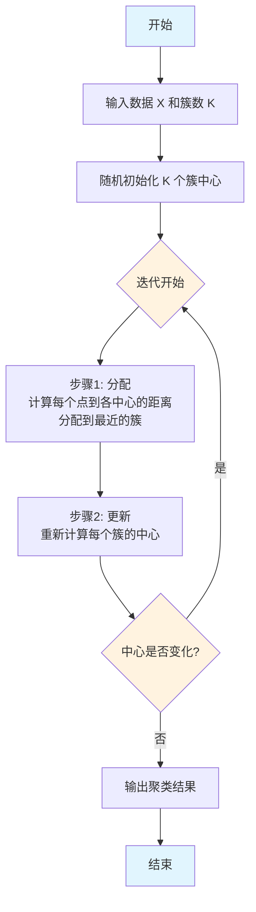
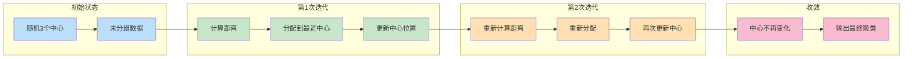
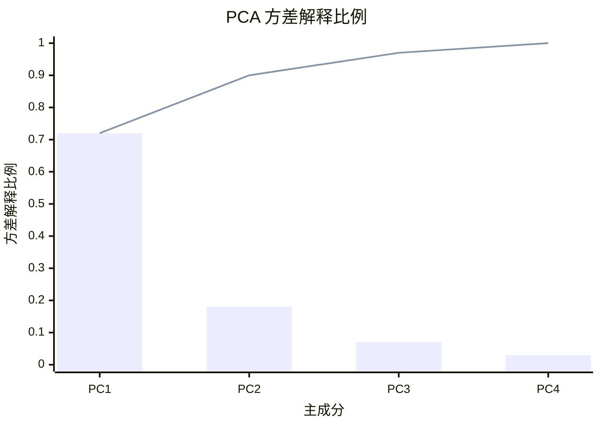
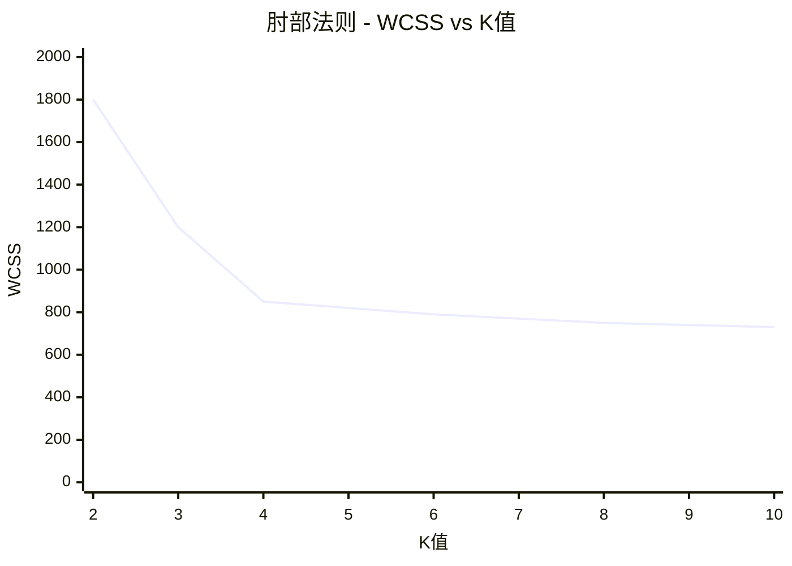
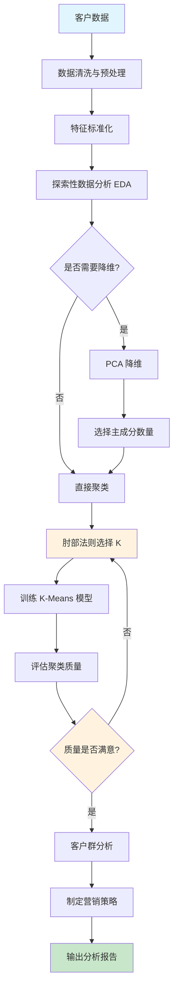
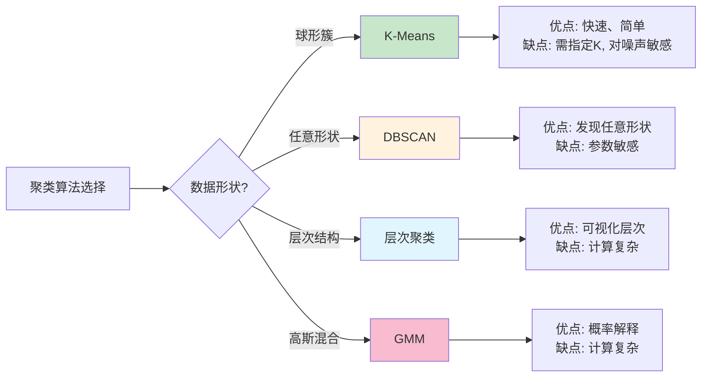
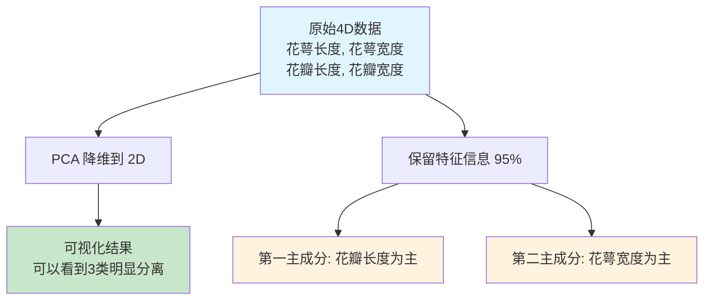
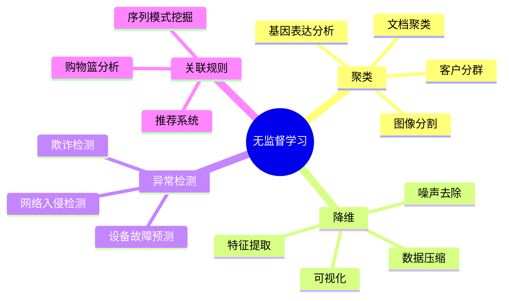
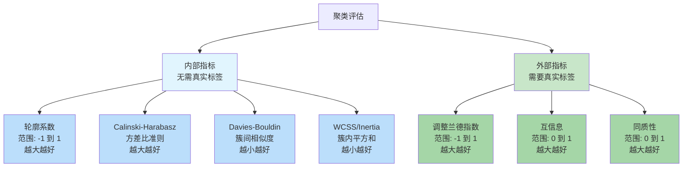

# Day 111 图解 — K-Means 聚类与 PCA 降维

## 1. K-Means 算法流程图



## 2. K-Means 迭代过程图解



## 3. PCA 降维原理图

```mermaid
flowchart TD
    A[原始高维数据 X<br/>n × d] --> B[步骤1: 中心化<br/>减去均值]
    B --> C[步骤2: 计算协方差矩阵<br/>C = X^T X / (n-1)]
    C --> D[步骤3: 特征值分解<br/>C v_i = λ_i v_i]
    D --> E[步骤4: 选择主成分<br/>按特征值从大到小排列]
    E --> F[步骤5: 投影<br/>Z = X W_d]
    F --> G[输出低维数据 Z<br/>n × d', 其中 d' < d]
    
    style A fill:#e1f5fe
    style G fill:#c8e6c9
    style D fill:#fff3e0
```

## 4. PCA 方差解释比例图



## 5. 肘部法则示意图



## 6. 客户分群完整流程图



## 7. K-Means vs 其他聚类算法对比



## 8. PCA 降维可视化效果



## 9. 无监督学习应用场景



## 10. 评估指标对比


