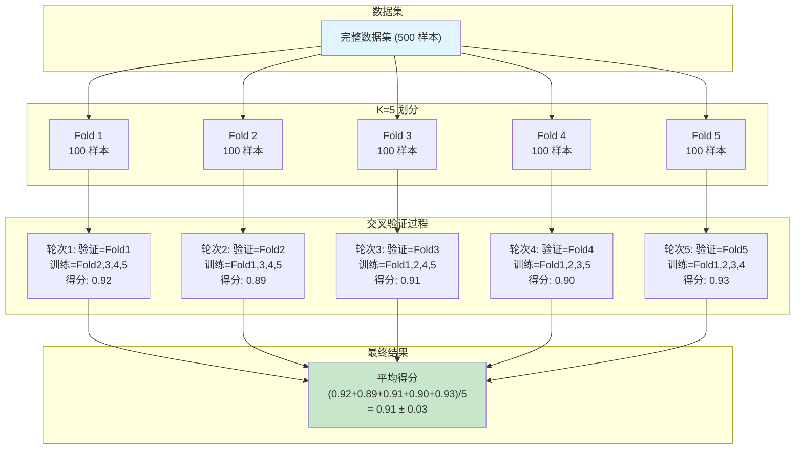
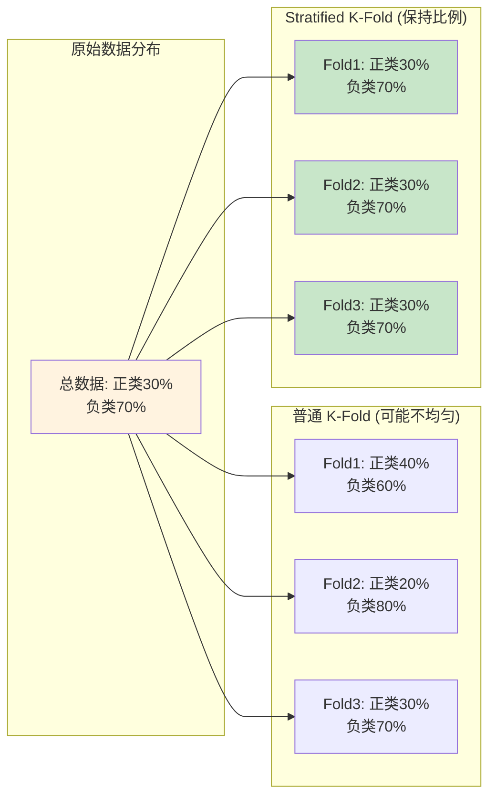
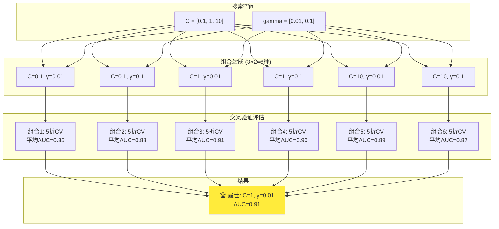
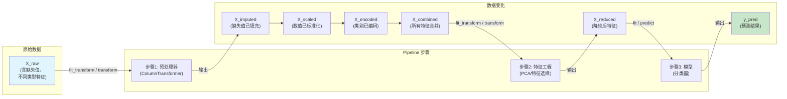
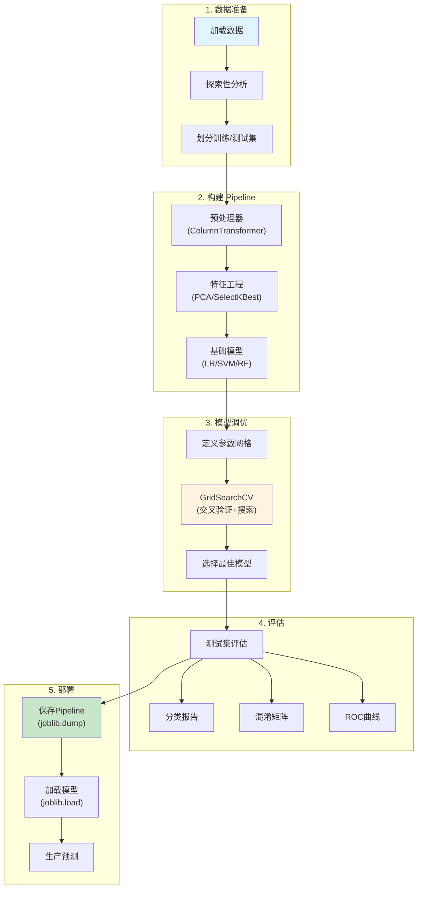
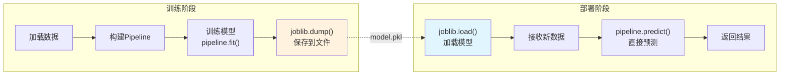

# Day 112 — 图解：模型调优与 Pipeline

> 使用 Mermaid 图解核心概念，帮助理解数据流动和算法流程

---

## 1. K-Fold 交叉验证数据划分

---

## 2. Stratified K-Fold vs 普通 K-Fold

---

## 3. GridSearchCV 搜索过程

---

## 4. Pipeline 数据流

---

## 5. 完整 ML Pipeline 工作流

---

## 6. 数据泄露 vs 正确做法

```mermaid
flowchart TB
    subgraph "❌ 数据泄露 (错误)"
        W1["全部数据"]
        W2["scaler.fit_transform(全部)"]
        W3["划分训练/测试"]
        W4["模型训练"]
        W5["⚠️ 测试集信息已泄露到训练集!"]
    end

    subgraph "✅ 正确做法"
        R1["全部数据"]
        R2["划分训练/测试集"]
        R3["scaler.fit_transform(训练集)"]
        R4["scaler.transform(测试集)"]
        R5["模型训练 & 评估"]
    end

    subgraph "✅ Pipeline 做法 (最佳)"
        P1["Pipeline.fit(训练集)"]
        P2["Pipeline.predict(测试集)"]
        P3["✅ 自动防止数据泄露"]
    end

    W1 --> W2 --> W3 --> W4 --> W5
    R1 --> R2 --> R3 --> R4 --> R5
    P1 --> P2 --> P3

    style W5 fill:#ffcdd2
    style R5 fill:#c8e6c9
    style P3 fill:#c8e6c9
```

---

## 7. 模型保存与加载流程

---

## 📝 图解说明

以上 Mermaid 图解覆盖了 Day 112 的核心概念：

1. **K-Fold 交叉验证** — 数据如何被划分和重复使用
2. **Stratified vs 普通 K-Fold** — 类别比例保持的重要性
3. **GridSearchCV** — 超参数搜索的穷举过程
4. **Pipeline 数据流** — 数据在各步骤中的变化
5. **完整 ML 工作流** — 从数据到部署的全流程
6. **数据泄露** — 正确 vs 错误的做法对比
7. **模型持久化** — 训练与部署的衔接

> 💡 可以将这些代码复制到 [Mermaid Live Editor](https://mermaid.live/) 中查看可视化效果。
