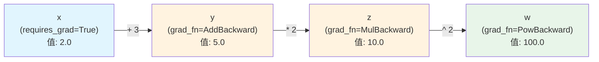
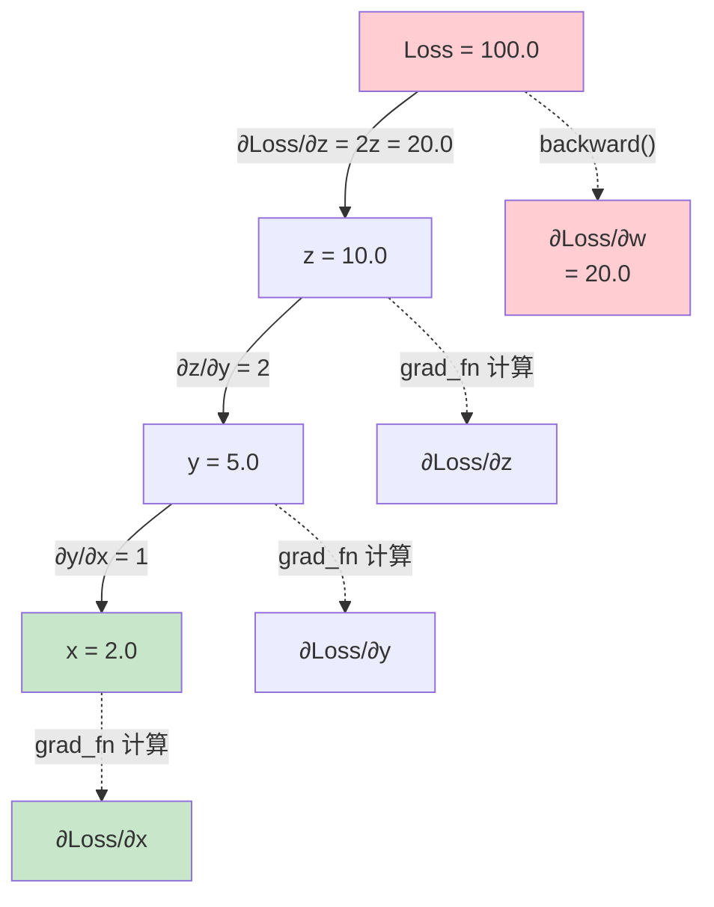
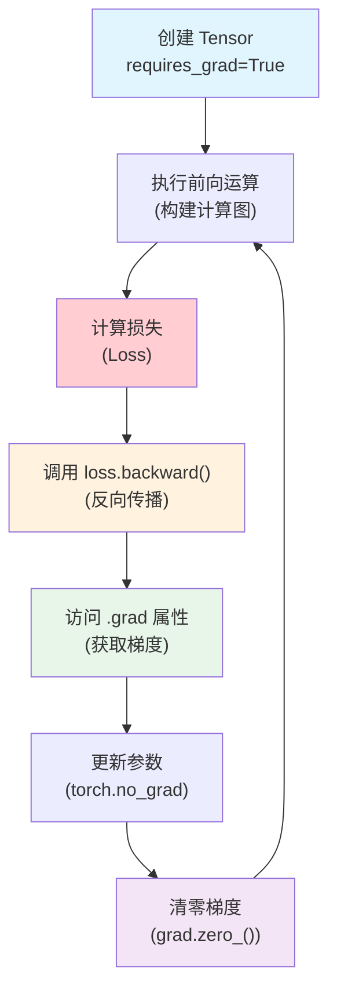
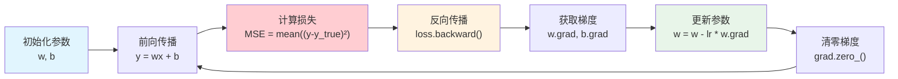
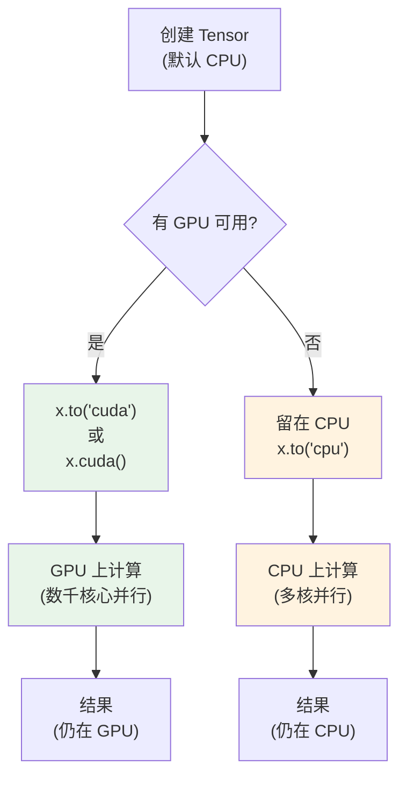
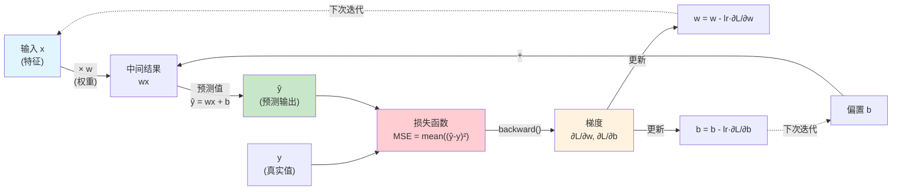
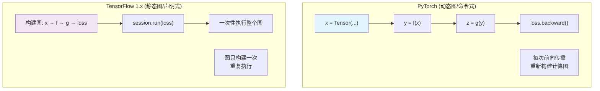

# Day 113 图解 - PyTorch 基础

## 1. PyTorch 计算图

计算图是 PyTorch 实现自动微分的核心数据结构。当操作涉及 `requires_grad=True` 的 Tensor 时，PyTorch 自动构建此图。



**说明**：
- 绿色节点 = 叶子节点（输入 Tensor）
- 橙色节点 = 中间节点（由操作生成）
- 箭头 = 数据流向和梯度传播方向

---

## 2. 反向传播过程

反向传播从损失函数开始，沿计算图反向传播梯度。



**反向传播公式**：
$$
\frac{\partial L}{\partial x} = \frac{\partial L}{\partial z} \cdot \frac{\partial z}{\partial y} \cdot \frac{\partial y}{\partial x}
$$

---

## 3. Autograd 自动求导流程



---

## 4. 梯度下降流程



---

## 5. Tensor 设备迁移



---

## 6. 线性回归模型结构



---

## 7. 梯度累积与清零

```mermaid
sequenceDiagram
    participant Opt as 优化器
    participant Grad as 梯度 (w.grad)
    participant Model as 模型参数 (w)
    
    Note over Opt: 第1次迭代
    Opt->>Grad: loss.backward() → grad += Δ₁
    Note over Grad: w.grad = Δ₁
    Opt->>Model: w -= lr * w.grad
    
    Note over Opt: 第2次迭代 (不清零!)
    Opt->>Grad: loss.backward() → grad += Δ₂
    Note over Grad: w.grad = Δ₁ + Δ₂ ⚠️ 累积!
    Opt->>Model: w -= lr * (Δ₁ + Δ₂) ❌ 错误!
    
    Note over Opt: 第3次迭代 (正确: 先清零)
    Opt->>Grad: grad.zero_()
    Note over Grad: w.grad = 0 ✓
    Opt->>Grad: loss.backward() → grad = Δ₃
    Note over Grad: w.grad = Δ₃ ✓
    Opt->>Model: w -= lr * Δ₃ ✓ 正确!
```

---

## 8. 计算图 vs 命令式编程对比



**PyTorch 优势**：动态图更灵活，便于调试，支持动态控制流（if/for）。
