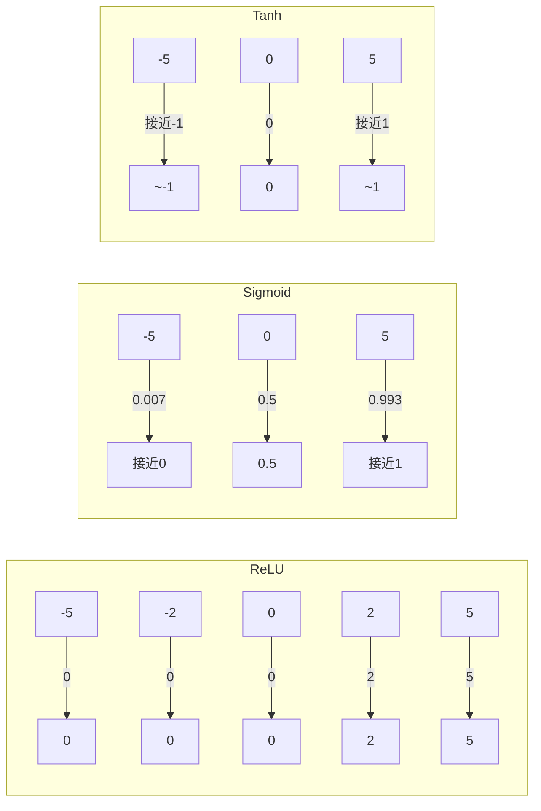

# Day 114 — 神经网络入门 · 图解

## 神经网络前向传播流程

```
输入层          隐藏层            输出层
(64维)         (256维)           (10维)

 [x1] ─────┬──→ [h1]  ──┬──→ [y1]  ← 类别 0
 [x2] ───┬─┼─→ [h2]  ──┼─→ [y2]  ← 类别 1
  ...    │ │    ...     │    ...
 [x64] ──┼─┴─→ [h256] ─┴─→ [y10] ← 类别 9
          │
        全连接：每个输入与每个神经元相连

参数量：
  第一层: 64 × 256 + 256 = 16,640 + 256 = 16,896
  第二层: 256 × 10 + 10  = 2,560 + 10  = 2,570
  总计:   19,466 个参数
```

## 训练循环五步

```
  ┌─────────────────────────────────────────────┐
  │              1. 前向传播                      │
  │  输入 ──→ 模型 ──→ 预测值                     │
  └─────────────────┬───────────────────────────┘
                    │
  ┌─────────────────▼───────────────────────────┐
  │              2. 计算损失                      │
  │  loss = criterion(预测值, 真实值)             │
  └─────────────────┬───────────────────────────┘
                    │
  ┌─────────────────▼───────────────────────────┐
  │              3. 反向传播                      │
  │  loss.backward()  ← 自动求导                 │
  └─────────────────┬───────────────────────────┘
                    │
  ┌─────────────────▼───────────────────────────┐
  │              4. 更新参数                      │
  │  optimizer.step() ← 根据梯度更新权重          │
  └─────────────────┬───────────────────────────┘
                    │
  ┌─────────────────▼───────────────────────────┐
  │              5. 清空梯度                      │
  │  optimizer.zero_grad() ← 防止梯度累积         │
  └─────────────────────────────────────────────┘
```

## 激活函数可视化（Mermaid）



## 交叉熵损失直觉

```
预测概率分布:    [0.7, 0.2, 0.1]   ← 类别 0 概率最高
真实标签 (one-hot): [1, 0, 0]       ← 确实是类别 0

交叉熵 = -Σ(y_i × log(p_i))
       = -(1×log(0.7) + 0×log(0.2) + 0×log(0.1))
       = -log(0.7)
       = 0.357  ← 损失较小，预测较准

如果预测为:      [0.1, 0.1, 0.8]   ← 错了！
交叉熵 = -log(0.1) = 2.303  ← 损失很大，预测很差
```
