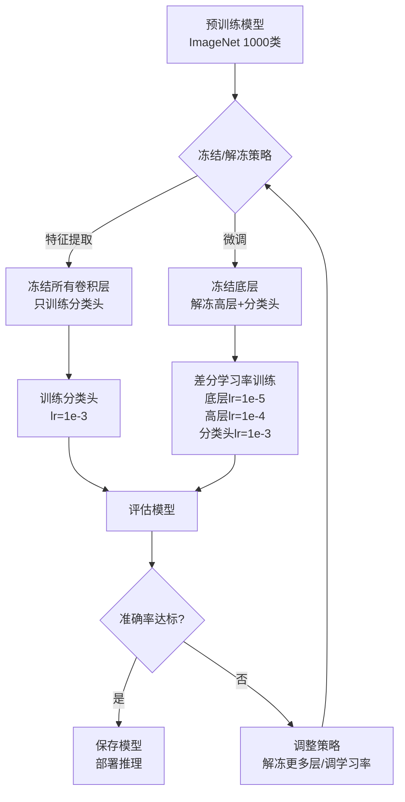

# Day 117 — 迁移学习 图解

## 1. 迁移学习整体流程



## 2. 渐进式解冻策略

```mermaid
flowchart LR
    subgraph 阶段1["阶段1: 分类头训练"]
        A1[conv1]:::frozen
        A2[layer1]:::frozen
        A3[layer2]:::frozen
        A4[layer3]:::frozen
        A5[layer4]:::frozen
        A6[fc]:::trainable
    end

    subgraph 阶段2["阶段2: 解冻 layer4"]
        B1[conv1]:::frozen
        B2[layer1]:::frozen
        B3[layer2]:::frozen
        B4[layer3]:::frozen
        B5[layer4]:::trainable
        B6[fc]:::trainable
    end

    subgraph 阶段3["阶段3: 解冻 layer3-4"]
        C1[conv1]:::frozen
        C2[layer1]:::frozen
        C3[layer2]:::frozen
        C4[layer3]:::trainable
        C5[layer4]:::trainable
        C6[fc]:::trainable
    end

    阶段1 --> 阶段2 --> 阶段3

    classDef frozen fill:#ffcccc,stroke:#cc0000
    classDef trainable fill:#ccffcc,stroke:#00cc00
```



## 3. 差分学习率示意图

```mermaid
xychart-beta
    title "差分学习率设置"
    x-axis ["conv1", "layer1", "layer2", "layer3", "layer4", "fc"]
    y-axis "学习率 (log scale)" 1e-6 --> 1e-2
    bar [1e-6, 1e-5, 1e-5, 1e-5, 1e-4, 1e-3]
```

## 4. 特征层级可视化

```
深度网络特征层级
═══════════════════════════════════════════════════════════

输入: 📷 猫的照片 (224×224×3)
    │
    ▼
┌─────────────────────────────────────────────────┐
│ Layer 1-2: 边缘/颜色/纹理                        │
│ ┌───┐ ┌───┐ ┌───┐ ┌───┐                         │
│ │ ─ │ │ ╱ │ │ ╲ │ │ │ │  → 简单视觉特征          │
│ └───┘ └───┘ └───┘ └───┘                         │
│ 特点: 通用性强，所有图像任务共享                   │
└─────────────────────────────────────────────────┘
    │
    ▼
┌─────────────────────────────────────────────────┐
│ Layer 3-4: 局部形状/纹理组合                      │
│ ┌───┐ ┌───┐ ┌───┐ ┌───┐                         │
│ │ ◯ │ │ △ │ │ □ │ │ ⬡ │  → 中级视觉特征          │
│ └───┘ └───┘ └───┘ └───┘                         │
│ 特点: 部分通用，需要少量调整                       │
└─────────────────────────────────────────────────┘
    │
    ▼
┌─────────────────────────────────────────────────┐
│ Layer 5+: 高级语义特征                            │
│ ┌───┐ ┌───┐ ┌───┐ ┌───┐                         │
│ │ 👁 │ │ 👂 │ │ 🐾 │ │ 🐱 │  → 语义级特征          │
│ └───┘ └───┘ └───┘ └───┘                         │
│ 特点: 任务相关性强，需要微调                       │
└─────────────────────────────────────────────────┘
    │
    ▼
┌─────────────────────────────────────────────────┐
│ 分类头: 最终决策                                  │
│ ┌───────────────────────────┐                    │
│ │ 猫 95% │ 狗 3% │ 其他 2% │  → 输出概率          │
│ └───────────────────────────┘                    │
│ 特点: 必须从头训练（类别数不同）                   │
└─────────────────────────────────────────────────┘

迁移学习策略:
  ✅ 冻结 Layer 1-2（通用特征，不需要调整）
  ⚠️ 冻结或微调 Layer 3-4（看数据量决定）
  ✅ 解冻 Layer 5+（任务相关，需要调整）
  ✅ 从头训练分类头（类别数不同）
```

## 5. 模型性能对比

```
模型性能对比（ImageNet 验证集）
═══════════════════════════════════════════════════════════

模型            参数量      准确率     速度      推荐场景
─────────────────────────────────────────────────────────
ResNet-18      11.7M      69.8%     ⚡⚡⚡     快速实验/移动端
ResNet-50      25.6M      76.1%     ⚡⚡       通用任务首选
ResNet-152     60.2M      78.3%     ⚡         高精度要求
VGG-16         138M       71.6%     ⚡         特征提取/风格迁移
EfficientNet-B0  5.3M     77.1%     ⚡⚡⚡     资源受限场景
EfficientNet-B4  19M      82.9%     ⚡⚡       通用高精度任务

选择建议:
  🚀 快速原型 → ResNet-18 或 EfficientNet-B0
  🎯 通用任务 → ResNet-50
  🏆 高精度   → EfficientNet-B4 或 ResNet-152
  📱 移动端   → MobileNetV3 或 EfficientNet-B0
```
