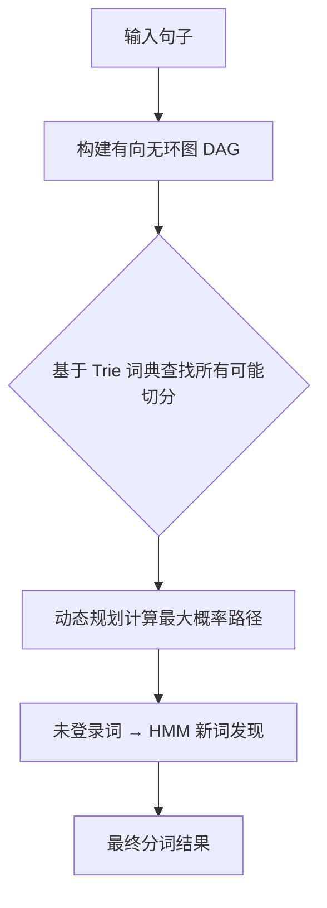
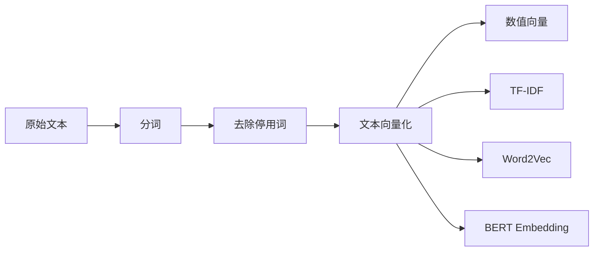
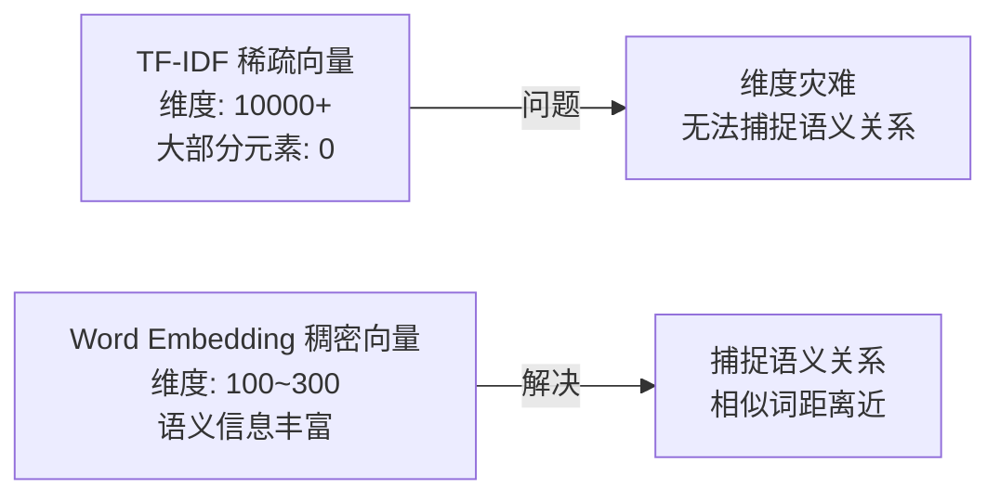
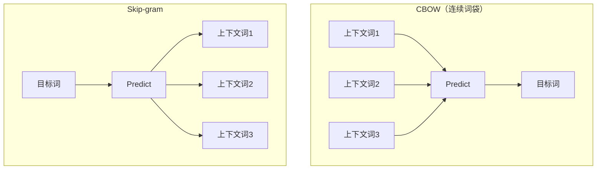
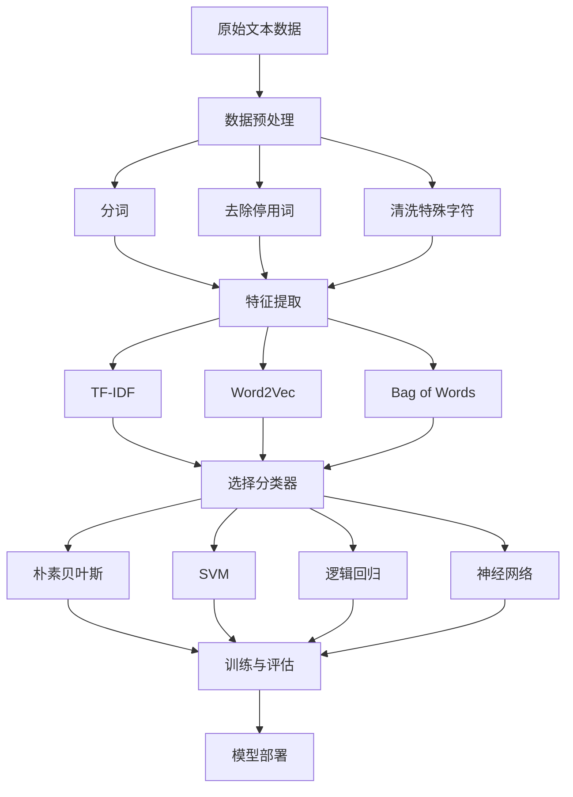

# Day 118 — NLP 基础

> 自然语言处理（Natural Language Processing）是让计算机理解、分析和生成人类语言的技术。今天我们将从分词开始，逐步掌握文本表示与分类的核心方法。

---

## 📋 目录

1. [分词（jieba）](#1-分词jieba)
2. [TF-IDF 文本表示](#2-tf-idf-文本表示)
3. [Word Embedding 概念](#3-word-embedding-概念)
4. [实战：文本分类](#4-实战文本分类)
5. [思考题](#5-思考题)

---

## 1. 分词（jieba）

### 1.1 什么是分词？

分词是将连续的文本切分成有意义的词语序列的过程。对于中文而言，分词是 NLP 的基础步骤——因为中文不像英文有天然的空格分隔。

**为什么中文需要分词？**

| 语言 | 示例 | 说明 |
|------|------|------|
| 英文 | `I love Python` | 空格天然分隔 |
| 中文 | `我爱Python` | 没有空格，需要算法切分 |

一个中文句子可能有多种切分方式：

```
南京市长江大桥
→ 南京市 / 长江大桥 ✓
→ 南京 / 市长 / 江大桥 ✗（歧义）
```

### 1.2 jieba 分词原理

jieba 是最常用的中文分词库，其核心算法基于 **HMM（隐马尔可夫模型）+ Trie 树（前缀词典）**：



**jieba 的三种分词模式：**

| 模式 | 函数 | 特点 | 适用场景 |
|------|------|------|----------|
| 精确模式 | `jieba.cut()` | 最精确，无冗余 | 文本分析 |
| 全模式 | `jieba.cut_all()` | 所有可能组合 | 搜索引擎 |
| 搜索引擎模式 | `jieba.cut_for_search()` | 兼顾召回和精确 | 搜索引擎索引 |

### 1.3 jieba 核心 API

```python
import jieba

# 精确模式（最常用）
words = jieba.cut("我在北京大学学习自然语言处理")
print("/".join(words))
# 我/在/北京/大学/学习/自然语言处理

# 全模式
words = jieba.cut("我在北京大学学习自然语言处理", cut_all=True)
print("/".join(words))
# 我/在/北京/大学/北京大/大学/学习/自然/语言/处理/自然语言

# 搜索引擎模式
words = jieba.cut_for_search("南京市长江大桥")
print("/".join(words))
# 南京市/南京/市长/长江/长江大桥/大桥

# 添加自定义词典
jieba.add_word("机器学习", freq=10000)
jieba.add_word("深度学习", freq=10000)

# 加载外部词典文件
# jieba.load_userdict("mydict.txt")
# 文件格式：词语 频率 词性
# 机器学习 10000 n
# 深度学习 10000 n

# 获取词语和词性
import jieba.posseg as pseg
words = pseg.cut("我爱自然语言处理")
for word, flag in words:
    print(f"{word}/{flag}", end=" ")
# 我/r 爱/v 自然语言处理/l
```

### 1.4 词性标注（POS Tagging）

jieba.posseg 提供词性标注功能，常用词性：

| 标签 | 含义 | 示例 |
|------|------|------|
| n | 名词 | 人名、地名、机构名 |
| v | 动词 | 学习、运行 |
| a | 形容词 | 美丽、快速 |
| r | 代词 | 我、你、他 |
| d | 副词 | 很、非常 |
| m | 数词 | 一个、三本 |
| eng | 英文 | Python、API |
| l | 习用语 | 自然语言处理 |

---

## 2. TF-IDF 文本表示

### 2.1 从文字到数字

计算机无法直接处理文字，需要将文本转换为数值向量。这就是**文本表示**的核心问题。



### 2.2 TF-IDF 原理

**TF-IDF（Term Frequency - Inverse Document Frequency）** 是经典的文本特征提取方法。

**核心思想：** 一个词对某篇文章的重要性，不仅取决于它在该文章中出现的频率（TF），还取决于它在整个语料库中的稀有程度（IDF）。

#### TF（词频）

$$TF(t, d) = \frac{\text{词 } t \text{ 在文档 } d \text{ 中出现的次数}}{\text{文档 } d \text{ 的总词数}}$$

**设计原理：** 如果一个词在文档中频繁出现，说明它对这篇文档很重要。但单纯看频率不够——"的"、"是"、"在" 这些词出现频率极高，却没什么信息量。

#### IDF（逆文档频率）

$$IDF(t) = \log\left(\frac{\text{文档总数}}{\text{包含词 } t \text{ 的文档数}}\right)$$

**设计原理：** IDF 给罕见词更高的权重。如果一个词只在少数文档中出现，说明它有很强的区分能力。例如 "量子力学" 在科技论文中比 "学习" 更有区分度。

#### TF-IDF

$$TF\text{-}IDF(t, d) = TF(t, d) \times IDF(t)$$

### 2.3 计算实例

假设语料库有 4 篇文档：

| 文档 | 内容 |
|------|------|
| D1 | 机器学习是人工智能的一个分支 |
| D2 | 深度学习是机器学习的重要方法 |
| D3 | 自然语言处理使用深度学习 |
| D4 | Python 是广泛使用的编程语言 |

计算 "深度学习" 在 D2 中的 TF-IDF：

- TF("深度学习", D2) = 1/10 = 0.1
- IDF("深度学习") = log(4/2) = 0.301
- TF-IDF = 0.1 × 0.301 = 0.0301

计算 "Python" 在 D4 中的 TF-IDF：

- TF("Python", D4) = 1/8 = 0.125
- IDF("Python") = log(4/1) = 0.602
- TF-IDF = 0.125 × 0.602 = 0.0753

"Python" 的 TF-IDF 更高，因为它只出现在 D4 中，具有更强的区分能力。

### 2.4 scikit-learn 中的 TF-IDF

```python
from sklearn.feature_extraction.text import TfidfVectorizer
import jieba

# 中文需要先分词
corpus = [
    "机器学习是人工智能的一个分支",
    "深度学习是机器学习的重要方法",
    "自然语言处理使用深度学习",
    "Python 是广泛使用的编程语言"
]

# 分词 + 去除停用词
stopwords = {"是", "的", "一个", "重要", "广泛", "使用"}
segmented = [
    " ".join([w for w in jieba.cut(text) if w not in stopwords and len(w.strip()) > 0])
    for text in corpus
]

# TF-IDF 向量化
vectorizer = TfidfVectorizer()
tfidf_matrix = vectorizer.fit_transform(segmented)

# 查看结果
feature_names = vectorizer.get_feature_names_out()
print("特征词：", list(feature_names))
print("TF-IDF 矩阵：")
print(tfidf_matrix.toarray())

# 查看某个词的 IDF 值
for word, idf in zip(feature_names, vectorizer.idf_):
    print(f"  IDF({word}) = {idf:.4f}")
```

### 2.5 常用参数说明

| 参数 | 默认值 | 说明 |
|------|--------|------|
| `max_features` | None | 最大特征数（按 IDF 排序取前N个） |
| `min_df` | 1 | 最小文档频率，低于此值的词被忽略 |
| `max_df` | 1.0 | 最大文档频率，高于此值的词被忽略 |
| `ngram_range` | (1,1) | n-gram 范围，(1,2) 表示同时考虑词和双词 |
| `sublinear_tf` | False | 是否使用对数 TF（1 + log(tf)） |
| `norm` | 'l2' | 归一化方式，l2 或 l1 |

---

## 3. Word Embedding 概念

### 3.1 从稀疏到稠密

TF-IDF 生成的是**稀疏向量**（高维、大部分元素为0）。Word Embedding 的核心思想是将每个词映射到一个**低维稠密向量**，使得语义相近的词在向量空间中距离相近。



### 3.2 Word2Vec 原理

Word2Vec 由 Google 的 Tomas Mikolov 于 2013 年提出，核心假设是**分布式假设**：出现在相似上下文中的词具有相似的语义。

**两种模型架构：**



| 架构 | 输入 | 输出 | 特点 |
|------|------|------|------|
| CBOW | 上下文词 | 目标词 | 训练快，适合频繁词 |
| Skip-gram | 目标词 | 上下文词 | 效果好，适合罕见词 |

### 3.3 词向量的神奇特性

训练好的词向量具有线性代数的语义关系：

```python
# 经典例子
vec("king") - vec("man") + vec("woman") ≈ vec("queen")

# 语义类比
vec("Paris") - vec("France") + vec("Japan") ≈ vec("Tokyo")
vec("bigger") - vec("big") + vec("small") ≈ vec("smaller")
```

**为什么能实现这种线性关系？**

Word2Vec 在训练过程中，本质上是在学习词与词之间的共现关系。如果 king 和 queen 经常出现在相似的上下文中（王室、权力、统治），它们的向量就会被拉近。而 king/queen 与 man/woman 之间的关系是另一个维度（性别），这两个关系在向量空间中近似正交，所以可以通过向量加减来表达。

### 3.4 GloVe 与 FastText

| 算法 | 原理 | 优势 |
|------|------|------|
| **Word2Vec** | 预测模型（CBOW/Skip-gram） | 训练快，效果好 |
| **GloVe** | 全局词共现矩阵分解 | 充分利用全局统计信息 |
| **FastText** | 基于子词（subword）的 Word2Vec | 能处理未登录词 |

### 3.5 使用 Gensim 加载预训练词向量

```python
from gensim.models import KeyedVectors

# 加载预训练的 Word2Vec 模型（中文需要下载对应模型）
# model = KeyedVectors.load_word2vec_format("sgns.baidubaike.bigram-char", binary=False)

# 使用示例（以模拟数据为例）
import numpy as np

# 模拟词向量（实际使用时加载预训练模型）
word_vectors = {
    "机器": np.array([0.2, 0.8, 0.1, 0.5]),
    "学习": np.array([0.3, 0.7, 0.2, 0.4]),
    "深度": np.array([0.1, 0.9, 0.3, 0.6]),
    "自然": np.array([0.4, 0.3, 0.7, 0.2]),
    "语言": np.array([0.5, 0.4, 0.6, 0.3]),
}

def cosine_similarity(v1, v2):
    """计算余弦相似度"""
    return np.dot(v1, v2) / (np.linalg.norm(v1) * np.linalg.norm(v2))

# 语义相似度
print("机器 与 学习 的相似度:", cosine_similarity(word_vectors["机器"], word_vectors["学习"]))
print("机器 与 自然 的相似度:", cosine_similarity(word_vectors["机器"], word_vectors["自然"]))
```

---

## 4. 实战：文本分类

### 4.1 文本分类流程



### 4.2 完整文本分类实战

我们将使用 TF-IDF + 朴素贝叶斯 实现一个新闻分类器：

```python
"""
完整文本分类示例：新闻分类
使用 TF-IDF + 多种分类器对比
"""
import jieba
import numpy as np
from sklearn.feature_extraction.text import TfidfVectorizer
from sklearn.naive_bayes import MultinomialNB
from sklearn.linear_model import LogisticRegression
from sklearn.svm import LinearSVC
from sklearn.model_selection import train_test_split
from sklearn.metrics import classification_report, accuracy_score
from sklearn.pipeline import Pipeline

# ── 1. 准备训练数据 ──
train_data = [
    # 科技类
    ("苹果发布新款iPhone，搭载A18芯片", "科技"),
    ("华为推出鸿蒙操作系统新版本", "科技"),
    ("人工智能在医疗诊断领域取得突破", "科技"),
    ("特斯拉发布自动驾驶新功能", "科技"),
    ("谷歌推出新一代大语言模型", "科技"),
    ("量子计算机实现新里程碑", "科技"),
    ("5G网络覆盖范围进一步扩大", "科技"),
    ("SpaceX 成功发射星舰", "科技"),
    # 体育类
    ("中国女排夺得世界冠军", "体育"),
    ("世界杯预选赛中国队获胜", "体育"),
    ("姚明当选篮球协会主席", "体育"),
    ("奥运会筹备工作进展顺利", "体育"),
    ("刘翔退役后投身青少年体育教育", "体育"),
    ("足球联赛新赛季开幕", "体育"),
    ("游泳世锦赛中国队摘金夺银", "体育"),
    ("NBA总决赛湖人队夺冠", "体育"),
    # 财经类
    ("央行宣布降低利率", "财经"),
    ("股市今日大幅上涨", "财经"),
    ("房地产市场调控政策出台", "财经"),
    ("比特币价格突破历史新高", "财经"),
    ("新能源汽车企业获得融资", "财经"),
    ("外资持续流入A股市场", "财经"),
    ("央行发布货币政策报告", "财经"),
    ("科技股估值引发市场讨论", "财经"),
]

texts = [t[0] for t in train_data]
labels = [t[1] for t in train_data]

# ── 2. 文本预处理 ──
stopwords = {"的", "了", "在", "是", "我", "有", "和", "就", "不", "人", "都", "一",
             "一个", "上", "也", "很", "到", "说", "要", "去", "你", "会", "着",
             "没有", "看", "好", "自己", "这", "他", "她", "它", "们", "那", "被",
             "从", "把", "让", "给", "对", "与", "以", "及", "等", "但", "而",
             "如", "或", "之", "其", "已", "将", "更", "新", "为", "于", "中",
             "后", "前", "可", "能", "所", "此", "这个", "那个", "什么"}

def preprocess(text):
    """分词 + 去停用词"""
    words = jieba.cut(text)
    return " ".join([w for w in words if w not in stopwords and len(w.strip()) > 1])

processed_texts = [preprocess(t) for t in texts]

# 打印预处理结果
print("=" * 60)
print("📝 预处理示例")
print("=" * 60)
for i in range(3):
    print(f"原文: {texts[i]}")
    print(f"分词: {processed_texts[i]}")
    print()

# ── 3. 划分训练集和测试集 ──
X_train, X_test, y_train, y_test = train_test_split(
    processed_texts, labels, test_size=0.3, random_state=42, stratify=labels
)

# ── 4. 使用 Pipeline 构建分类器 ──
classifiers = {
    "朴素贝叶斯": Pipeline([
        ("tfidf", TfidfVectorizer(max_features=5000)),
        ("clf", MultinomialNB())
    ]),
    "逻辑回归": Pipeline([
        ("tfidf", TfidfVectorizer(max_features=5000)),
        ("clf", LogisticRegression(max_iter=1000))
    ]),
    "SVM": Pipeline([
        ("tfidf", TfidfVectorizer(max_features=5000)),
        ("clf", LinearSVC())
    ]),
}

print("=" * 60)
print("📊 分类器对比")
print("=" * 60)

for name, clf in classifiers.items():
    clf.fit(X_train, y_train)
    y_pred = clf.predict(X_test)
    acc = accuracy_score(y_test, y_pred)
    print(f"\n{name}: 准确率 = {acc:.2%}")
    if len(set(y_test)) > 1:
        print(classification_report(y_test, y_pred, zero_division=0))

# ── 5. 使用最佳模型进行预测 ──
best_clf = classifiers["逻辑回归"]  # 通常逻辑回归效果最好
print("=" * 60)
print("🔮 新文本预测")
print("=" * 60)

new_texts = [
    "研究人员开发出新型电池技术",
    "足球世界杯决赛将在今晚举行",
    "央行宣布下调存款准备金率",
]

for text in new_texts:
    processed = preprocess(text)
    pred = best_clf.predict([processed])[0]
    # 获取概率（如果支持）
    if hasattr(best_clf.named_steps['clf'], 'predict_proba'):
        proba = best_clf.predict_proba([processed])[0]
        classes = best_clf.classes_
        proba_str = ", ".join([f"{c}: {p:.1%}" for c, p in zip(classes, proba)])
        print(f"文本: {text}")
        print(f"  预测: {pred} | 概率: {proba_str}")
    else:
        print(f"文本: {text} → 预测: {pred}")
    print()
```

### 4.3 避坑指南

| 坑 | 说明 | 解决方案 |
|----|------|----------|
| 中文没空格 | 直接用 sklearn 会按字符切分 | 先用 jieba 分词，结果用空格连接 |
| 停用词干扰 | "的"、"是"等词没有区分度 | 加载中文停用词表 |
| 标点符号 | "，"、"。"混入特征 | 预处理时用正则清除标点 |
| 数据不平衡 | 某类样本太少导致偏见 | 过采样/欠采样/调整 class_weight |
| 过拟合 | 训练集表现好但测试集差 | 增加数据、正则化、减少特征数 |

---

## 5. 思考题

1. **分词歧义问题**："南京市长江大桥" 可以切分为 "南京市/长江大桥" 或 "南京/市长/江大桥"。jieba 是如何解决这种歧义的？HMM 在其中扮演什么角色？

2. **TF-IDF 的局限性**：TF-IDF 将每个词视为独立的特征，无法捕捉词序信息（如 "喜欢" 和 "不喜欢" 在 TF-IDF 中差异可能很小）。如何改进？

3. **Word Embedding 的语义鸿沟**：Word2Vec 为每个词只生成一个固定向量，但 "苹果" 在 "吃苹果" 和 "苹果手机" 中含义完全不同。这个问题叫**多义词问题（Polysemy）**，如何解决？

4. **TF-IDF vs Word Embedding**：在什么场景下 TF-IDF 比 Word Embedding 更好？什么场景下相反？

5. **实践挑战**：如果你要构建一个中文垃圾邮件过滤器，除了今天学的方法，还需要考虑哪些额外的预处理步骤？

---

> 📅 **明日预告**：Day 119 — 大模型 API 调用，学习如何调用 OpenAI/DeepSeek API 以及 Prompt Engineering 技巧。
