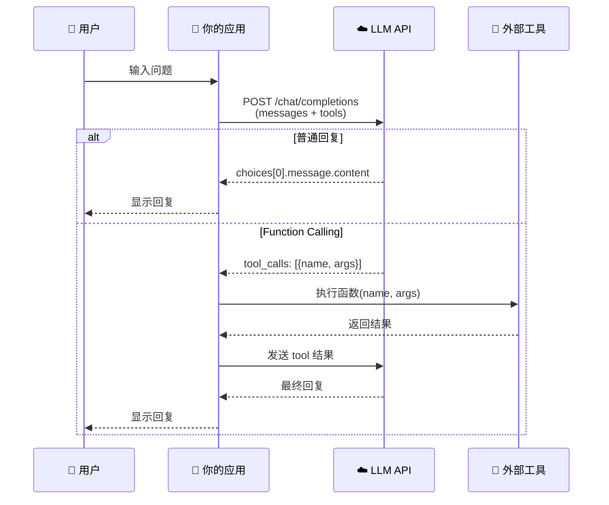
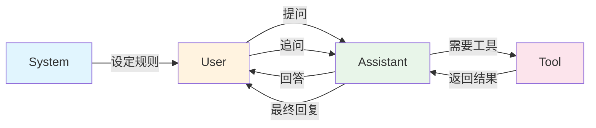
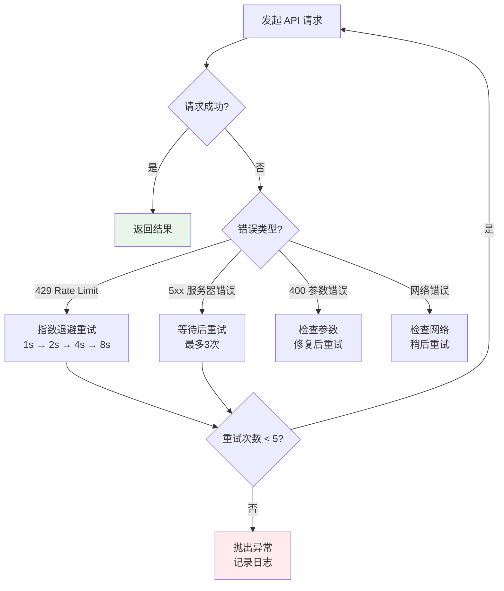

# Day 119 图解 — 大模型 API 调用

## 一、API 调用全流程



## 二、消息角色流转



## 三、Prompt Engineering 六大技巧

```
┌──────────────────────────────────────────────────────┐
│            Prompt Engineering 六大技巧                 │
├──────────────────────────────────────────────────────┤
│                                                      │
│  1️⃣ 角色设定          2️⃣ Few-Shot 示例              │
│  ┌─────────────┐      ┌──────────────────┐          │
│  │ "你是专家"   │      │ 输入→输出 示例1  │          │
│  │ 激活专业知识  │      │ 输入→输出 示例2  │          │
│  └─────────────┘      └──────────────────┘          │
│                                                      │
│  3️⃣ 链式思考          4️⃣ 结构化输出                  │
│  ┌─────────────┐      ┌──────────────────┐          │
│  │ Step 1 →    │      │ {"key": "value"} │          │
│  │ Step 2 →    │      │ 便于程序解析      │          │
│  │ Step 3 → 答 │      └──────────────────┘          │
│  └─────────────┘                                     │
│                                                      │
│  5️⃣ 约束与边界          6️⃣ 分步骤指令                │
│  ┌─────────────┐      ┌──────────────────┐          │
│  │ "不要编造"   │      │ 步骤1: 审查      │          │
│  │ "100字以内"  │      │ 步骤2: 分析      │          │
│  └─────────────┘      │ 步骤3: 建议      │          │
│                        └──────────────────┘          │
└──────────────────────────────────────────────────────┘
```

## 四、Function Calling 状态机

```
                    ┌──────────┐
                    │  开始    │
                    └────┬─────┘
                         ▼
               ┌─────────────────┐
               │ 用户发送消息     │
               │ + 工具定义       │
               └────────┬────────┘
                        ▼
               ┌─────────────────┐
               │ LLM 分析需求     │
               └────────┬────────┘
                        ▼
                  ┌───────────┐
                  │ 需要工具？ │
                  └─────┬─────┘
                   Yes  │  No
            ┌───────────┤───────────┐
            ▼                       ▼
   ┌──────────────┐       ┌──────────────┐
   │ 返回工具调用   │       │ 返回文本回复   │
   │ {name, args}  │       └──────┬───────┘
   └──────┬───────┘              │
          ▼                      ▼
   ┌──────────────┐       ┌──────────┐
   │ 执行函数      │       │ 返回用户  │
   │ 获取结果      │       └──────────┘
   └──────┬───────┘
          ▼
   ┌──────────────┐
   │ 结果发回 LLM  │
   └──────┬───────┘
          ▼
   ┌──────────────┐
   │ LLM 整合回复  │
   └──────┬───────┘
          ▼
   ┌──────────┐
   │ 返回用户  │
   └──────────┘
```

## 五、上下文窗口管理

```
┌──────────────────────────────────────────┐
│         Token 上下文窗口管理              │
├──────────────────────────────────────────┤
│                                          │
│  Token 预算: 8192 (模型限制)              │
│                                          │
│  ┌────────────────────────────────────┐  │
│  │ [System Prompt]      ~200 tokens  │  │
│  │ [历史消息1]          ~100 tokens  │  │
│  │ [历史消息2]          ~150 tokens  │  │
│  │ ...                              │  │
│  │ [历史消息N]          ~120 tokens  │  │  ← 自动截断
│  │ ─ ─ ─ ─ ─ ─ ─ ─ ─ ─ ─ ─ ─ ─ ─  │  │
│  │ [当前用户消息]        ~80 tokens  │  │
│  │ [预留输出空间]       ~2000 tokens │  │
│  └────────────────────────────────────┘  │
│                                          │
│  💡 策略:                                │
│  • 保留 System Prompt（始终不动）          │
│  • 滑动窗口保留最近 N 条                  │
│  • 预留 max_tokens 给输出                 │
└──────────────────────────────────────────┘
```

## 六、错误处理与重试策略


